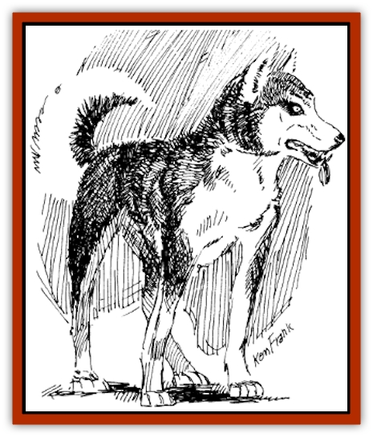
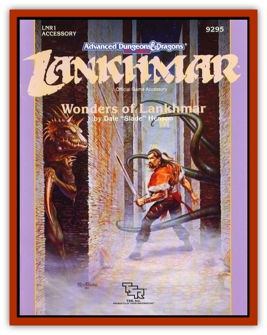

# Wolvern

| Statistic | **Wolvern** |
| --- | --- |
| **Activity Cycle:** | Any |
| **Alignment:** | Neutral |
| **Armor Class:** | 4 |
| **Climate/Terrain:** | Any |
| **Damage/Attack:** | 1d4/1d4/2d4 |
| **Diet:** | Carnivore |
| **Frequency:** | Rare |
| **Hit Dice:** | 8+1 |
| **Intelligence:** | Very (11-12) |
| **Magic Resistance:** | Nil |
| **Morale:** | Steady (11-12) |
| **Movement:** | 14 |
| **No. Appearing:** | 2d4 |
| **No. of Attacks:** | 3 |
| **Organization:** | Pack |
| **Size:** | S (3' tall) |
| **Special Attacks:** | Nil |
| **Special Defenses:** | Telepathy |
| **THAC0:** | 13 |
| **Treasure:** | Nil |
| **XP Value:** | 1,400 |

This is an intelligent [[Dog|canine]] hybrid that prefers to hunt in packs. These packs usually range in size from two to eight animals, but can exceed sixty or more under special conditions, such as in locations where the number of watering holes or springs are rare, and they happen to all get to the watering hole at the same time.

These animals all possess a semi-telepathic ability which alIows them to accurately predict where prey will run to next, or where an opponent will strike next. This telepathic ability does not function on other telepathic creatures. If a creature not usually telepathic is given magical telepathy, the wolvern's predictive capacities do not function on that creature.

**Combat:** These animals usually do not attack creatures with an intelligence rating equal to or higher than their own, unless they feel threatened or are abused in any way. They are normally calm mannered and simply curious around human encampments. They have a great respect for all creatures of intelligence. If they are provoked to attack, or are driven by hunger, they are awarded a +2 to attack beyond their normal THAC0. Their opponents are also inhibited by a -2 to hit, due to these telepathic capacities. Both of these attack modifiers are nullified if the opponent is currently telepathic (naturally or unnaturally).

Even if driven by hunger, if an opponent is able to speak with a wolvern, either telepathically or vocally through the *speak with animals* spell, the animal befriends them immediately.

**Habitat/Society:** These animal live in packs. There is always one wolvern that is the leader of the �clan': the most intelligent animal in the pack. This wolvern holds the leader position until either another is determined to be more intelligent, or it dies, whichever comes first.

**Ecology:** Wolverns mate for life, as do [[Wolf|wolves]]. The pair sire 2d4 pups every year. They protect their young with such ferocity that few men have ever seen them.

The only way to take a wolvern as a pet is to either telepathically or vocally speak to the animal via the *speak with animals* spell. The animal spoken to is so impressed with the apparent intelligence of the person that it is bonded and loyal until mistreated. At that point, it does everything in its power to escape, even at the expense of the former �master'. Wolverns have a language that consists of many different barks, whines and growls. It is impossible to learn this language unless one has been befriended by a wolvern.

---
## Discovery & Documentation

**Source Publication:** LNR1 Wonders of Lankhmar (1992)
**Campaign Setting:** Lankhmar
**Author(s):** Dale "Slade" Henson

### Other Creatures Found in This Source Book
   * [[Monolisk|Monolisk]]
   * [[Smog_Deadly|Smog, Deadly]]
   * [[Stalking_Death|Stalking Death]]
