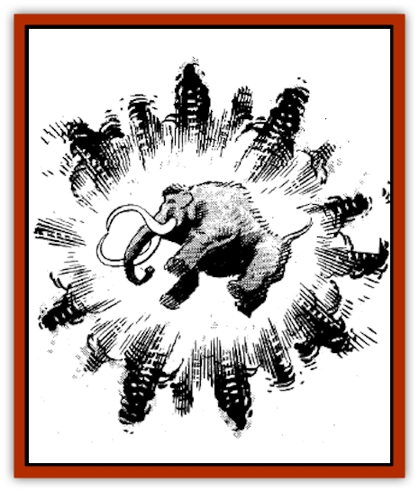

# Wooly Mammoth - Blink

| Statistic | **Wooly Mammoth, Blink** |
| --- | --- |
| **Activity Cycle:** | Day |
| **Alignment:** | Neutral |
| **Armor Class:** | 5 |
| **Climate/Terrain:** | Subarctic/Plains |
| **Damage/Attack:** | 2-16/2-16/2-12/2-12-12 |
| **Diet:** | Herbivore |
| **Frequency:** | Very rare |
| **Hit Dice:** | 15 |
| **Intelligence:** | Semi- (2-4) |
| **Magic Resistance:** | Nil |
| **Morale:** | Elite (14) |
| **Movement:** | 12 |
| **No. Appearing:** | 1-12 |
| **No. of Attacks:** | 5 (2 tusks, 1 trunk constriction, 2 forefeet) |
| **Organization:** | Herd |
| **Size:** | L (14' tall at shoulder) |
| **Special Attacks:** | Blinking |
| **Special Defenses:** | Nil |
| **THAC0:** | 5 |
| **Treasure:** | Tusks (good luck!) |
| **XP Value:** | 12,000 |

These otherwise normal [[Elephant|mammoths]] blink in and out at random when attacked, using a limited form of *teleportation* as do [[Dog|blink dogs]]. They will blink on a roll of 5 or better on 1d12, with a range of up to 60', and will reappear as per a 1d12 roll: 1 = in front of opponent; 2 = shield (or left) front flank; 3 = unshielded (or right) front flank; 4-8 = behind opponent; 9-12 = on top of opponent. If a blink mammoth appears directly above its opponent, the victim is crushed for 6-36 hp damage. All of his equipment must save vs. crushing blow, and the victim must save vs. wands to avoid being knocked unconscious for 2-12 rounds. Only one blink mammoth will "drop in on" a victim at a time. Additionally, any victim so struck must make a dexterity check on 4d6 to avoid being knocked down, thus giving the blink mammoths a +2 to-hit bonus if the victim fails to get initiative to stand up.

The heavy tusks of these mammoths have 150% of the weight and value of elephants' tusks, being worth 1d6 x 150 gp each, or about 6 gp per pound. Getting the tusks, of course, is a problem.

*Created by: Sharon Jenkins*

---
## Discovery & Documentation

**Source Publication:** Dragon156 (1990)
**Campaign Setting:** Dragon Magazine
**Author(s):** Mark Nelson, Bruce A. Heard

### Other Creatures Found in This Source Book
   * [[Death_Sheep|Death Sheep]]
   * [[Dragon_Pink|Dragon, Pink]]
   * [[Dragonet_Paper_Dragon|Dragonet, Paper Dragon]]
   * [[Gello_Monster|Gello Monster]]
   * [[Golem_Tin|Golem, Tin]]
   * [[Killer_Spruce|Killer Spruce]]
   * [[Man-Drake|Man-Drake]]
   * [[Pigeontoad|Pigeontoad]]
   * [[Tickler|Tickler]]
