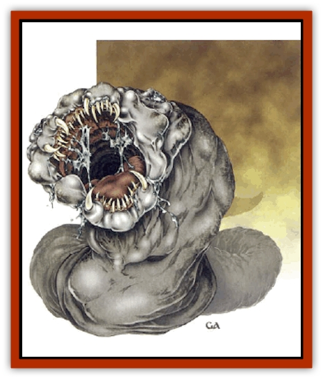

# Worm - Lukhorn

| Statistic | **Worm, Lukhorn** |
| --- | --- |
| **Activity Cycle:** | Any |
| **Alignment:** | Neutral |
| **Armor Class:** | 3 (5 interior) |
| **Climate/Terrain:** | Underdark |
| **Damage/Attack:** | Special |
| **Diet:** | Carnivore |
| **Frequency:** | Very rare |
| **Hit Dice:** | 10 |
| **Intelligence:** | Semi- (2-4) |
| **Magic Resistance:** | Nil |
| **Morale:** | Average (8-10) |
| **Movement:** | 9, Br 9 |
| **No. Appearing:** | 1 |
| **No. of Attacks:** | 1 |
| **Organization:** | Solitary |
| **Size:** | H (15' diameter, 200' long) |
| **Special Attacks:** | Digestive acid, sonic screech |
| **Special Defenses:** | Camouflage, see below |
| **THAC0:** | 11 |
| **Treasure:** | Incidental |
| **XP Value:** | 3,000 |

The lukhorn is a burrowing, predatory [[Worm|worm]] that lurks in the mysterious caverns of the underdark. Though the creature is generally gray-skinned in its natural state, the lukhorn can alter its coloration to match almost perfectly the stone around it.

Lukhorns possess a highly malleable body structure; they can mold themselves to the shape of whatever cavern or tunnel they travel through. The creature's skin is coated with a sheath of viscous liquid, which it secretes through tiny, pore-like openings. The liquid helps keep the lukhorn's skin supple and masks the creature's body heat from infravision.

The lukhorn averages about 200 feet long, though legends tell of gargantuan versions of this creature.

**Combat:** The lukhorn prefers to use its malleable body and excellent camouflage to mimic a cavern or tunnel opening. It moves to the mouth of a dark tunnel shapes its body to the dimensions of the tunnel, then opens its huge mouth. The lukhorn promptly swallows any creature that walks into its mouth. Those native to the Underdark can see through the lukhorn's camouflage with a successful Wisdom check; surface dwellers cannot pierce the creature's disguise without magic unless they view it with illumination as bright as sunlight.

Extremely hungry lukhorns do not wait for their prey to fall into their trap; rather, the monstrous worms may lunge out and attempt to swallow victims as they pass by the worms' hiding places. One creature per round can be attacked. If the attack is successful the prey is swallowed; unlike creatures such as the [[Slug_Giant|giant slug]] or [[Worm|purple worm]], the lukhorn inflicts no damage upon a creature until it has been swallowed.

After being swallowed, however, the prey suffers 4d6 points of damage per round from the lukhorn's digestive juices. These juices are powerful enough to dissolve wood and cloth in two rounds. Metal, such as that in armor and weapons, dissolves after 4 rounds of exposure to the creature's digestive acid. Magical items are allowed item saving throws vs. acid.

A swallowed victim may attempt to cut out of the lukhorn by inflicting 40 points of damage to a concentrated area inside the creature. However, the lukhorn's malleable body makes it difficult to injure. Though only AC 5, the rubbery interior of the creature suffers no damage from bludgeoning weapons; all other weapons subtract 2 points of damage from their total for each successful attack.

If the lukhorn is attacked while digesting prey, the worm emits a powerful *sonic screech*. All within a 60-foot radius of the *screech* must make a saving throw vs. petrification; those who fail writhe in agony on the ground for 1d6 rounds. The sound of the lukhorn's *screech* will carry for miles in the twisting caverns of the Underdark, perhaps attracting or warning off other monsters.

**Habitat/Society:** Little is known about the lukhorn life cycle, except that it is a solitary creature, ever wandering in search of food. Some scholars suggest that these giant worms mate in secret breeding caverns hidden deep within the Underdark - though this has never been proven. In any event, lukhorns do not seem to reproduce often, or in great numbers.

**Ecology:** The lukhorn is among the most powerful predators of the Underdark; it has been known to consume whole patrols of [[Elf_Drow|drow]] warriors. These creatures are highly carnivorous and driven almost wholly by hunger.

The viscous liquid secreted by the lukhorn is often in high demand by alchemists and wizards (100 gp per vial). When used in the creation of *invisibility* and *polymorph* potions, it extends their durations by 25%. The liquid, however, dries almost immediately upon the death of the lukhorn; it is extremely difficult to secure more than a vial or two from a recently killed specimen.

---
## Discovery & Documentation

**Source Publication:** Monstrous Compendium, 1997 Annual, Volume 4 (1995)
**Campaign Setting:** Advanced Dungeons & Dragons 2nd Edition
**Author(s):** Jon Pickens

### Other Creatures Found in This Source Book
   * [[Anemone_Giant_Sea|Anemone, Giant Sea]]
   * [[Asperii|Asperii]]
   * [[Bainligor|Bainligor]]
   * [[Beast_of_Chaos|Beast of Chaos]]
   * [[Blindheim|Blindheim]]
   * [[Bloodsipper_Far_Realm|Bloodsipper (Far Realm)]]
   * [[Bulette_Gohlbrorn|Bulette, Gohlbrorn]]
   * [[Child_of_the_Sea|Child of the Sea]]
   * [[Clockwork_Horror|Clockwork Horror]]
   * [[Clockwork_Swordsman|Clockwork Swordsman]]
   * [[Coral|Coral]]
   * [[Darklore|Darklore]]
   * [[Dharculus|Dharculus]]
   * [[Dolphin_Athas|Dolphin (Athas)]]
   * [[Dragon_Neutral_Moonstone|Dragon, Neutral, Moonstone]]
   * [[Dragon_Prismatic|Dragon, Prismatic]]
   * [[Dream_Stalker|Dream Stalker]]
   * [[Dragon-kin_Albino_Wyrm|Dragon-kin, Albino Wyrm]]
   * [[Echyan|Echyan]]
   * [[Firestar|Firestar]]
   * [[Firetail|Firetail]]
   * [[Fish_Ascallion|Fish, Ascallion]]
   * [[Fish_Deep_Ocean|Fish, Deep Ocean]]
   * [[Fish_Tropical|Fish, Tropical]]
   * [[Fish_Vurgens|Fish, Vurgens]]
   * [[Fogwarden|Fogwarden]]
   * [[Fraal|Fraal]]
   * [[Giant_Crag|Giant, Crag]]
   * [[Gibberling_Brood|Gibberling, Brood]]
   * [[Glutton_Sea|Glutton, Sea]]
   * [[Golden_Ammonite|Golden Ammonite]]
   * [[Golem_Brass_Minotaur|Golem, Brass Minotaur]]
   * [[Golem_Gemstone|Golem, Gemstone]]
   * [[Golem_Maggot|Golem, Maggot]]
   * [[Groundling|Groundling]]
   * [[Hermit_Sea|Hermit, Sea]]
   * [[Hound_of_Law|Hound of Law]]
   * [[Human_Amazon|Human, Amazon]]
   * [[Human_Pygmy|Human, Pygmy]]
   * [[Inquisitor|Inquisitor]]
   * [[Kercpa|Kercpa]]
   * [[Kreel|Kreel]]
   * [[Lycanthrope_Lythari|Lycanthrope, Lythari]]
   * [[Mercurial|Mercurial]]
   * [[Mold_Chromatic|Mold, Chromatic]]
   * [[Mummy_Bog|Mummy, Bog]]
   * [[Neh-thalggu|Neh-thalggu]]
   * [[Nymph_Grain|Nymph, Grain]]
   * [[Nymph_Unseelie|Nymph, Unseelie]]
   * [[Octopus_Octo-Jelly|Octopus, Octo-Jelly]]
   * [[Puddingfish|Puddingfish]]
   * [[Sea_Demon|Sea Demon]]
   * [[Shade|Shade]]
   * [[Shadowrath|Shadowrath]]
   * [[Shark_Athas|Shark (Athas)]]
   * [[Siren_Ravenloft|Siren (Ravenloft)]]
   * [[Skeleton_Variant|Skeleton, Variant]]
   * [[Skyfish|Skyfish]]
   * [[Spectral_Scion|Spectral Scion]]
   * [[Spyder_Fiend|Spyder Fiend]]
   * [[Squid_Squark|Squid, Squark]]
   * [[Tanar'ri_Lesser_Uridezu|Tanar'ri, Lesser, Uridezu]]
   * [[Troll_Mutate|Troll Mutate]]
   * [[Vaati|Vaati]]
   * [[Vampire_Cerebral|Vampire, Cerebral]]
   * [[Varkha|Varkha]]
   * [[Wizshade|Wizshade]]
   * [[Wyste|Wyste]]
   * [[Yugoloth_Lesser_Gacholoth|Yugoloth, Lesser, Gacholoth]]
   * [[Zombie_Mud|Zombie, Mud]]
