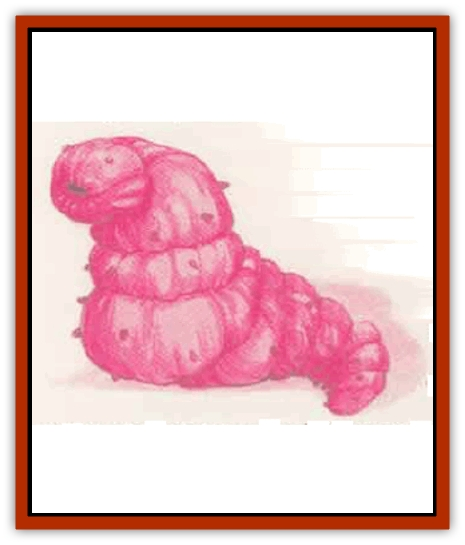

# Worm - Mystara

| Statistic | **Caecillia** | **Fyrsnaca** | **Great Annelid** | **Leviathan, Desert** | **Leviathan, Marine** | **Red Worm** | **Slime Worm** |
| --- | --- | --- | --- | --- | --- | --- | --- |
| **Activity Cycle:** | Any | Any | Any | Any | Any | Any | Any |
| **Alignment:** | Neutral | Chaotic neutral | Neutral | Neutral | Neutral | Chaotic neutral | Neutral |
| **Armor Class:** | 6 | 5 | 7 | 2 | 4 | 7 | 5 |
| **Climate/Terrain:** | Any nonarctic | Subterranean | Subterranean | Desert | Ocean | Subterranean | Subterranean |
| **Damage/Attack:** | 1d8 (bite) | 1d8 (bite) | 3d6 (bite) | 3d12 (bite) | 4d10 (bite) | 1d4 (bite) | 2d6 (bite) |
| **Diet:** | Carnivore | Minerals | Minerals | Omnivore | Omnivore | Carnivore | Carnivore |
| **Frequency:** | Rare | Very rare | Very rare | Very rare | Very rare | Rare | Very rare |
| **Hit Dice:** | 6 | 10 | 25-50 | 60 | 70 | 2+2 | 10 |
| **Intelligence:** | Non- (0) | Low (5-7) | Non- (0) | Non- (0) | Non- (0) | Animal (1) | Non- (0) |
| **Magic Resistance:** | Nil | Nil | Nil | Nil | Nil | Nil | Nil |
| **Morale:** | Elite (13) | Elite (13) | Champion (16) | Fearless (19) | Fanatic (18) | Champion (15) | Average (10) |
| **Movement:** | 6, Br 3 | 6, Br 3 | 30, Br 24 | Br 24 | Sw 24 | 9, Br 3 | 6 |
| **No. Appearing:** | 1 | 1d2 | 1 | 1 | 1 | 2d6 | 1 |
| **No. of Attacks:** | 1 | 1 | 1 | 1 | 1 | 1 | 1 |
| **Organization:** | Solitary | Solitary | Solitary | Solitary | Solitary | Brood | Solitary |
| **Size:** | G (30' long) | G (70' long) | G (1,000'+ long) | G (500' long) | G (650' long) | L (10' long) | G (80' long) |
| **Special Attacks:** | Swallow | Fiery breath | Swallow | Swallow | Swallow, whirlpool | Poison | Swallow |
| **Special Defenses:** | Nil | Nil | Immune to heat and pressure | See below | See below | Nil | Nil |
| **THAC0:** | 15 | 11 | 3 | 1 | 1 | 19 | 11 |
| **Treasure:** | B | R | Nil | Nil | Nil | Q | D |
| **XP Value:** | 650 | 2,000 | 16,000 | 20,000 | 25,000 | 650 | 2,000 |

Mystara is home to several types of crawling, invertebrate monsters that resemble great caterpillars or earth[[Worm|worms]].

**Great Annelid**

These gargantuan worms are among the largest creatures in Mystara. Some can grow to be 2,000 feet long and 40 feet in diameter. Thes are exceptional specimens, however; most adults are 1,000 feet long and 25 feet in diameter.

A great annelid's skin looks like damp rock, usually grayish brown in color. The creature is segmented, just like an ordinary earthworm; the largest great annelids may have 600 segments or more. Its body is a long hollow tube, with both a digestive tract and a nerve cord running from head to tail. The funnel-like mouth is lined with three rows of sharp teeth.

Great annelids have an unsurpassed ability to tunnel. They can grind through solid rock almost as quickly as they can crawl. Though not carnivorous, they are quite mindless and their first reaction upon meeting anything is to try to eat it. A great annelid can easily swallow creatures of up to huge size (size H) whole if it rolls 5 or more above the unmodified attack score it needs to bite a creature of that Armor Class. In addition to normal bite damage, the victim is hurled 3d10 feet down the creature's gullet. Since the gullet is perpetually filled with grit and fragments of rock, a swallowed victim suffers 2d6+6 points of acid and abrasive damage each round until it escapes or the great annelid is killed (victim who are immune to acid damage suffer only 2d6 points of damage). Spellcasting is impossible within the gullet. A victim can attempt to cut his or her way out with a slashing (type S) weapon. The great annelid's internal Armor Class is 5; the victim must inflict 25 points of damage to the same area to cut a way out. The victim suffers a -4 penalty to attack rolls and a +4 penalty to initiative while within the gullet.

Great annelids are completely immune to all forms of heat and pressure - they simply cannot be burned or crushed.

One of the strangest and least understood of the great annelid's powers is its ability to attract and paralyze [[Elemental_Air_Earth|earth elementals]]. Great annelids are hermaphrodites. When they are ready to lay eggs, they send out a false signal that lures earth elementals, [[Xorn|xorn]], and similar creatures to them, perhaps by mimicking the presence of a large cache of gems or precious metals. When the creatures arrive, the great annelid attacks but does not swallow its prey, instead, its bite paralyzes any earth elemental or [[Elemental_Earth_Kin|elemental-kin]] that fails a saving throw vs. paralyzation. Paralysis is permanent, and the great annelid then lays its eggs on the victim's body.

Great annelids constantly burrow through the depths of the earth. They can survive in any type of environment, including pools of molten lava, but avoid water. They are a special terror to earth elemental creatures. Miners such as [[Dwarf|dwarves]] and [[Gnome|gnomes]] tend to have mixed emotions about great annelids. On one hand, their tunnels often provide useful avenues for exploring the bowels of the earth and searching out minerals. On the other hand, one great annelid in the wrong place can wipe out a promising vein of ore in minutes, and the creatures are hard to remove once they settle into an area.

**Caecillia**

These creatures lurk unseen in loose soil just below the surface and emerge only to attack prey. Their wormlike bodies are gray and featureless except for their huge, toothy maws.

A caecillia attacks whenever prey comes within reach. The initial attack should be treated as an ambush unless the victim has some reason to suspect an attack from below.

A caecillia can swallow victims of size large (L) or smaller if it hits with an unadjusted attack roll of 19 or 20. Once inside, a victim suffers 1d8 points of damage each round until he or she escapes or the caecillia is killed. The victim can escape unaided only if he or she was holding a small piercing or slashing weapon when swallowed, as contractions in the caecillia's gullet prevent the victim from drawing a weapon. A caecillia has an internal Armor Class of 9; the victim must inflict 10 points of damage to cut a way out. The victim suffers the same combat penalties as do great annelid victims.

A caecillia's gullet can hold one large creature, two medium (human-sized) creatures, four small creatures, or eight tiny creatures. If a caecillia fills its gullet during a fight, it retreats into the soil to digest its meal.

**Fyrsnaca**

These fire-breathing worms are distantly related to [[Worm|purple worms;]] they are the adult form of red worms. Their skin is smooth and reddish purple, with lighter undersides. Their gaping maws glow cherry red, like hot metal, and are filled with wickedly sharp teeth.

Fyrsnaca are not meat eaters. Like great annelids, they consume rocks and minerals. They tend to be bad-tempered, however, and are prone to attack unless an intruder backs away quickly or bribes the creature with a gem or precious metal. Fyrsnaca have no language, but if communication can be established (through a speak with monsters spell or other means), a fyrsnaca might be persuaded to perform some service in return for an ample payment of gems or metal. Once every 1d3 rounds, a fyrsnaca can breathe a line of fire 5 feet wide and 50 feet long. The flames inflict 2d6 points of damage, but a successful saving throw vs. breath weapon halves the damage.

Periodically, a fyrsnaca's internal fires flare and the creature begins to heat up. This extra heat does not make its breath weapon more formidable, but it does cause the creature to eventually spawn 2d6 red worms by disgorging them through its mouth. Immediately after spawning, a fyrsnaca must immerse itself in water or burn up. Once submerged, the fyrsnaca remains dormant for 50 years while its fires subside. If disturbed, a dormant fyrsnaca rises up and attacks fearlessly (morale 20) but does not leave the water.

**Leviathan**

[[Whale|Leviathans]] are among the mightiest creatures living on the Prime Material Plane. Travelers who meet a leviathan seldom live to tell the tale. Desert leviathans have pale brown hides that match their sandy environments; they can grow to be 500 feet long and 40 feet wide. Marine leviathans are longer and sleeker than their desert cousins, reaching lengths of 650 feet. Desert leviathans are eyeless and blind, but marine leviathans have huge eyes adapted for the gloom of the depths.

Leviathans are sensitive to vibrations in sand or water and generally attack any sizable creature moving witbin a quarter mile of their location. When closing on its prey, a desert leviathan creates a ripple in the sand, like a huge ocean wave. A marine leviathan moving near the surface also creates a visible wave.

A leviathan attacks by simply engulfing a large volume of sand or water. A desert leviathan can take in a 30-foot cube of sand, a marine leviathan a 50-foot cube of water. Any creature within this area must make a successful saving throw vs. breath weapon (with a -4 penalty to the roll) or be swallowed. Immobile creatures (held, bound, sleeping, etc.) get no saving throw. Victims who fail the saving throw are sucked into the creature's maw, where they suffer bite damage (3d12 from a desert leviathan, 4d10 from a marine leviathan) and 4d12 points of damage from the creature's digestive tract; if the victim is resistant to acid, damage is reduced to 2d12.

As long as they are alive and mobile, swallowed victims can try to cut their way out with slashing (type S) weapons. A leviathan's internal Armor Class is 5, and the victims must inflict 50 points of damage to cut their way out. The victims suffer the same combat penalties as victims of great annelids. If a leviathan hasn't digested a swallowed creature within one turn, it expels the item before returning to the depths.

Leviathans are immune to poison and disintegration and take half damage from all attacks, including psionics and spells. They are immune to all spells, magical effects, and psionic abilities that do not inflict damage.

A marine leviathan can create a huge whirlpool by swimming in a great circle, head to tail, for three rounds. The resulting vortex is 100 feet wide at the top, 200 feet deep, and 50 feet wide at the bottom. Anything caught in it is drawn down to the waiting leviathan. The vortex lasts while the leviathan swims and for one round thereafter.

**Red Worm**

These grotesque worms are the larval form of the fyrsnaca. Their red-hued skin is almost transparent, revealing the veins and organs within. They are voracious carnivores, always on the lookout for food.

Unlike fyrnaca, red worms do not breath fire. Their bite, however, is mildly venomous, and any creature bitten must make a successful saving throw vs. poison or take double damage from the bite. Red worms can detect prey by vibration and often burst out of solid rock to attack. This maneuver gives their opponents a -3 penalty to their surprise rolls.

**Slime Worm**

These giant worms are a pale, mottled gray. They excrete a sticky slime that coats their backs and sides. Small objects such as coins and other treasure stick to the slime, making the creature indistinguishable from a large pile of treasure.

When camouflaged, there is only a 15% chance that anyone will recognize a slime worm as anything but a pile of objects. If its victims are unaware of the slime worm, it attacks from ambush. On a successful unadjusted attack roll of 18 or better, slime wonns can swallow creatures of up to large (L) size (an unmodified attack roll of 20 always indicates that the target has been swallowed). Once inside, a victim suffers 2d6 points of damage each round until he or she escapes or the slime worm is killed. The victim can escape unaided only if he or she was holding a small piercing or slashing weapon when swallowed. A slime worm has an internal Armor Class of 8 and the victim must inflict 10 points of damage to cut a way out. He or she suffers the same combat penalties as victims of great annelids.

A slime worm's gullet can hold one large creature, two human-sized creatures, four small creatures, or eight tiny creatures. If a slime worm fills its gullet during a fight, it continues to attack but cannot swallow additional victims.

---
## Discovery & Documentation

**Source Publication:** Mystara Appendix (1994)
**Campaign Setting:** Mystara
**Author(s):** John Nephew, Teeuwynn Woodruff, John Terra, Skip Williams

### Other Creatures Found in This Source Book
   * [[Actaeon|Actaeon]]
   * [[Agarat|Agarat]]
   * [[Ash_Crawler|Ash Crawler]]
   * [[Baldandar|Baldandar]]
   * [[Bargda|Bargda]]
   * [[Bhut|Bhut]]
   * [[Bird_Mystara|Bird (Mystara)]]
   * [[Blackball|Blackball]]
   * [[Choker|Choker]]
   * [[Coltpixie|Coltpixie]]
   * [[Crone_of_Chaos|Crone of Chaos]]
   * [[Darkhood|Darkhood]]
   * [[Darkwing|Darkwing]]
   * [[Decapus|Decapus]]
   * [[Deep_Glaurant|Deep Glaurant]]
   * [[Diabolus|Diabolus]]
   * [[Dimensional_Warper|Dimensional Warper]]
   * [[Dragon_Mystara_Crystalline|Dragon (Mystara), Crystalline]]
   * [[Dragon_Mystara_Jade|Dragon (Mystara), Jade]]
   * [[Dragon_Mystara_Onyx|Dragon (Mystara), Onyx]]
   * [[Dragon_Mystara_Ruby|Dragon (Mystara), Ruby]]
   * [[Drake_Mystara|Drake (Mystara)]]
   * [[Dragonfly|Dragonfly]]
   * [[Dusanu|Dusanu]]
   * [[Elemental_of_Chaos_Air_Earth|Elemental of Chaos, Air/Earth]]
   * [[Elemental_of_Chaos_Fire_Water|Elemental of Chaos, Fire/Water]]
   * [[Elemental_of_Law_Air_Earth|Elemental of Law, Air/Earth]]
   * [[Elemental_of_Law_Fire_Water|Elemental of Law, Fire/Water]]
   * [[Familiar_Mystara|Familiar (Mystara)]]
   * [[Frost_Salamander|Frost Salamander]]
   * [[Fundamental_Air_Earth|Fundamental, Air/Earth]]
   * [[Fundamental_Fire_Water|Fundamental, Fire/Water]]
   * [[Gargantua_Mystara|Gargantua (Mystara)]]
   * [[Geonid|Geonid]]
   * [[Ghostly_Horde|Ghostly Horde]]
   * [[Giant_Athach|Giant, Athach]]
   * [[Giant_Hephaeston|Giant, Hephaeston]]
   * [[Golem_Drolem|Golem, Drolem]]
   * [[Golem_Mystara_I|Golem (Mystara) I]]
   * [[Golem_Mystara_II|Golem (Mystara) II]]
   * [[Golem_Mystara_III|Golem (Mystara) III]]
   * [[Gray_Philosopher|Gray Philosopher]]
   * [[Guardian_Warrior|Guardian Warrior]]
   * [[Gyerian|Gyerian]]
   * [[Herex|Herex]]
   * [[Hivebrood|Hivebrood]]
   * [[Horde|Horde]]
   * [[Hsiao|Hsiao]]
   * [[Huptzeen|Huptzeen]]
   * [[Hutaakan|Hutaakan]]
   * [[Imp_Mystara|Imp (Mystara)]]
   * [[Jellyfish_Giant_Mystara|Jellyfish, Giant (Mystara)]]
   * [[Kna|Kna]]
   * [[Kopru|Kopru]]
   * [[Lizard_Mystara|Lizard (Mystara)]]
   * [[Lizard-kin_Mystara|Lizard-kin (Mystara)]]
   * [[Lupin|Lupin]]
   * [[Lycanthrope_Werejaguar_Mystara|Lycanthrope, Werejaguar (Mystara)]]
   * [[Lycanthrope_Wereswine|Lycanthrope, Wereswine]]
   * [[Magen|Magen]]
   * [[Manikin|Manikin]]
   * [[Mek|Mek]]
   * [[Mujina|Mujina]]
   * [[Nagpa|Nagpa]]
   * [[Neh-thalggu|Neh-thalggu]]
   * [[Nightshade_Mystara|Nightshade (Mystara)]]
   * [[Nuckalavee|Nuckalavee]]
   * [[Pegataur|Pegataur]]
   * [[Phanaton|Phanaton]]
   * [[Plant_Dangerous_Mystara|Plant, Dangerous (Mystara)]]
   * [[Plasm|Plasm]]
   * [[Rakasta|Rakasta]]
   * [[Rock_Man|Rock Man]]
   * [[Sabreclaw|Sabreclaw]]
   * [[Sacrol|Sacrol]]
   * [[Scamille|Scamille]]
   * [[Shapeshifter|Shapeshifter]]
   * [[Shargugh|Shargugh]]
   * [[Shark-kin|Shark-kin]]
   * [[Sollux|Sollux]]
   * [[Spectral_Death|Spectral Death]]
   * [[Spectral_Hound|Spectral Hound]]
   * [[Spider-kin|Spider-kin]]
   * [[Spirit_Mystara|Spirit (Mystara)]]
   * [[Statue_Living|Statue, Living]]
   * [[Surtaki|Surtaki]]
   * [[Tabi|Tabi]]
   * [[Thoul|Thoul]]
   * [[Thunderhead|Thunderhead]]
   * [[Tiger_Ebon|Tiger, Ebon]]
   * [[Topi|Topi]]
   * [[Tortle|Tortle]]
   * [[Vampire_Velya|Vampire, Velya]]
   * [[White_Fang|White Fang]]
   * [[Wyrd|Wyrd]]
   * [[Yowler|Yowler]]
   * [[Zombie_Lightning|Zombie, Lightning]]
