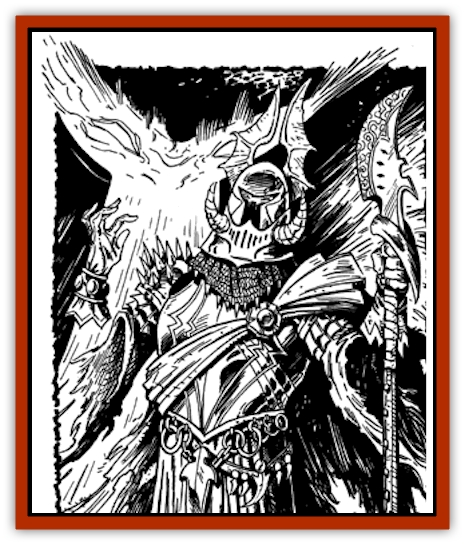

# Wraith-King

| Statistic | **Wraith-King** |
| --- | --- |
| **Activity Cycle:** | Night |
| **Alignment:** | Lawful evil |
| **Armor Class:** | -5 |
| **Climate/Terrain:** | Any, often subterranean |
| **Damage/Attack:** | 1d8+10 |
| **Diet:** | Carnivore (living beings) |
| **Frequency:** | Very rare |
| **Hit Dice:** | 15+27 (95 hp) |
| **Intelligence:** | Genius (17) |
| **Magic Resistance:** | 20% |
| **Morale:** | Champion (15-16) |
| **Movement:** | 12/36 if riding |
| **No. Appearing:** | 1 |
| **No. of Attacks:** | 2/1 by weapon type, or 1 by touch |
| **Organization:** | Solitary, may have following |
| **Size:** | M (6-7') |
| **Special Attacks:** | Energy-drain gaze, wraith control, spellcasting, magical items |
| **Special Defenses:** | Immunity to some spells and weapons |
| **THAC0:** | -1 |
| **Treasure:** | H |
| **XP Value:** | 32,000 |

[[Wraith|Wraith]]-kings were once powerful individuals who so feared death that they made unholy bargains with an evil god. Each individual believed he was gaining immortality, but was instead turned into an undead monster. The body of a wraith-king has faded away completely. Inside the form of its armor, one can see only two hateful red burning eyes.

**Combat:** A wraith-king fights much as it did in life. It wears plate armor +3 and wields a sword +4 (any type). It is considered to have exceptional attribute statistics (S 18/00, D 18, C 17, I 17, W 15, Ch 17 (to undead only)). These magical items and attribute scores are already calculated into the wraith-king's statistics.

A wraith-king can drain life levels by gaze alone at the rate of one level per round for any one victim within clear view in a 30' range (the victim must save vs. death ray each round to avoid this effect). Any victim completely drained of life levels becomes a full-strength wraith under the control of the wraith-king.

A wraith-king can cast either a *permanent illusion* or *programmed illusion* once per round, without limit. It can also cast a *mass charm* spell once per day. All spells are cast at the 15th level of ability. A wraith-king is so powerful that any individual of a level lower than the wraith-king must make a saving throw vs. spells or flee in panic from fear.

The following spells or attack forms have no effect on a wraith-king: *charm*, *sleep*, *enfeeblement*, *polymorph*, cold, electricity, insanity, and death magic. A wraith-king can be harmed only by magical weapons with at least a +2 bonus, and even these weapons do only half damage.

A wraith-king is even more powerful than a [[Lich|lich]]. A cleric of level 9-13 has a chance to turn a wraith-king on a roll of 19 or better. A cleric of level 14+ has a chance to turn a wraith-king on a roll of 16 or better. Because a wraith-king's undead power comes directly from a god, a raise dead spell will not affect a wraith-king.

**Habitat/Society:** A wraith-king lives in an eternal state of anger and hatred. Having been tricked by an evil god, the wraith-king hates the living and seeks, whenever possible, to convert them to undead to increase the wraith-king's following. Even when not guarding its hoarded treasure, a wraith-king seeks out the living to punish them for the anguish it feels. It especially delights in using illusions to trick and tempt the living.

A wraith-king is, however, cautious. It considers itself immortal and, hateful as its undead state is, it nonetheless cherishes its unlife. It will flee if an attack appears to be going against it.

When encountered in its tomb/lair, a wraith-king has control of 4-24 wraiths. When not encountered in its tomb, a wraith-king is likely to be riding a <a href="nightmar">nightmare</a>.

br

**Note:** Because wraith-kings are so powerful and so rare, it is suggested that a DM use them sparingly. A wraith-king became undead as the act of an evil god, so a good or neutral god often aids a cleric confronting a wraith-king. Such aid may take the form of a special magical item that protects the cleric or the entire party from some of the wraithking's malign powers. An entire campaign, including visions, communion with a beneficent god or goddess, and the search for an appropriate undead-destroying magical item, can be built around a quest to destroy a single wraith-king.

---
## Discovery & Documentation

**Source Publication:** Dragon198 (1993)
**Campaign Setting:** Dragon Magazine
**Author(s):** 

### Other Creatures Found in This Source Book
   * [[Angreden|Angreden]]
   * [[Ghoul_Goop|Ghoul, Goop]]
   * [[Ka|Ka]]
   * [[Vartha|Vartha]]
   * [[Wight_King-|Wight, King-]]
