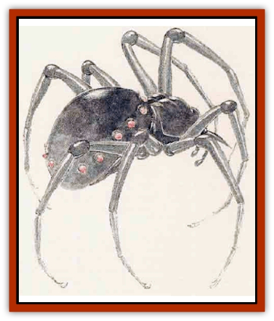

# Wraith-Spider

| Statistic | **Wraith-Spider** |
| --- | --- |
| **Activity Cycle:** | Night |
| **Alignment:** | Lawful evil |
| **Armor Class:** | 5 |
| **Climate/Terrain:** | Any |
| **Damage/Attack:** | 1d4 |
| **Diet:** | Special |
| **Frequency:** | Rare |
| **Hit Dice:** | 3+2 |
| **Intelligence:** | Average (8-10) |
| **Magic Resistance:** | 15% |
| **Morale:** | Champion (15) |
| **Movement:** | 15, Wb 18 |
| **No. Appearing:** | 3-18 |
| **No. of Attacks:** | 1 |
| **Organization:** | Pack |
| **Size:** | M (4' diameter) |
| **Special Attacks:** | Energy drain, poison |
| **Special Defenses:** | Silver or +1 or better weapons to hit |
| **THAC0:** | 17 |
| **Treasure:** | Incidental |
| **XP Value:** | 1,400 |

[[Wraith|Wraith]]-[[Spider|spiders]] appear as vaguely formed dark spider shapes whose eight legs trail off into dark mist. They have no physical substance, being more shadow and mist than spider. They attack with mandibles that appear insubstantial, but leave visible wounds. Their bodies are circled with glowihg red pinprick-eyes that look in all directions simultaneously.

They speak no language of their own and do not respond in any way to a *speak with dead* spell. They seem to communicate with each other on some instinctive level to coordinate attacks in pack formations, though this is non-verbal in nature.

They understand orders given in the common tongue or [[Elf_Drow|drow]], and can be commanded by those with the ability to command or control undead. They are always encountered as the servants of some more powerful creature.

**Combat:** Wraith-spiders cause damage by several methods. Their bite causes 1d4 points of damage from chilling cold; each bite also drains 1 level of experience from an opponent. This affects hit points and all abilities connected with that level, such as combat ability or spellcasting. Lost experience levels can only be regained by earning new experience or by the *restoration* spell.

A wraith-spider's bite also injects a poison. This poison remains active for 2-5 rounds and drains 1 point of Constitution each round it is active. The victim must roll a successful saving throw vs. poison each round to escape the poison's effects for that round. A *neutralize poison* spell alleviates the effects of the poison entirely, removing it from the victim's system and restoring any lost Constitution points. A *slow poison* delays the effects of the poison for the duration of the spell but will not restore Constitution points already lost. Constitution points can be regained at the rate of 1 per week; a *heal* spell restores 1-4 points per spell. Victims drained of all Constitution points die and have a 25% chance of becoming wraith-spiders themselves. Characters slain by wraith-spiders can be returned to life with a *heal* and a *resurrection* spell cast in that sequence.

These creatures are immune to cold-based attacks and *sleep*, *charm*, and *hold* spells. Normal weapons do no damage; wraith-spiders are affected only by silver weapons or magical weapons. Holy water vials thrown at these creatures inflict 2d4 points of damage (as acid) against their undead forms. For unknown reasons, *raise dead* spells do not affect these creatures as they do other wraiths, having no effect at all.

Wraith-spiders are turned as shadows.

These creatures create webs that glow with an eerie dim green light. Anyope touching a web will sustain 1d4 points of damage from the numbing cold of the strands. Characters in contact with the webs must also make a saving throw vs. paralyzation or be immobilized by the web for 1-6 rounds, sustaining cold damage for each round in the web. Like the wraith-spiders themselves, the webs cannot be cut by normal weapons; they can be cut only by silver or magical edged weapons, or broken by a successful bend bars/lift gates roll.

**Habitat/Society:** Wraith-spiders were originally created as guardians of treasure or as guards for a particular area of a drow stronghold. Even under someone else's control, they tend to guard treasure well, any treasure left by their victim being added to their original cache. Wraith-spiders are usually encountered in packs since they are created in groups. However, since they do not always turn victims into more wraith-spiders (though there is speculation on what happens if a normal or [[Spider|giant spider]] is killed by them), they are somtimes encountered alone as attrition takes its toll.

**Ecology:** Wraith-spiders have no goals or purposes other than to perform their guard tasks and slay the living. Since they are not free to roam at will, they have little effect on the natural order. It is rumored that a wizard named Muiral created them; however, it is more likely that the wraith-spiders were created years before by the drow for their wars against the [[Dwarf_Duergar|duergar]].

---
## Discovery & Documentation

**Source Publication:** Lankhmar: City of Adventure (2nd Ed.) (1993)
**Campaign Setting:** Lankhmar
**Author(s):** Bruce Nesmith, Douglas Niles, and Ken Rolston

### Other Creatures Found in This Source Book
   * [[Astral_Wolf|Astral Wolf]]
   * [[Behemoth|Behemoth]]
   * [[Bird_of_Tyaa|Bird of Tyaa]]
   * [[Cat_War|Cat, War]]
   * [[Cloaker_Sea|Cloaker, Sea]]
   * [[Cold_Woman|Cold Woman]]
   * [[Devourer_Lankhmar|Devourer (Lankhmar)]]
   * [[Ghoul_Kleshite|Ghoul, Kleshite]]
   * [[Ghoul_Lankhmar|Ghoul (Lankhmar)]]
   * [[Gladiator_Lizard|Gladiator Lizard]]
   * [[Horag|Horag]]
   * [[Howler|Howler]]
   * [[Ice_Gnome|Ice Gnome]]
   * [[Invisible_of_Stardock|Invisible of Stardock]]
   * [[Lizard|Lizard]]
   * [[Ophidian|Ophidian]]
   * [[Ray_Invisible_Flying|Ray, Invisible Flying]]
   * [[Scorpion|Scorpion]]
   * [[Simorgyan|Simorgyan]]
   * [[Snow_Serpent|Snow Serpent]]
   * [[Thunder_Children|Thunder Children]]
   * [[Zombie_Sea|Zombie, Sea]]
