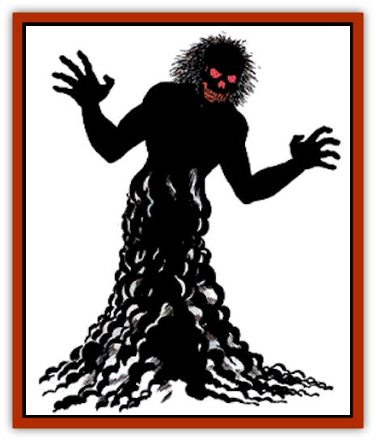

# Wraith

| Statistic | **Wraith** |
| --- | --- |
| **Activity Cycle:** | Night |
| **Alignment:** | Lawful evil |
| **Armor Class:** | 4 |
| **Climate/Terrain:** | Any |
| **Damage/Attack:** | 1-6 |
| **Diet:** | Special |
| **Frequency:** | Uncommon |
| **Hit Dice:** | 5+3 |
| **Intelligence:** | Very (11-12) |
| **Magic Resistance:** | Nil |
| **Morale:** | Champion (15) |
| **Movement:** | 12, Fl 24 (B) |
| **No. Appearing:** | 2-12 (2d6) |
| **No. of Attacks:** | 1 |
| **Organization:** | Pack |
| **Size:** | M (6' tall) |
| **Special Attacks:** | Energy drain |
| **Special Defenses:** | Hit only by silver or +1 or better magical weapon |
| **THAC0:** | 15 |
| **Treasure:** | E |
| **XP Value:** | 2,000 |

The wraith is an evil undead spirit of a powerful human that seeks to absorb human life energy.

These horrible creatures are usually seen as black, vaguely man-shaped clouds. They have no true substance, but tend to shape themselves with two upper limbs, a torso, and a head with two glowing red eyes. This shape is a convenience born from the habit of once having a human body.

**Combat:** The touch of a wraith does damage in two ways. First, the chilling effect of the touch inflicts 1-6 points of damage, even to creatures immune to cold. Second, such a hit drains a level of experience from its victim. This includes hit points and all abilities associated with that level, such as spell casting or combat ability. The damage from the chill can be healed normally, but the experience points are gone forever and must be earned again or magically *restored*.

Wraiths are immune to normal weapons. An attack with such a weapon merely passes through its body with no effect. Silver weapons cause only half normal damage. Magical weapons inflict their full damage, causing a black vapor to boil away from the body of the wraith. A wraith slowly regains its full hit points if left alone for at least a week (recovering one point every eight hours). Like most undead, wraiths are immune to *sleep*, *charm*, *hold*, death and cold-based spells. They are immune to poison and paralyzation. A vial of holy water causes 2-8 points of damage (as acid) upon striking the body of a wraith. A *raise dead* spell will utterly destroy one if a saving throw vs. spell is failed.

Wraiths attack humans or demihumans in preference to other creatures. However, animals will sense their presence within 30 feet and refuse to advance further, panicking if forced. A pack of wraiths will try to get surprise when attacking, and will wait and position themselves for the most advantageous moment to attack. Wraiths are very intelligent and tend to cluster around the weaker members, or stragglers, when attacking. Any human killed by a wraith becomes a half-strength wraith under its control (e.g., a 10th-level fighter will become a 5 Hit Die wraith under the control of the wraith that slew him).

This foul creature has no power in direct sunlight and will flee from it. Sunlight cannot destroy the wraith, but the undead creature cannot attack in sunlight. It shuns bright (e.g., *continual*) light sources in general, but will occasionally attack if the compulsion to do so is strong.

**Habitat/Society:** A wraith is an undead spirit of a powerful, evil human. As such, it is usually found in tombs or places where such men and women would have died. Since such men and women are frequently buried together, in the case of the wealthy, or with their families, wraiths are most commonly encountered in packs. Those that died or were buried alone might still be encountered in packs, because a human who dies from the touch of a wraith becomes a wraith under the sway of its slayer. The treasure of the wraith is usually its possessions in life, now buried with it, or those of its victims. Wraiths exist only to perpetuate evil by absorbing the life force of as many people as possible. A character who becomes a wraith is nearly impossible to recover, requiring a special quest.

The wraith cannot communicate, except through a *speak with dead* spell. They do not even seem to communicate with each other, except as master to slave for combat strategy. Any attempt to speak to a wraith is met with scorn, unless by a very powerful party. In that case, the wraith desires only to flee. Wraiths can be dominated by powerful evil creatures, particularly other undead, priests, and wizards, and made to serve their will.

**Ecology:** The wraith has no proper niche, serving no useful purpose in nature and providing no byproducts that others can use. It requires no nourishment, killing only for the sheer hatred of life. All creatures close to nature will shun the presence of a wraith. It exists more in the Negative Material Plane than in the Prime Material Plane, and thus is not a natural part of this world.

---
## Discovery & Documentation

**Source Publication:** MC1 Volume I (w/binder #1) (1991)
**Campaign Setting:** Advanced Dungeons & Dragons 2nd Edition
**Author(s):** Jay Batista, Scott Bennie, Grant Boucher, William W. Connors, Steve Gilbert, Heike Kubasch, James Lowder, David Edward Martin, Bruce Nesmith, Jean Rabe, Rick Swan, John J. Terra, Gary L. Thomas

### Other Creatures Found in This Source Book
   * [[Bat|Bat]]
   * [[Bear|Bear]]
   * [[Behir|Behir]]
   * [[Boar|Boar]]
   * [[Bookworm|Bookworm]]
   * [[Brownie|Brownie]]
   * [[Bugbear|Bugbear]]
   * [[Carrion_Crawler|Carrion Crawler]]
   * [[Cat_Great|Cat, Great]]
   * [[Catoblepas|Catoblepas]]
   * [[Dragon_General_Information|Dragon, General Information]]
   * [[Dragonfish|Dragonfish]]
   * [[Elemental_Air_Kin_Aerial_Servant|Elemental, Air Kin, Aerial Servant]]
   * [[Elemental_Earth_Kin_Sandling|Elemental, Earth Kin, Sandling]]
   * [[Elephant|Elephant]]
   * [[Gnoll|Gnoll]]
   * [[Hobgoblin|Hobgoblin]]
   * [[Homunculus|Homunculus]]
   * [[Hornet_Giant|Hornet, Giant]]
   * [[Horse|Horse]]
   * [[Hyena|Hyena]]
   * [[Jackal|Jackal]]
   * [[Jackalwere|Jackalwere]]
   * [[Korred|Korred]]
   * [[Lich|Lich]]
   * [[Lizard|Lizard]]
   * [[Lizard_Man|Lizard Man]]
   * [[Lycanthrope_General_Information|Lycanthrope, General Information]]
   * [[Lycanthrope_Seawolf|Lycanthrope, Seawolf]]
   * [[Lycanthrope_Werebear|Lycanthrope, Werebear]]
   * [[Lycanthrope_Weretiger|Lycanthrope, Weretiger]]
   * [[Lycanthrope_Werewolf|Lycanthrope, Werewolf]]
   * [[Manticore|Manticore]]
   * [[Medusa|Medusa]]
   * [[Mind_Flayer|Mind Flayer]]
   * [[Minotaur|Minotaur]]
   * [[Mudman|Mudman]]
   * [[Mummy|Mummy]]
   * [[Nixie|Nixie]]
   * [[Nymph|Nymph]]
   * [[Ogre|Ogre]]
   * [[Ooze_Slime_Jelly_I|Ooze/Slime/Jelly I]]
   * [[Ooze_Slime_Jelly_II|Ooze/Slime/Jelly II]]
   * [[Orc|Orc]]
   * [[Owl|Owl]]
   * [[Owlbear_I|Owlbear I]]
   * [[Pegasus|Pegasus]]
   * [[Piercer|Piercer]]
   * [[Pudding_Deadly|Pudding, Deadly]]
   * [[Rakshasa|Rakshasa]]
   * [[Rat|Rat]]
   * [[Ray|Ray]]
   * [[Remorhaz|Remorhaz]]
   * [[Satyr|Satyr]]
   * [[Scorpion|Scorpion]]
   * [[Selkie|Selkie]]
   * [[Shadow|Shadow]]
   * [[Skeleton|Skeleton]]
   * [[Skunk|Skunk]]
   * [[Snake|Snake]]
   * [[Spectre|Spectre]]
   * [[Spider|Spider]]
   * [[Sprite|Sprite]]
   * [[Toad_Giant|Toad, Giant]]
   * [[Treant|Treant]]
   * [[Troll|Troll]]
   * [[Umber_Hulk|Umber Hulk]]
   * [[Unicorn|Unicorn]]
   * [[Vampire|Vampire]]
   * [[Wight|Wight]]
   * [[Will_O'Wisp|Will O'Wisp]]
   * [[Wolf|Wolf]]
   * [[Wolfwere|Wolfwere]]
   * [[Wyvern|Wyvern]]
   * [[Yeti|Yeti]]
   * [[Yuan-ti|Yuan-ti]]
   * [[Zombie|Zombie]]
