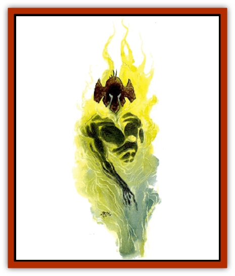

# Wraith - Athas

| Statistic | **Wraith (Athas)** |
| --- | --- |
| **Activity Cycle:** | Any |
| **Alignment:** | Neutral evil |
| **Armor Class:** | 2 |
| **Climate/Terrain:** | Any |
| **Damage/Attack:** | 1d4 or by weapon type |
| **Diet:** | None |
| **Frequency:** | Rare |
| **Hit Dice:** | 7+3 |
| **Intelligence:** | Average to High (8-14) |
| **Magic Resistance:** | Nil |
| **Morale:** | Elite (13-14) |
| **Movement:** | 9 |
| **No. Appearing:** | 1 or 1-4 |
| **No. of Attacks:** | 1 or 3/2 with weapon |
| **Organization:** | Solitary |
| **Size:** | M (6' tall) |
| **Special Attacks:** | Animate object, inhabit body, chill touch |
| **Special Defenses:** | +2 weapon or better to hit |
| **THAC0:** | 14 |
| **Treasure:** | R |
| **XP Value:** | 2,000 |

An Athasian [[Wraith|wraith]] is a noncorporeal [[Undead_Athas_General_Information|undead]] capable of moving freely between the Gray and the land of the living. It can possess unliving objects of all sorts, ranging from weapons to furniture to corpses, as well as unintelligent creatures such as [[Scorpion_Athas|scorpions]], insects, or slimes. Outside its host object, an Athasian wraith is barely visible, appearing only as a gray shade or a mass of churning darkness. Its form resembles its living body, but it can also assume a mist-like appearance. No matter what form a wraith takes, it can always be spotted by its glowing eyes, which range from a bright purple to blood red.

Wraiths who take human corpses as hosts fill out the dead flesh with their own misty form. When a section of the host is cut away, the same part of the wraith becomes visible. For instance, if an Athasian wraith possessed a corpse and the host's right arm were chopped off, the wraith's right arm would be visible in its place.

Athasian wraiths are capable of communicating verbally with the living and speak the same languages they spoke in life or have learned in undeath. They are free to communicate as they please outside their hosts, but are limited to the capabilities of the hosts they inhabit.

**Combat:** Athasian wraiths in their own forms can attack once per round with their fists, causing 1-4 (1d4) points of damage per attack. As the wraiths' fists pass through their opponents, the icy chill of death causes additional damage. Like the spell *chill touch*, the touch of a wraith causes 1d4 points of damage and the loss of 1 point of Strength unless a save vs. death is made. Lost Strength returns at the rate of 1 point per hour. A victim reduced to 0 Strength points dies immediately.

A wraith can reach into a living creature and grip its heart. This requires an attack roll made with a -4 penalty. Each round that the living creature is held, it must make a saving throw to shrug off the effects of the wraith's *chill touch*. While holding a living heart, a wraith can tell if the heart's owner is lying and can even read surface thoughts. A character held in such a way can't free himself, but any attack that causes damage to the wraith makes the undead release its grip immediately.

Wraiths inhabiting inanimate objects, living creatures, or corpses attack with the natural combat forms or with weapons. Damage inflicted on the host does not harm the wraith or even slow it down. A living creature, such as a scorpion or a [[Animal_Domestic_Athas_I|kank]], can be sliced to ribbons while the wraith continues to press its attack through the host. Inanimate objects, such as statues, suits of armor, or swords, can be animated to behave as though they were alive.

Wraiths can only be injured by enchanted weapons of +2 or better. Spells can also be used to harm them, but normal weapons and psionics don't affect them. While inhabiting a host, damage from attacks that can harm a wraith only cause half damage until the host form is destroyed.

Using an enchanted weapon against a wraith is dangerous, however. Every time a wraith comes in contact with a magical weapon, there is a chance that the weapon will be tainted. The chance that an enchanted weapon will be tainted depends on what it is made out of: metal 75%, rock 50%, bone or wood 25%. Every time a weapon is tainted, it loses one of its magical bonuses. Thus, a long sword +2 that is tainted becomes a +1. If it is tainted again, it loses all magical properties. As long as some enchantment remains, the weapon can be restored to its original form through the use of a *remove curse* spell. Weapons that have lost all magical bonuses cannot be restored.

Living creatures are allowed saving throws versus death to fight off a wraith's attempt to take them over.

Athasian wraiths are immune to paralyzation and poison, along with *sleep*, *charm*, *hold*, death, and cold-based spells. A *raise dead* spell utterly destroys an Athasian wraith if it fails a saving throw vs. death.

**Habitat/Society:** The Gray, one of the two parallel planes of existence next to the Prime Material Plane of Athas (the other is the Black), is the natural home of Athasian wraiths. In the Gray, the spirits of the dead slowly dissolve and are absorbed. Some spirits, like wraiths, don't suffer this fate. They are sustained by a force even more powerful than the Gray - their everlasting faith in a cause greater than themselves. Wraiths can freely travel between the Gray and the Prime Material Plane to serve whatever cause sustains them.

All wraiths need something important from their lives to serve as magnets for their spirits. These items can be candles of faith, like in the Crimson shrine, or brilliant gems full of life force, such as the gems used by the Dragon's wraith knights.

**Ecology:** Wraiths are merely undead shadows of the living, though they can have an effect on the material world when they so choose. Most wraiths seek to drive away those who still have life pulsing in their veins, seeking to defend the ancient sites they inhabit. Some, however, have a greater goal in mind and are motivated by a faith that lasts well beyond the death of their physical forms.

The Crimson Shrine, a temple of the ancients located in Under Tyr, is home to a host of extremely dedicated wraiths. Called the Crimson Knights, they inhabit full suits of steel armor and wield tall halberds. It is said that the pure of heart have nothing to fear from the Crimson Knights, but all others are actively barred from entering their temple. Thousands of candles flicker within the darkness of the temple, kept burning by the faith of the wraiths.

Another group of Athasian wraiths continue to walk the burning sands of Athas in the service of [[Dragon_of_Tyr|Borys the Dragon]], though their true devotion seems to be to the return of Rajaat.

---
## Discovery & Documentation

**Source Publication:** Dark Sun Appendix II - Terrors Beyond Tyr (1991)
**Campaign Setting:** Dark Sun
**Author(s):** Jim Atkiss, Steve Brown, Timothy B. Brown, Andrew P. Morris, Bruce Nesmith, Wes Nicholson, Bill Slavicsek

### Other Creatures Found in This Source Book
   * [[Aarakocra_Athas|Aarakocra (Athas)]]
   * [[Animal_Domestic_Athas_II|Animal, Domestic (Athas) II]]
   * [[Aviarag|Aviarag]]
   * [[Baazrag|Baazrag]]
   * [[Baazrag_Boneclaw|Baazrag, Boneclaw]]
   * [[Bloodgrass|Bloodgrass]]
   * [[Cactus_Hunting|Cactus, Hunting]]
   * [[Cactus_Rock|Cactus, Rock]]
   * [[Cilops|Cilops]]
   * [[Crodlu|Crodlu]]
   * [[Dagorran|Dagorran]]
   * [[Dhaot|Dhaot]]
   * [[Drake_Lesser_Athas_General_Information|Drake, Lesser (Athas), General Information]]
   * [[Drake_Lesser_Athas_Magma|Drake, Lesser (Athas), Magma]]
   * [[Drake_Lesser_Athas_Rain|Drake, Lesser (Athas), Rain]]
   * [[Drake_Lesser_Athas_Silt|Drake, Lesser (Athas), Silt]]
   * [[Drake_Lesser_Athas_Sun|Drake, Lesser (Athas), Sun]]
   * [[Dray|Dray]]
   * [[Drik|Drik]]
   * [[Dune_Reaper|Dune Reaper]]
   * [[Dwarf_Athas|Dwarf (Athas)]]
   * [[Elemental_Beast_Athas_Air|Elemental Beast (Athas), Air]]
   * [[Elemental_Beast_Athas_Earth|Elemental Beast (Athas), Earth]]
   * [[Elemental_Beast_Athas_Fire|Elemental Beast (Athas), Fire]]
   * [[Elemental_Beast_Athas_Water|Elemental Beast (Athas), Water]]
   * [[Elf_Athas|Elf (Athas)]]
   * [[Fael|Fael]]
   * [[Feylaar|Feylaar]]
   * [[Fordorran|Fordorran]]
   * [[Giant_Half-giant|Giant, Half-giant]]
   * [[Giant_Shadow|Giant, Shadow]]
   * [[Golem_Athas_Magma|Golem (Athas), Magma]]
   * [[Golem_Athas_Salt|Golem (Athas), Salt]]
   * [[Golem_Athas_General_Information|Golem (Athas), General Information]]
   * [[Gorak|Gorak]]
   * [[Halfling_Athas|Halfling (Athas)]]
   * [[Human_Athas|Human (Athas)]]
   * [[Jhakar|Jhakar]]
   * [[Kaisharga|Kaisharga]]
   * [[Kes'trekel|Kes'trekel]]
   * [[Klar|Klar]]
   * [[Krag|Krag]]
   * [[Kragling|Kragling]]
   * [[Lirr|Lirr]]
   * [[Mastyrial|Mastyrial]]
   * [[Meorty|Meorty]]
   * [[Mul|Mul]]
   * [[Nikaal|Nikaal]]
   * [[Paraelemental_Beast_General_Information|Paraelemental Beast, General Information]]
   * [[Paraelemental_Beast_Magma|Paraelemental Beast, Magma]]
   * [[Paraelemental_Beast_Rain|Paraelemental Beast, Rain]]
   * [[Paraelemental_Beast_Silt|Paraelemental Beast, Silt]]
   * [[Paraelemental_Beast_Sun|Paraelemental Beast, Sun]]
   * [[Pakubrazi|Pakubrazi]]
   * [[Psionocus|Psionocus]]
   * [[Psurlon|Psurlon]]
   * [[Raaig|Raaig]]
   * [[Retriever_Obsidian|Retriever, Obsidian]]
   * [[Ruktoi|Ruktoi]]
   * [[Ruvoka_Athas|Ruvoka (Athas)]]
   * [[Sand_Howler|Sand Howler]]
   * [[Scorpion_Athas|Scorpion (Athas)]]
   * [[Seed_Brain|Seed, Brain]]
   * [[Silt_Horror_Black|Silt Horror, Black]]
   * [[Silt_Horror_Magma|Silt Horror, Magma]]
   * [[Silt_Horror_Red|Silt Horror, Red]]
   * [[Silt_Spawn|Silt Spawn]]
   * [[Slig|Slig]]
   * [[Spider_Athas|Spider (Athas)]]
   * [[Spinewyrm|Spinewyrm]]
   * [[Ssurran|Ssurran]]
   * [[Stalking_Horror|Stalking Horror]]
   * [[Tarek|Tarek]]
   * [[Tari|Tari]]
   * [[Thri-kreen|Thri-kreen]]
   * [[T'liz|T'liz]]
   * [[Tohr-kreen_II|Tohr-kreen II]]
   * [[Tohr-kreen_III|Tohr-kreen III]]
   * [[Trin|Trin]]
   * [[Tul'k|Tul'k]]
   * [[Undead_Athas_General_Information|Undead (Athas), General Information]]
   * [[Xerichou|Xerichou]]
   * [[Zombie_Thinking|Zombie, Thinking]]
