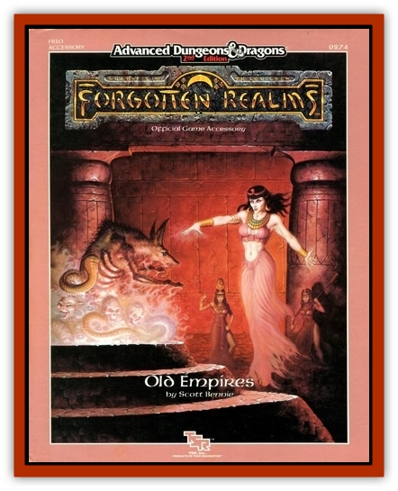

# Wraith - Desert

| Statistic | **Wraith, Desert** |
| --- | --- |
| **Activity Cycle:** | Night |
| **Alignment:** | Chaotic evil |
| **Armor Class:** | 4 |
| **Climate/Terrain:** | Subtropical/Desert |
| **Damage/Attack:** | 1-4 (in human form) or 1-6 (in jackal form) |
| **Diet:** | Life energy |
| **Frequency:** | Rare |
| **Hit Dice:** | 6+3 |
| **Intelligence:** | Low (5-7) |
| **Magic Resistance:** | 30% |
| **Morale:** | Elite (13-14) |
| **Movement:** | 9 (18 in jackal form) |
| **No. Appearing:** | 1-3 |
| **No. of Attacks:** | 1 |
| **Organization:** | Solitary or Group |
| **Size:** | M |
| **Special Attacks:** | Energy drain |
| **Special Defenses:** | +1 or better weapon to hit |
| **THAC0:** | 13 |
| **Treasure:** | Nil |
| **XP Value:** | 2,000 |

Creatures killed by [[Skriaxit|skriaxits]] are animated three days later as desert [[Wraith|wraiths]], malevolent spirits of the sands.

These creatures have two forms - that of a human and that of a [[Jackal|jackal]]. Their goal is to destroy any living creature that they encounter.

**Combat:** The desert wraith shifts between its two forms as it sees fit; it uses its jackal form to charge at its prey, then transforms itself into human form to attack. The human form inflicts 1d4 points of damage on a touch and drains the victim of one life level (no saving throw allowed), as per a wraith, with appropriate reductions in hit points, spell abilities, etc.

A desert wraith is undead and can be turned, on the same column as a spectre. Daylight destroys them utterly, and holy water inflicts 2d4 points of damage per vial.

While they have only low intelligence, they are capable of cunning (e.g., burying themselves in the sand, then attacking their prey by surprise).

They can see in total darkness as if it were noon.

**Habitat/Society:** A desert wraith is totally evil. It lives only to feed off the life forces of others. Desert wraiths dig barrows for themselves in the sand; they retreat to these during the day.

**Ecology:** Desert wraiths feed off life force energy. No creatures exist that prey on them. Creatures brought to 0 life levels by a desert wraith are transformed into [[Zombie|zombies]] within 48 hours, even if raised, unless their bodies are washed in holy water.

---
## Discovery & Documentation

**Source Publication:** FR10 Old Empires (1987)
**Campaign Setting:** Forgotten Realms
**Author(s):** Scott Bennie

### Other Creatures Found in This Source Book
   * [[Colossus_Stone|Colossus, Stone]]
   * [[Dragon_Brown|Dragon, Brown]]
   * [[Hakeashar|Hakeashar]]
   * [[Lycanthrope_Werecrocodile|Lycanthrope, Werecrocodile]]
   * [[Minion_Divine|Minion, Divine]]
   * [[Skriaxit|Skriaxit]]
   * [[Sphinx_Draco-|Sphinx, Draco-]]
