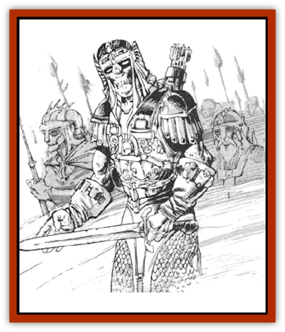

# Wraith - Oerth

| Statistic | **Soul Beckoner** | **Swordwraith** |
| --- | --- | --- |
| **Activity Cycle:** | Any | Night |
| **Alignment:** | Neutral evil | Lawful evil |
| **Armor Class:** | 2 | 3 |
| **Climate/Terrain:** | Any/Subterranean | Any/Old battlegrounds |
| **Damage/Attack:** | 1-6/1-6 | 1-10 |
| **Diet:** | Life energy | None |
| **Frequency:** | Rare | Rare |
| **Hit Dice:** | Varies (4+) | 7 |
| **Intelligence:** | High (13-14) | Average (8-10) |
| **Magic Resistance:** | Nil | Nil |
| **Morale:** | Champion (15-16) | Fearless (19-20) |
| **Movement:** | 6 | 9 |
| **No. Appearing:** | 1 | 2-8 |
| **No. of Attacks:** | 2 | 3/2 (as F7) |
| **Organization:** | Solitary | Military unit |
| **Size:** | M (6' tall) | M (6' tall) |
| **Special Attacks:** | Eerie whisper | Strength drain |
| **Special Defenses:** | +1 or better to hit | +2 or better to hit |
| **THAC0:** | Varies | 13 |
| **Treasure:** | E | Incidental |
| **XP Value:** | Varies | 650 |

## Swordwraith

Sword[[Wraith|wraiths]] are the spirits of warriors cut down during battle and kept from the dissolution of death by their indomitable wills.

Only seen at night, or underground where the sun never shines, swordwraiths appear as warriors. Although the armor and weapons are unremarkable, the flesh within appears insubstantial. Under certain lighting conditions, all that can be seen are two glowing eyes.

**Combat:** Swordwraiths, when they were alive, were hardened warriors; as undead, they retain their knowledge of strategy and tactics. They speak the common tongue and might parlay with someone they consider their military equal. Swordwraiths attack as normal warriors. No matter what weapon is used, the damage is 1d10 points. Each hit also drains 1 point of Strength from the victim. If a victim's Strength reaches 0, he dies. Strength lost to a swordwraiths attack can only be regained by complete rest (1 point per day of total inactivity), or through a *wish*, *limited wish*, or equally potent magic.

Swordwraiths can be harmed only by weapons of +2 or better enchantment. They are immune to *sleep*, *charm*, and other mind-affecting magic. They are turned by priests as if they were vampires.

**Habitat/Society:** Swordwraiths were once professional soldiers for whom fighting was all there was in life. In many cases, they are too stubborn to even admit that they are dead.

These creatures are active only in the absence of sunlight. Their bodies were typically interred in barrows or burial mounds. During daylight hours, intruders into such barrows may meet swordwraiths preparing for their nocturnal activities.

Swordwraiths congregate in small units, planning and executing midnight raids on nearby settlements. They are also likely to attack any traveling party unwise enough to spend the night within their territory. Swordwraiths gather no loot and occupy no territory; they fight because fighting is all they know.

Swordwraiths are common in the Stark Mounds region - probably as a result of ancient territorial wars between Geoff and Stench, or their forebears - but they can be found in any other parts of the world that boast old battlefields and war graves.

**Ecology:** Swordwraiths consume and produce nothing. Their victims are travelers and nearby settlers.

## Soul Beckoner

Soul beckoners resemble [[Shadow|shadows]] more than wraiths, being 90% undetectable unless seen in bright light. However, as soul beckoners drain energy levels, they take on the features of their victims, coming to resemble them in form.

**Combat:** When a victim is in range (see below), a soul beckoner lures him with whispers. Characters hearing the whispers must roll a successful saving throw vs. spell (Wisdom bonuses apply} or be drawn toward the creature. A successful saving throw negates the whisper and results in the character hearing an eerie wailing sound. The character must then roll another successful saving throw vs. spell or flee in terror for 1d4+1 rounds. Creatures drawn to a soul beckoner are attacked by the monster with a +4 bonus to its attack roll, but a successful hit breaks the enchantment of the whisper. Otherwise, victims are allowed a saving throw every round to escape the creature's enchantment with a cumulative bonus of +2 per round. A *silence* spell or a character incapable of hearing (i.e., deaf, ear plugs, etc.) prevents the effects of both the whisper and the wail.

This creature physically attacks with two daws, causing 1d6 points of damage each and also draining one energy level with each successful attack. When first encountered, a soul beckoner has 4 Hit Dice. However, for each energy level that it drains, it becomes 1 Hit Die stronger, gaining the extra hit points and THAC0 appropriate to its new Hit Dice. Therefore, in one round the monster is capable of draining up to two energy levels and gaining 2 HD and the extra hit points. A soul beckoner is turned by priests as an undead according to its current Hit Dice.

**Habitat/Society:** The solitary soul beckoner is normally found underground, where it waits for prey to come within 240 feet.

**Ecology:** The soul beckoner is simply a form of wraith that is more in tune with its previous living form, and thus has a stronger tie to the Prime Material plane than usual.

---
## Discovery & Documentation

**Source Publication:** MC5 Greyhawk Appendix (1989)
**Campaign Setting:** Advanced Dungeons & Dragons 2nd Edition
**Author(s):** Grant Boucher, William W. Connors, Steve Gilbert, Bruce Nesmith, Chris Mortika, Skip Williams

### Other Creatures Found in This Source Book
   * [[Aspis|Aspis]]
   * [[Beastman|Beastman]]
   * [[Bonesnapper|Bonesnapper]]
   * [[Booka|Booka]]
   * [[Brownie_Buckawn|Brownie, Buckawn]]
   * [[Brownie_Quickling|Brownie, Quickling]]
   * [[Crystalmist|Crystalmist]]
   * [[Dragon_Cloud|Dragon, Cloud]]
   * [[Dragon_Oerth_Greyhawk|Dragon (Oerth), Greyhawk]]
   * [[Dragonfly_Giant|Dragonfly, Giant]]
   * [[Dragonnel|Dragonnel]]
   * [[Elf_Grugach|Elf, Grugach]]
   * [[Elf_Valley|Elf, Valley]]
   * [[Golem_Necrophidius|Golem, Necrophidius]]
   * [[Grell_Wild|Grell, Wild]]
   * [[Grung|Grung]]
   * [[Hobgoblin_Norker|Hobgoblin, Norker]]
   * [[Hook_Horror|Hook Horror]]
   * [[Horgar|Horgar]]
   * [[Hound_Yeth|Hound, Yeth]]
   * [[Iguana_Giant|Iguana, Giant]]
   * [[Ingundi|Ingundi]]
   * [[Kech|Kech]]
   * [[Kyuss_Son_of|Kyuss, Son of]]
   * [[Mite|Mite]]
   * [[Needleman|Needleman]]
   * [[Plant_Carnivorous_Oerth|Plant, Carnivorous (Oerth)]]
   * [[Plant_Carnivorous_Vampire_Cactus|Plant, Carnivorous, Vampire Cactus]]
   * [[Plasmoid_General_Information|Plasmoid, General Information]]
   * [[Rat_Oerth|Rat (Oerth)]]
   * [[Raven_Crow|Raven/Crow]]
   * [[Scarecrow|Scarecrow]]
   * [[Shadow_Slow|Shadow, Slow]]
   * [[Skulk|Skulk]]
   * [[Snail|Snail]]
   * [[Sprite|Sprite]]
   * [[Taer|Taer]]
   * [[Tentamort|Tentamort]]
   * [[Turtle_Giant|Turtle, Giant]]
   * [[Tyrg|Tyrg]]
   * [[Wolf_Mist|Wolf, Mist]]
   * [[Zygom|Zygom]]
