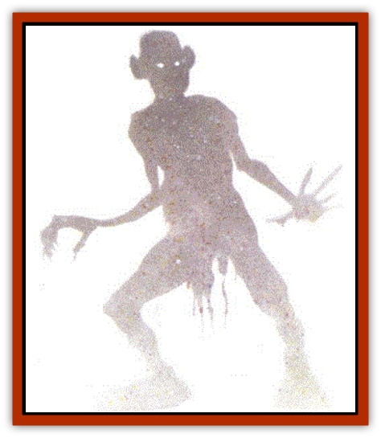

# Wraith - Shimmering

| Statistic | **Wraith, Shimmering** |
| --- | --- |
| **Activity Cycle:** | Any |
| **Alignment:** | Neutral |
| **Armor Class:** | 4 |
| **Climate/Terrain:** | Any |
| **Damage/Attack:** | 1d6 |
| **Diet:** | None |
| **Frequency:** | Summoned only by curse |
| **Hit Dice:** | 4 |
| **Intelligence:** | Non- (0) |
| **Magic Resistance:** | Nil |
| **Morale:** | Special |
| **Movement:** | 12 |
| **No. Appearing:** | 1 the first day, 2 the second, 4 the third, 16 the fourth, 256 the fifth, on the sixth day and onward, attacks are nonstop |
| **No. of Attacks:** | 1 |
| **Organization:** | Special |
| **Size:** | M (5-6' tall) |
| **Special Attacks:** | <i>Shadow chill</i> |
| **Special Defenses:** | Unaffected by cold, electricity, priestly turning attempts, or <i>dispel magic</i> |
| **THAC0:** | 17 |
| **Treasure:** | Nil |
| **XP Value:** | Special |

These entities are nonliving energies created by combining the forces of the Negative Energy Plane and the Quasi-elemental Plane of Lightning. Shimmering [[Wraith|wraiths]] resemble [[Shadow|shadows]] filled with sparkling points of light. They often go unnoticed until they coalesce into man-sized but irregular forms, just before attacking.

Shimmering wraiths speak no languages and are not known to communicate in any meaningful way.

**Combat:** These wraiths attack with a single touch, but a maximum of three wraiths can amount a man-sized creature at one time, and each inflicts 1d6 points of electrical damage, regardless of armor or clothing. Oddly, every hit point of damage a shimmering wraith inflicts lowers its own hit points by the exact same number, until the wraith dissipates.

Shimmering wraiths can be successfully struck by any weapon, but using a metallic weapon to touch or strike a wraith causes 1 point damage per successful touch to the attacker, as electricity surges through the weapon every time it contacts the monster.

If there is enough light (the equivalent of full daylight or a *continual light* spell) for a wraith to cast a shadow, it gains a second weapon. Anyone who is touched by the shadow of a wraith suffers 1d4 points of cold damage, regardless of armor or clothing. The Dungeon Master will have to determine the direction from which the light source emanates, and the area in which the wraith's shadow falls. The wraiths are unaffected by cold or electrical attacks, and they cannot be turned like other wraiths, nor will a *dispel magic* spell eliminate them. However, a *banishment* spell will send them back to the Inner Planes from whence they came. When confronted with protective spells and wards such as *shield*, *protection from evil*, *wall of force*, *wall of iron*, etc., or with physical barriers, the wraiths can become ethereal and penetrate most barriers (movement at half speed), then coalesce back into physical form and attack once more. They are nonintelligent, and their only tactic is to embrace their target.

**Habitat/Society:** Shimmering wraiths don't appear to have sentience, although they do recognize and pursue specific targets. They appear as the result of a curse uttered by an elemental being. Bound [[Elemental_General_Information|elementals]] cannot curse their masters, nor can they send shimmering wraiths from the Inner Planes to harass a former summoner, but if they break free of control while on the Prime Material Plane, they may curse a person for thwarting a plan or unsuccessfully attempting to bind them.

One day after the curse is laid, a single wraith appears and attacks the cursed character. The creature may be easily destroyed, but it reappears on the next day with another of its kind. Each day the number of shimmering wraiths is multiplied by itself, and the result is the number of them that will appear on the next day and so on until the cursed character is slain.

The only way to break the curse is to find the cursing elemental (if it is still on the Prime Material Plane) and either bind it or destroy it. If the elemental has returned to the Inner Planes, it must be summoned and bound, at which point it will withdraw its curse perforce. The creature must be satisfied or banished in order to keep it from cursing again.

**Ecology:** Some mages think that shimmering wraiths can be used to power *wands of lightning* and similar items, but since they dissipate upon defeat and always fight to the death, no one can test the theory.

---
## Discovery & Documentation

**Source Publication:** Monstrous Compendium, 1994 Annual, Volume 1 (1995)
**Campaign Setting:** Advanced Dungeons & Dragons 2nd Edition
**Author(s):** David Wise

### Other Creatures Found in This Source Book
   * [[Abyss_Ant|Abyss Ant]]
   * [[Achaierai|Achaierai]]
   * [[Afanc|Afanc]]
   * [[Al-Jahar|Al-Jahar]]
   * [[Baelnorn|Baelnorn]]
   * [[Baneguard|Baneguard]]
   * [[Banelar|Banelar]]
   * [[Bird_Talking|Bird, Talking]]
   * [[Blazing_Bones|Blazing Bones]]
   * [[Campestri|Campestri]]
   * [[Caniquine|Caniquine]]
   * [[Cat_Winged|Cat, Winged]]
   * [[Crypt_Servant|Crypt Servant]]
   * [[Death's_Head_Tree|Death's Head Tree]]
   * [[Dog_Saluqi|Dog, Saluqi]]
   * [[Dragon_Electrum|Dragon, Electrum]]
   * [[Dragon_Fang|Dragon, Fang]]
   * [[Dragon_Linnorm_Corpse_Tearer|Dragon, Linnorm, Corpse Tearer]]
   * [[Dragon_Linnorm_Dread|Dragon, Linnorm, Dread]]
   * [[Dragon_Linnorm_Flame|Dragon, Linnorm, Flame]]
   * [[Dragon_Linnorm_Forest|Dragon, Linnorm, Forest]]
   * [[Dragon_Linnorm_Frost|Dragon, Linnorm, Frost]]
   * [[Dragon_Linnorm_Gray|Dragon, Linnorm, Gray]]
   * [[Dragon_Linnorm_Land|Dragon, Linnorm, Land]]
   * [[Dragon_Linnorm_Midgard|Dragon, Linnorm, Midgard]]
   * [[Dragon_Linnorm_Rain|Dragon, Linnorm, Rain]]
   * [[Dragon_Linnorm_Sea|Dragon, Linnorm, Sea]]
   * [[Dragon_Neutral_Jacinth|Dragon, Neutral, Jacinth]]
   * [[Dragon_Neutral_Jade|Dragon, Neutral, Jade]]
   * [[Dragon_Neutral_Pearl|Dragon, Neutral, Pearl]]
   * [[Dread|Dread]]
   * [[Dragon-kin|Dragon-kin]]
   * [[Elemental_Earth_Kin_Chrysmal|Elemental, Earth Kin, Chrysmal]]
   * [[Elemental_Earth_Kin_Earth_Weird|Elemental, Earth Kin, Earth Weird]]
   * [[Elemental_Fire_Kin_Azer|Elemental, Fire Kin, Azer]]
   * [[Elemental_Sandman|Elemental, Sandman]]
   * [[Elemental_Wind_Walker|Elemental, Wind Walker]]
   * [[Elemental_Vermin|Elemental Vermin]]
   * [[Feystag|Feystag]]
   * [[Flame_Skull|Flame Skull]]
   * [[Foulwing|Foulwing]]
   * [[Gambado|Gambado]]
   * [[Garbug|Garbug]]
   * [[Genie_Tasked_Administrator|Genie, Tasked, Administrator]]
   * [[Genie_Tasked_Deceiver|Genie, Tasked, Deceiver]]
   * [[Genie_Tasked_Harim_Servant|Genie, Tasked, Harim Servant]]
   * [[Genie_Tasked_Messenger|Genie, Tasked, Messenger]]
   * [[Genie_Tasked_Miner|Genie, Tasked, Miner]]
   * [[Genie_Tasked_Oathbinder|Genie, Tasked, Oathbinder]]
   * [[Gibbering_Mouther|Gibbering Mouther]]
   * [[Gnasher|Gnasher]]
   * [[Gnasher_Winged|Gnasher, Winged]]
   * [[Golem_Brain|Golem, Brain]]
   * [[Golem_Hammer|Golem, Hammer]]
   * [[Golem_Metagolem|Golem, Metagolem]]
   * [[Golem_Spiderstone|Golem, Spiderstone]]
   * [[Gorynych|Gorynych]]
   * [[Greelox|Greelox]]
   * [[Helmed_Horror|Helmed Horror]]
   * [[Jarbo|Jarbo]]
   * [[Laraken|Laraken]]
   * [[Lich_Psionic|Lich, Psionic]]
   * [[Living_Steel|Living Steel]]
   * [[Lock_Lurker|Lock Lurker]]
   * [[Loxo|Loxo]]
   * [[Lycanthrope_Loup_de_Noir|Lycanthrope, Loup de Noir]]
   * [[Lycanthrope_Werebadger|Lycanthrope, Werebadger]]
   * [[Lycanthrope_Werejaguar|Lycanthrope, Werejaguar]]
   * [[Lythlyx|Lythlyx]]
   * [[Magebane|Magebane]]
   * [[Marrashi|Marrashi]]
   * [[Metalmaster|Metalmaster]]
   * [[Mimic_House_Hunter|Mimic, House Hunter]]
   * [[Naga_Bone|Naga, Bone]]
   * [[Nautilus_Giant|Nautilus, Giant]]
   * [[Nightshade_Toril|Nightshade (Toril)]]
   * [[Nishruu|Nishruu]]
   * [[Noran|Noran]]
   * [[Opinicus|Opinicus]]
   * [[Ormyrr|Ormyrr]]
   * [[Parasite|Parasite]]
   * [[Pasari-Niml|Pasari-Niml]]
   * [[Plant_Vampire_Moss|Plant, Vampire Moss]]
   * [[Pteraman|Pteraman]]
   * [[Rautym|Rautym]]
   * [[Shadeling|Shadeling]]
   * [[Skum|Skum]]
   * [[Snake_Giant_Cobra|Snake, Giant Cobra]]
   * [[Snake_Stone|Snake, Stone]]
   * [[Spectral_Wizard|Spectral Wizard]]
   * [[Spell_Weaver|Spell Weaver]]
   * [[Spider_Brain|Spider, Brain]]
   * [[Suwyze|Suwyze]]
   * [[Tatalla|Tatalla]]
   * [[Tick_Heart|Tick, Heart]]
   * [[Tree_Dark|Tree, Dark]]
   * [[Tree_Singing|Tree, Singing]]
   * [[Tressym|Tressym]]
   * [[Troll_Snow|Troll, Snow]]
   * [[Tuyewera|Tuyewera]]
   * [[Ulitharid|Ulitharid]]
   * [[Undead_Dwarf|Undead Dwarf]]
   * [[Undead_Lake_Monster|Undead Lake Monster]]
   * [[Whipsting|Whipsting]]
   * [[Windghost|Windghost]]
   * [[Wolf_Dread|Wolf, Dread]]
   * [[Wolf_Stone|Wolf, Stone]]
   * [[Wolf_Vampiric|Wolf, Vampiric]]
   * [[Xantravar|Xantravar]]
   * [[Xaver|Xaver]]
