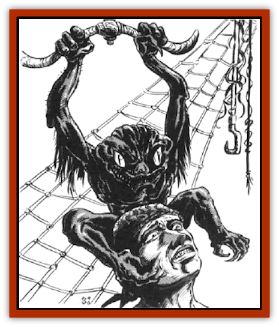

# Wryback

| Statistic | **Wryback** |
| --- | --- |
| **Activity Cycle:** | Night |
| **Alignment:** | Chaotic evil |
| **Armor Class:** | 5 |
| **Climate/Terrain:** | Any |
| **Damage/Attack:** | 1-3/1-3 |
| **Diet:** | Omnivore |
| **Frequency:** | Rare |
| **Hit Dice:** | 3 |
| **Intelligence:** | Low (5-7) |
| **Magic Resistance:** | See below |
| **Morale:** | Average (10) |
| **Movement:** | 15 |
| **No. Appearing:** | 2-7 |
| **No. of Attacks:** | 2 |
| **Organization:** | Pack |
| **Size:** | S (3' tall) |
| **Special Attacks:** | See below |
| **Special Defenses:** | See below |
| **THAC0:** | 17 |
| **Treasure:** | O,P,Q |
| **XP Value:** | 175 |

Wrybacks are malicious little humanoid creatures that live by scavenging and stealing. They are named for their twisted, rubbery bodies and limbs.

Adult wrybacks are three feet tall and weigh around 50 pounds. Their skin is black or gray, sometimes with a blue or green tint. Their heads are squat and wide, with two bulging, cat-like eyes (either oily blue or sickly green), rudimentary noses with vertical nostril slits, and wide mouths filled with curved, needle-sharp teeth. Their arms are ape-like and oddly twisted. Their hands have three fingers and a thumb, and each digit is equipped with a curved, wickedly sharp, ivory claw. The legs also are short, twisted and ape-like. The feet are prehensile, having four fingers and a thumb, but with flat nails instead of claws.

Although wrybacks can manipulate objects with all four apengages, the feet usually are used for delicate tasks. Thick, rough pads on the feet and palms of the hands allow them to move almost silently (90%) and climb sheer surfaces of stone (unless completely smooth) and of wood or any other surface soft enough for the creatures to sink their claws into. Wrybacks have been seen walking on two legs, running on all fours, and even swinging from rafters or spelljammer deck beams.

**Combat:** Wrybacks fight with their claws, but they prefer stealth and backbiting to direct attack. Wrybacks can move very quietly and are masters of concealment; opponents suffer a -3 penalty to surprise rolls. Wrybacks are 50% undetectable even if listened or watched for. Wrybacks have only weak infravision (30-foot range), but their eyes are five times more sensitive to normal light than human eyes. This causes their eyes to glow an eerie blue in dim light. Wrybacks also have hearing even more acute than that of [[Elf|elves]]. This and their sharp eyes give them a bonus of +1 to their surprise rolls.

Wrybacks have no true bones, only thin rods of gristle surrounded by layers of smooth, tough muscle - this gives them their twisted appearance. This construction makes them resistant to falling damage (subtract 30 feet from the actual distance fallen when calculating damage) and almost immune to blunt weapons. Though they feel pain when struck by a bludgeoning weapon, their bodies tend to compress under the blow, negating damage. However, a hit with a blunt weapon can inflict 1 point of damage if the attacker rolls a successful bend bars/lift gates roll.

**Habitat/Society:** Wrybacks usually are found in groups, as any place capable of supporting one of the little pests usually can support at least three or four. They can be found infesting the holds of ships or spelljammers (where they stow away by hiding in the cargo or climbing aboard via mooring lines), granaries, warehouses, dungeons, ruins, sewers, and anywhere else that might attract vermin.

**Ecology:** The wrybacks' home system is unknown, but their habit of stowing away on spelljammers has enabled them to spread to almost every system that supports life.

Wrybacks are effective, but not subtle, thieves. Their claws and arms are well suited to grasping and prying. A lone wryback working on a door or closure for ten minutes effectively has a Strength of 16 when determining its chance to open it, provided it is not entirely made out of stone, metal, or other material that is impervious to its claws. Each additional wryback adds 2 points of Strength, to a maximum of 19.

Wrybacks have one adaptation to space - the ability to automatically *feign death* when exposed to deadly air or poison gas. Wrybacks using this ability consume no air at all; they can maintain their trance indefinitely. When exposed to breathable air, they automatically return to consciousness in 1d4+1 rounds. They also have a 30% chance to voluntarily *feign death* when attacked and facing death, reawakening in 1d3 hours. An active wryback counts as half a person when calculating air consumption aboard a spelljammer.

How wrybacks mate is unknown, but they reproduce by budding. A pregnant female carries 1d4+1 warts on her back for about 10 weeks, when they erupt into tiny, fully formed wrybacks (1d3 hp each), these reach maturity in about eight weeks. Wrybacks live 25-30 years.

---
## Discovery & Documentation

**Source Publication:** MC7 Spelljammer Appendix I (1990)
**Campaign Setting:** Advanced Dungeons & Dragons 2nd Edition
**Author(s):** various

### Other Creatures Found in This Source Book
   * [[Aartuk|Aartuk]]
   * [[Albari|Albari]]
   * [[Ancient_Mariner|Ancient Mariner]]
   * [[Argos|Argos]]
   * [[Beholder_Abomination_Astereater|Beholder (Abomination), Astereater]]
   * [[Blazozoid|Blazozoid]]
   * [[Chattur|Chattur]]
   * [[Chevall|Chevall]]
   * [[Clockwork_Horror|Clockwork Horror]]
   * [[Colossus|Colossus]]
   * [[Delphinid|Delphinid]]
   * [[Dizantar|Dizantar]]
   * [[Dog|Dog]]
   * [[Dog_Bog_Hound|Dog, Bog Hound]]
   * [[Esthetic|Esthetic]]
   * [[Focoid|Focoid]]
   * [[Fractine|Fractine]]
   * [[Giant_Spacesea|Giant, Spacesea]]
   * [[Golem_Furnace|Golem, Furnace]]
   * [[Golem_Radiant|Golem, Radiant]]
   * [[Gravislayer|Gravislayer]]
   * [[Grommam|Grommam]]
   * [[Hadozee|Hadozee]]
   * [[Hamster_Giant_Space|Hamster, Giant Space]]
   * [[Jammer_Leech|Jammer Leech]]
   * [[Lakshu|Lakshu]]
   * [[Lumineaux|Lumineaux]]
   * [[Lutum|Lutum]]
   * [[Mimic_Space|Mimic, Space]]
   * [[Misi|Misi]]
   * [[Moon_Rogue|Moon, Rogue]]
   * [[Mortiss|Mortiss]]
   * [[Murderoid|Murderoid]]
   * [[Nay-Churr|Nay-Churr]]
   * [[Phlog-Crawler|Phlog-Crawler]]
   * [[Plasman|Plasman]]
   * [[Plasmoid_DeGleash|Plasmoid, DeGleash]]
   * [[Plasmoid_DelNoric|Plasmoid, DelNoric]]
   * [[Plasmoid_General_Information|Plasmoid, General Information]]
   * [[Plasmoid_Ontalak|Plasmoid, Ontalak]]
   * [[Puffer|Puffer]]
   * [[Q'nidar|Q'nidar]]
   * [[Rastipede|Rastipede]]
   * [[Reigar|Reigar]]
   * [[Rock_Hopper|Rock Hopper]]
   * [[Slinker|Slinker]]
   * [[Spider_Asteroid|Spider, Asteroid]]
   * [[Spiritjam|Spiritjam]]
   * [[Survivor|Survivor]]
   * [[Syllix|Syllix]]
   * [[Symbiont_Power|Symbiont, Power]]
   * [[Vine_Infinity|Vine, Infinity]]
   * [[Wiggle|Wiggle]]
   * [[Wizshade|Wizshade]]
   * [[Zard|Zard]]
   * [[Zodar|Zodar]]
