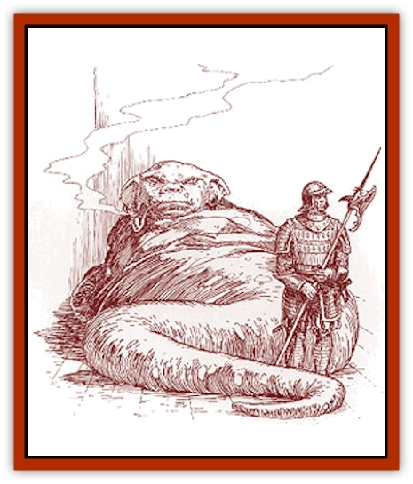

# Wurmling

| Statistic | **Wurmling** |
| --- | --- |
| **Activity Cycle:** | Any |
| **Alignment:** | Lawful evil |
| **Armor Class:** | 5 |
| **Climate/Terrain:** | Any hot climate |
| **Damage/Attack:** | 2d8/1d8 |
| **Diet:** | Omnivore |
| **Frequency:** | Very rare |
| **Hit Dice:** | 10-15 |
| **Intelligence:** | Exceptional (15-16) |
| **Magic Resistance:** | 2% per HD |
| **Morale:** | Fanatic (17-18) |
| **Movement:** | 24, Br 3 |
| **No. Appearing:** | 1 |
| **No. of Attacks:** | 2 (bite/tail) |
| **Organization:** | Patron |
| **Size:** | Huge (30-45' long) |
| **Special Attacks:** | Roll over, Legacies |
| **Special Defenses:** | Spell immunities |
| **THAC0:** | 10 HD: 11 / 11-12 HD: 9 / 13-14 HD: 7 / 15 HD: 5 |
| **Treasure:** | A,D |
| **XP Value:** | 5,000 + 1,000 per HD over 10 |

Wurmlings are large, intelligent [[Worm|worms]], often found at the helm of evil brotherhoods (such as assassins' guilds) and crime syndicates. They rule through a combination of physical presence, intellect, cunning, intimidation, and blackmail. Wurmlings are utterly greedy masters of subterfuge and blackmail, skillful at acquiring wealth and manipulating pawns. Wurmlings have an unparalleled ability to pay attention to details. They have phenomenal memories and never forget anything.

Wurmlings grow up to 45 feet long, gaining in length and bulk as they age. A mature wurmling (10 Hit Dice) weighs about eight tons and gains 1 ton per Hit Dice thereafter. They are brown in color, with a tough, leathery hide. The top of the wurmling is usually a darker shade than its underside. They have small spindly arms, a long whip-tail, and a prehensile tongue. They have large, yellow eyes and can see quite well in a wide variety of ambient lighting conditions, from bright sunlight to a single flickering candle.

*The Red Curse:* Each wurmling gains Legacies as an Inheritor of level equal to its Hit Dice. Thus, a 10 Hit Die wurmling has five Legacies, just like a 10th-level Inheritor. A 12 Hit Die wurmling has six Legacies, and a 15 Hit Die wurmling has seven Legacies. A wurmling requires *crimson essence* to activate all Legacies after the first. However, like an Inheritor, the wurmling gains the Legacy permanently. Also, the wurmling requires *cinnabryl* to support its Legacies.

   Typical wurmling Legacies include: Anti-Poison, Crimson Fire, Digging, Farsight, Red Shield, Shape Stone, and Temperature. Wurmlings often have Legacies appropriate to Eusdria.

**Combat:** A wurmling rarely enters melee combat, but it does have a ferocious bite and a whip-tail that it can use in an emergency. While its arms are small and spindly in comparison to its massive body, its great weight and bulk give it an effective Strength of 20 for purposes of holding on or grabbing things.

In spite of their bulk, wurmlings are extremely quick. If they have enough room, they can roll over on up to three man-sized or smaller opponents. If the victim makes a successful saving throw vs. paralysis, he avoids the attack. If the saving throw fails, the victim takes 1d4 points of damage per Hit Die of the Wurmling. If the wurmling stays on top, the victim continues to take this damage each round. Additionally, if the victim fails the initial saving throw, all of his items must make a successful saving throw vs. crushing blow or be demolished.

Wurmlings are immune to the hallucinatory effects of [[Plant_Savage_Coast|scarlet pimpernel]] and will often use this substance to augment their Legacies.

Wurmlings have the following thief abilities as a thief of equivalent level: open locks, find/remove traps, move silently, hear noise, and read languages. Wurmlings are skilled with languages and are able to fluently communicate in one language per 2 Hit Die. They also have the equivalent of the legend lore ability and the local history nonweapon proficiency. A wurmling gains additional information-related nonweapon proficiencies as a thief of equivalent level.

Wurmlings are immune to any mood-altering abilities or proficiencies such as fast talk, intimidation, or a bard's charm ability. They also get a +3 bonus on all saving throws against mind-altering spells such as *charm person*, *emotion*, *forget*, and *suggestion*. The same bonus applies to any mind-affecting Legacies used against the wurmling.

**Habitat/Society:** Wurmlings, while evil, are scrupulously fair in their business dealing. They do not cheat, although sealing a bargain with them is a tricky business. Wurmlings thrive on the seamy side of business, and they drive extremely hard bargains. Wurmlings do not tolerate competition, especially from other wurmlings. Each wurmling establishes a clearly defined territory. Conflict between wurmlings is always fatal to at least one of the wurmlings involved.

Wurmlings always have bodyguards. They are never found alone. There will always be at least 1d4 trusted guardians around the huge, bloated creature. In many cases, they have as many as 4d10 guardians. Typical guardian creatures include [[Orc|orcs]], [[Troll|trolls]] (if properly trained), [[Gnoll|gnolls]], evil humans, etc. Typically, a wurmling also has 100 to 200 retainers, servants, and assorted underlings.

A wurmling pays its people very good wages, which helps to ensure loyalty. The paranoid wurmling does not rely on that, however. Wurmlings seem physiologically incapable of trust. Instead, it supplements the wage-loyalty with magical conditioning, drug addiction, and blackmail. It typically knows 1d4 scandalous secrets about each of its servants.

Wurmlings sometimes obtain [[Lizard_Kin_Savage_Coast|krolli]] bodyguards. The two races are compatible enough that the wurmling rarely has to blackmail or coerce its krolli bodyguards.

Wurmlings are typically involved with a host of illegal and reprehensible activities, including blackmail, black marketing, bootlegging, bribery, copyright infringement, drug-trafficking, extortion (exorbitant charges for services rendered), gambling, money-laundering, assassination, prostitution, "protection" schemes, racketeering, and smuggling. Wurmlings are unlikely to kill or maim a defaulter. Dead people do not repay loans. They are, however, relentless in pursuit of a jumper. Wurmlings typically have considerable influence in the local police force, military, trade and merchants' guilds, and political offices.

**Ecology:** Wurmlings are hermaphroditic; they have both male and female reproductive organs, although they are not self-fertile. Mating between wurmlings occurs only after long and arduous negotiations (carried out through intermediaries), followed by the signing and witnessing of elaborate, intensely detailed contracts and agreements. Wurmlings will mate only after they are absolutely certain that they are not currently (and will never be) competing. The mating always occurs in neutral territory.

Since wurmlings weigh several tons and their mating is very energetic (coupled with the spontaneous and unpredictable firing of their Legacies), it can be very dangerous to be anywhere near a pair of mating wurmlings. After mating, both wurmlings become pregnant and have one offspring after a gestation period of about two years. The immature wurmling stays with its parent until it reaches 10 Hit Dice (about 100 years), learning the business before it strikes out on its own. A wurmling can live to be over 1,500 years old. After its death, a wurmling's decayed remains turn into *steel seed*.

The only widely known wurmling resides in Eusdria. This may seem like a strange place for a wurmling, but it works; Eusdria gave up contact with the Heldann freeholds years ago, so the wurmling supplies a steady and illicit trickle of *red steel*. The wurmling poses as a legitimate business owner, but its legitimate businesses are only the tip of the iceberg. The wurmling's organization is also bound by a rigid code of business conduct, similar to the Honorbound code. Eusdrian officials have tried for years to pin a criminal conviction on the wurmling, but have so far been unsuccessful.

A typical wurmling lair is underground, in a city or other center of commerce. A wurmling lair will always be well-defended, with lots of open space, traps, guards, and detection points. Trick floors, pressure plates, false doors, and trip-wires are also common. The lair usually includes one or more special holding cells for use by the wurmling's information retrieval technicians. The lair will also include quarters and accommodations for the wurmling's servants and guards.

Anyone looking for written records will be sorely disappointed. Wurmlings never write anything down, relying on their flawless memory to keep books, juggle accounts, etc.

Wurmlings can burrow, albeit slowly. They take advantage of their long life span and burrowing ability to carve intricate networks of secret tunnels beneath their lairs.

---
## Discovery & Documentation

**Source Publication:** Monstrous Compendium Savage Coast Appendix (Online Exclusive) (1995)
**Campaign Setting:** Mystara
**Author(s):** Loren L Coleman, Ted James, Thomas Zuvich, Cindi M. Rice

### Other Creatures Found in This Source Book
   * [[Aranea_Savage_Coast|Aranea (Savage Coast)]]
   * [[Arashaeem|Arashaeem]]
   * [[Batracine|Batracine]]
   * [[Cat_Marine|Cat, Marine]]
   * [[Cinnavixen|Cinnavixen]]
   * [[Clockwork_Swordsman|Clockwork Swordsman]]
   * [[Critter_Temple|Critter, Temple]]
   * [[Cursed_One|Cursed One]]
   * [[Deathmare|Deathmare]]
   * [[Dragon_Savage_Coast_Crimson|Dragon (Savage Coast), Crimson]]
   * [[Dragon_Savage_Coast_Red_Hawk|Dragon (Savage Coast), Red Hawk]]
   * [[Echyan|Echyan]]
   * [[Ee'aar|Ee'aar]]
   * [[Enduk|Enduk]]
   * [[Fachan_Savage_Coast|Fachan (Savage Coast)]]
   * [[Feliquine|Feliquine]]
   * [[Fiend_Narvaezan|Fiend, Narvaezan]]
   * [[Frelôn|Frelôn]]
   * [[Ghriest|Ghriest]]
   * [[Glutton_Sea|Glutton, Sea]]
   * [[Goatman|Goatman]]
   * [[Golem_Naâruk|Golem, Naâruk]]
   * [[Golem_Savage_Coast|Golem (Savage Coast)]]
   * [[Grudgling|Grudgling]]
   * [[Heraldic_Servant_I|Heraldic Servant I]]
   * [[Heraldic_Servant_II|Heraldic Servant II]]
   * [[Heraldic_Servant_III|Heraldic Servant III]]
   * [[Heraldic_Servant_IV|Heraldic Servant IV]]
   * [[Heraldic_Servant_V|Heraldic Servant V]]
   * [[Heraldic_Servant_General_Information|Heraldic Servant, General Information]]
   * [[Hermit_Sea|Hermit, Sea]]
   * [[Jorri|Jorri]]
   * [[Juhrion|Juhrion]]
   * [[Kla'a-tah|Kla'a-tah]]
   * [[Leech_Legacy|Leech, Legacy]]
   * [[Lich_Inheritor|Lich, Inheritor]]
   * [[Lizard_Kin_Savage_Coast|Lizard Kin (Savage Coast)]]
   * [[Lupasus|Lupasus]]
   * [[Lupin|Lupin]]
   * [[Lyra_Bird_Saragón|Lyra Bird, Saragón]]
   * [[Malfera|Malfera]]
   * [[Manscorpion_Nimmurian|Manscorpion, Nimmurian]]
   * [[Mythuínn_Folk|Mythuínn Folk]]
   * [[Neshezu|Neshezu]]
   * [[Nikt'oo|Nikt'oo]]
   * [[Nosferatu|Nosferatu]]
   * [[Omm-wa|Omm-wa]]
   * [[Omshirim|Omshirim]]
   * [[Parasite_Savage_Coast|Parasite (Savage Coast)]]
   * [[Phanaton|Phanaton]]
   * [[Plant_Savage_Coast|Plant (Savage Coast)]]
   * [[Pudding_Vermilion|Pudding, Vermilion]]
   * [[Rakasta|Rakasta]]
   * [[Ray_Forest|Ray, Forest]]
   * [[Shedu_Greater_Savage_Coast|Shedu, Greater (Savage Coast)]]
   * [[Shimmerfish|Shimmerfish]]
   * [[Skinwing|Skinwing]]
   * [[Spawn_of_Nimmur|Spawn of Nimmur]]
   * [[Spider-spy|Spider-spy]]
   * [[Spirit_Heroic|Spirit, Heroic]]
   * [[Spirit_Walleran|Spirit, Walleran]]
   * [[Succulus|Succulus]]
   * [[Swampmare|Swampmare]]
   * [[Symbiont_Shadow|Symbiont, Shadow]]
   * [[Tortle|Tortle]]
   * [[Troll_Legacy|Troll, Legacy]]
   * [[Trosip|Trosip]]
   * [[Tyminid|Tyminid]]
   * [[Utukku|Utukku]]
   * [[Voat|Voat]]
   * [[Voat_Herathian|Voat, Herathian]]
   * [[Vulturehound|Vulturehound]]
   * [[Wallara|Wallara]]
   * [[Wynzet|Wynzet]]
   * [[Yeshom|Yeshom]]
   * [[Zombie_Red|Zombie, Red]]
