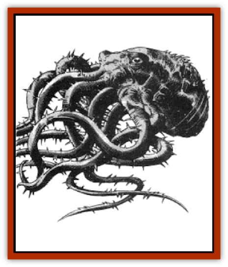

# Wyndlass

| Statistic | **Wyndlass** |
| --- | --- |
| **Activity Cycle:** | Any |
| **Alignment:** | Neutral |
| **Armor Class:** | 3 |
| **Climate/Terrain:** | Temperate/Forest and swamp |
| **Damage/Attack:** | 1-10 &times;10/1-4 |
| **Diet:** | Carnivore |
| **Frequency:** | Very rare |
| **Hit Dice:** | 12 |
| **Intelligence:** | Low (5-7) |
| **Magic Resistance:** | Nil |
| **Morale:** | Champion (15-16) |
| **Movement:** | 3 |
| **No. Appearing:** | 1 |
| **No. of Attacks:** | 11 |
| **Organization:** | Solitary |
| **Size:** | H (20' long) |
| **Special Attacks:** | Surprise |
| **Special Defenses:** | Nil |
| **THAC0:** | 9 |
| **Treasure:** | Z |
| **XP Value:** | 5,000 |

The wyndlass is a tentacled horror that lurks in desolate swamps and gloomy forests. A powerful predator, it has been known to devour several whole [[Horse|horses]] at a time in its quest to satisfy its awesome hunger. Few living men can tell the tale of a firsthand encounter with a wyndlass, as few ever survive such a meeting.

Although the wyndlass is seldom (if ever) seen by those it hunts, there have been occasions when it was sighted out of its pit by those with the sense to quickly note its appearance and then flee for their lives. From these accounts we know that the wyndlass looks something like a giant black [[Octopus_Giant|octopus]] with no fewer than ten tentacles. Each of these whiplike limbs is over 25 feet long and covered with keen barbs that sink deep into the flesh of prey. The tendrils attach to the body in two clusters of five limbs each. Between the two clusters are the creature's three eyes (which glow with a faint blue light) and its powerful beak.

**Combat:** When a wyndlass has buried itself in its quicksand pit (see "Ecology"), it lies very still and awaits the passing of a potential victim. As soon as something steps into its pit, the horror unfurls its tendrils and grabs hold of the prey, pulling it under the surface of the quicksand. When the wyndlass attacks in this manner, it imposes a -5 penalty to its opponents' surprise rolls. Once a victim is pulled beneath the surface of the quicksand pit, it quickly suffocates (see "Holding Your Breath", 2nd Edition *Player's Handbook*, page 122) and can be devoured by the wyndlass at its leisure.

Anyone caught in the grip of the wyndlass cannot take any action to defend himself from the attacks of the other tentacles or the bite of the beak. As a rule, the wyndlass devotes one of its tendril clusters to each opponent; thus, although it has ten limbs, the wyndlass can attack only two opponents at once. In addition, the creature's beak can bite only those who are held in its tendrils.

Anyone who attempts to wrench himself free of the wyndlass's tendrils is torn and cut by the barbs that cover their surface. Whenever an ensnared character attempts to break free, he must roll a successful bend bars/lift gates check. In so doing, however, he suffers 1d6 points of damage for each limb that was wrapped about him.

The wyndlass takes no delight in killing and is not an evil creature, but its great size requires that it hunt very often and this has led to its reputation as an evil and hateful thing.

**Habitat/Society:** The wyndlass is a solitary creature that spends most of its life at the bottom of its quicksand pit awaiting prey. Most intelligent creatures stay well clear of a wyndlass's lair (if they learn about it before being devoured).

A wyndlass sets up its lair by burrowing into the earth along a well-traveled game path or road. As it digs, it exudes a tine oil that mixes with the soil to form a substance that has far less surface tension than water or normal quicksand. Those who have had the chance to examine a pool of wyndlass quicksand claim that it is so slippery that you cannot actually feel it when you run it between your fingers. Whether or not that is the case, it is impossible to swim in the substance as it offers almost no support at all. When a creature steps onto the pit, it instantly plunges beneath the surface and is attacked by the wyndlass.

When a wyndlass feels that game is becoming scarce in a given area, it pulls itself out of its pit and begins the slow migration to a new home. As a rule, the wyndlass relocates like this only once a year or so.

**Ecology:** A powerful hunter in its own right, the wyndlass has few (if any) natural enemies. On occasion, it may be sought out and destroyed by teams of adventurers, however, because of the oil that it secretes. As a lubricant, wyndlass oil is second to none. While this alone might be enough to bring a few hunters out after the wyndlass, it is the creature's use to alchemists and wizards that most often spawns a hunting party. Wyndlass oil is one of the most common, and important, ingredients in *oil of slipperiness*, and it is often sought for this purpose.

---
## Discovery & Documentation

**Source Publication:** MC4 Dragonlance Appendix (w/binder #2) (1989)
**Campaign Setting:** Dragonlance
**Author(s):** Rick Swan

### Other Creatures Found in This Source Book
   * [[Anemone_Giant_Sea|Anemone, Giant Sea]]
   * [[Bear_Ice|Bear, Ice]]
   * [[Beast_Undead|Beast, Undead]]
   * [[Bird_Krynn|Bird (Krynn)]]
   * [[Disir|Disir]]
   * [[Draconian_Aurak|Draconian, Aurak]]
   * [[Draconian_Baaz|Draconian, Baaz]]
   * [[Draconian_Bozak|Draconian, Bozak]]
   * [[Draconian_Kapak|Draconian, Kapak]]
   * [[Draconian_General_Information|Draconian, General Information]]
   * [[Draconian_Sivak|Draconian, Sivak]]
   * [[Draconian_Proto-_Traag|Draconian, Proto-, Traag]]
   * [[Dragon_Amphi|Dragon, Amphi]]
   * [[Dragon_Astral|Dragon, Astral]]
   * [[Dragon_Kodragon|Dragon, Kodragon]]
   * [[Dragon_Krynn_Othlorx_General_Information|Dragon (Krynn), Othlorx, General Information]]
   * [[Dragon_Krynn_General_Information|Dragon (Krynn), General Information]]
   * [[Dragon_Sea|Dragon, Sea]]
   * [[Dreamshadow|Dreamshadow]]
   * [[Dreamwraith|Dreamwraith]]
   * [[Dwarf_Daergar|Dwarf, Daergar]]
   * [[Dwarf_Hill_Neidar|Dwarf, Hill, Neidar]]
   * [[Dwarf_Mountain_Hylar|Dwarf, Mountain, Hylar]]
   * [[Dwarf_Theiwar|Dwarf, Theiwar]]
   * [[Dwarf_Zakhar|Dwarf, Zakhar]]
   * [[Elf_Half-|Elf, Half-]]
   * [[Elf_High_Qualinesti|Elf, High, Qualinesti]]
   * [[Elf_High_Silvanesti|Elf, High, Silvanesti]]
   * [[Elf_Sea_Dargonesti|Elf, Sea, Dargonesti]]
   * [[Elf_Sea_Dimernesti|Elf, Sea, Dimernesti]]
   * [[Elf_Wild_Kagonesti|Elf, Wild, Kagonesti]]
   * [[Eyewing|Eyewing]]
   * [[Fetch|Fetch]]
   * [[Fire_Minion|Fire Minion]]
   * [[Fireshadow|Fireshadow]]
   * [[Gnome_Tinker|Gnome, Tinker]]
   * [[Gurik_Cha'ahl|Gurik Cha'ahl]]
   * [[Haunt_Knight|Haunt, Knight]]
   * [[Horax|Horax]]
   * [[Human_Krynn|Human (Krynn)]]
   * [[Imp_Blood_Sea|Imp, Blood Sea]]
   * [[Kalothagh|Kalothagh]]
   * [[Kani_Doll|Kani Doll]]
   * [[Kender|Kender]]
   * [[Kyrie|Kyrie]]
   * [[Lizard_Man_Krynn|Lizard Man (Krynn)]]
   * [[Minotaur_Krynn|Minotaur, Krynn]]
   * [[Ogre_High|Ogre, High]]
   * [[Ogre_Krynn|Ogre (Krynn)]]
   * [[Phaethon|Phaethon]]
   * [[Saqualaminoi|Saqualaminoi]]
   * [[Shadowperson|Shadowperson]]
   * [[Shimmerweed|Shimmerweed]]
   * [[Skrit|Skrit]]
   * [[Spectral_Minion|Spectral Minion]]
   * [[Spider_Krynn|Spider (Krynn)]]
   * [[Stag|Stag]]
   * [[Tayling|Tayling]]
   * [[Thanoi|Thanoi]]
   * [[Tylor|Tylor]]
   * [[Wichtlin|Wichtlin]]
   * [[Yaggol|Yaggol]]
