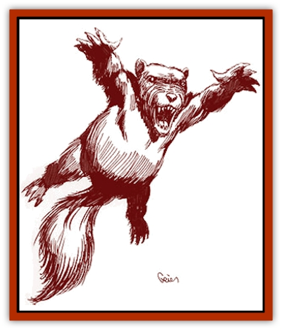

# Wynzet

| Statistic | **Wynzet** |
| --- | --- |
| **Activity Cycle:** | Any |
| **Alignment:** | Neutral |
| **Armor Class:** | 7 |
| **Climate/Terrain:** | Any forest |
| **Damage/Attack:** | 1d3 |
| **Diet:** | Carnivore |
| **Frequency:** | Very rare (common in Robrenn) |
| **Hit Dice:** | 1 |
| **Intelligence:** | Animal (1) |
| **Magic Resistance:** | Nil |
| **Morale:** | Steady (11-12) |
| **Movement:** | 12 |
| **No. Appearing:** | 1 |
| **No. of Attacks:** | 1 (bite) |
| **Organization:** | Solitary |
| **Size:** | T (1-2' tall) |
| **Special Attacks:** | Bite Legacy (1d8) |
| **Special Defenses:** | Nil |
| **THAC0:** | 19 |
| **Treasure:** | J,K,L,M,N |
| **XP Value:** | 120 |

Wynzets are large, furry creatures commonly found in Robrenn forests. They tend to have the form of either gray [[Mammal_Small|squirrels]] or [[Mammal_Small|rabbits]], but other forms have been found. A wynzet is cute and fluffy and appears to be very docile. Many humanoids find the appearance of the wynzet quite appealing, and wynzets will approach humanoids without fear. They are very docile and will allow themselves to be petted and fed quite tamely. They have soft fur and large, wide eyes.

This cute, tame appearance is very deceptive, however. The wynzet is a magical creature, empowered by the druids of Robrenn to help defend the forests. The wynzet is an extension of the forest that it lives in, and it taps in to the very "being" of the forest. Normally, its docile, pleasant appearance is quite true. It will happily play and frolic with nature-lovers. However, if the wynzet encounters a despoiler of the forest, its special powers come into play. It will approach such a despoiler, act cute and fluffy, and generally try to befriend the despoiler to get the him to drop his guard.

*The Red Curse:* Wynzets all have the Bite Legacy, but they do not require *cinnabryl*.

**Combat:** Once it has secured the friendship of someone who has been despoiling the forest, the wynzet uses its Bite Legacy to attack the person's throat. The wynzet can perform a lightning-fast leap of up to 15 feet to make this attack. The wynzet must make a successful attack roll with a +4 bonus to implement this attack.

On the wynzet's first successful attack, the victim must make a successful saving throw vs. paralyzation (dexterity bonuses apply) or die. If the saving throw succeeds, the victim still takes double normal damage from the first Bite attack (2d8 damage). Subsequent attacks do normal damage (1d8 for the Bite or 1d3 for the normal bite).

**Habitat/Society:** The wynzet usually behaves like the creature it resembles. A squirrel-form wynzet behaves like a squirrel, and likewise for a wynzet that has a rabbit-form.

**Ecology:** Wynzets are natural creatures augmented by the druids of Robrenn. A wynzet breeds as the creature it appears to be (squirrel or rabbit), but only about 5% of its offspring will be wynzets.

The wynzet restores ecological damage caused by despoilers of the forest. If marauders damage the forest, the wynzet kills them. Their bodies then decay and replenish the forest's ecology.

In Renardy, this creature is sometimes known as *le lapin mortel*.

---
## Discovery & Documentation

**Source Publication:** Monstrous Compendium Savage Coast Appendix (Online Exclusive) (1995)
**Campaign Setting:** Mystara
**Author(s):** Loren L Coleman, Ted James, Thomas Zuvich, Cindi M. Rice

### Other Creatures Found in This Source Book
   * [[Aranea_Savage_Coast|Aranea (Savage Coast)]]
   * [[Arashaeem|Arashaeem]]
   * [[Batracine|Batracine]]
   * [[Cat_Marine|Cat, Marine]]
   * [[Cinnavixen|Cinnavixen]]
   * [[Clockwork_Swordsman|Clockwork Swordsman]]
   * [[Critter_Temple|Critter, Temple]]
   * [[Cursed_One|Cursed One]]
   * [[Deathmare|Deathmare]]
   * [[Dragon_Savage_Coast_Crimson|Dragon (Savage Coast), Crimson]]
   * [[Dragon_Savage_Coast_Red_Hawk|Dragon (Savage Coast), Red Hawk]]
   * [[Echyan|Echyan]]
   * [[Ee'aar|Ee'aar]]
   * [[Enduk|Enduk]]
   * [[Fachan_Savage_Coast|Fachan (Savage Coast)]]
   * [[Feliquine|Feliquine]]
   * [[Fiend_Narvaezan|Fiend, Narvaezan]]
   * [[Frelôn|Frelôn]]
   * [[Ghriest|Ghriest]]
   * [[Glutton_Sea|Glutton, Sea]]
   * [[Goatman|Goatman]]
   * [[Golem_Naâruk|Golem, Naâruk]]
   * [[Golem_Savage_Coast|Golem (Savage Coast)]]
   * [[Grudgling|Grudgling]]
   * [[Heraldic_Servant_I|Heraldic Servant I]]
   * [[Heraldic_Servant_II|Heraldic Servant II]]
   * [[Heraldic_Servant_III|Heraldic Servant III]]
   * [[Heraldic_Servant_IV|Heraldic Servant IV]]
   * [[Heraldic_Servant_V|Heraldic Servant V]]
   * [[Heraldic_Servant_General_Information|Heraldic Servant, General Information]]
   * [[Hermit_Sea|Hermit, Sea]]
   * [[Jorri|Jorri]]
   * [[Juhrion|Juhrion]]
   * [[Kla'a-tah|Kla'a-tah]]
   * [[Leech_Legacy|Leech, Legacy]]
   * [[Lich_Inheritor|Lich, Inheritor]]
   * [[Lizard_Kin_Savage_Coast|Lizard Kin (Savage Coast)]]
   * [[Lupasus|Lupasus]]
   * [[Lupin|Lupin]]
   * [[Lyra_Bird_Saragón|Lyra Bird, Saragón]]
   * [[Malfera|Malfera]]
   * [[Manscorpion_Nimmurian|Manscorpion, Nimmurian]]
   * [[Mythuínn_Folk|Mythuínn Folk]]
   * [[Neshezu|Neshezu]]
   * [[Nikt'oo|Nikt'oo]]
   * [[Nosferatu|Nosferatu]]
   * [[Omm-wa|Omm-wa]]
   * [[Omshirim|Omshirim]]
   * [[Parasite_Savage_Coast|Parasite (Savage Coast)]]
   * [[Phanaton|Phanaton]]
   * [[Plant_Savage_Coast|Plant (Savage Coast)]]
   * [[Pudding_Vermilion|Pudding, Vermilion]]
   * [[Rakasta|Rakasta]]
   * [[Ray_Forest|Ray, Forest]]
   * [[Shedu_Greater_Savage_Coast|Shedu, Greater (Savage Coast)]]
   * [[Shimmerfish|Shimmerfish]]
   * [[Skinwing|Skinwing]]
   * [[Spawn_of_Nimmur|Spawn of Nimmur]]
   * [[Spider-spy|Spider-spy]]
   * [[Spirit_Heroic|Spirit, Heroic]]
   * [[Spirit_Walleran|Spirit, Walleran]]
   * [[Succulus|Succulus]]
   * [[Swampmare|Swampmare]]
   * [[Symbiont_Shadow|Symbiont, Shadow]]
   * [[Tortle|Tortle]]
   * [[Troll_Legacy|Troll, Legacy]]
   * [[Trosip|Trosip]]
   * [[Tyminid|Tyminid]]
   * [[Utukku|Utukku]]
   * [[Voat|Voat]]
   * [[Voat_Herathian|Voat, Herathian]]
   * [[Vulturehound|Vulturehound]]
   * [[Wallara|Wallara]]
   * [[Wurmling|Wurmling]]
   * [[Yeshom|Yeshom]]
   * [[Zombie_Red|Zombie, Red]]
