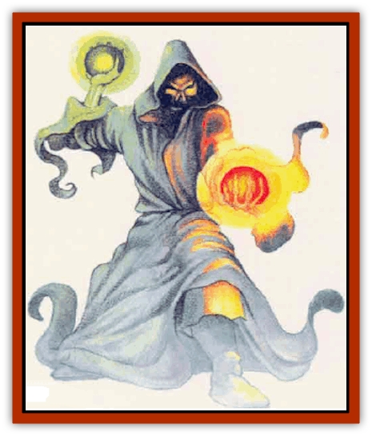

# Wyrd

| Statistic | **Greater** | **Lesser** |
| --- | --- | --- |
| **Activity Cycle:** | Night | Night |
| **Alignment:** | Chaotic evil | Chaotic evil |
| **Armor Class:** | 0 | 4 |
| **Climate/Terrain:** | Forest, ruins | Forest, ruins |
| **Damage/Attack:** | 1d10 (sphere)/1d10 (sphere) | 1d6 (sphere)/1d6 (sphere) |
| **Diet:** | None | None |
| **Frequency:** | Very rare | Rare |
| **Hit Dice:** | 8 | 4 |
| **Intelligence:** | Average (8-10) | Low (5-7) |
| **Magic Resistance:** | Nil | Nil |
| **Morale:** | Fearless (20) | Fearless (20) |
| **Movement:** | 12, Fl 24 (B) | 12 |
| **No. Appearing:** | 1d2 | 1d6 |
| **No. of Attacks:** | 2 | 2 |
| **Organization:** | Solitary | Solitary |
| **Size:** | M (6' tall) | M (6' tall) |
| **Special Attacks:** | Paralysis, chill | Nil |
| **Special Defenses:** | See below | See below |
| **THAC0:** | 13 | 17 |
| **Treasure:** | B | B |
| **XP Value:** | 5,000 | 420 |

Wyrds are undead creatures with strong connections to the Positive Energy Plane. They are created when an evil spirit inhabits the dead body of an [[Elf|elf]].

Wyrds appear as immaterial figures clad in dark, hooded robes. A dark, skeletal face is faintly visible in the depths of the hood. A wyrd's feet appear to be booted; its hands have flesh but are thin and gnarled. A wyrd holds a small red or green sphere, about the size of a grapefruit, in the palm of each hand. The spheres glow faintly, like the last embers of a dying fire.

**Combat:** A lesser wyrd can create two glowing red spheres each round. It can use its spheres as hand-to-hand weapons, or it can hurl them (range 30/60/90), or it can use one sphere for hand-to-hand combat and throw the other. When a sphere strikes a target, it bursts with a small thunderclap and a flash of brilliant energy that inflicts 1d6 points of damage on the target creature (1d6+3 points of damage if the victim is an elf). When a sphere explodes, a replacement instantly appears in the wyrd's hand, but the wyrd can never create more than two spheres per round, even if affected by a *haste* spell.

Wyrds can be harmed only by silver or magical weapons. Being undead, they move silently and are immune to poison and to *sleep*, *charm*, and *hold* spells.

A ward can be turned as a wraith.

Wyrds prefer to attack from a distance, concentrating on elves and on any character capable of returning the attack. Creatures killed by a wyrd tend to be badly burned by the energy spheres but can be raised normally; they do not return from death as undead.

**Habitat/Society:** Wyrds can be found haunting caves, ruins, and forests. During daylight, a wyrd retreats into a dense thicket of undergrowth or into a lightless crypt or cave. Like most undead, wyrds loathe the living and relentlessly attack any creature they encounter. Forest-dwelling wyrds are a particular bane to good sylvan creatures such as [[Unicorn|unicorns]] and [[Dryad|dryads]], and these creatures do not hesitate to destroy a wyrd just as soon as they can muster enough force to do so. Elves, for obvious reasons, despise wyrds and try to see that they are destroyed as quickly as possible.

**Ecology:** Except for their propensity to kill, wyrds have no role in the ecology.

The process that creates wyrds is a mystery. It seems to be clear, however, that the spirit that animates a wyrd prefers to occupy elves who have died violently and been left unburied. Elves who have been abandoned by their fellow elves and left to die alone seem to be the most likely to become wyrds. Certain locales near places of ancient evil, such as ruined temples, battlefields where evil forces were once victorious, and scenes of great treachery also seem to be prone to produce wyrds.

**Greater Wyrd**

  This more hideous variety of wyrd, created when an undead spirit occupies the body of an exceptionally high-level elf, is justifiably feared. Any creature viewing a greater wyrd must make a successM saving throw vs. spell or be stricken with a dreadful chill that causes a -3 penalty to all attack and damage rolls when fighting the wyrd (successful attacks always inflict at least 1 point of damage). The penalty remains in force until the reater wyrd is destroyed, until the next sunrise, or until the victim receives a *remove curse* spell from a caster of at least 9th level. The victim, however, is still vulnerable and must roll another saving throw if the greater wyrd appers again, wheras those who make successful saving throws when first confronting the wyrd are immune to the effects until the next sunset.

A greater wyrd's globes glow a sickly green. They eplode for 1d10 points of damage when they hit, and the victim must make a successful saving throw vs. paralyzation or be paralyzed for 2d4 turns (elves suffer 1d10+5 points of damage from each globe but are immune to the paralyzation effect).

Greater wyrds are turned as ghosts.

Like the lesser wyrd, the greater wyrd can be hit only by magical or silver weapons and is immune to poison and to *sleep*, *charm*, and *hold* spells.

---
## Discovery & Documentation

**Source Publication:** Mystara Appendix (1994)
**Campaign Setting:** Mystara
**Author(s):** John Nephew, Teeuwynn Woodruff, John Terra, Skip Williams

### Other Creatures Found in This Source Book
   * [[Actaeon|Actaeon]]
   * [[Agarat|Agarat]]
   * [[Ash_Crawler|Ash Crawler]]
   * [[Baldandar|Baldandar]]
   * [[Bargda|Bargda]]
   * [[Bhut|Bhut]]
   * [[Bird_Mystara|Bird (Mystara)]]
   * [[Blackball|Blackball]]
   * [[Choker|Choker]]
   * [[Coltpixie|Coltpixie]]
   * [[Crone_of_Chaos|Crone of Chaos]]
   * [[Darkhood|Darkhood]]
   * [[Darkwing|Darkwing]]
   * [[Decapus|Decapus]]
   * [[Deep_Glaurant|Deep Glaurant]]
   * [[Diabolus|Diabolus]]
   * [[Dimensional_Warper|Dimensional Warper]]
   * [[Dragon_Mystara_Crystalline|Dragon (Mystara), Crystalline]]
   * [[Dragon_Mystara_Jade|Dragon (Mystara), Jade]]
   * [[Dragon_Mystara_Onyx|Dragon (Mystara), Onyx]]
   * [[Dragon_Mystara_Ruby|Dragon (Mystara), Ruby]]
   * [[Drake_Mystara|Drake (Mystara)]]
   * [[Dragonfly|Dragonfly]]
   * [[Dusanu|Dusanu]]
   * [[Elemental_of_Chaos_Air_Earth|Elemental of Chaos, Air/Earth]]
   * [[Elemental_of_Chaos_Fire_Water|Elemental of Chaos, Fire/Water]]
   * [[Elemental_of_Law_Air_Earth|Elemental of Law, Air/Earth]]
   * [[Elemental_of_Law_Fire_Water|Elemental of Law, Fire/Water]]
   * [[Familiar_Mystara|Familiar (Mystara)]]
   * [[Frost_Salamander|Frost Salamander]]
   * [[Fundamental_Air_Earth|Fundamental, Air/Earth]]
   * [[Fundamental_Fire_Water|Fundamental, Fire/Water]]
   * [[Gargantua_Mystara|Gargantua (Mystara)]]
   * [[Geonid|Geonid]]
   * [[Ghostly_Horde|Ghostly Horde]]
   * [[Giant_Athach|Giant, Athach]]
   * [[Giant_Hephaeston|Giant, Hephaeston]]
   * [[Golem_Drolem|Golem, Drolem]]
   * [[Golem_Mystara_I|Golem (Mystara) I]]
   * [[Golem_Mystara_II|Golem (Mystara) II]]
   * [[Golem_Mystara_III|Golem (Mystara) III]]
   * [[Gray_Philosopher|Gray Philosopher]]
   * [[Guardian_Warrior|Guardian Warrior]]
   * [[Gyerian|Gyerian]]
   * [[Herex|Herex]]
   * [[Hivebrood|Hivebrood]]
   * [[Horde|Horde]]
   * [[Hsiao|Hsiao]]
   * [[Huptzeen|Huptzeen]]
   * [[Hutaakan|Hutaakan]]
   * [[Imp_Mystara|Imp (Mystara)]]
   * [[Jellyfish_Giant_Mystara|Jellyfish, Giant (Mystara)]]
   * [[Kna|Kna]]
   * [[Kopru|Kopru]]
   * [[Lizard_Mystara|Lizard (Mystara)]]
   * [[Lizard-kin_Mystara|Lizard-kin (Mystara)]]
   * [[Lupin|Lupin]]
   * [[Lycanthrope_Werejaguar_Mystara|Lycanthrope, Werejaguar (Mystara)]]
   * [[Lycanthrope_Wereswine|Lycanthrope, Wereswine]]
   * [[Magen|Magen]]
   * [[Manikin|Manikin]]
   * [[Mek|Mek]]
   * [[Mujina|Mujina]]
   * [[Nagpa|Nagpa]]
   * [[Neh-thalggu|Neh-thalggu]]
   * [[Nightshade_Mystara|Nightshade (Mystara)]]
   * [[Nuckalavee|Nuckalavee]]
   * [[Pegataur|Pegataur]]
   * [[Phanaton|Phanaton]]
   * [[Plant_Dangerous_Mystara|Plant, Dangerous (Mystara)]]
   * [[Plasm|Plasm]]
   * [[Rakasta|Rakasta]]
   * [[Rock_Man|Rock Man]]
   * [[Sabreclaw|Sabreclaw]]
   * [[Sacrol|Sacrol]]
   * [[Scamille|Scamille]]
   * [[Shapeshifter|Shapeshifter]]
   * [[Shargugh|Shargugh]]
   * [[Shark-kin|Shark-kin]]
   * [[Sollux|Sollux]]
   * [[Spectral_Death|Spectral Death]]
   * [[Spectral_Hound|Spectral Hound]]
   * [[Spider-kin|Spider-kin]]
   * [[Spirit_Mystara|Spirit (Mystara)]]
   * [[Statue_Living|Statue, Living]]
   * [[Surtaki|Surtaki]]
   * [[Tabi|Tabi]]
   * [[Thoul|Thoul]]
   * [[Thunderhead|Thunderhead]]
   * [[Tiger_Ebon|Tiger, Ebon]]
   * [[Topi|Topi]]
   * [[Tortle|Tortle]]
   * [[Vampire_Velya|Vampire, Velya]]
   * [[White_Fang|White Fang]]
   * [[Worm_Mystara|Worm (Mystara)]]
   * [[Yowler|Yowler]]
   * [[Zombie_Lightning|Zombie, Lightning]]
