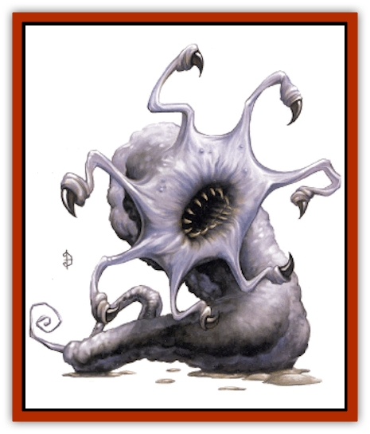

# Wyste

| Statistic | **Wyste** |
| --- | --- |
| **Activity Cycle:** | Any |
| **Alignment:** | Neutral evil |
| **Armor Class:** | 2 |
| **Climate/Terrain:** | Far Realms gate |
| **Damage/Attack:** | 1d4+1 &times;4 |
| **Diet:** | Carnivore |
| **Frequency:** | Very rare |
| **Hit Dice:** | 5+5 |
| **Intelligence:** | Non- (0) |
| **Magic Resistance:** | Nil |
| **Morale:** | Steady (12) |
| **Movement:** | 3, Sw 15 |
| **No. Appearing:** | 2-8 |
| **No. of Attacks:** | 4 |
| **Organization:** | School |
| **Size:** | H (25' long) |
| **Special Attacks:** | Drowning |
| **Special Defenses:** | Nil |
| **THAC0:** | 15 |
| **Treasure:** | Nil |
| **XP Value:** | 975 |

The wyste (pronounced, *wist*) is an alien creature much like a giant [[Worm|worm]] that inhabits fetid pools of slime. The typical specimen is 2 feet in diameter and about 25 feet long.

Its skin is translucent, showing strange twisted strands of pulsing organs underneath. The creature has no eyes or mouth; instead it has a large sucker hole fringed by large, claw-tipped cilia. The cilia not only allow the wyste to sense its environment and feed itself, but also provide a defense against predators. So far as is known, wystes operate only by instinct, and live to feed.

**Combat:** Wystes are aggressively territorial and will lunge up to 15 feet out of their slimy pools to attack creatures that approach. Often, wystes in an area attack as a group, and any other nearby that are attracted by the commotion will move in to feed as well. Despite their size. wystes are fast, whipping and writhing to bring their clawed cilia to bear. Those killed by a wyste will be dragged away, to be consumed at its leisure, provided the wyste can defend the body against the onslaught of its fellows.

Sometimes a wyste will attempt to seize and drown an intruder. Only prey of man-size or smaller will be attacked in this fashion. A successful attack means the wyste wraps its body around the prey and pulls it into the slime pool. The prey can make a Strength check with a -2 penalty to its Strength to escape. Even if it escapes, the prey requires a successful swimming or direction sense proficiency check to reach the surface. Failure means the prey will become disoriented in the slime and eventually drown. A victim who fails to escape can try once per wound, after making any necessary check against drowning, as described in the *DMG*. Further, the pool slime is poisonous. Any creature not of the Far Realm or mutated by its effects that swallows the slime must make a successful saving throw vs. poison or die in 1d4 rounds.

**Habitat/Society:** Not much is known of these creatures, for they have so far been found only in or near pools of slime of alien origin. Presumably, they are much like aquatic worms or [[Leech|leeches]], but the matter is certainly subject to further study.

Apparently, wystes do not need to breathe in their native slime, or at least they can remain submerged for long periods. Their presence in a pool of slime might be detected by the ripples they create as they swim just below the surface.

Wystes are not restricted to their slime pools; they can move slowly about on land. However, they cannot go far from a slime pool; if wystes are encountered, a pool of the opaque blue slime native to the Far Realm will be nearby.

The slime pools that wystes swim in are produced by two types of subterranean alien life forms. One creature, a satiny black bulb, grows on rock walls and ceilings, clinging there by thick, fibrous roots. The second creature is a doughy; dog-sized white lump, which is able to crawl on walls and ceilings. Apparently, the white lumps feed on the black bulbs. Every so often a dark orifice opens in a white lump and discharges an opaque blue ooze.

The slimy ooze runs together and collects in stagnant pools. The slime is somewhat slippery, and poisonous if ingested (save vs. poison or die in 1d4 rounds). Apparently, by themselves, the smaller creatures are harmless, but the slime pools they create attract wystes, and wystes attract [[Dharculus|dharculi]] and other weird predators of the Far Realm,

**Ecology:** Wystes are often preyed upon by dharculi, and if wystes are encountered, there is a 10% chance that at least one dharculus will be nearby. If the influence of the alien energies of the Far Realm is removed, the wystes will eventually die off (in about one month) as the creatures that renew their slime pools die.

---
## Discovery & Documentation

**Source Publication:** Monstrous Compendium, 1997 Annual, Volume 4 (1995)
**Campaign Setting:** Advanced Dungeons & Dragons 2nd Edition
**Author(s):** Jon Pickens

### Other Creatures Found in This Source Book
   * [[Anemone_Giant_Sea|Anemone, Giant Sea]]
   * [[Asperii|Asperii]]
   * [[Bainligor|Bainligor]]
   * [[Beast_of_Chaos|Beast of Chaos]]
   * [[Blindheim|Blindheim]]
   * [[Bloodsipper_Far_Realm|Bloodsipper (Far Realm)]]
   * [[Bulette_Gohlbrorn|Bulette, Gohlbrorn]]
   * [[Child_of_the_Sea|Child of the Sea]]
   * [[Clockwork_Horror|Clockwork Horror]]
   * [[Clockwork_Swordsman|Clockwork Swordsman]]
   * [[Coral|Coral]]
   * [[Darklore|Darklore]]
   * [[Dharculus|Dharculus]]
   * [[Dolphin_Athas|Dolphin (Athas)]]
   * [[Dragon_Neutral_Moonstone|Dragon, Neutral, Moonstone]]
   * [[Dragon_Prismatic|Dragon, Prismatic]]
   * [[Dream_Stalker|Dream Stalker]]
   * [[Dragon-kin_Albino_Wyrm|Dragon-kin, Albino Wyrm]]
   * [[Echyan|Echyan]]
   * [[Firestar|Firestar]]
   * [[Firetail|Firetail]]
   * [[Fish_Ascallion|Fish, Ascallion]]
   * [[Fish_Deep_Ocean|Fish, Deep Ocean]]
   * [[Fish_Tropical|Fish, Tropical]]
   * [[Fish_Vurgens|Fish, Vurgens]]
   * [[Fogwarden|Fogwarden]]
   * [[Fraal|Fraal]]
   * [[Giant_Crag|Giant, Crag]]
   * [[Gibberling_Brood|Gibberling, Brood]]
   * [[Glutton_Sea|Glutton, Sea]]
   * [[Golden_Ammonite|Golden Ammonite]]
   * [[Golem_Brass_Minotaur|Golem, Brass Minotaur]]
   * [[Golem_Gemstone|Golem, Gemstone]]
   * [[Golem_Maggot|Golem, Maggot]]
   * [[Groundling|Groundling]]
   * [[Hermit_Sea|Hermit, Sea]]
   * [[Hound_of_Law|Hound of Law]]
   * [[Human_Amazon|Human, Amazon]]
   * [[Human_Pygmy|Human, Pygmy]]
   * [[Inquisitor|Inquisitor]]
   * [[Kercpa|Kercpa]]
   * [[Kreel|Kreel]]
   * [[Lycanthrope_Lythari|Lycanthrope, Lythari]]
   * [[Mercurial|Mercurial]]
   * [[Mold_Chromatic|Mold, Chromatic]]
   * [[Mummy_Bog|Mummy, Bog]]
   * [[Neh-thalggu|Neh-thalggu]]
   * [[Nymph_Grain|Nymph, Grain]]
   * [[Nymph_Unseelie|Nymph, Unseelie]]
   * [[Octopus_Octo-Jelly|Octopus, Octo-Jelly]]
   * [[Puddingfish|Puddingfish]]
   * [[Sea_Demon|Sea Demon]]
   * [[Shade|Shade]]
   * [[Shadowrath|Shadowrath]]
   * [[Shark_Athas|Shark (Athas)]]
   * [[Siren_Ravenloft|Siren (Ravenloft)]]
   * [[Skeleton_Variant|Skeleton, Variant]]
   * [[Skyfish|Skyfish]]
   * [[Spectral_Scion|Spectral Scion]]
   * [[Spyder_Fiend|Spyder Fiend]]
   * [[Squid_Squark|Squid, Squark]]
   * [[Tanar'ri_Lesser_Uridezu|Tanar'ri, Lesser, Uridezu]]
   * [[Troll_Mutate|Troll Mutate]]
   * [[Vaati|Vaati]]
   * [[Vampire_Cerebral|Vampire, Cerebral]]
   * [[Varkha|Varkha]]
   * [[Wizshade|Wizshade]]
   * [[Worm_Lukhorn|Worm, Lukhorn]]
   * [[Yugoloth_Lesser_Gacholoth|Yugoloth, Lesser, Gacholoth]]
   * [[Zombie_Mud|Zombie, Mud]]
