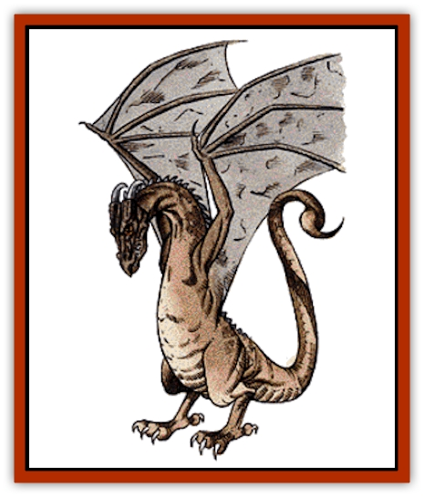

# Wyvern

| Statistic | **Wyvern** |
| --- | --- |
| **Activity Cycle:** | Dusk and dawn |
| **Alignment:** | Neutral (evil) |
| **Armor Class:** | 3 |
| **Climate/Terrain:** | Temperate mountain forests and jungles |
| **Damage/Attack:** | 2-16/1-6 |
| **Diet:** | Carnivore |
| **Frequency:** | Uncommon |
| **Hit Dice:** | 7+7 |
| **Intelligence:** | Low (5-7) |
| **Magic Resistance:** | Nil |
| **Morale:** | Elite (14) |
| **Movement:** | 6, Fl 24 (E) |
| **No. Appearing:** | 1-6 |
| **No. of Attacks:** | 2 |
| **Organization:** | Solitary |
| **Size:** | G (35' long) |
| **Special Attacks:** | Poison |
| **Special Defenses:** | Nil |
| **THAC0:** | 13 |
| **Treasure:** | E |
| **XP Value:** | 1,400 |

A distant cousin to the [[Dragon_General_Information|dragon]], the wyvern is a huge flying [[Lizard|lizard]] with a poisonous stinger in its tail.

The 35-foot-long dark brown to gray body of the wyvern is half tail. Its leathery [[Bat|bat]]like wings are over 50 feet from tip to tip. The head alone is 4 feet long and filled with long, sharp teeth. Unlike the dragon, it has only hind legs, using them the same way a hunting [[Bird|bird]] would. The tip of the tail is a thick knot of cartilage from which a 2- foot-long stinger protrudes, very much like that of a [[Scorpion|scorpion]]. The eyes are red or orange. A wyvern does not have a strong odor, although its lair might smell of a recent kill. These beasts can make two sounds: a loud hiss, which sounds like a hot sword plunged into water, and a low, deep-throated growl, much like that of a bull [[Crocodile|crocodile]].

**Combat:** Rather stupid, but aggressive, wyverns will nearly always attack. In combat, the wyvern always prefers to be flying, and will seize any opportunity to take flight and continue combat. If trapped on the ground it will bite (2-16 points of damage) and use its stinger (1-6 points of damage), attacking the most convenient target or targets. The tail is very mobile, easily striking over the back of the wyvern to hit an opponent to its front. The stinger injects poison (type F) into the wound, against which the victim must make a save vs. poison or die. Even if the saving throw is successful, the victim suffers 1-6 points of physical damage from the sting.

From the air the wyvern is a far more deadly opponent. It dives upon ground targets, attempting to snatch them up in its two taloned claws (1-6 points of damage each) and fly off. Man-sized victims are snatched if at least one talon hits for damage. Large victims require both talons to hit in order to snatch them up. The wyvern cannot fly while carrying anything bigger. After a dive, it takes the wyvern a full round to circle around. On the next round it can dive again. Once airborne with prey in its talons, the wyvern stings and bites each round, both at +4 to hit, until the victim is motionless. In aerial combat, the wyvern will make a pass during which it will either bite or sting. Then it will land and feast, not hunting again until the next day.

As a hunter, the wyvern is cunning. It will avoid letting its shadow fall across its prey as a warning. The final approach of the dive is done in complete silence, imposing a -2 surprise modifier on the target. It trails its prey from downwind whenever possible. A mature wyvern often waits for the right moment to strike, and is willing to let prey go that is too powerful or within easy reach of cover. Such a wyvern understands that men, particularly those armed in bright metal, are stronger than their size would indicate. Given a perfect opportunity, it will attempt to snatch up an unarmored member and fly out of range.

**Habitat/Society:** The wyvern is a solitary creature, nesting only with its mate and young. It tends to lair on mountainsides that overlook forests, jungles, or sometimes plains. A wyvern makes its lair in large caverns that can be found in such places, staking out a territory about 25 miles across. If game is sparse, it will hunt with a small group of its own kind. Only young wyverns attack others of their kind, usually to establish new territory. Older wyverns settle disputes in an unknown manner without actual combat.

Some wyverns have been known to work with evil dragons. Usually these dragons completely dominate the weaker and smaller wyverns.

**Ecology:** An adult wyvern consumes the equivalent of a man-sized to large creature once per day. This could translate to a horse, pig, or a handful of sheep. While it eats them whole, the bones are not digested, and neither are metal objects. The wyvern eats carrion only if desperate.

The wyvern has no natural enemies, although it would not be a match for certain powerful creatures. It is noted for the foul taste of its flesh. No one has found a way to cure its hide and the bones are light and brittle to aid in flying. Certain body parts are used by spell casters as spell components, for which they will pay a reasonable price.

---
## Discovery & Documentation

**Source Publication:** MC1 Volume I (w/binder #1) (1991)
**Campaign Setting:** Advanced Dungeons & Dragons 2nd Edition
**Author(s):** Jay Batista, Scott Bennie, Grant Boucher, William W. Connors, Steve Gilbert, Heike Kubasch, James Lowder, David Edward Martin, Bruce Nesmith, Jean Rabe, Rick Swan, John J. Terra, Gary L. Thomas

### Other Creatures Found in This Source Book
   * [[Bat|Bat]]
   * [[Bear|Bear]]
   * [[Behir|Behir]]
   * [[Boar|Boar]]
   * [[Bookworm|Bookworm]]
   * [[Brownie|Brownie]]
   * [[Bugbear|Bugbear]]
   * [[Carrion_Crawler|Carrion Crawler]]
   * [[Cat_Great|Cat, Great]]
   * [[Catoblepas|Catoblepas]]
   * [[Dragon_General_Information|Dragon, General Information]]
   * [[Dragonfish|Dragonfish]]
   * [[Elemental_Air_Kin_Aerial_Servant|Elemental, Air Kin, Aerial Servant]]
   * [[Elemental_Earth_Kin_Sandling|Elemental, Earth Kin, Sandling]]
   * [[Elephant|Elephant]]
   * [[Gnoll|Gnoll]]
   * [[Hobgoblin|Hobgoblin]]
   * [[Homunculus|Homunculus]]
   * [[Hornet_Giant|Hornet, Giant]]
   * [[Horse|Horse]]
   * [[Hyena|Hyena]]
   * [[Jackal|Jackal]]
   * [[Jackalwere|Jackalwere]]
   * [[Korred|Korred]]
   * [[Lich|Lich]]
   * [[Lizard|Lizard]]
   * [[Lizard_Man|Lizard Man]]
   * [[Lycanthrope_General_Information|Lycanthrope, General Information]]
   * [[Lycanthrope_Seawolf|Lycanthrope, Seawolf]]
   * [[Lycanthrope_Werebear|Lycanthrope, Werebear]]
   * [[Lycanthrope_Weretiger|Lycanthrope, Weretiger]]
   * [[Lycanthrope_Werewolf|Lycanthrope, Werewolf]]
   * [[Manticore|Manticore]]
   * [[Medusa|Medusa]]
   * [[Mind_Flayer|Mind Flayer]]
   * [[Minotaur|Minotaur]]
   * [[Mudman|Mudman]]
   * [[Mummy|Mummy]]
   * [[Nixie|Nixie]]
   * [[Nymph|Nymph]]
   * [[Ogre|Ogre]]
   * [[Ooze_Slime_Jelly_I|Ooze/Slime/Jelly I]]
   * [[Ooze_Slime_Jelly_II|Ooze/Slime/Jelly II]]
   * [[Orc|Orc]]
   * [[Owl|Owl]]
   * [[Owlbear_I|Owlbear I]]
   * [[Pegasus|Pegasus]]
   * [[Piercer|Piercer]]
   * [[Pudding_Deadly|Pudding, Deadly]]
   * [[Rakshasa|Rakshasa]]
   * [[Rat|Rat]]
   * [[Ray|Ray]]
   * [[Remorhaz|Remorhaz]]
   * [[Satyr|Satyr]]
   * [[Scorpion|Scorpion]]
   * [[Selkie|Selkie]]
   * [[Shadow|Shadow]]
   * [[Skeleton|Skeleton]]
   * [[Skunk|Skunk]]
   * [[Snake|Snake]]
   * [[Spectre|Spectre]]
   * [[Spider|Spider]]
   * [[Sprite|Sprite]]
   * [[Toad_Giant|Toad, Giant]]
   * [[Treant|Treant]]
   * [[Troll|Troll]]
   * [[Umber_Hulk|Umber Hulk]]
   * [[Unicorn|Unicorn]]
   * [[Vampire|Vampire]]
   * [[Wight|Wight]]
   * [[Will_O'Wisp|Will O'Wisp]]
   * [[Wolf|Wolf]]
   * [[Wolfwere|Wolfwere]]
   * [[Wraith|Wraith]]
   * [[Yeti|Yeti]]
   * [[Yuan-ti|Yuan-ti]]
   * [[Zombie|Zombie]]
