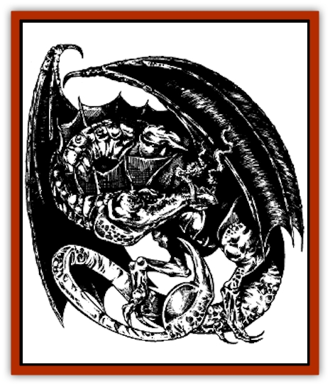

# Wyvern Drake

| Statistic | **Wyvern Drake** |
| --- | --- |
| **Activity Cycle:** | Dusk and dawn |
| **Alignment:** | Black, Red, White, Yellow: CE / Blue, Green: LE / Brown: NE |
| **Armor Class:** | Black: 1; Blue: 0; Green: 0; Red: -3; White: 1; Brown: 2; Yellow: 0 |
| **Climate/Terrain:** | Temperate mountains and forests |
| **Damage/Attack:** | 2d10/1d8 (bite/stinger) |
| **Diet:** | Carnivore |
| **Frequency:** | Very rare |
| **Hit Dice:** | 8+7 |
| **Intelligence:** | Average (8-10) |
| **Magic Resistance:** | Nil |
| **Morale:** | Elite (13-14) |
| **Movement:** | 6, Fl 24 (E) |
| **No. Appearing:** | 1d3 |
| **No. of Attacks:** | 2 |
| **Organization:** | Solitary |
| **Size:** | G (45' long) |
| **Special Attacks:** | Breath weapon, poison; surprise, bombing |
| **Special Defenses:** | Immune to breath weapon of dragon parent and like attacks (spells, etc.) |
| **THAC0:** | 11 |
| **Treasure:** | Nil (E) |
| **XP Value:** | Black 9,000 / Blue 10,000 / Brown 9,000 / Green 10,000 / Red 10,000 / White 9,000 / Yellow 10,000 |

The wyvern drake is, as its name implies, a cross between a [[Dragon_General_Information|dragon]] and a [[Wyvern|wyvern]]. It is 45 feet long (half of that is tail), with a 60-foot wingspan and a yard-long stinger at the end of its tail. Its body, limbs, and wings have the same color ranges as that of wyverns, from a dark brown to gray. A wyvern drake's 5-foot head is colored similar to its dragon parent, though its eyes often have red or orange swirls or patterns in the iris, a remnant of the normal wyvern eye color.

Besides a wyvern's hissing and roaring calls, the wyvern drake can also speak the tongue of its dragon parent and the common tongue, along with one or two other languages that it learns or is taught. Those wyvern drakes raised from birth by the Cult of the Dragon normally know common, the language of their dragon parent, and perhaps a local tongue or the language of a humanoid race the Cult deals with.

**Combat:** Having more intelligence than a normal wyvern, the wyvern drake is a highly dangerous foe. It always fights in the open if it can, invariably attacking from the air. In addition to doing physical damage, the [[Scorpion|scorpion]]like tail also injects Type F poison, killing the victim unless it saves vs. poison. The tail stinger can hit an enemy in any direction, so long as it is within reach. The clever wyvern drake can also pick up a smaller foe, carry it high into the air, then drop it (inflicting normal falling damage), or else pick up objects such a boulders and drop them onto foes (-2 on attack rolls, but inflicting 1d10 points of damage on a hit).

The wyvern drake also fights with a breath weapon inherited from its dragon parent usable three times per day. Damage done by the wyvern drake's breath weapon is equal to the beast's normal hit point total. This damage does not vary as the beast is wounded or healed over time.

| Dragon Parent | Breath Weapon |
| --- | --- |
| Black | Jet of acid 5 feet wide, 60 feet long; victim takes half damage if successful save vs. breath weapon is made. |
| Blue | Bolt of lightning 5 feet wide, 100 feet long; save for half. |
| Brown | Jet of acid 5 feet wide, 60 feet long; victim takes half damage if successful save vs. breath weapon is made. |
| Green | Cloud of chlorine gas 50 feet long, 40 feet wide, and 30 feet high; half damage if save is made vs. breath weapon. |
| Red | Cone of fire 5 feet at mouth, 90 feet long, 30 feet wide at cone's widest; half damage if save is made. |
| White | Cone of frost 5 feet wide, 70 feet long, 25 feet wide at cone's widest; half damage if save is made vs. breath weapon. |
| Yellow | Blast of scorching air and sand 50 feet long, 40 feet wide, and 20 feet high; half damage if save is made vs. breath weapon. |

The wyvern drake is immune to attack forms that resemble its breath weapon. Wyvern drakes do not suffer any additional damage or effects from weapons or items specifically designed to kill dragons.

Wyvern drakes prefer to use their breath weapon instead of relying on physical combat when fighting an aerial opponent. Still, their stings are useful in a dogfight, as they can arch over their backs to strike opponent in front of them.

When stalking prey, the wyvern drake uses cunning. Neither sound nor shadow alert victims that they are being followed, and the attacking wyvern drake achieves a -2 penalty on the victim.s surprise roll due to its silent dive to the attack. Though it will not attack an enemy that is obviously too powerful for it, a group of humans will be attacked if the beast is hungry enough.

**Habitat/Society:** The wild wyvern drake prefers to live alone, staying with another of its kind only for the few months it takes to birth and rear its young to a fledgling state. It lairs on mountains or cliffs overlooking forests or plains, particularly those containing caravan or migration routes. Its average hunting ground is about 25 square miles in size, but it can travel 150 miles in a single day and back again in its search for food. Unlike ordinary wyverns, wyvern drakes never fight their own kind except when there is absolutely nothing else around to eat. Wyvern drakes hoard treasure just as dragons do.

Cult of the Dragon wyvern drakes are often used as aerial scouts and as airborne attack platforms. Most are trained to accept Cult members as riders.

**Ecology:** The wyvern drake eats the equivalent of a cow or horse per day. It swallows victims whole once combat is finished, without chewing, and only the bones and any metal or stone items on the corpse are not digested. (It cannot swallow prey whole in melee.) Carrion is regarded as a food of last resort. Wyvern drakes have few natural enemies, though other large territorial predators will attack them if they consider them to have invaded their ranges.

---
## Discovery & Documentation

**Source Publication:** FOR11 Cult of the Dragon (1990)
**Campaign Setting:** Advanced Dungeons & Dragons 2nd Edition
**Author(s):** Dale Donovan

### Other Creatures Found in This Source Book
   * [[Dracimera|Dracimera]]
   * [[Dracohydra|Dracohydra]]
   * [[Dracolich|Dracolich]]
   * [[Dragon_Ghost|Dragon, Ghost]]
   * [[Dragon_Lesser_Undead|Dragon, Lesser Undead]]
   * [[Dragon-kin|Dragon-kin]]
   * [[Mantidrake|Mantidrake]]
   * [[Ur-Histachii|Ur-Histachii]]
