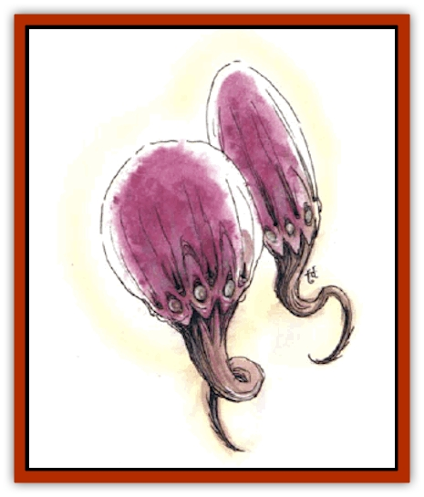

# Xantravar

| Statistic | **Xantravar** |
| --- | --- |
| **Activity Cycle:** | Any |
| **Alignment:** | Neutral evil |
| **Armor Class:** | 6 |
| **Climate/Terrain:** | Swamps, sea coasts |
| **Damage/Attack:** | 1d4 &times;2 |
| **Diet:** | Blood |
| **Frequency:** | Rare |
| **Hit Dice:** | 3+3 |
| **Intelligence:** | Low (5-7) |
| **Magic Resistance:** | Nil |
| **Morale:** | Elite (13-14) |
| **Movement:** | Fl 15 (A), Sw 12 |
| **No. Appearing:** | 1 or 1d4 |
| **No. of Attacks:** | 2 |
| **Organization:** | Solitary or hunting groups |
| **Size:** | L (see below) |
| **Special Attacks:** | Poison, blood drain |
| **Special Defenses:** | Spell immunities |
| **THAC0:** | 17 |
| **Treasure:** | Nil |
| **XP Value:** | 975 |

The xantravar, or *stinging horror*, is a silent, deadly predator that inhabits swamps, salt marshes, and remote seacoasts with tidal caverns. A xantravar's body is actually two wine-red to gray mottled, teardrop-shaped, rubbery bulbs, 6 to 7 feet long, elating in strong, corded muscles that can drive home the two hollow bone stings at the base of each bulb with great force. Above the stings, eight eyes (90-foot infravision and normal vision to human range) ring each stalk. The bulbs are of the same size, linked by a curious glowing energy field that varies in length from a 2-foot norm to a maximum vertical separation of up to 12 feet and horizontal separation of up to 20 feet.

**Combat:** A xantravar's two stingers look identical, but only one injects a paralyzing venom as it strikes. A stinging horror can inject this once per round and four times in a turn; if the venom is exhausted, two turns are required for the monster's body to replace it. The poison stinger inflicts 1d4 damage, and the victim must successfully save vs. poison or suffer 15 additional points of damage. The saving throw is made with a penalty of -3 for man-sized or smaller victims, and with a penalty of -1 for larger targets. A being who successfully saves against the venom of a xantravar is forever immune to the venom of that particular xantravar. They themselves are immune to all known toxins.

The horror's other stinger also strikes for 1d4 damage, but with each blow it sucks 1d6+3 hp-worth of blood.

Above its eyes, a xantravar has indentations circling each body-bulb - these are iris valves that emit ventral steering jets of gas from the creature's interior. The gas is air taken in and mixed with vapors caused by the creature's digestion, and it is highly flammable. Contact between a steering jet and an open flame (such as a torch) causes the jet to become a gout of flame, leaping 10 feet outward from the xantravar. This jet inflicts 1d3 points of damage upon all beings in its path, while the xantravar suffers 1d2 damage before it involuntarily closes off the gas jet.

Above the jets, in the large head of each bulb, a xantravar has floatation chambers of gas. The taking in of gas is done in some mysterious manner by the glowing energy field that joins the two bulbs of a xantravar's body. The length of the field can vary, but its existence is constant. It is unaffected by *dispel magic* spells and will disrupt other fields of force that contact it; it can be destroyed only by slaying the xantravar. Spells involving heat, electrical energy, and magical energy discharges (such as *magic missile*) augment this field; treat damage from these as hit points gained by the xantravar. The spells that help the field still inflict their normal damage upon the bulbs of an xantravar's body.

In any serious fight, a xantravar separates its body bulbs by at least 10 feet for protection. A xantravar can be destroyed by any attack - such as a flaming arrow - that punctures a floatation chamber and introduces an open flame into it on the same round or the round immediately after (the leak is sealed off by the third round). A successful flaming attack into a ruptured gas chamber causes the xantravar to expire in a violent 20-foot-radius, 4d6-damage fireball.

**Habitat/Society:** Xantravars prey upon any living thing they can reach with their stingers. They prefer to hunt at night or in heavy fog, keeping to deep, flooded caverns or shallow shoreline depths by day. They co-exist peacefully with their own kind, but mate very seldom. Xantravars as bisexual.

**Ecology:** Xantravars don't interact with other creatures except to prey upon them (or be preyed upon when wounded or already dead). Their formidable powers normally keep all but the largest [[Octopus_Giant|octopi]], [[Fish|fish]], and [[Bird|birds]] of prey at bay.

---
## Discovery & Documentation

**Source Publication:** Monstrous Compendium, 1994 Annual, Volume 1 (1995)
**Campaign Setting:** Advanced Dungeons & Dragons 2nd Edition
**Author(s):** David Wise

### Other Creatures Found in This Source Book
   * [[Abyss_Ant|Abyss Ant]]
   * [[Achaierai|Achaierai]]
   * [[Afanc|Afanc]]
   * [[Al-Jahar|Al-Jahar]]
   * [[Baelnorn|Baelnorn]]
   * [[Baneguard|Baneguard]]
   * [[Banelar|Banelar]]
   * [[Bird_Talking|Bird, Talking]]
   * [[Blazing_Bones|Blazing Bones]]
   * [[Campestri|Campestri]]
   * [[Caniquine|Caniquine]]
   * [[Cat_Winged|Cat, Winged]]
   * [[Crypt_Servant|Crypt Servant]]
   * [[Death's_Head_Tree|Death's Head Tree]]
   * [[Dog_Saluqi|Dog, Saluqi]]
   * [[Dragon_Electrum|Dragon, Electrum]]
   * [[Dragon_Fang|Dragon, Fang]]
   * [[Dragon_Linnorm_Corpse_Tearer|Dragon, Linnorm, Corpse Tearer]]
   * [[Dragon_Linnorm_Dread|Dragon, Linnorm, Dread]]
   * [[Dragon_Linnorm_Flame|Dragon, Linnorm, Flame]]
   * [[Dragon_Linnorm_Forest|Dragon, Linnorm, Forest]]
   * [[Dragon_Linnorm_Frost|Dragon, Linnorm, Frost]]
   * [[Dragon_Linnorm_Gray|Dragon, Linnorm, Gray]]
   * [[Dragon_Linnorm_Land|Dragon, Linnorm, Land]]
   * [[Dragon_Linnorm_Midgard|Dragon, Linnorm, Midgard]]
   * [[Dragon_Linnorm_Rain|Dragon, Linnorm, Rain]]
   * [[Dragon_Linnorm_Sea|Dragon, Linnorm, Sea]]
   * [[Dragon_Neutral_Jacinth|Dragon, Neutral, Jacinth]]
   * [[Dragon_Neutral_Jade|Dragon, Neutral, Jade]]
   * [[Dragon_Neutral_Pearl|Dragon, Neutral, Pearl]]
   * [[Dread|Dread]]
   * [[Dragon-kin|Dragon-kin]]
   * [[Elemental_Earth_Kin_Chrysmal|Elemental, Earth Kin, Chrysmal]]
   * [[Elemental_Earth_Kin_Earth_Weird|Elemental, Earth Kin, Earth Weird]]
   * [[Elemental_Fire_Kin_Azer|Elemental, Fire Kin, Azer]]
   * [[Elemental_Sandman|Elemental, Sandman]]
   * [[Elemental_Wind_Walker|Elemental, Wind Walker]]
   * [[Elemental_Vermin|Elemental Vermin]]
   * [[Feystag|Feystag]]
   * [[Flame_Skull|Flame Skull]]
   * [[Foulwing|Foulwing]]
   * [[Gambado|Gambado]]
   * [[Garbug|Garbug]]
   * [[Genie_Tasked_Administrator|Genie, Tasked, Administrator]]
   * [[Genie_Tasked_Deceiver|Genie, Tasked, Deceiver]]
   * [[Genie_Tasked_Harim_Servant|Genie, Tasked, Harim Servant]]
   * [[Genie_Tasked_Messenger|Genie, Tasked, Messenger]]
   * [[Genie_Tasked_Miner|Genie, Tasked, Miner]]
   * [[Genie_Tasked_Oathbinder|Genie, Tasked, Oathbinder]]
   * [[Gibbering_Mouther|Gibbering Mouther]]
   * [[Gnasher|Gnasher]]
   * [[Gnasher_Winged|Gnasher, Winged]]
   * [[Golem_Brain|Golem, Brain]]
   * [[Golem_Hammer|Golem, Hammer]]
   * [[Golem_Metagolem|Golem, Metagolem]]
   * [[Golem_Spiderstone|Golem, Spiderstone]]
   * [[Gorynych|Gorynych]]
   * [[Greelox|Greelox]]
   * [[Helmed_Horror|Helmed Horror]]
   * [[Jarbo|Jarbo]]
   * [[Laraken|Laraken]]
   * [[Lich_Psionic|Lich, Psionic]]
   * [[Living_Steel|Living Steel]]
   * [[Lock_Lurker|Lock Lurker]]
   * [[Loxo|Loxo]]
   * [[Lycanthrope_Loup_de_Noir|Lycanthrope, Loup de Noir]]
   * [[Lycanthrope_Werebadger|Lycanthrope, Werebadger]]
   * [[Lycanthrope_Werejaguar|Lycanthrope, Werejaguar]]
   * [[Lythlyx|Lythlyx]]
   * [[Magebane|Magebane]]
   * [[Marrashi|Marrashi]]
   * [[Metalmaster|Metalmaster]]
   * [[Mimic_House_Hunter|Mimic, House Hunter]]
   * [[Naga_Bone|Naga, Bone]]
   * [[Nautilus_Giant|Nautilus, Giant]]
   * [[Nightshade_Toril|Nightshade (Toril)]]
   * [[Nishruu|Nishruu]]
   * [[Noran|Noran]]
   * [[Opinicus|Opinicus]]
   * [[Ormyrr|Ormyrr]]
   * [[Parasite|Parasite]]
   * [[Pasari-Niml|Pasari-Niml]]
   * [[Plant_Vampire_Moss|Plant, Vampire Moss]]
   * [[Pteraman|Pteraman]]
   * [[Rautym|Rautym]]
   * [[Shadeling|Shadeling]]
   * [[Skum|Skum]]
   * [[Snake_Giant_Cobra|Snake, Giant Cobra]]
   * [[Snake_Stone|Snake, Stone]]
   * [[Spectral_Wizard|Spectral Wizard]]
   * [[Spell_Weaver|Spell Weaver]]
   * [[Spider_Brain|Spider, Brain]]
   * [[Suwyze|Suwyze]]
   * [[Tatalla|Tatalla]]
   * [[Tick_Heart|Tick, Heart]]
   * [[Tree_Dark|Tree, Dark]]
   * [[Tree_Singing|Tree, Singing]]
   * [[Tressym|Tressym]]
   * [[Troll_Snow|Troll, Snow]]
   * [[Tuyewera|Tuyewera]]
   * [[Ulitharid|Ulitharid]]
   * [[Undead_Dwarf|Undead Dwarf]]
   * [[Undead_Lake_Monster|Undead Lake Monster]]
   * [[Whipsting|Whipsting]]
   * [[Windghost|Windghost]]
   * [[Wolf_Dread|Wolf, Dread]]
   * [[Wolf_Stone|Wolf, Stone]]
   * [[Wolf_Vampiric|Wolf, Vampiric]]
   * [[Wraith_Shimmering|Wraith, Shimmering]]
   * [[Xaver|Xaver]]
