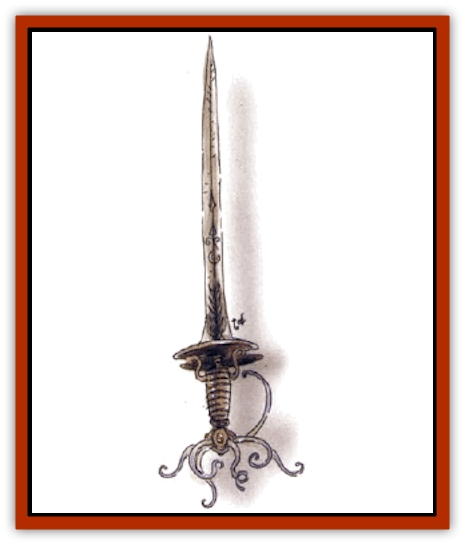

# Xaver

| Statistic | **Xaver** |
| --- | --- |
| **Activity Cycle:** | Any |
| **Alignment:** | Lawful neutral |
| **Armor Class:** | 2 |
| **Climate/Terrain:** | Any land |
| **Damage/Attack:** | 1d4+1 |
| **Diet:** | Ferrous metals |
| **Frequency:** | Very rare |
| **Hit Dice:** | 3 |
| **Intelligence:** | Average to high (8-14) |
| **Magic Resistance:** | 45% |
| **Morale:** | Elite (13-14) |
| **Movement:** | 9, Jp 3 |
| **No. Appearing:** | 1d4 |
| **No. of Attacks:** | 1 |
| **Organization:** | Solitary or family bands |
| **Size:** | S to M (3-6' tall) |
| **Special Attacks:** | Metal corrosion |
| **Special Defenses:** | See below |
| **THAC0:** | 17 |
| **Treasure:** | See below |
| **XP Value:** | 270 |

A xaver looks exactly like a sword, with a hard, silvery body and six faceted green eyes that resemble gems around the hilt of a blade. Xavers are intelligent creatures that scuttle about on tiny, retractible, wormlike legs.

Like [[Rust_Monster|rust monsters]], xavers eat ferrous metals (and alloys that include them such as steel and adamantine), but they are intelligent enough not to be bought off with a few spikes when they see an easily won suit of armor or much weaponry.

The body of a xaver is smooth and metallic, with a bulbous base at one end, tapering to a point at the other; the length between has flat side and sharp edges. An 8-inch-long, tentaclelike leg is set between each gemlike eye (the eyes ring the base of the body), but these legs are retracted at lightning speed if danger approaches. Xavers can see as humans do, and have 90-foot-range infravision. They do not hear or smell, and they give off no body heat or sound. They absorb solar heat and needed gases through their bodies, and lie motionless when creatures approach. Their bodies do not corrode until after death, and rust monsters cannot harm them.

**Combat:** Xavers cut opponents with the razor-sharp edges of their bladelike bodies. Usually they do a battle dance, swinging their bodies in wild circular slashes. Metal passes through a xaver's body as if the latter did not exist. Heat and electrical attacks also inflict no damage, but the xaver's body conducts these with full effects to all beings and items in contact with it. Poisons and venoms also have no effect on xavers, but cold-based attacks cause an extra point per die of damage.

Any ferrous metal touching a xaver cracks and falls into shards 1 segment later. The xaver will then try to eat the shards. Whenever a xaver can gorge itself, it grows slightly. A meal of several suits of armor or a dozen weapons or more might make one grow an inch in length. They cannot turn off their corrosive powers, but they can choose not to touch metallic items.

**Habitat/Society:** Xavers can go for many years without eating and are known to live for centuries. They are solitary, but wandering young, mating pairs, and a few that exhaust their food supplies can be found in small family groups. They never fight others of their own kind.

Xavers normally inhabit rocky lairs, but are sometimes found among treasure hoards in which they have concealed themselves. If a hoard is initially detemined to contain armor, shield, or weapons, there is a 4% chance that a xaver hasn't yet managed to eat all the metal.

Xavers are bisexual. After mating, both partners go their separate ways and engage in eating sprees in order to provide sufficient nourishment for offspring. After 2d20 days, each parent gives birth to a single young xaver. Baby xavers have 1+2 HD, are about 3 feet long, and possess the full powers of an adult. If enough food is available, they'll grow to full size within two months.

**Ecology:** Xavers eat ferrous metals and rust. Other types of metal don't harm a xaver if ingested, but don't give nourishment and are ejected later. Most coins consist of a base metal - sometimes ferrous - coated with a plating, so xavers often excrete masses of pure plating.

[[Lizard|Fire lizards]], [[Xorn|xorn]], [[Remorhaz|remorhaz]], and [[Harpy|harpies]] (who must snatch xavers aloft and drop them from a height onto rocks to shatter their bodies) like xaver flesh, and a few other creatures will eat xavers if hungry enough.

Alchemists and wizards use powdered xaver bodies in spell inks, unguents, and alternative  spellcasting components in spells involving resistance to heat and electrical energies, the rusting of metals, and in invulnerability to metallic weapons. Sold in the right place, a reasonably intact and fresh adult xaver body can bring as much as 1,600 gold pieces.

---
## Discovery & Documentation

**Source Publication:** Monstrous Compendium, 1994 Annual, Volume 1 (1995)
**Campaign Setting:** Advanced Dungeons & Dragons 2nd Edition
**Author(s):** David Wise

### Other Creatures Found in This Source Book
   * [[Abyss_Ant|Abyss Ant]]
   * [[Achaierai|Achaierai]]
   * [[Afanc|Afanc]]
   * [[Al-Jahar|Al-Jahar]]
   * [[Baelnorn|Baelnorn]]
   * [[Baneguard|Baneguard]]
   * [[Banelar|Banelar]]
   * [[Bird_Talking|Bird, Talking]]
   * [[Blazing_Bones|Blazing Bones]]
   * [[Campestri|Campestri]]
   * [[Caniquine|Caniquine]]
   * [[Cat_Winged|Cat, Winged]]
   * [[Crypt_Servant|Crypt Servant]]
   * [[Death's_Head_Tree|Death's Head Tree]]
   * [[Dog_Saluqi|Dog, Saluqi]]
   * [[Dragon_Electrum|Dragon, Electrum]]
   * [[Dragon_Fang|Dragon, Fang]]
   * [[Dragon_Linnorm_Corpse_Tearer|Dragon, Linnorm, Corpse Tearer]]
   * [[Dragon_Linnorm_Dread|Dragon, Linnorm, Dread]]
   * [[Dragon_Linnorm_Flame|Dragon, Linnorm, Flame]]
   * [[Dragon_Linnorm_Forest|Dragon, Linnorm, Forest]]
   * [[Dragon_Linnorm_Frost|Dragon, Linnorm, Frost]]
   * [[Dragon_Linnorm_Gray|Dragon, Linnorm, Gray]]
   * [[Dragon_Linnorm_Land|Dragon, Linnorm, Land]]
   * [[Dragon_Linnorm_Midgard|Dragon, Linnorm, Midgard]]
   * [[Dragon_Linnorm_Rain|Dragon, Linnorm, Rain]]
   * [[Dragon_Linnorm_Sea|Dragon, Linnorm, Sea]]
   * [[Dragon_Neutral_Jacinth|Dragon, Neutral, Jacinth]]
   * [[Dragon_Neutral_Jade|Dragon, Neutral, Jade]]
   * [[Dragon_Neutral_Pearl|Dragon, Neutral, Pearl]]
   * [[Dread|Dread]]
   * [[Dragon-kin|Dragon-kin]]
   * [[Elemental_Earth_Kin_Chrysmal|Elemental, Earth Kin, Chrysmal]]
   * [[Elemental_Earth_Kin_Earth_Weird|Elemental, Earth Kin, Earth Weird]]
   * [[Elemental_Fire_Kin_Azer|Elemental, Fire Kin, Azer]]
   * [[Elemental_Sandman|Elemental, Sandman]]
   * [[Elemental_Wind_Walker|Elemental, Wind Walker]]
   * [[Elemental_Vermin|Elemental Vermin]]
   * [[Feystag|Feystag]]
   * [[Flame_Skull|Flame Skull]]
   * [[Foulwing|Foulwing]]
   * [[Gambado|Gambado]]
   * [[Garbug|Garbug]]
   * [[Genie_Tasked_Administrator|Genie, Tasked, Administrator]]
   * [[Genie_Tasked_Deceiver|Genie, Tasked, Deceiver]]
   * [[Genie_Tasked_Harim_Servant|Genie, Tasked, Harim Servant]]
   * [[Genie_Tasked_Messenger|Genie, Tasked, Messenger]]
   * [[Genie_Tasked_Miner|Genie, Tasked, Miner]]
   * [[Genie_Tasked_Oathbinder|Genie, Tasked, Oathbinder]]
   * [[Gibbering_Mouther|Gibbering Mouther]]
   * [[Gnasher|Gnasher]]
   * [[Gnasher_Winged|Gnasher, Winged]]
   * [[Golem_Brain|Golem, Brain]]
   * [[Golem_Hammer|Golem, Hammer]]
   * [[Golem_Metagolem|Golem, Metagolem]]
   * [[Golem_Spiderstone|Golem, Spiderstone]]
   * [[Gorynych|Gorynych]]
   * [[Greelox|Greelox]]
   * [[Helmed_Horror|Helmed Horror]]
   * [[Jarbo|Jarbo]]
   * [[Laraken|Laraken]]
   * [[Lich_Psionic|Lich, Psionic]]
   * [[Living_Steel|Living Steel]]
   * [[Lock_Lurker|Lock Lurker]]
   * [[Loxo|Loxo]]
   * [[Lycanthrope_Loup_de_Noir|Lycanthrope, Loup de Noir]]
   * [[Lycanthrope_Werebadger|Lycanthrope, Werebadger]]
   * [[Lycanthrope_Werejaguar|Lycanthrope, Werejaguar]]
   * [[Lythlyx|Lythlyx]]
   * [[Magebane|Magebane]]
   * [[Marrashi|Marrashi]]
   * [[Metalmaster|Metalmaster]]
   * [[Mimic_House_Hunter|Mimic, House Hunter]]
   * [[Naga_Bone|Naga, Bone]]
   * [[Nautilus_Giant|Nautilus, Giant]]
   * [[Nightshade_Toril|Nightshade (Toril)]]
   * [[Nishruu|Nishruu]]
   * [[Noran|Noran]]
   * [[Opinicus|Opinicus]]
   * [[Ormyrr|Ormyrr]]
   * [[Parasite|Parasite]]
   * [[Pasari-Niml|Pasari-Niml]]
   * [[Plant_Vampire_Moss|Plant, Vampire Moss]]
   * [[Pteraman|Pteraman]]
   * [[Rautym|Rautym]]
   * [[Shadeling|Shadeling]]
   * [[Skum|Skum]]
   * [[Snake_Giant_Cobra|Snake, Giant Cobra]]
   * [[Snake_Stone|Snake, Stone]]
   * [[Spectral_Wizard|Spectral Wizard]]
   * [[Spell_Weaver|Spell Weaver]]
   * [[Spider_Brain|Spider, Brain]]
   * [[Suwyze|Suwyze]]
   * [[Tatalla|Tatalla]]
   * [[Tick_Heart|Tick, Heart]]
   * [[Tree_Dark|Tree, Dark]]
   * [[Tree_Singing|Tree, Singing]]
   * [[Tressym|Tressym]]
   * [[Troll_Snow|Troll, Snow]]
   * [[Tuyewera|Tuyewera]]
   * [[Ulitharid|Ulitharid]]
   * [[Undead_Dwarf|Undead Dwarf]]
   * [[Undead_Lake_Monster|Undead Lake Monster]]
   * [[Whipsting|Whipsting]]
   * [[Windghost|Windghost]]
   * [[Wolf_Dread|Wolf, Dread]]
   * [[Wolf_Stone|Wolf, Stone]]
   * [[Wolf_Vampiric|Wolf, Vampiric]]
   * [[Wraith_Shimmering|Wraith, Shimmering]]
   * [[Xantravar|Xantravar]]
