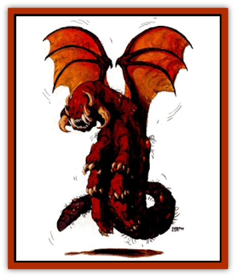

# Xerichou

| Statistic | **Xerichou** |
| --- | --- |
| **Activity Cycle:** | Day |
| **Alignment:** | Neutral |
| **Armor Class:** | 5 |
| **Climate/Terrain:** | Any dry land |
| **Damage/Attack:** | 2-8 |
| **Diet:** | Omnivore |
| **Frequency:** | Uncommon |
| **Hit Dice:** | 3 |
| **Intelligence:** | Average (8-10) |
| **Magic Resistance:** | Nil |
| **Morale:** | Steady (11-12) |
| **Movement:** | 9, Fl 15 (D) |
| **No. Appearing:** | 6-36 |
| **No. of Attacks:** | 2 |
| **Organization:** | Solitary, flock |
| **Size:** | S (1' long, 3' wingspan) |
| **Special Attacks:** | See below |
| **Special Defenses:** | See below |
| **THAC0:** | 17 |
| **Treasure:** | Nil |
| **XP Value:** | 270 |

**Psionics Summary**

| Level | Dis/Sci/Dev | Attack/Defense | Score | PSPs |
| --- | --- | --- | --- | --- |
| 5 | 2/2/7 | MT,PsC/MB,TS | 10 | 35 |

**Psychometabolism -** *Science:* complete healing; *Devotions:* body control, body weaponry, cell adjustment, displacement.

**Telepathy -** *Science:* mind link; *Devotions:* contact, mind thrust, psionic crush.

Xerichous are flying, vicious predators. Xerichous begin their life as relatively small, armored, [[Worm|worm]]like creatures. After their metamorphosis, xerichous become flying, 6-legged predators. They are deep brown to red-brown in color and have a tough, leathery hide. They also have sparse tufts of hair sprouting from around their joints and underbelly. After this change, xerichous begin to flock with others of their kind. They emit loud shrieking caws when attacking potential prey.

**Combat:** Xerichous flock together to breed and to insure their survival through safety in numbers. The beasts attack by flying in and raking the razorlike edge of their wings into their intended victims, causing 2-8 (2d4) points of damage on a successful attack. Though they are small creatures individually, a flock will attack beings as large as [[Giant_Athas|giants]].

While attacking, the creatures use their numerous psionic abilities to confuse their prey Xerichous use teleport, displacement, and timeshift to change their location and disorient their victims. When one of the creatures begins this behavior, all their comrades follow suit. During the first three rounds of this attack, the flock attacks at +1 and victims can make no attacks for l.4 rounds unless a successful save vs. petrification is made at -2.

If a xerichou falls below 10% of its maximum hit points, it teleports back to its lair (if it has enough psionic strength points) or will disengage the enemy and fly back to its lair. Once back in the lair it rests, using its psionics to heal all damage sustained during the encounter.

**Habitat/Society:** When a larvae is half a year old, it climbs a high precipice and hook its legs into the surface. It then begin the long process of cocooning itself into a shell that looks almost rocklike. While in this stage they are 90% likely to be mistaken for a natural rock formation. After hatching, the creature instinctively returns to its ancestral nesting grounds where mating and egg laying takes place and the whole process begins once again.

**Ecology:** While in larval form, xerichous are considered a delicacy to the [[Thri-kreen|thri-kreen]]. Also the secretions made while cocooned are highly sought for their astral properties for use in potions and research.

The larvae are beige in color, completely silent, and have no combat ability (HD 1, AC 8, MV 6). They crawl using 12 small stublike appendages with sharp hooks on the bottom. The hooks allow the larvae to climb vertical surfaces and even hang upside down. Larvae are solitary and omnivorous, eating anything that does not move.

---
## Discovery & Documentation

**Source Publication:** Dark Sun Appendix II - Terrors Beyond Tyr (1991)
**Campaign Setting:** Dark Sun
**Author(s):** Jim Atkiss, Steve Brown, Timothy B. Brown, Andrew P. Morris, Bruce Nesmith, Wes Nicholson, Bill Slavicsek

### Other Creatures Found in This Source Book
   * [[Aarakocra_Athas|Aarakocra (Athas)]]
   * [[Animal_Domestic_Athas_II|Animal, Domestic (Athas) II]]
   * [[Aviarag|Aviarag]]
   * [[Baazrag|Baazrag]]
   * [[Baazrag_Boneclaw|Baazrag, Boneclaw]]
   * [[Bloodgrass|Bloodgrass]]
   * [[Cactus_Hunting|Cactus, Hunting]]
   * [[Cactus_Rock|Cactus, Rock]]
   * [[Cilops|Cilops]]
   * [[Crodlu|Crodlu]]
   * [[Dagorran|Dagorran]]
   * [[Dhaot|Dhaot]]
   * [[Drake_Lesser_Athas_General_Information|Drake, Lesser (Athas), General Information]]
   * [[Drake_Lesser_Athas_Magma|Drake, Lesser (Athas), Magma]]
   * [[Drake_Lesser_Athas_Rain|Drake, Lesser (Athas), Rain]]
   * [[Drake_Lesser_Athas_Silt|Drake, Lesser (Athas), Silt]]
   * [[Drake_Lesser_Athas_Sun|Drake, Lesser (Athas), Sun]]
   * [[Dray|Dray]]
   * [[Drik|Drik]]
   * [[Dune_Reaper|Dune Reaper]]
   * [[Dwarf_Athas|Dwarf (Athas)]]
   * [[Elemental_Beast_Athas_Air|Elemental Beast (Athas), Air]]
   * [[Elemental_Beast_Athas_Earth|Elemental Beast (Athas), Earth]]
   * [[Elemental_Beast_Athas_Fire|Elemental Beast (Athas), Fire]]
   * [[Elemental_Beast_Athas_Water|Elemental Beast (Athas), Water]]
   * [[Elf_Athas|Elf (Athas)]]
   * [[Fael|Fael]]
   * [[Feylaar|Feylaar]]
   * [[Fordorran|Fordorran]]
   * [[Giant_Half-giant|Giant, Half-giant]]
   * [[Giant_Shadow|Giant, Shadow]]
   * [[Golem_Athas_Magma|Golem (Athas), Magma]]
   * [[Golem_Athas_Salt|Golem (Athas), Salt]]
   * [[Golem_Athas_General_Information|Golem (Athas), General Information]]
   * [[Gorak|Gorak]]
   * [[Halfling_Athas|Halfling (Athas)]]
   * [[Human_Athas|Human (Athas)]]
   * [[Jhakar|Jhakar]]
   * [[Kaisharga|Kaisharga]]
   * [[Kes'trekel|Kes'trekel]]
   * [[Klar|Klar]]
   * [[Krag|Krag]]
   * [[Kragling|Kragling]]
   * [[Lirr|Lirr]]
   * [[Mastyrial|Mastyrial]]
   * [[Meorty|Meorty]]
   * [[Mul|Mul]]
   * [[Nikaal|Nikaal]]
   * [[Paraelemental_Beast_General_Information|Paraelemental Beast, General Information]]
   * [[Paraelemental_Beast_Magma|Paraelemental Beast, Magma]]
   * [[Paraelemental_Beast_Rain|Paraelemental Beast, Rain]]
   * [[Paraelemental_Beast_Silt|Paraelemental Beast, Silt]]
   * [[Paraelemental_Beast_Sun|Paraelemental Beast, Sun]]
   * [[Pakubrazi|Pakubrazi]]
   * [[Psionocus|Psionocus]]
   * [[Psurlon|Psurlon]]
   * [[Raaig|Raaig]]
   * [[Retriever_Obsidian|Retriever, Obsidian]]
   * [[Ruktoi|Ruktoi]]
   * [[Ruvoka_Athas|Ruvoka (Athas)]]
   * [[Sand_Howler|Sand Howler]]
   * [[Scorpion_Athas|Scorpion (Athas)]]
   * [[Seed_Brain|Seed, Brain]]
   * [[Silt_Horror_Black|Silt Horror, Black]]
   * [[Silt_Horror_Magma|Silt Horror, Magma]]
   * [[Silt_Horror_Red|Silt Horror, Red]]
   * [[Silt_Spawn|Silt Spawn]]
   * [[Slig|Slig]]
   * [[Spider_Athas|Spider (Athas)]]
   * [[Spinewyrm|Spinewyrm]]
   * [[Ssurran|Ssurran]]
   * [[Stalking_Horror|Stalking Horror]]
   * [[Tarek|Tarek]]
   * [[Tari|Tari]]
   * [[Thri-kreen|Thri-kreen]]
   * [[T'liz|T'liz]]
   * [[Tohr-kreen_II|Tohr-kreen II]]
   * [[Tohr-kreen_III|Tohr-kreen III]]
   * [[Trin|Trin]]
   * [[Tul'k|Tul'k]]
   * [[Undead_Athas_General_Information|Undead (Athas), General Information]]
   * [[Wraith_Athas|Wraith (Athas)]]
   * [[Zombie_Thinking|Zombie, Thinking]]
