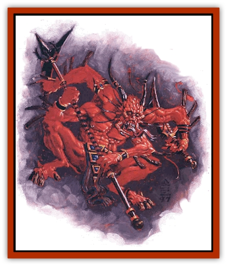

# Xill

| Statistic | **Xill** |
| --- | --- |
| **Activity Cycle:** | Any |
| **Alignment:** | Lawful evil |
| **Armor Class:** | 0 |
| **Climate/Terrain:** | Ethereal Plane (Inner Planes) |
| **Damage/Attack:** | 1d4 &times;4 or by weapon |
| **Diet:** | Omnivore |
| **Frequency:** | Uncommon |
| **Hit Dice:** | 5 |
| **Intelligence:** | Very (11-12) |
| **Magic Resistance:** | 70% |
| **Morale:** | Champion (15) |
| **Movement:** | 15 |
| **No. Appearing:** | 1d6 |
| **No. of Attacks:** | 4 |
| **Organization:** | Clan |
| **Size:** | M (4-5' tall) |
| **Special Attacks:** | Paralyzation |
| **Special Defenses:** | See below |
| **THAC0:** | 15 (13 with missiles) |
| **Treasure:** | C |
| **XP Value:** | 3,000 |

The vaguely reptilian xill are natives of the Ethereal Plane. Four-armed, leathery-skinned humanoids brilliantly colored red by some strange twist of fate, these beings are feared on all planes that border the Ethereal (in other words, the Prime and the Inner Planes). 'Course, some xill claim that these fears are unfounded, but peery members of other races believe that even the so-called civilized xill harbor a dark secret.

All xill communicate telepathically - fact is, they have no spoken language - and they can travel back and forth from the Ethereal Plane (via the Border Ethereal) as they wish.

**Combat:** Less sophisticated xill attack with their four claws when in battle, inflicting 1d4 points of damage per strike. Xill of more civilized clans use well-forged weapons. They can wield them in all four hands and often use at least one missile weapon for long-range combat.

Barbaric xill prefer to attack opponents on planes that "touch" the Misty Shore. From the Border Ethereal, they slip between the folds to reach the target plane, where they usually startle their intended victims (the sods roll for surprise at -6). The invading xill attack not to kill but to subdue their foes, using two arms to grapple and two to punch.

Here's how it works: If two of the xill's claws successfully strike a foe (inflicting 1d4 points of damage each), the creature automatically puts the victim in a wrestling hold. Then, the xill's other two arms make nonlethal punch attacks (refer to the rules for punching and wrestling in the combat chapter of the *PHB* or *DMG*). Once the xill has successfully grappled the opponent, it automatically bites him in the following round. The bite inflicts no damage but forces the victim to make a saving throw versus poison or face paralyzation for 1d4 hours. (The xill produces enough venom for only two bites every six hours, and it can't bite a foe that it hasn't grappled.)

If this occurs off the Ethereal, the xill then tries to spirit its paralyzed prey back to its home plane. This process of fading from one spot and reappearing in another takes two rounds, during which time the creature is completely immobile and foregoes its magic resistance. However, as the xill fades, it becomes harder and harder to strike (it's AC -1 in the first round of planar transfer and AC -3 in the second). Once it reaches its Ethereal lair, it implants its paralyzed victim with eggs (as explained below).

Xill of the High Clans use the paralyzation venom only as a last resort. Because they've let the associated glands atrophy, they produce only enough venom for one bite each day. Certain High Clan xill can become clerics of up to 5th level; these bloods worship a variety of deities.

**Habitat/Society:** Xill can be classified as members of the Lower Clans or the High Clans. Lower Clan xill rarely use weapons, preferring the strength of their claws, and they never create anything of their own. They seemingly live only to reproduce, and thus raid other planes looking for intelligent hosts for their eggs. Interestingly, the xill of the Lower Clans don't refer to themselves as "Lower Clans", don't even acknowledge the High Clans, and can't look upon any other race as anything more than prey. If encountered on the Ethereal, Lower Clan xill are likely to flee after first securing the safety of their young and any prisoners serving as egg hatcheries.

High Clan xill lead more sophisticated lives, crafting tools, weapons, clothing, and other necessities for themselves. The High Clans rarely leve the Ethereal, but if they're encountered by planewalkers, they don't automatically size up the situation as predator/prey. In fact, many High Clan xill trade goods and information with travelers to the Misty Shore. Cutters looking for such xill can find them in the Deep Ethereal, dwelling in refined cities built on chunks of what's known as solid ether. Some High Clan xill can even be paid to serve as guides to the mysterious plane.

Chant is, however, that the High Clans xill still need to use intelligent creatures as hosts in which to hatch their young. According to these dark rumors, somewhere hidden in the Deep Ethereal is a vast hatchery/nursery where human slaves are bred and grown like cattle to serve as hosts for xill eggs. These poor sods're supposedly the descendants if victims captured long ago and kept as living prisoners rather than implanted with eggs - for just such a long-term plan. The modern slaves, if they eist, are said to have lost all traces of intelligence or sophistication, and rarely live beyond their late teens before serving as htcheries. Most folk hope that this rumor isn't true and try not to think about it too much.

In any event, a canny blood should always keep in mind that despite their sophistication, High Clan xill are still evil - vengeful, selfish, sometimes backbiting, and always power-hungry.

**Ecology:** Xill live for approximately 50 years, reproducing twice during that time. To do so, they must impant their eggs in a living, intelligent host - only a live body provides the sustenance that the young creatures will need when born.

The eggs take four days to hatch (during which time a *cure disease* spell will remove the infestation), after which the larvae begin to eat their way out of their host. This horrible process takes another seven days (at this point, only a *wish* or *limited wish* can save the victim), during which time the host suffers 1d10+10 points of damage each day. Eventually, 2d8 young xill emerge from the victim, killing him instantly if he's not in the dead-bokk already.

---
## Discovery & Documentation

**Source Publication:** MC14 Fiend Folio Appendix (1992)
**Campaign Setting:** Fiends Folio
**Author(s):** Don Bingle, John Terra, Wes Nicholson, Tim Beach, Steve Hardinger, Kris Hardinger, Rob Nicholls, Greg Swedberg, Al Boyce, Vince Garcia, Norm Ritchie

### Other Creatures Found in This Source Book
   * [[Aballin|Aballin]]
   * [[Achaierai|Achaierai]]
   * [[Adherer|Adherer]]
   * [[Algoid|Algoid]]
   * [[Al-Mi'raj|Al-Mi'raj]]
   * [[Apparition|Apparition]]
   * [[Caterwaul|Caterwaul]]
   * [[Coffer_Corpse|Coffer Corpse]]
   * [[Crabman|Crabman]]
   * [[Dark_Creeper|Dark Creeper]]
   * [[Dark_Stalker|Dark Stalker]]
   * [[Darter|Darter]]
   * [[Denzelian|Denzelian]]
   * [[Dune_Stalker|Dune Stalker]]
   * [[Dwarf_Urdunnir|Dwarf, Urdunnir]]
   * [[Falcon_Fire|Falcon, Fire]]
   * [[Faux_Faerie|Faux Faerie]]
   * [[Flawder|Flawder]]
   * [[Fyrefly|Fyrefly]]
   * [[Gambado|Gambado]]
   * [[Garbug|Garbug]]
   * [[Giant_Fhoimorien|Giant, Fhoimorien]]
   * [[Gibberling|Gibberling]]
   * [[Gorbel|Gorbel]]
   * [[Grimlock|Grimlock]]
   * [[Hellcat|Hellcat]]
   * [[Ice_Lizard|Ice Lizard]]
   * [[Iron_Cobra|Iron Cobra]]
   * [[Khargra|Khargra]]
   * [[Mantari|Mantari]]
   * [[Penanggalan|Penanggalan]]
   * [[Pernicon|Pernicon]]
   * [[Phantom_Stalker|Phantom Stalker]]
   * [[Retriever|Retriever]]
   * [[Ruve|Ruve]]
   * [[Scathe|Scathe]]
   * [[Sheet_Ghoul_Sheet_Phantom|Sheet Ghoul/Sheet Phantom]]
   * [[Shocker|Shocker]]
   * [[Spanner|Spanner]]
   * [[Stwinger|Stwinger]]
   * [[Sussurus|Sussurus]]
   * [[Symbiotic_Jelly|Symbiotic Jelly]]
   * [[Terithran|Terithran]]
   * [[Thunder_Children|Thunder Children]]
   * [[Troll_Ice|Troll, Ice]]
   * [[Tween|Tween]]
   * [[Umpleby|Umpleby]]
   * [[Volt|Volt]]
   * [[Xvart|Xvart]]
   * [[Zygraat|Zygraat]]
