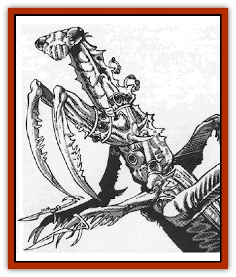

# Xixchil

| Statistic | **Xixchil** |
| --- | --- |
| **Activity Cycle:** | Day |
| **Alignment:** | Any |
| **Armor Class:** | See below |
| **Climate/Terrain:** | Any |
| **Damage/Attack:** | By weapon type, or 2d6/2d6 or 1d4 + poison |
| **Diet:** | Carnivore |
| **Frequency:** | Uncommon |
| **Hit Dice:** | 1+1 |
| **Intelligence:** | Average - Genius (8-18) |
| **Magic Resistance:** | Nil |
| **Morale:** | Elite (13-14) |
| **Movement:** | 12 |
| **No. Appearing:** | 1-3 |
| **No. of Attacks:** | 1 or 2 |
| **Organization:** | Solitary/tribal |
| **Size:** | M (5' base) |
| **Special Attacks:** | Poison bite |
| **Special Defenses:** | Nil |
| **THAC0:** | 19 |
| **Treasure:** | W |
| **XP Value:** | Varies |

Xixchil (ZIX-chil) are praying mantis-like "mantoids" who are accomplished craftsmen. Using their fine scalpel-like manipulators at the ends of their forelimbs, they create fine metalwork, clothing, and clockwork devices whose complexity and beauty rival even that of the [[Reigar|reigar]].

The xixchil's main avocation (some say religion) is surgery. The xixchil believe that the body is like a house, and that one must add to the blank shell to make it truly one's home. Because of this belief, xixchil are very easy to tell apart - their exoskeletons can be covered with inlays, gem settings and other adornments, and they may be grown into fantastic shapes. Most xixchil who deal with humans are named after their "modifications" - Spike, Crest, Hook, and Spinner, for example. The xixchil talent for surgical adornment has found many applications among non-xixchil as well.

Xixchil can synthesize a person-specific anesthetic that renders a patient unconscious for the duration of the "operation". This enzyme soup requires a taste of the subject's (or victim's) clothing, weaponry, or any object that the subject has held in close body contact. A single bite (normal attack roll) administers the dose, or the saliva can work through food or drink.

In this manner the xixchil also create poisons. Once the xixchil has touched the victim, it licks its finger blade to taste the victim's essence and synthesize poison. On the next round, the xixchil bites to administer the poison saliva. Generally, the poison reacts with the victim's body chemistry, paralyzing or killing the victim in one round. Those bitten save vs. poison at -4 due to the tailored brew. The xixchil may also spit the poison onto its finger blades. The saliva must be used within ten turns before it breaks down and becomes useless.

The xixchil communicate among themselves with a complex language of both gestures and spoken words punctuated with sharp clicks of their mandibles. The xixchil mandibles are so complex that they can be used to form the words of humanoid speech.

**Combat:** Most xixchil prefer to strike from surprise or a position of advantage. "Stealth equals efficiency," says one xixchil proverb.

Xixchll tactics rely on their forelimbs, which have sharp retractable blades. The xixchil slaps with its blades extended for 2d6 damage per forelimb. It can strike twice per round in this fashion, using a sort of boxing maneuver, feinting and dodging to defend itself. Unadorned xixchil have a base AC 5 due to their exoskeletons.

*Battle-hardened xixchil:* When a xixchil pursues a life of combat, it purchases body modifications - special limbs in the form of maces, blowguns, swords, man catchers, or other weapons. Use the *Player's Handbook* for weapon-limb damage statistics, since these modifications are comparable to the actual items.

Large xixchil carry so many battle "adornments" that they become killing machines, hiring themselves out for contract work as mercenaries, bodyguards, gladiators, or leg-breakers. These battle-hardened xixchil may have as many as six attacks per round, due to their specialized extra limbs, increased speed, or enhanced strength. Their Armor Class can reach -4.

Battle-hardened xixchil are rare, since fighting is not the race's main concern. But in the words of one xixchil proverb: "Scalpels are knives." The xixchil's flair for sharp objects and their inborn ability to synthesize poison wins them renown as assassins.

**Habitat/Society:** Xixchil evolved on a liveworld among many predators. Their modification ability enabled them to grow defensive weapons and camouflage. Aided by their unique metabolism, they poisoned and slashed their way to the top of the food chain.

Since danger was ever-present in xixchil life, females spun egg cases containing 10d10 eggs. When they hatched, the young immediately dueled and ate each other until one or two individuals remained. After the first week of life, the infants' homicidal tendencies faded, allowing the xixchil to achieve civilization.

This inborn winnowing process still occurs today. "Survival of the fittest" remains a major tenet of xixchil society, which stresses individual achievement and improvement over group effort. A xixchil's allegiance is first to self, then to family; society comes last.

Since they discovered spelljamming, xixchil have realized that there is an endless variety of places and beings and things, all useful for attaining greater prestige. Ironically, this desire to experience the new has caused some individuals to realize that there is more to life than merely self-preservation. This motivates them to try many things - even join adventuring parties.

**Xixchil and Adventurers**

  In this capacity, the xixchil is renowned for its surgical ability. Injured adventurers, or those who simply desire enhancements, can count on swift, sure treatment for their problems. With their sharp forearms and fingertips, the xixchil can execute the finest surgical techniques, separating nerve endings, even isolating single veins for modification. When coupled with clerical magic, a xixchil adventurer can make a party nearly unbeatable.

Their unique digestive processes also work on the cellular level, allowing them to create chemicals with many efiects - body armor, increased strength, specialized appendages, etc. These "adornments" have earned these surgeons a mixed reputation among their clients, for humanoid aesthetics mean nothing to the xixchil. They believe that form follows function, which has led to some really unhappy customers - for instance, the dwarf who wanted superhuman strength, so the xixchil surgeon modified him to use it. Who needs a head, the surgeon reasoned, except for use as a muscle anchor? The poor headless dwarf, though very strong, never again won a beauty contest.

Suffice to say there are more than enough "beautiful people" who are no longer that way thanks to the gentle ministrations of the xixchil. But oh, are they functional!

As a general rule of thumb, if PCs request special modification from a xixchil - for instance, "I want wings" - the modification is non-magical, irreversible, and functional. If the PC can no longer crawl dungeons because his wings are too big, too bad. That PC probably also gets a larger lung capacity, an enhanced appetite, and hollow bones - all essential to flyers. Overall, any given modification takes from one day to two weeks&hellip; longer if the client requests extensive changes like super-strength or body armor.

The "adornments" don't come cheap. Accomplished surgeons charge 2d10 x 100 gp per change, varying the price with the extent and complexity of each operation. Implanted dagger sheaths and hidden dart throwers are fairly simple jobs. A full-body makeover with gender change is not. However, if one is rich and on the run, it could prove a valuable investment.

As an aside, this penchant for adornment also extends to lower animal and plant life. Blooming birds and [[Cat_Winged|winged kittens]] are common sale items. Xixchil spelljamming ships are prime examples of plant sculpture, sporting orchid-like blooms as gangways, exotic naturally-grown staterooms, and sail-like leaves. The introduction of these non-intelligent spacegoing beauties has caused consternation among the [[Elf|elves]], since they rival the elven ships in quality but are easier to maintain.

---
## Discovery & Documentation

**Source Publication:** MC9 Spelljammer Appendix II (1991)
**Campaign Setting:** Planescape
**Author(s):** Scott Davis, Newton Ewell, John Terra

### Other Creatures Found in This Source Book
   * [[Alchemy_Plant|Alchemy Plant]]
   * [[Allura|Allura]]
   * [[Aperusa|Aperusa]]
   * [[Autognome|Autognome]]
   * [[Bionoid|Bionoid]]
   * [[Bloodsac|Bloodsac]]
   * [[Buzzjewel|Buzzjewel]]
   * [[Constellate|Constellate]]
   * [[Contemplator|Contemplator]]
   * [[Dohwar|Dohwar]]
   * [[Dragon_Moon|Dragon, Moon]]
   * [[Dragon_Stellar|Dragon, Stellar]]
   * [[Dragon_Sun|Dragon, Sun]]
   * [[Dreamslayer|Dreamslayer]]
   * [[Dweomerborn|Dweomerborn]]
   * [[Fal|Fal]]
   * [[Feesu|Feesu]]
   * [[Fire_Bat|Fire Bat]]
   * [[Firebird|Firebird]]
   * [[Firelich|Firelich]]
   * [[Flowfiend|Flowfiend]]
   * [[Gadabout|Gadabout]]
   * [[Gammaroid|Gammaroid]]
   * [[Gonn|Gonn]]
   * [[Gossamer|Gossamer]]
   * [[Grav|Grav]]
   * [[Great_Dreamer|Great Dreamer]]
   * [[Greatswan|Greatswan]]
   * [[Grell_Colonial|Grell, Colonial]]
   * [[Gullion|Gullion]]
   * [[Insectare|Insectare]]
   * [[Lhee|Lhee]]
   * [[Mercurial_Slime|Mercurial Slime]]
   * [[Meteorspawn|Meteorspawn]]
   * [[Monitor|Monitor]]
   * [[Owl_Space|Owl, Space]]
   * [[Pristatic|Pristatic]]
   * [[Scro|Scro]]
   * [[Selkie_Star|Selkie, Star]]
   * [[Silatic|Silatic]]
   * [[Skullbird|Skullbird]]
   * [[Sleek|Sleek]]
   * [[Sluk|Sluk]]
   * [[Space_Swine|Space Swine]]
   * [[Sphinx_Astro-|Sphinx, Astro-]]
   * [[Spirit_Warrior|Spirit Warrior]]
   * [[Starfly_Plant|Starfly Plant]]
   * [[Stargazer|Stargazer]]
   * [[Undead_Stellar|Undead, Stellar]]
   * [[Witchlight_Marauder|Witchlight Marauder]]
   * [[Yitsan|Yitsan]]
   * [[Zurchin|Zurchin]]
