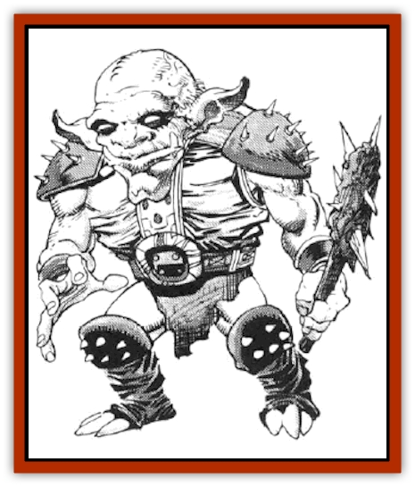
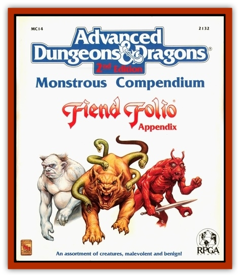

# Xvart

| Statistic | **Xvart** |
| --- | --- |
| **Activity Cycle:** | Any |
| **Alignment:** | Chaotic evil |
| **Armor Class:** | 7 |
| **Climate/Terrain:** | Temperate or arctic/Land |
| **Damage/Attack:** | 2-5 or by weapon type |
| **Diet:** | Omnivore |
| **Frequency:** | Uncommon |
| **Hit Dice:** | 1-1 |
| **Intelligence:** | Average (8-10) |
| **Magic Resistance:** | Nil |
| **Morale:** | Average (8-10) |
| **Movement:** | 6 |
| **No. Appearing:** | 40-400 |
| **No. of Attacks:** | 1 |
| **Organization:** | Tribal |
| **Size:** | S (3' tall) |
| **Special Attacks:** | Nil |
| **Special Defenses:** | Nil |
| **THAC0:** | 20 |
| **Treasure:** | K |
| **XP Value:** | 15 / Leader: 24 |

Xvarts are a cruel, cowardly race of humanoids which live in hilly, cavernous regions. They occupy a place in humanoid society somewhere between [[Goblin|goblins]] and [[Kobold|kobolds]]. The small, bald, blue-skinned creatures often act as intermediaries between these two races, usually dominating the latter.

Although weak individually, they are extremely prolific, and are almost always encountered in large groups.

**Combat:** Xvarts will attack a party of humans only if they have a tremendous numerical advantage. Xvarts fear humans, but hate [[Halfling|halflings]], and will attack them even if the xvarts do not have a tremendous edge in numbers. Xvarts will also attempt to bully kobolds whenever possible.

Xvarts will almost always try to ambush and overwhelm their opponents, preferring not to fight fairly at any time. Xvarts like to fight sleeping or resting opponents, circling them and brutally attacking before their prey knows what has hit them.

In every group of 20 xvarts, there will be at least one with a net, which it will attempt to throw at a target to entangle and impede an enemy. Xvarts will attempt to overbear a foe, knocking him/her down so that all the remaining xvarts can attack.

Xvarts typically use small short swords which cause 2-5 hit points of damage. Usually there are so many xvarts in a fight that it is impossible for a fighter to use a shield effectively against all of them.

For every group of 100 xvarts, there will be a leader, which has 11 hit points and attacks as a 2-HD monster. This leader will often use a spear or long sword, doing appropriate damage.

While most xvarts are fighters, 5% of them are shamans with clerical spell use of 2nd level, and another 5% will be magic-users who cast spells of up to 2nd level. These individuals will not rush forward in battle, preferring instead to expend their spells and then escape. Typically, these spell-using xvarts will be accompanied by 1-6 [[Rat|giant rats]].

**Habitat/Society:** Xvart society is crude by human standards, but effective in keeping the small creatures alive. Xvarts will lair in a complex of caves or in the deep forest. Xvarts are mostly resistant to the elements, wearing simple cloth doublets. They prefer blues and greens to dress in, and except for their orange eyes, they blend into their surroundings well.

Xvarts live a communal existences with hunting parties going out daily to try to gather food for the tribe. Xvarts will kill livestock or small animals, or raid farms for crops. Xvarts are not fussy eaters, and will adapt to almost any diet.

Xvart females do not fight, but raise the xvart children and keep the xvart community as organized as possible. They also maintain the many traps that have been placed around the camp.

For every 100 members of a tribe, in addition to the afore-mentioned leader and spell-casting types, there will be 3 lieutenants, with 8 hit points each (fighting as 1+1 HD monsters). In every xvart lair 3-30 giant rats are used as guards.

Xvarts speak their own language, as well as that of goblins and kobolds. It is for this reason that xvarts are often used as intermediaries between these often-warring races. Goblins will use xvarts as spies, while xvarts take a haughtier attitude with kobolds. It is only the large numbers of kobolds which keep xvart society from overrunning the slightly weaker kobolds.

Xvarts love to take human prisoners, sometimes for ransom, sometimes to torment them.

**Ecology:** Xvarts live for only 50 years, and it is a tough existence for them. Most creatures are larger and more powerful than they are. Xvarts mate twice a year, in the spring and in the fall. Each mating produces two children, which are cared for communally until age seven when they are old enough to assume their tribal duties of hunting and caring for the camp.

---
## Discovery & Documentation

**Source Publication:** MC14 Fiend Folio Appendix (1992)
**Campaign Setting:** Fiends Folio
**Author(s):** Don Bingle, John Terra, Wes Nicholson, Tim Beach, Steve Hardinger, Kris Hardinger, Rob Nicholls, Greg Swedberg, Al Boyce, Vince Garcia, Norm Ritchie

### Other Creatures Found in This Source Book
   * [[Aballin|Aballin]]
   * [[Achaierai|Achaierai]]
   * [[Adherer|Adherer]]
   * [[Algoid|Algoid]]
   * [[Al-Mi'raj|Al-Mi'raj]]
   * [[Apparition|Apparition]]
   * [[Caterwaul|Caterwaul]]
   * [[Coffer_Corpse|Coffer Corpse]]
   * [[Crabman|Crabman]]
   * [[Dark_Creeper|Dark Creeper]]
   * [[Dark_Stalker|Dark Stalker]]
   * [[Darter|Darter]]
   * [[Denzelian|Denzelian]]
   * [[Dune_Stalker|Dune Stalker]]
   * [[Dwarf_Urdunnir|Dwarf, Urdunnir]]
   * [[Falcon_Fire|Falcon, Fire]]
   * [[Faux_Faerie|Faux Faerie]]
   * [[Flawder|Flawder]]
   * [[Fyrefly|Fyrefly]]
   * [[Gambado|Gambado]]
   * [[Garbug|Garbug]]
   * [[Giant_Fhoimorien|Giant, Fhoimorien]]
   * [[Gibberling|Gibberling]]
   * [[Gorbel|Gorbel]]
   * [[Grimlock|Grimlock]]
   * [[Hellcat|Hellcat]]
   * [[Ice_Lizard|Ice Lizard]]
   * [[Iron_Cobra|Iron Cobra]]
   * [[Khargra|Khargra]]
   * [[Mantari|Mantari]]
   * [[Penanggalan|Penanggalan]]
   * [[Pernicon|Pernicon]]
   * [[Phantom_Stalker|Phantom Stalker]]
   * [[Retriever|Retriever]]
   * [[Ruve|Ruve]]
   * [[Scathe|Scathe]]
   * [[Sheet_Ghoul_Sheet_Phantom|Sheet Ghoul/Sheet Phantom]]
   * [[Shocker|Shocker]]
   * [[Spanner|Spanner]]
   * [[Stwinger|Stwinger]]
   * [[Sussurus|Sussurus]]
   * [[Symbiotic_Jelly|Symbiotic Jelly]]
   * [[Terithran|Terithran]]
   * [[Thunder_Children|Thunder Children]]
   * [[Troll_Ice|Troll, Ice]]
   * [[Tween|Tween]]
   * [[Umpleby|Umpleby]]
   * [[Volt|Volt]]
   * [[Xill|Xill]]
   * [[Zygraat|Zygraat]]
