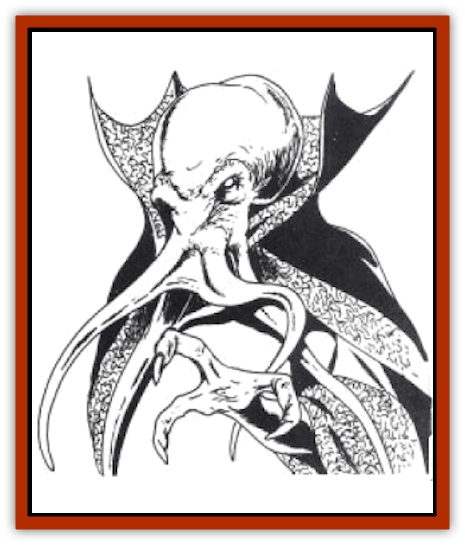
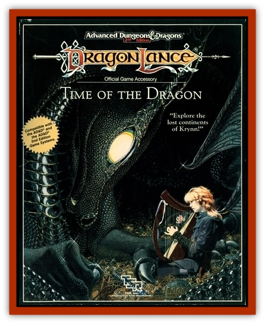

# Yaggol

| Statistic | **Yaggol** |
| --- | --- |
| **Activity Cycle:** | Night |
| **Alignment:** | Lawful evil |
| **Armor Class:** | 4 |
| **Climate/Terrain:** | Jungle |
| **Damage/Attack:** | 1d6+4/1d6+4, Special |
| **Diet:** | Carnivore |
| **Frequency:** | Very rare |
| **Hit Dice:** | 9 |
| **Intelligence:** | Low (5-7) |
| **Magic Resistance:** | 50% |
| **Morale:** | Champion (15) |
| **Movement:** | 12 |
| **No. Appearing:** | 1d6 |
| **No. of Attacks:** | 6 |
| **Organization:** | Tribal |
| **Size:** | M (7') |
| **Special Attacks:** | Mind blast |
| **Special Defenses:** | Camouflage |
| **THAC0:** | 11 |
| **Treasure:** | U (B) |
| **XP Value:** | 4,000 |

The yaggol are a degenerate sub-race of the evil and terrifying [[Mind_Flayer|mind flayers]] Degenerate, in this case, does not mean more debased or decadent (mind flayers are already decadent in the extreme). Rather, the yaggol have culturally regressed, and their once formidable mental powers have atrophied and are forgotten.

In appearance, the yaggol are almost identical with their cousins. They are larger, standing about seven feet tall, and have greater physical power. They have the same uncanny resemblance to malevolent octopi, including the four long tentacles that hide their mouth. Their skin is chameleonlike, shifting in color and pattern to match the background. The possible color changes range from brilliant rich green to a scarlet orange, encompassing various shades of browns, greens, and yellows. They possess three fingers on each hand, weirdly jointed so that any one can oppose the other two. The older members of their community dress in flowing robes, while the youths often wear nothing more than simple loincloths.

**Combat:** Although they have lost much of the intelligence of their ancestors, the yaggol are still incredibly dangerous and cunning in combat. They are extremely hard to spot if hidden against a natural background - one that falls within the color range of their powers. Elves have a 50% chance of noticing them, all others have a 20% chance. The yaggol must be within 30 feet before they can be spotted. If not detected, the yaggol automatically attack with surprise.

Once in combat, a yaggol attacks with its fists, delivering powerful blows. In addition, it can attack with its long tentacles. As with the mind flayer, any tentacle that hits will worm its way to the victims brain in 1d4 rounds. It then sucks the brain out and eats it. Each round these attached tentacles cause an automatic 1d6 points of damage. Victims can tear free if they roll a successful Strength check, but doing so causes 1d10 points of damage per attached tentacle.

The yaggol have lost nearly all the great mental powers of mind flayers. Thus they have no innate spell ability and possess only a simple mind blast. This affects those within a radius of ten feet around the creatures. All within the area must roll a successful saving throw vs. wand or suffer 3d6 points of damage from the intense mental agony the creatures radiate. Their own kind (including the more advanced [[Mind_Flayer|illithids]]) are immune to this effect. The mind blast places a great strain on the creatures; they must wait an hour before attempting it again. Furthermore, it dazes them for the round immediately after. They can take no actions as they recover their wits.

The yaggol are extremely savage and ferocious. At the same time, they are not so stupid as to fight against hopeless odds. They freely retreat from battles that go against them, even leaving their own kind behind. When they can, they take slaves (dinner for a later date). Failing this, they seek to kill as many as possible to provide a large quantity of fresh meat for the tribe.

**Habitat/Society:** The yaggol are descended from the more powerful and numerous race of mind flayers, a stellar race from the dark, cold reaches of space. According to their legends, which are extremely garbled, the yaggol once inhabited the stars but are now confined to the earth after offending some powerful being. Much more likely is that they are the survivors of a failed colonization attempt on Taladas, a failure caused by the destruction of the Cataclysm. They speak yaggol and whatever the local tongue is - cha'asi on Taladas. Originally a race that loved only darkness, the yaggol have adapted to surface life, although they still favor the comforting gloom of the jungle. They do not venture beyond the humid warmth of the jungle.

**Ecology:** The yaggol have a lifespan of no more than 60 years, spending the first five in a tadpole state. During this time there is the distinct possibility of being eaten by their elders in times of famine. Birth rates are accordingly high to adjust for the low chances of survival to adulthood. As a race they are asexual and in conversation freely refer to themselves as both he and she, having no understanding of the difference in the two words.

---
## Discovery & Documentation

**Source Publication:** Time of the Dragon (1989)
**Campaign Setting:** Dragonlance
**Author(s):** David Cook

### Other Creatures Found in This Source Book
   * [[Disir|Disir]]
   * [[Draconian_Proto-_Traag|Draconian, Proto-, Traag]]
   * [[Dragon_Krynn_Othlorx_General_Information|Dragon (Krynn), Othlorx, General Information]]
   * [[Fire_Minion|Fire Minion]]
   * [[Gurik_Cha'ahl|Gurik Cha'ahl]]
   * [[Horax|Horax]]
   * [[Saqualaminoi|Saqualaminoi]]
   * [[Skrit|Skrit]]
