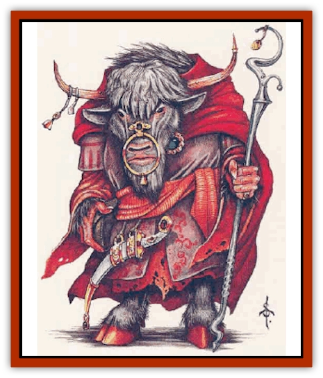

# Yak-Man

| Statistic | **Yak-Man** |
| --- | --- |
| **Activity Cycle:** | Day |
| **Alignment:** | Neutral evil |
| **Armor Class:** | 4 |
| **Climate/Terrain:** | Moutains |
| **Damage/Attack:** | 1d10 or by weapon |
| **Diet:** | Omnivore |
| **Frequency:** | Very rare |
| **Hit Dice:** | 5 |
| **Intelligence:** | Average to Genius (9-18) |
| **Magic Resistance:** | 10% |
| **Morale:** | Elite (13-14) |
| **Movement:** | 9 |
| **No. Appearing:** | 1 or 1-4 |
| **No. of Attacks:** | 1 |
| **Organization:** | Priesthood |
| **Size:** | L (8' tall) |
| **Special Attacks:** | See below |
| **Special Defenses:** | See below |
| **THAC0:** | 15 |
| **Treasure:** | P (D) |
| **XP Value:** | 1,400 / Leader: 2,000 |

[[Mammal_Herd_II|Yak]]-men live in the highest mountains, comfortable among the foreboding heights and deep, hidden valleys of the most inaccessible ranges. Here, they maintain their petty empires, ruling all other life forms within their borders.

Yak-men, known among themselves as Yikaria (the "Lucky Chosen" in their native writing) are [[Ogre|ogre]]-sized humanoids with broad shoulders. Their heads are like those of disgruntled yaks, complete with curved horns and uniformly dour, sullen expressions. Male or female, their bodies are coated with thick fur and hair. Female yak-men are more slender, but otherwise they are very similar to the males in appearance; many outsiders cannot tell them apart. Both sexes wear long flowing robes and occasionally turbans. All carry staves, some of which are magical.

**Combat:** Yak-men have a number of powers that make them deadly opponents. They can use magical items regardless of normal magical abilities. Their leaders are spellcasters. They have the natural power to summon and command [[Genie|dao genies]]. Lastly, they boast a spell-like ability similar to the 5th-level wizard spell, *magic jar*. Each power is explained below.

*Magical items.* All yak-men can use magical items, including items that are normally restricted to one class. If the item raises benefits and abilities that the yak-man doesn't have - for example, a magical device that doubles the number of spells learned - the yak-man gains nothing. However, if the item bestows a new power, the yak-man can gain that power.

These creatures are particularly attracted to magical staves. As a result, in any encounter, there is a 10% chance that one yak-man has a magical rod or staff of some type. Yak-men are always fully capable of using such item and rarely hesitate to do so.

*Spellcasting lenders.* Yak-men leaders have no more Hit Dice than other yak-men, but they do have priest abilities that range from 1st to 10th level. They worship their own "Forgotten God" (see "Habitat/Society"). All spheres except plant and summoning are available. At 9th level, leaders become high priests of the faith and gain wizard spell abilities. Wizardry is performed as if they were of a level matching their priest abilities (they begin with 5th-level spells). Upon gaining wizard powers, high priests typically become members of the royal court and advisors to their emperor.

*Commanding dao.* Each yak-man can summon a dao once per day, provided the yak-man does not already have a dao under his or her command. The dao becomes a slave; it must perform all actions that its master commands until the yakman decides to release it or until the sun has risen twice, whichever comes first. Yak-men are wise enough not to demand wishes, however. Instead they are content to exploit the dao's other impressive abilities. (The emperor of the yakmen uses dao as thugs, as well as a messenger service and spy network, with which to maintain control throughout his empire.)

The dao, of course, hate their imprisonment, but they take out their anger and frustration on the yak-men's enemies. No dao can attack a yak-man - not even a dao summoned by a yak-man's enemy. Dao summoned by others will, however, retain their initial loyalties. Under certain conditions, a dao may manage to harm a yak-man indirectly - by giving information to his enemies for example.

*Unique magic jar.* The yak-men's most frightening weapon is their unique *magic jar* attack (which resembles the spell). With this power, a yak-man literally crawls under another's skin, controlling the foe's body, wreaking havoc, and becoming a spy for evil yak-men masters. The yak-man's magic jar is a touch attack. It takes two full turns to take effect, during which time the victim usually must be restrained. (Restraining actions are often cloaked in ritual, but the typical chanting and incense-burning ceremonies are entirely optional.) To fend off this insidious attack, the victim must make a successful saving throw vs. spell with a -4 penalty (cumulative with any other modifiers in effect).

Yak-men use this ability solely against humans, demihumans, and humanoids - including [[Elf|elves]], [[Dwarf|dwarves]], [[Orc|orcs]], and [[Giant_Zakhara_General_Information|giants]], but excluding genies, monstrous creatures, [[Mind_Flayer|mind-flayers]], and animals. When occupying another's flesh, a yak-man gains access to all of the victim's memories and knowledge. (This exceeds the power of the *magic jar* spell.) Although the yak-man retains his own powers, he does not gain any of the victim's magical, spell-like, or psionic abilities. The victim's life force is cast into the furthest reaches of the yak-man's own mind and kept unconscious there until it is returned to its normal state (or slain). Meanwhile, the yak-man's mind takes full control of the victim's body. Outwardly, the body does not change. *Detect magic* and the like cannot detect the yak-man's presence nor can a sha'ir (desert wizard) detect genie-work. A "wise woman" can sense something falx about the affected mortal, but even she cannot recognize this falsehood as a yakman's work unless she has dealt with this creature before.

The *magic jar* effects can be dispelled as the spell of the same name. Furthermore, a yak-man can choose to return to his own body at any time, at will, regardless of distance. The original life force regains consciousness. If either body is slain, then both the yak-man and the inhabited character perish immediately. A yak-man will flee an endangered mortal form to preserve his own life.

**Habitat/Society:** Most yak-men cities occupy the peaks of the highest mountains. An average city holds several thousand yak-men, plus five or six times that many slaves. Even the poorest yak-men keeps a servant or two, and slaves are the xak-men's  common currency. Buildings and other structures are made from a gray, greasy-textured stone that dao import from the Elemental Plane of Earth. The walls of a yak-man city rival those of the strongest human settlements.

Outposts of this brutal society lie in the narrow vales below the mountain peaks, each housing 11 to 20 yak-men. The numbers may seem scant, but a single outpost can dominate an entire valley, for it has the aid of 10 dao and 10 to 40 local enslaved warriors. The yak-men demand a portion of the low-land population as tribute for their "wise and benevolent" rule. Those who disagree with this attitude are destroyed. Their lands are given to slaves who are more receptive to the yak-men's will - that is, slaves willing to sacrifice a portion oftheir families to help ensure the remainder's survival.

Yak-men function as a unified, malignant theocracy. All are fanatical followers of their Forgotten God (a name used by outsiders; the yak-men's own name for their god is unknown). The worship of this savage deity directs their lives. The Forgotten God takes the general form of a yak-man, but the deity's face is worn smooth into a featureless mask. Great statues of the faceless god dominate yak-men temples, which occupy the highest crags of their home mountains.

The yak-men's dark deity is appeased by sacrifice, which the followers carry out by offering slaves in the "Manner Elemental" - that is by fire (immolation), earth (live burial), water (drowning), or air (throwing the victim off a mountain). Daily sacrifices ensure the ongoing benevolence of the deity. These hideous acts also strengthen the yak-men's domination of their land, since a slave who disobeys today almost certainly will meet his or her death on the morrow.

It was the Forgotten God who enabled the yak-men to enslave the dao. In a legend told by bards, it is said that the Forgotten God once journeyed to the Elemental Plane of Earth. There, through guile and deception, the deity defeated the ruler of the earth elementals. The price of that defeat was harsh: the dao were forced to serve the Forgotten God and its minions - and forbidden to attack them - for "a thousand years and a year." (It is unclear how much of the sentence has passed, but sages are confident it will continue for centuries to come.)

Of late, the rest of the world has begun to interest the yak men, who see it as asource of new slaves and power. A foray into civilized realms typically involves a single scout or a party of one to four. A dao may accompany each yak-man. If a yak-man leader is present (10% chance), then any accompanying dao is [[Genie_Noble_Dao|noble]].

For a single scout, the mission is usually reconaissance - helping yak-men gauge the strengths and weaknesses of their potential foes. Nearly all scouts are convicted criminals hoping to earn a new life among their fellow yak-men. (If they die on duty, it hardly matters.) Should the scout return to the home city with some remarkable treasure or an extraordinary parcel of slaves, his crimes will be forgiven. These scouts frequently make deals with evil humans. A single yak-man may return home with a caravan of servants, kidnapped or stolen, or with some other treasure, similarly "hot".

A party of yak-men in civilized lands usually has a mission involving the members' *magic jar* abilities. They seek to kidnap a mortal or two and then inhabit their skins. (At least one yak-man guards the bodies of his or her companions.) Such spies strive to infiltrate the local ruling class; taking the place of a well-positioned servant or slave is a popular tactic. (It's more difficult to imitate someone with power or unusual ability.) After the mission is completed, when it's time for entertainment, a yak-man may force the inhabited body to run amok, spreading chaos, only to abandon control at the correct moment, leaving the confused mortal to pay the price for the yak-man's actions.

**Ecology:** Yak-men have an inhemt drive for knowledge, particularly dark knowledge that may serve to corrupt or dominate others. Knowledge that yak-men cannot gain or use immediately is to be destroyed. Unsentimental by nature, yak-men parents pack children off to communal creches once they are weaned, never to recognize them again. Yak-men feel no loyalty to their family - only to their god and to their inherently superior race as a whole.

Outsiders know little of the yak-men. For the most part they have remained within the confines of their lands, content to enslave or kill whomever enters it. To the other intelligent races, they are mysterious figures, treated as "boogie men" - a scary race of evil, ruthless, unenlightened, powerful savages who threaten the security of neighboring lands. The reputation is warranted.

All other races are slaves at best to the yak-men - even dao. There are rumors that dao leaders are working in conjunction with the Forgotten God, helping that deity facilitate its own besting other genie lords and the temporary enslavement of their races.

---
## Discovery & Documentation

**Source Publication:** Monstrous Compendium, 1995 Annual, Volume 2 (1995)
**Campaign Setting:** Advanced Dungeons & Dragons 2nd Edition
**Author(s):** Jon Pickens

### Other Creatures Found in This Source Book
   * [[Aboleth_Savant|Aboleth, Savant]]
   * [[Addazahr|Addazahr]]
   * [[Amiq_Rasol|Amiq Rasol]]
   * [[Arch-Shadow|Arch-Shadow]]
   * [[Automaton_Scaladar|Automaton, Scaladar]]
   * [[Automaton_Trobriand's|Automaton, Trobriand's]]
   * [[Bat_Sporebat|Bat, Sporebat]]
   * [[Beetle_Dragon|Beetle, Dragon]]
   * [[Bi-nou|Bi-nou]]
   * [[Boggle|Boggle]]
   * [[Brownie_Dobie|Brownie, Dobie]]
   * [[Brownie_Quickling|Brownie, Quickling]]
   * [[Cat_Crypt|Cat, Crypt]]
   * [[Cat_Great_Cath_Shee|Cat, Great, Cath Shee]]
   * [[Centaur-kin_Dorvesh|Centaur-kin, Dorvesh]]
   * [[Centaur-kin_Gnoat|Centaur-kin, Gnoat]]
   * [[Centaur-kin_Ha'pony|Centaur-kin, Ha'pony]]
   * [[Centaur-kin_Zebranaur|Centaur-kin, Zebranaur]]
   * [[Chronolily|Chronolily]]
   * [[Curst|Curst]]
   * [[Darktentacles|Darktentacles]]
   * [[Dinosaur_Aquatic|Dinosaur, Aquatic]]
   * [[Dinosaur_II|Dinosaur II]]
   * [[Dinosaur_III|Dinosaur III]]
   * [[Doppelganger_Greater|Doppelganger, Greater]]
   * [[Dragon_Brine|Dragon, Brine]]
   * [[Dragon_Half-|Dragon, Half-]]
   * [[Dragon-kin_Sea_Wyrm|Dragon-kin, Sea Wyrm]]
   * [[Dwarf_Wild|Dwarf, Wild]]
   * [[Ekimmu|Ekimmu]]
   * [[Elemental_Nature|Elemental, Nature]]
   * [[Elf_Winged|Elf, Winged]]
   * [[Fish_Great_Glacier|Fish (Great Glacier)]]
   * [[Fish_Subterranean|Fish, Subterranean]]
   * [[Fish_Toril|Fish (Toril)]]
   * [[Flareater|Flareater]]
   * [[Flumph|Flumph]]
   * [[Froghemoth|Froghemoth]]
   * [[Ghost_Casurua|Ghost, Casurua]]
   * [[Ghost_Ker|Ghost, Ker]]
   * [[Ghul|Ghul]]
   * [[Ghul-Kin|Ghul-Kin]]
   * [[Giant_Half-giant|Giant, Half-giant]]
   * [[Golem_Burning_Man|Golem, Burning Man]]
   * [[Golem_Phantom_Flyer|Golem, Phantom Flyer]]
   * [[Gulguthhydra|Gulguthhydra]]
   * [[Hakeashar|Hakeashar]]
   * [[Horse_Moon-|Horse, Moon-]]
   * [[Human_Dragonslayer|Human, Dragonslayer]]
   * [[Human_Vistana|Human, Vistana]]
   * [[Jellyfish_Giant|Jellyfish, Giant]]
   * [[Kalin|Kalin]]
   * [[Kholiathra|Kholiathra]]
   * [[Laerti|Laerti]]
   * [[Leucrotta_Greater|Leucrotta, Greater]]
   * [[Lich_Suel|Lich, Suel]]
   * [[Lurker_Shadow|Lurker, Shadow]]
   * [[Lycanthrope_Werepanther|Lycanthrope, Werepanther]]
   * [[Lycanthrope_Wereshark|Lycanthrope, Wereshark]]
   * [[Mammal_Herd_II|Mammal, Herd II]]
   * [[Marl|Marl]]
   * [[Meenlock|Meenlock]]
   * [[Mimic_Greater|Mimic, Greater]]
   * [[Mold_II|Mold II]]
   * [[Mummy_Creature|Mummy, Creature]]
   * [[Nyth|Nyth]]
   * [[Ooze_Slime_Jelly_Ghaunadan|Ooze/Slime/Jelly, Ghaunadan]]
   * [[Palimpsest|Palimpsest]]
   * [[Peltast|Peltast]]
   * [[Plant_Dangerous_II|Plant, Dangerous II]]
   * [[Pleistocene_Animal|Pleistocene Animal]]
   * [[Pudding_Subterranean|Pudding, Subterranean]]
   * [[Raggamoffyn|Raggamoffyn]]
   * [[Snake_Serpent|Snake, Serpent]]
   * [[Snake_Serpent_Vine|Snake, Serpent Vine]]
   * [[Sphinx_Draco-|Sphinx, Draco-]]
   * [[Sprite_Seelie_Faerie|Sprite, Seelie Faerie]]
   * [[Sprite_Unseelie_Faerie|Sprite, Unseelie Faerie]]
   * [[Squealer|Squealer]]
   * [[Turtle_Giant|Turtle, Giant]]
   * [[Umpleby|Umpleby]]
   * [[Vizier's_Turban|Vizier's Turban]]
   * [[Wall_Walker|Wall Walker]]
   * [[Webbird|Webbird]]
   * [[Zorbo|Zorbo]]
