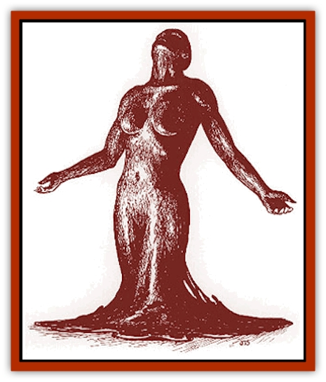

# Yeshom

| Statistic | **Yeshom** |
| --- | --- |
| **Activity Cycle:** | Any |
| **Alignment:** | Neutral evil |
| **Armor Class:** | 0 |
| **Climate/Terrain:** | Any |
| **Damage/Attack:** | Varies |
| **Diet:** | Sentient beings |
| **Frequency:** | Very rare |
| **Hit Dice:** | 14 |
| **Intelligence:** | Supra-genius (19-20) |
| **Magic Resistance:** | 75% |
| **Morale:** | Fanatic (17-18) |
| **Movement:** | 1 |
| **No. Appearing:** | 1 |
| **No. of Attacks:** | 1 |
| **Organization:** | Solitary |
| **Size:** | M (6' diameter) |
| **Special Attacks:** | Black pudding, envelop |
| **Special Defenses:** | Spell immunities, struck only by magical weapons |
| **THAC0:** | 7 |
| **Treasure:** | A |
| **XP Value:** | 20,000 |

Yeshoms are the undead remnants of [[Aranea_Savage_Coast|aranean]] mages who sought power, got it, and paid too high a price. In its normal form, the yeshom resembles a large puddle of oily, black tar.

Yeshoms came into being about 1,500 years ago, when a group of Herathian mages cooperated in an effort to gain immortality, augment the natural shapechanging abilities of the aranean race, and gain additional spellcasting power.

Their research effort succeeded in all three of these goals, discovering a method by which a powerful aranea could be transformed into a new form with vastly greater power. A number of Herath's best and finest mages volunteered for the treatment and were transformed into yeshoms, before the process's horrible side effects were discovered.

At first, the Herathian volunteers were able to retain their original alignments through force of will. However, the undead form carried a subtle evil warping influence, which slowly made the yeshoms psychotic and bitter. All of them eventually became insane, humanoid-hating recluses.

*The Red Curse:* Yeshoms each have six Legacies (as 14th-level Inheritors) from Region 4. They do not require *cinnabryl*.

**Combat:** Yeshoms are quite willing to engage in combat. Killing assuages their terrible boredom and hatred.

A yeshom casts spells as a 14th- to 18th-level mage. It also has the following permanent magical abilities: *infravision*, *comprehend languages*, *detect evil*, *detect good*, *detect invisible*, *detect magic*, *protection from good*, *protection from normal missiles*, *read magic*, *tongues*, and *unseen servant*.

With a successful attack (ignoring armor bonuses), a yeshom can choose to either do damage as a [[Pudding_Deadly|black pudding]] or envelop its victim. If the yeshom chooses to envelop its victim, a victim that does not make a successful saving throw vs. spell is thrust into an interior pocket-dimension and put into a state of suspended animation. Once a victim is placed in this state, the yeshom knows everything the victim knows. The victim can then be killed at the whim of the yeshom.

This horrible undead form amplifies the natural shapeshifting abilities of the araneas. The yeshom can assume the form of any man-sized or smaller creature, but each form retains its characteristic shiny, black, liquid texture.

In addition to their magic resistance, yeshoms are immune to any form of energy discharge, including lightning, fire, cold, and *magic missile*. They are also immune to any form of *sleep*, *charm*, and *hold* spells and death magic. They are also immune to poison. Holy water from the temple of a neutral good Immortal will inflict 2d4 points of damage per vial.

Anyone killed by a yeshom is gone forever, beyond *resurrection*, *raise dead*, and *wish*.

**Habitat/Society:** Yeshoms are extremely solitary; they have no retainers or undead followers. The yeshom is also cruel, irrational, and bored. Yeshom prefer to draw out the agony of a death, prolonging the victim's terror.

Yeshom are not prone to travel. They inhabit isolated regions and regard anyone or anything that wanders into their territory as prey. They especially like to prey upon araneas, a form of revenge for the failed experiment.

Araneas try desperately to hide the existence of this creature from outsiders. Because the yeshom tends to stay in one place, the araneas simply avoid those places. Also, the secretive araneas rarely feel obligated to warn outsiders.

**Ecology:** Yeshom have little impact on the local ecology. They do, however, have large treasures, the belongings of their fallen victims.

---
## Discovery & Documentation

**Source Publication:** Monstrous Compendium Savage Coast Appendix (Online Exclusive) (1995)
**Campaign Setting:** Mystara
**Author(s):** Loren L Coleman, Ted James, Thomas Zuvich, Cindi M. Rice

### Other Creatures Found in This Source Book
   * [[Aranea_Savage_Coast|Aranea (Savage Coast)]]
   * [[Arashaeem|Arashaeem]]
   * [[Batracine|Batracine]]
   * [[Cat_Marine|Cat, Marine]]
   * [[Cinnavixen|Cinnavixen]]
   * [[Clockwork_Swordsman|Clockwork Swordsman]]
   * [[Critter_Temple|Critter, Temple]]
   * [[Cursed_One|Cursed One]]
   * [[Deathmare|Deathmare]]
   * [[Dragon_Savage_Coast_Crimson|Dragon (Savage Coast), Crimson]]
   * [[Dragon_Savage_Coast_Red_Hawk|Dragon (Savage Coast), Red Hawk]]
   * [[Echyan|Echyan]]
   * [[Ee'aar|Ee'aar]]
   * [[Enduk|Enduk]]
   * [[Fachan_Savage_Coast|Fachan (Savage Coast)]]
   * [[Feliquine|Feliquine]]
   * [[Fiend_Narvaezan|Fiend, Narvaezan]]
   * [[Frelôn|Frelôn]]
   * [[Ghriest|Ghriest]]
   * [[Glutton_Sea|Glutton, Sea]]
   * [[Goatman|Goatman]]
   * [[Golem_Naâruk|Golem, Naâruk]]
   * [[Golem_Savage_Coast|Golem (Savage Coast)]]
   * [[Grudgling|Grudgling]]
   * [[Heraldic_Servant_I|Heraldic Servant I]]
   * [[Heraldic_Servant_II|Heraldic Servant II]]
   * [[Heraldic_Servant_III|Heraldic Servant III]]
   * [[Heraldic_Servant_IV|Heraldic Servant IV]]
   * [[Heraldic_Servant_V|Heraldic Servant V]]
   * [[Heraldic_Servant_General_Information|Heraldic Servant, General Information]]
   * [[Hermit_Sea|Hermit, Sea]]
   * [[Jorri|Jorri]]
   * [[Juhrion|Juhrion]]
   * [[Kla'a-tah|Kla'a-tah]]
   * [[Leech_Legacy|Leech, Legacy]]
   * [[Lich_Inheritor|Lich, Inheritor]]
   * [[Lizard_Kin_Savage_Coast|Lizard Kin (Savage Coast)]]
   * [[Lupasus|Lupasus]]
   * [[Lupin|Lupin]]
   * [[Lyra_Bird_Saragón|Lyra Bird, Saragón]]
   * [[Malfera|Malfera]]
   * [[Manscorpion_Nimmurian|Manscorpion, Nimmurian]]
   * [[Mythuínn_Folk|Mythuínn Folk]]
   * [[Neshezu|Neshezu]]
   * [[Nikt'oo|Nikt'oo]]
   * [[Nosferatu|Nosferatu]]
   * [[Omm-wa|Omm-wa]]
   * [[Omshirim|Omshirim]]
   * [[Parasite_Savage_Coast|Parasite (Savage Coast)]]
   * [[Phanaton|Phanaton]]
   * [[Plant_Savage_Coast|Plant (Savage Coast)]]
   * [[Pudding_Vermilion|Pudding, Vermilion]]
   * [[Rakasta|Rakasta]]
   * [[Ray_Forest|Ray, Forest]]
   * [[Shedu_Greater_Savage_Coast|Shedu, Greater (Savage Coast)]]
   * [[Shimmerfish|Shimmerfish]]
   * [[Skinwing|Skinwing]]
   * [[Spawn_of_Nimmur|Spawn of Nimmur]]
   * [[Spider-spy|Spider-spy]]
   * [[Spirit_Heroic|Spirit, Heroic]]
   * [[Spirit_Walleran|Spirit, Walleran]]
   * [[Succulus|Succulus]]
   * [[Swampmare|Swampmare]]
   * [[Symbiont_Shadow|Symbiont, Shadow]]
   * [[Tortle|Tortle]]
   * [[Troll_Legacy|Troll, Legacy]]
   * [[Trosip|Trosip]]
   * [[Tyminid|Tyminid]]
   * [[Utukku|Utukku]]
   * [[Voat|Voat]]
   * [[Voat_Herathian|Voat, Herathian]]
   * [[Vulturehound|Vulturehound]]
   * [[Wallara|Wallara]]
   * [[Wurmling|Wurmling]]
   * [[Wynzet|Wynzet]]
   * [[Zombie_Red|Zombie, Red]]
