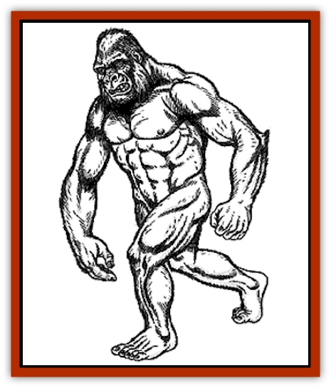

# Yeti

| Statistic | **Yeti** |
| --- | --- |
| **Activity Cycle:** | Day |
| **Alignment:** | Neutral |
| **Armor Class:** | 6 |
| **Climate/Terrain:** | Arctic hills and mountains |
| **Damage/Attack:** | 1-6/1-6 |
| **Diet:** | Carnivore |
| **Frequency:** | Very rare |
| **Hit Dice:** | 4+4 |
| **Intelligence:** | Average (8-10) |
| **Magic Resistance:** | Nil |
| **Morale:** | Elite (13) |
| **Movement:** | 15 |
| **No. Appearing:** | 1-6 |
| **No. of Attacks:** | 2 |
| **Organization:** | Clan |
| **Size:** | L (8' tall) |
| **Special Attacks:** | Squeeze |
| **Special Defenses:** | Immune to normal cold, invisible in snow and ice |
| **THAC0:** | 15 |
| **Treasure:** | D |
| **XP Value:** | 420 |

Sometimes confused with the abominable snowman, the yeti is a distant cousin to the great [[Ape_Carnivorous|carnivorous apes]] of warmer climates.

An adult yeti stands 8 feet tall and is covered in long, white fur. Their feet and hands are wide and flat, which helps to disperse their great weight (about 300 pounds) on treacherous snow fields. They travel on all fours like the apes, but fight very comfortably standing erect. Unlike most apes and gorillas, the yeti does not have an opposable toe on its feet. They wear no clothing or ornamentation. The spoor, or smell, of a yeti is very subtle in cold climates, but in confined or warm areas, they have a strong, musky odor. The eyes of a yeti are icy blue or almost colorless. Their claws and flesh are ivory white. Unlike many arctic creatures, the yeti does not have a thick layer of body fat to keep it warm. Instead, it relies upon the special properties of its thick, warm fur. It has a transparent second eyelid, which allows the creature to see in blowing snow, and prevents its eyes from freezing in extreme temperatures.

**Combat:** The yeti is a fierce hunter of the polar regions. It stalks its prey and lays an ambush, attempting to gain surprise. A favorite trick is to get ahead of its prey and lie in a depression in the snow, or dig a shallow pit and cover itself with snow. Such works can be detected only by natives of the arctic regions, and then only 25% of the time. Against the snow, the yeti is invisible due to its coloration until its prey is 10 yards away. Under a thin layer of snow it is completely invisible.

Any opponent surprised by a yeti must save vs. paralyzation or go rigid with fright for three rounds, indicating that he has looked into the icy blue depths of the yeti's eyes. Any opponent that is paralyzed in this way can be automatically hit by both claws and squeezed.

Although the yeti does have fangs (1-4 points of damage), it does not usually attack with them, preferring to use its formidable claws. If any hit with claws is made with a natural 20, the victim is pulled in for a chilling squeeze. The creature's fur actually absorbs heat, making it extraordinarily cold if contacted (2-16 points of damage if squeezed). The heat-absorbing property of the yeti's fur can work against it; damage from heat is 50% greater than normal.

**Habitat/Society:** Although the yeti is of average intelligence, it has no civilization. They can use simple tools, including man-made weapons, but will not make any themselves. Yeti live in ice caves in hills and mountains. Sometimes these are natural, sometimes they are excavated by the yeti or enlarged to accommodate the family. Most yeti treasure consists of items recovered from the bodies of explorers.

Life is harsh in the arctic, and friends and food are hard to find, making survival and reproduction the yeti's only goals. The yeti will associate only with its immediate family, the young leaving to fend for themselves as soon as they mature. A family usually consists of an adult male with one to three females and a 50% chance of 1-6 young if females are present. In an attacking group, the largest yeti is the male, the next largest ones are his mates. Any others are small males or females that are due to leave the family soon.

**Ecology:** Any living creature not of its family is considered potential food, including other yeti. This does not make them foolhardy; only a starving yeti will attack an obviously stronger party. Their typical diet consists of herd creatures, such as [[Mammal_Herd_II|caribou]], [[Bear|bears]], [[Wolf|wolves]], and other creatures inhabiting the snowy mountains in which they live. The yeti may turn to scavenging in hard times. They range across a wide area in search of food, usually 15 miles in all directions from their lair.

Yeti claws and teeth have value only because of the rarity of the creature. They sell for about a gold piece a tooth or claw on the open market. Yeti fur is another story. It is prized by those living in cold climates for its extraordinary ability to keep its wearer warm. A full grown yeti pelt can fetch up to 300 gold pieces on the open market.

---
## Discovery & Documentation

**Source Publication:** MC1 Volume I (w/binder #1) (1991)
**Campaign Setting:** Advanced Dungeons & Dragons 2nd Edition
**Author(s):** Jay Batista, Scott Bennie, Grant Boucher, William W. Connors, Steve Gilbert, Heike Kubasch, James Lowder, David Edward Martin, Bruce Nesmith, Jean Rabe, Rick Swan, John J. Terra, Gary L. Thomas

### Other Creatures Found in This Source Book
   * [[Bat|Bat]]
   * [[Bear|Bear]]
   * [[Behir|Behir]]
   * [[Boar|Boar]]
   * [[Bookworm|Bookworm]]
   * [[Brownie|Brownie]]
   * [[Bugbear|Bugbear]]
   * [[Carrion_Crawler|Carrion Crawler]]
   * [[Cat_Great|Cat, Great]]
   * [[Catoblepas|Catoblepas]]
   * [[Dragon_General_Information|Dragon, General Information]]
   * [[Dragonfish|Dragonfish]]
   * [[Elemental_Air_Kin_Aerial_Servant|Elemental, Air Kin, Aerial Servant]]
   * [[Elemental_Earth_Kin_Sandling|Elemental, Earth Kin, Sandling]]
   * [[Elephant|Elephant]]
   * [[Gnoll|Gnoll]]
   * [[Hobgoblin|Hobgoblin]]
   * [[Homunculus|Homunculus]]
   * [[Hornet_Giant|Hornet, Giant]]
   * [[Horse|Horse]]
   * [[Hyena|Hyena]]
   * [[Jackal|Jackal]]
   * [[Jackalwere|Jackalwere]]
   * [[Korred|Korred]]
   * [[Lich|Lich]]
   * [[Lizard|Lizard]]
   * [[Lizard_Man|Lizard Man]]
   * [[Lycanthrope_General_Information|Lycanthrope, General Information]]
   * [[Lycanthrope_Seawolf|Lycanthrope, Seawolf]]
   * [[Lycanthrope_Werebear|Lycanthrope, Werebear]]
   * [[Lycanthrope_Weretiger|Lycanthrope, Weretiger]]
   * [[Lycanthrope_Werewolf|Lycanthrope, Werewolf]]
   * [[Manticore|Manticore]]
   * [[Medusa|Medusa]]
   * [[Mind_Flayer|Mind Flayer]]
   * [[Minotaur|Minotaur]]
   * [[Mudman|Mudman]]
   * [[Mummy|Mummy]]
   * [[Nixie|Nixie]]
   * [[Nymph|Nymph]]
   * [[Ogre|Ogre]]
   * [[Ooze_Slime_Jelly_I|Ooze/Slime/Jelly I]]
   * [[Ooze_Slime_Jelly_II|Ooze/Slime/Jelly II]]
   * [[Orc|Orc]]
   * [[Owl|Owl]]
   * [[Owlbear_I|Owlbear I]]
   * [[Pegasus|Pegasus]]
   * [[Piercer|Piercer]]
   * [[Pudding_Deadly|Pudding, Deadly]]
   * [[Rakshasa|Rakshasa]]
   * [[Rat|Rat]]
   * [[Ray|Ray]]
   * [[Remorhaz|Remorhaz]]
   * [[Satyr|Satyr]]
   * [[Scorpion|Scorpion]]
   * [[Selkie|Selkie]]
   * [[Shadow|Shadow]]
   * [[Skeleton|Skeleton]]
   * [[Skunk|Skunk]]
   * [[Snake|Snake]]
   * [[Spectre|Spectre]]
   * [[Spider|Spider]]
   * [[Sprite|Sprite]]
   * [[Toad_Giant|Toad, Giant]]
   * [[Treant|Treant]]
   * [[Troll|Troll]]
   * [[Umber_Hulk|Umber Hulk]]
   * [[Unicorn|Unicorn]]
   * [[Vampire|Vampire]]
   * [[Wight|Wight]]
   * [[Will_O'Wisp|Will O'Wisp]]
   * [[Wolf|Wolf]]
   * [[Wolfwere|Wolfwere]]
   * [[Wraith|Wraith]]
   * [[Wyvern|Wyvern]]
   * [[Yuan-ti|Yuan-ti]]
   * [[Zombie|Zombie]]
