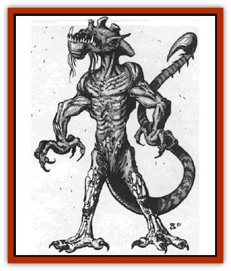

# Yitsan

| Statistic | **Yitsan** |
| --- | --- |
| **Activity Cycle:** | Any |
| **Alignment:** | Neutral |
| **Armor Class:** | 0 |
| **Climate/Terrain:** | Any |
| **Damage/Attack:** | 1d6/1d6/3d6/2d12 |
| **Diet:** | Carnivore |
| **Frequency:** | Very rare |
| **Hit Dice:** | 11 |
| **Intelligence:** | Very (11-12) |
| **Magic Resistance:** | Nil |
| **Morale:** | Fanatic (18) |
| **Movement:** | 12, Fl 3 (D), Br 6, Sw 12 |
| **No. Appearing:** | 1-4 |
| **No. of Attacks:** | 6 |
| **Organization:** | Pack |
| **Size:** | L (10' tall) |
| **Special Attacks:** | See below |
| **Special Defenses:** | +1 weapon or better to hit |
| **THAC0:** | 10 |
| **Treasure:** | Nil |
| **XP Value:** | 7,000 |

The yitsan is also known as "treasure bane" and "intruder within". Unwary sailors bring the eggs aboard ship in newfound treasure hoards.

Yitsan measure around 10' in height. They are humanoid, with 8' tails. Their skin is a fine mesh of grey-green scales. Yitsan have long claws on their four-fingered hands and toes, and their mouths have three sets of sharp teeth. Perhaps their most unusual characteristic is their lack of eyes. An odor of salt hangs about them.

If the yitsan have a language, it has yet to be discovered. They frequently utter hisses, shrieks, roars, and growls.

**Combat:** Fighting is what the yitsan does best. Its four sets of long claws each cause 1d6 damage. The yitsan can use the claws on its two feet just as easy as the claws on its hands. The only ways it can use all four claws at once is atop a victim, or while trampling underfoot.

The yitsan begins melee using its tail, with its many razor-sharp projections (2d12 damage). The tail can strike up to three opponents in a closely-spaced line. Only one attack roll is made, regardless of the number of opponents (use the best AC among the victims). Victims of the tail sweep must make a Dexterity check or fall. The yitsan tries to trample a prone victim with all four sets of claws (4d6 damage).

The tail can also wrap around a human-sized victim. Once it hits (for no damage), starting on the following round the tail constricts for 2d4 damage per round, plus 1d6 cutting damage from the tail's razor edges (not vs. victims in metal armor). A victim must succeed in a Strength ability check (trying once per round) to escape the tail. The yitsan can attack other victims with its claws while constricting with its tail.

The yitsan has three rows of sharp teeth that cause 3d6 damage. Once its jaws get hold of someone, they continue to grind, inflicting an automatic 2d6 points of damage per round. A victim gets Strength ability checks to escape as described above.

Due to their blindness, yitsan are immune to illusions and any spell that requires the target to see. However, a yitsan's senses of hearing, taste, and smell are inhumanly acute. They locate opponents in a 50' radius by their breathing or their scent (80% chance). Like [[Snake|snakes]], the yltsan use their tongues to taste the air. Casting a *silence* spell on a yitsan gives it only a 25% chance of detecting an opponent, and a -2 penalty to its attack rolls.

**Habitat/Society:** Yitsan have no organization. Each beast is out for itself. Most encounters with yitsan are with young, since adults avoid large groups of humans in favor of less intelligent prey.

A yitsan reproduces by laying a group of 1d4 eggs. These eggs are 1" wide golden disks. To the casual observer, a yitsan egg looks like a gold piece, except that it is featureless.

When the egg hatches, the newborn yitsan resembles a tiny (1") green [[Lizard|lizard]]. It crawls into a cozy crack in a ship's bulkhead and eats bugs, mice, wood, and cloth. The lizard grows to 60" in two weeks, trusting to its chameleon-like hide to remain unnoticed. Sailors may notice small nibble marks in their clothing or wood implements; there is a 1% chance per sailor to notice this per day.

After the lizard reaches a foot in length, it undergoes rapid and painful metabolic changes, maturing in two hours. This frantic growth spurt drains much energy and leaves the adult yitsan ravenously hungry. The yitsan always seeks a private place to mature, for it is helpless during the transformation.

An adult yitsan lays eggs once it has eaten its first meal. Once again it seeks a stash of coins, perhaps even returning to its spawning hoard.

**Ecology:** The yitsan is a predator of unknown origin. Some [[Elf|elven]] scholars guess that the yitsan is an [[Orc|orcish]] biological weapon left over from the Unhuman Wars that somehow escaped into civilized space.

---
## Discovery & Documentation

**Source Publication:** MC9 Spelljammer Appendix II (1991)
**Campaign Setting:** Planescape
**Author(s):** Scott Davis, Newton Ewell, John Terra

### Other Creatures Found in This Source Book
   * [[Alchemy_Plant|Alchemy Plant]]
   * [[Allura|Allura]]
   * [[Aperusa|Aperusa]]
   * [[Autognome|Autognome]]
   * [[Bionoid|Bionoid]]
   * [[Bloodsac|Bloodsac]]
   * [[Buzzjewel|Buzzjewel]]
   * [[Constellate|Constellate]]
   * [[Contemplator|Contemplator]]
   * [[Dohwar|Dohwar]]
   * [[Dragon_Moon|Dragon, Moon]]
   * [[Dragon_Stellar|Dragon, Stellar]]
   * [[Dragon_Sun|Dragon, Sun]]
   * [[Dreamslayer|Dreamslayer]]
   * [[Dweomerborn|Dweomerborn]]
   * [[Fal|Fal]]
   * [[Feesu|Feesu]]
   * [[Fire_Bat|Fire Bat]]
   * [[Firebird|Firebird]]
   * [[Firelich|Firelich]]
   * [[Flowfiend|Flowfiend]]
   * [[Gadabout|Gadabout]]
   * [[Gammaroid|Gammaroid]]
   * [[Gonn|Gonn]]
   * [[Gossamer|Gossamer]]
   * [[Grav|Grav]]
   * [[Great_Dreamer|Great Dreamer]]
   * [[Greatswan|Greatswan]]
   * [[Grell_Colonial|Grell, Colonial]]
   * [[Gullion|Gullion]]
   * [[Insectare|Insectare]]
   * [[Lhee|Lhee]]
   * [[Mercurial_Slime|Mercurial Slime]]
   * [[Meteorspawn|Meteorspawn]]
   * [[Monitor|Monitor]]
   * [[Owl_Space|Owl, Space]]
   * [[Pristatic|Pristatic]]
   * [[Scro|Scro]]
   * [[Selkie_Star|Selkie, Star]]
   * [[Silatic|Silatic]]
   * [[Skullbird|Skullbird]]
   * [[Sleek|Sleek]]
   * [[Sluk|Sluk]]
   * [[Space_Swine|Space Swine]]
   * [[Sphinx_Astro-|Sphinx, Astro-]]
   * [[Spirit_Warrior|Spirit Warrior]]
   * [[Starfly_Plant|Starfly Plant]]
   * [[Stargazer|Stargazer]]
   * [[Undead_Stellar|Undead, Stellar]]
   * [[Witchlight_Marauder|Witchlight Marauder]]
   * [[Xixchil|Xixchil]]
   * [[Zurchin|Zurchin]]
