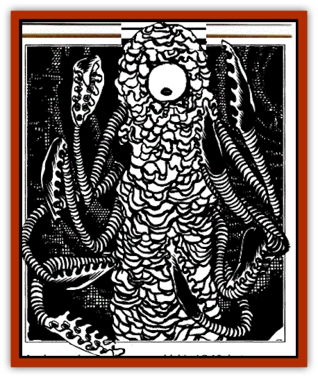

# Yochlol - Underdark

| Statistic | **Yochlol (Underdark)** |
| --- | --- |
| **Activity Cycle:** | Any |
| **Alignment:** | Chaotic evil |
| **Armor Class:** | 10 (10 when materialized) |
| **Climate/Terrain:** | Any/any |
| **Damage/Attack:** | See below |
| **Diet:** | Omnivore |
| **Frequency:** | Very rare (common in Abyss) |
| **Hit Dice:** | 6 (10-sided dice) |
| **Intelligence:** | High (13-14) |
| **Magic Resistance:** | 50% |
| **Morale:** | Champion (15-16) |
| **Movement:** | 12 |
| **No. Appearing:** | 1 (1-4 in Abyss) |
| **No. of Attacks:** | See below |
| **Organization:** | Solitary |
| **Size:** | M (or L, as giant spider) |
| **Special Attacks:** | See below |
| **Special Defenses:** | See below |
| **THAC0:** | 15 |
| **Treasure:** | Nil |
| **XP Value:** | 6,000 |

Yochlol, "the handmaidens of Lolth,"" are denizens of the Abyss. All known yochlol serve the Queen of Spiders, and appear on the Prime Material Plane only at her command, when summoned by rituals of worship to her.

Yochlol normally appear as misty columns of ale-brown or (more rarely) dark red, emerald, or violet gas. In this form, they are AC -10, appear as hazy, mobile smudges in the air, and have a strong, acrid, disgusting odor. They can extend pseudopods of their form or change the shape of their gaseous cloud to better hide, reach prey, or compress themselves to fit through thin apertures.

Yochlol must materialize to carry items or to make physical attacks, into one of three forms: an amorphous, one-eyed column resembling a roper or a half-burned brown candle, with eight pseudopods; a [[Spider|giant spider]]; or a beautiful female human or [[Elf|elf]].

**Combat:** In its gaseous form, a yochlol can be struck only by +1 or better magic weapons, and its touch affects others as if they had suffered the effects of a *stinking cloud* spell. It cannot carry, move, or use physical items in this form - such things simply fall through it.

While in gaseous form, a yochlol will be healed (gaining 3d4 hp) if a *stinking cloud* spell is cast on it. A *gust of wind* spell that overcomes its magic resistance deals it 6d6 points of damage, but this spell must be delivered by "touch" (i.e. the caster must move or reach into an area occupied by the gaseous yochlol, suffering its harmful effects upon him, to deliver the magical attack).

A *wind walk*spell will destroy gaseous yochlol automatically (regardless of their magic resistance), if they are "touched" (as described above) by the caster. A priest able to affect multiple persons with his *wind walk* spell can destroy the same number of yochlol, so long as the priest can "touch" them all on the round the spell is cast, or on the next round (this touch attack prohibits further spellcasting in that round).

In elven or human form, a yochlol is AC 10, but can wear armor, and use weapons and magic items normally employed by priests or fighters. Yochlol act as sixth-level fighters, including the ability to employ a melee weapon in 3 attacks every 2 rounds if they have specialized in its use - and most yochlol have had centuries of practice in butchery, if they care to master a single weapon.

In spider form, a yochlol is AC 10, but otherwise conforms to a giant [[Spider|spider]] (as described in Volume 1 of the Monstrous Compendium, under "Spider") in all respects. The poison of its bite causes death at the end of the same round if the victim's save fails, but otherwise has no effect.

In its "amorphous column" form, a yochlol has up to 8 pseudopods, each of which does 1d4+3 damage per blow. These appendages are fully prehensile, but lack the dexterity and grasping strength to use weapons properly in combat.

In all of their forms, yochlol have 18/50 strength, 160'-range infravision, and take only half damage from cold, electricity, and fire-based attacks of all sorts, and from corrosive or poisonous gas effects.

The gases and fires of a summoning ritual do not harm a yochlol, but feed it, giving it a focal presence on the Prime Material Plane, and if it fully materializes, fuelling its journey from one plane to the other. Except in a summoning ritual, a yochlol in fully gaseous form takes no damage from gases or acids, but takes full damage from fire. If a yochlol is attacked with fire on the Prime Material Plane while it is still surrounded by the fires of its summoning, it can direct that fire right back at the source, taking no harm from it.

Most fires on the Abyss feed a yochlol's substance with noxious gases, and therefore harm a yochlol little or not at all. In the Abyss, yochlol take no damage from poisonous or corrosive gas effects. Fire magic directed at a yochlol in the Abyss will do half damage to it, as the flames will be magical, not fuelled by substances native to the Abyss, and linked to the yochlol's essential nature.

In all forms, a yochlol can use the following spell-like powers, one at a time and once per round: *domination*, *mind blank* and *plane shift*. Except as noted, these powers are all identical to known priest and wizard spells. Use of one power negates or ends the effects of previously-activated powers. A yochlol can also choose (as its power use for that round) to alter its own alignment aura to that of any other chosen alignment. This disguise is effective against all known forms of non-divMe detection. 

In human or ellven form, a yochlol can exercise one other spell-like power: it can *cure light wounds* (1d8+1 hp) on itself or another touched creature. This ability can only be used twice per turn.

 A yochlol can perform an action, change its form, and carry out another activity all A the same round. It can never change its form twice in the same round, or make more than one use of a spell-like power.

 If a yochlol uses armor in human or elven form, it must become gaseous before changing to another physical form, causing the armor to fall away. If it does not, the armor will be rent and twisted during the transformation, doing the yochlol 4d6 damage in the process. Such armor is ruined, although it may be salvaged and repaired by a skilled smith. 

**Habitat/Society:** Yochlol take pleasure in dominating and inflicting cruelty on lesser creatures. They enjoy a good fight, exulting in the rage that defiance awakes in them. AB !mown yochlol serve Lolth, and by her command do not engage in any treadle, or combat against her or each other. Yochlol hiss, sneer, and shriek a lot when dealing with other creatures; they share an unlimited-range telepathy with Lolth whenever they are on the same plane as the Spider Queen, or even when partially materialized on the Prime Material Plane (use of this communication prevents the exercise of any spell-like power during the same round, and is impossible once a yochlol has material-ized fully on the Prime Material, even if it subsequently changes its form back to gaseous). Yochlol share a telepathy with other yochlol when within 90' of each other, and readily work together . combat to more effectively defeat foes. 

Among themselves, yochlol have few rivalries, and cannot be tricked or coerced into attacking each other or working against Lolth in any way. they do, however, enjoy making their own mark—especially on the Prime Material Plane. 

Yochlol delight most in escaping from those who have summoned them (whom they must serve faithfully in one action, by Lolth's command) and wandering at will in the Prime Material plane, working mischief. A "Tree" yochlol will use its various forms as disguises, and use cunning ploys and subterfuges to turn evil beings to its ends, working damage by intrigue, murder and deception. It will not go on an open killing spree unless enemies of its summoners or of Lolth menace it during the ritual of its summoning, and are present for it to battle. Yochlol like to terrorize lesser beings, whispering their names so that survivors will remember and fear them. 

On many occasions, yochlol have used their human or elven forms to befriend, love, and aid beings of Faerun in tender and kind ways, or to set right one being, injustices and wants with a seeming disregard for the being's alignment—or the parlors own cruel nature. Most sages believe this sort of behavior is a result of a yochlol, innate capriciousness and need to do something different, as well as a desire to let others know of its existence, power, and name. Lolth seldom lets such independent jaunts last long, but rarely punishes yochlol for them; they appear to be an accepted, necessary "safety valve." They also serve as a way of gathering information about the Prime Material plane, checking on the loyalty and doings of Lolth's faithful, and spreading rumors of her gathering power. 

**Ecology:** In gaseous form, yochlol absorb needed nutri-ents from gases and liquids (such as water or blood). In physical forms, yochlol eat the flesh of living things with their mouths, or by flowing to envelop the body of chosen prey (usually after it has been disabled or slain). They must eat at least once every 20 days. Prey that are within, or partially with., a yochlol are bitten by many tiny sucking mouths, which collectively deal the victim 10d4 damage per round. Yochlol typically devour an matter except bones. These they exude through their bodies in a harmless but disgustingly spectacular spray, or leave behind in a collapsing heap when they become gaseous. 

Yochlol essence (derived by heating collected portions of a yochlol's gaseous form in a closed vessel, or boiling portions of one of its physical forms) is a valued ingredient in spell inks, preparations, and castings involving *mind blank*, *shape change*, *stinking cloud* and *wraithform* spells or item effects.

---
## Discovery & Documentation

**Source Publication:** The Drow of the Underdark (1991)
**Campaign Setting:** Forgotten Realms
**Author(s):** Ed Greenwood

### Other Creatures Found in This Source Book
   * [[Bat_Deep|Bat, Deep]]
   * [[Dragon_Deep|Dragon, Deep]]
   * [[Myrlochar|Myrlochar]]
   * [[Pedipalp|Pedipalp]]
   * [[Rothe_Deep|Rothe, Deep]]
   * [[Solifugid|Solifugid]]
   * [[Spider_Subterranean|Spider, Subterranean]]
   * [[Spitting_Crawler|Spitting Crawler]]
