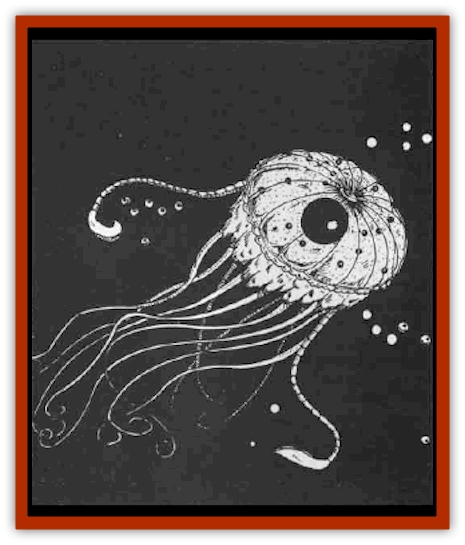

# Yphoz

| Statistic | **Yphoz** |
| --- | --- |
| **Activity Cycle:** | Any |
| **Alignment:** | Neutral evil |
| **Armor Class:** | 9 |
| **Climate/Terrain:** | Subterranean |
| **Damage/Attack:** | 1-6 |
| **Diet:** | Scavenger |
| **Frequency:** | Uncommon |
| **Hit Dice:** | 2 |
| **Intelligence:** | Animal (1) |
| **Magic Resistance:** | Nil |
| **Morale:** | Unreliable (2-4) |
| **Movement:** | 6, Sw 12 |
| **No. Appearing:** | 4-32 |
| **No. of Attacks:** | 1 |
| **Organization:** | Swarm |
| **Size:** | T (1-2' long) |
| **Special Attacks:** | Poison |
| **Special Defenses:** | Nil |
| **THAC0:** | 19 |
| **Treasure:** | Nil |
| **XP Value:** | 65 |

Yphoz appear in a variety ot shapes and sizes. Old adult yphoz may reach a length of 2'. Newborn young are typically 2-3" in diameter. They are composed of a gelatinous substance that matches the color of the water in which they live, ranging from black to varying shades of brown to varying shades of green or yellow. They may even be colorless. This feature makes them almost impossible to detect in their home pool (PCs in yphozinfested water rolling 4 or less on 1d6 are surprised).

A yphoz is typically shaped like a short, broad cone with a low dorsal fin, but its gelatinous composition allows it to vary this as necessary. They are not amorphous, but their bodies can change shape to allow for movement over almost any kind of surface, including traveling on land, up cave walls, and across ceilings. They also possess two long, whip-like tentacles. Their bodies excrete a sticky slime that helps them adhere to walls and ceilings. This slime will dry to a gummy substance on walls, floors, and ceilings, and a cave inhabited by a large number of yphoz will aquire a build-up of this elastic, gummy substance over time.

**Combat:** When a yphoz is in water and another creature swims within 20', the disturbance of the water will alert the yphoz to the presence of a potential meal. It will swim toward its victim and use its tentacles as "feelers" to locate its prey. Once it contacts something solid, it will swim in that direction and begin wrapping its tentacles around the victim. Should the victim start to swim in another direction, the yphoz can follow, towing itself on its unsuspecting meal.

The yphoz have no teeth, but are able to suck blood directly through a victim's skin, draining a victim of hit points. The gummy substance excreted by the yphoz will adhere to a victim even underwater, and contains a numbing contact poison. While the poison will not kill a victim, the numbness can cause a victim to lose muscle control, and if swimming, the victim could potentially drown. One yphoz can cause one limb or torso to become numb and useless in 3 rounds. Three yphoz can cause one limb to become numb and useless in one round. A victim may make a saving throw vs. poison to avoid these effects. The victim must save once per round for each yphoz it contacts. Once all yphoz are removed from the victim, the poison will wear off and the limb will function normally after 4-6 turns. If a victim's head is touched by a yphoz, the victim will fall unconscious after six unsuccessful saves (e.g. six yphoz contact it in one round, or one yphoz contacts it for six rounds, etc.)

When a yphoz hits a victim, the DM should roll 1d6 to determine which part of the victim's body was hit: 1 - head, 2 - right arm, 3 - left arm, 4 - torso, 5 - right leg, 6 - left leg.

**Habitat/Society:** A yphoz will never venture farther than 100 yards from its water source unless fleeing an attack or seeking a new habitat. It can survive no longer than 24 hours if isolated from water under damp conditions, and will die sooner if conditions are dry. A yphoz would probably survive no more than one hour in a desert setting.

Yphozs feed by absorbing organic matter, insects, and small worms. They also feed in the manner of a [[Leech|leech]], attaching themselves to a victim and sucking blood directly through the victim's skin. If a potential meal is too large to be absorbed, the yphoz will feed in this manner. A yphoz will feed on cold- and warm-blooded creatures alike, but cannot attach to animals with fur thicker than that of a rabbit. The yphoz also cannot feed on animals with hard scales (fish and snakes are in the yphoz's diet, but turtles are not).

**Ecology:** These slimy, filthy creatures make their homes in wet caves and pools of stagnant water. Their survival depends on a source of water, whether fresh or putrid.

---
## Discovery & Documentation

**Source Publication:** WGA2 Falconmaster (1990)
**Campaign Setting:** Greyhawk
**Author(s):** Richard W and Anne Brown

### Other Creatures Found in This Source Book
   * [[Strangleweed|Strangleweed]]
   * [[Weisshund|Weisshund]]
