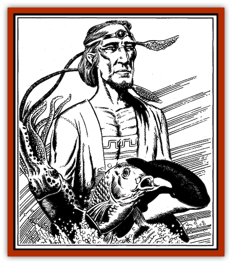
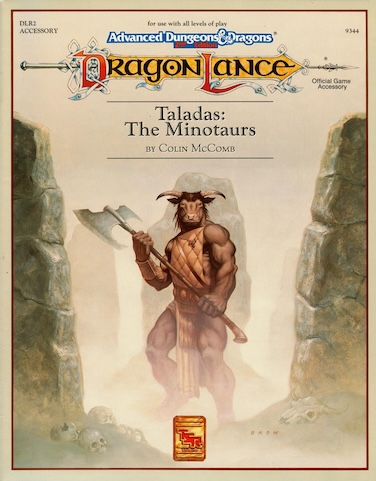

# Yrasda

| Statistic | **Aphelka** | **Thanic** | **Ushama** |
| --- | --- | --- | --- |
| **Activity Cycle:** | Any | Any | Any |
| **Alignment:** | Neutral | Any Evil | Any Good |
| **Armor Class:** | 8 | 7 | 5 |
| **Climate/Terrain:** | Temperate Salt Water | Subtropical Fresh Water | Any Salt Water |
| **Damage/Attack:** | By weapon or 1(x8), 1-4 | 1-6 | 3-12 |
| **Diet:** | Carnivore | Omnivore | Carnivore |
| **Frequency:** | Very Rare | Very Rare | Very Rare |
| **Hit Dice:** | 4 | 3 | 5 |
| **Intelligence:** | Very (11-12) | Very to High (11-14) | High (13-14) |
| **Magic Resistance:** | Nil | Nil | Nil |
| **Morale:** | Steady (11) | Average (10) | Elite (14) |
| **Movement:** | 12, Sw 3, jet 12 | 12, Sw 12 | Sw 18 |
| **No. Appearing:** | 1-2 | 1 | 2-12 |
| **No. of Attacks:** | 1 or 11 | 1 | 1 |
| **Organization:** | Solitary | Solitary | Pod |
| **Size:** | Humanoid form: M (5'); Squid form: S(4') | Humanoid form: M (5'); Carp form: S(3') | Humanoid form: M (6'); Killer Whale form: L (8') |
| **Special Attacks:** | See below | See below | See below |
| **Special Defenses:** | See below | See below | See below |
| **THAC0:** | 17 | 18 | 16 |
| **Treasure:** | Nil | Q | Q(U) |
| **XP Value:** | 270 | 270 | 650 |

Around the time of the Cataclysm, certain [[Ogre_High|irda]] underwent a transformation, becoming closely linked with the sea. These irda became the first of the yrasda, an irda-like race, whose members could transform themselves into one of three different sea creatures. Why these irda voluntarily underwent such changes is unknown, although some sages speculate that they were sea-faring irda who broke from their people to live permanently on and in the sea

Like irda, yrasda are shapeshifters, though each sub-race specializes in a single animal form, and can assume no other. Aphelka may take the form of squid, thanic may become a vicious and disgusting carp-like fish, and ushama can transform into killer whales (orca).

In their humanoid forms, yrasda look much like standard irda, with a slender build, silver eyes, and drooping eyelids. Thanic tend to have skin coloration of a deep sea green, while ushama have midnight blue skin, and aphelka can have any tone in between.

They are graceful and possess beautiful voices, but are not as peaceful as their irda antecedents. Aphelka are generally harmless, though they will fight to defend themselves. Thanic are vicious and aggressive predators, while ushama kill only what they need to eat.

**Combat:** On land, yrasda will fight with weapons, if possible, for they have lost their spell casting abilities. Ushama prefer swords, thanic prefer a dagger (hopefully in the back of their opponent), and aphelka maces. If they enter combat in the water, they will assume their animal forms.

In squid form, aphelka attack with their sharp beaks for 1-4 hit points of damage. In addition, they can attack with as many as eight tentacles for 1 point of damage each. Each tentacle which hits grasps the aphelka's opponent, constricting for 1-2 points of damage in subsequent rounds. A victim can free himself from a tentacle with a successful open doors roll. Otherwise, he will be somewhat disabled, being unable to cast spells and at -1 to attack rolls.

A thanic attacks with its bite, inflicting 1-6 points of damage with its sharp teeth.

Ushama also attack with their bite, although they fight only for food or if attacked first.

**Habitat/Society:** Yrasda are found throughout the oceans between Ansalon and Taladas. They seldom have lairs, preferring a nomadic existence, though aphelka and ushama will sometimes settle near a seacoast for a short while. Thanic are hostile to other humanoid life, but aphelka will sometimes enter into trade agreements with human, [[Minotaur|minotaur]], or irda communities

Ushama tend to be quite friendly toward other intelligent beings. They travel about in their tribe-like pods, and will usually aid any troubled traveler they find. Occasionally a pod or a single ushama will form a bond with a individual or even an entire town. Once such a bond is formed, only death will break it. Though the ushama will continue to wander the seas, it will always return to the town or person with whom it is bonded.

**Ecology:** Like irda, yrasda try to live in harmony with nature. However, they recognize themselves as part of nature, and will kill unintelligent animals (particularly fish) for food. Thanic are less concerned with their impact on nature than are other yrasda, and will frequently cause problems for fishermen by eating or driving away fish from a certain area. Yrasda are capable of making trade items from coral, shells, and pearls. Their most valuable trade item, though, is information regarding the fish population, sea currents, and weather patterns. Such information will often be traded for news of the world outside the waves or for part of a fisher’s catch

---
## Discovery & Documentation

**Source Publication:** DLR2 Taladas: The Minotaurs (1990)
**Campaign Setting:** Dragonlance
**Author(s):** Colin McComb

### Other Creatures Found in This Source Book
   * [[Child_of_the_Sea|Child of the Sea]]
   * [[Nymph_Grain|Nymph, Grain]]
