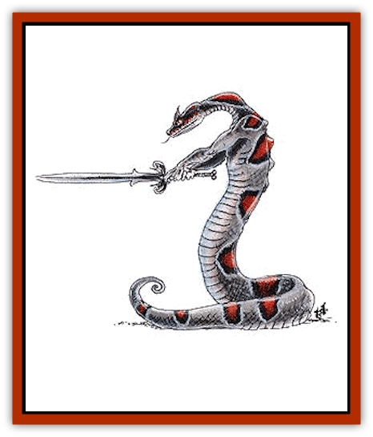

# Yuan-ti

| Statistic | **Yuan-ti** |
| --- | --- |
| **Activity Cycle:** | Any |
| **Alignment:** | Chaotic evil |
| **Armor Class:** | 4/0 |
| **Climate/Terrain:** | Tropical jungles |
| **Damage/Attack:** | See below |
| **Diet:** | Carnivore |
| **Frequency:** | Very rare |
| **Hit Dice:** | 6-9 |
| **Intelligence:** | Genius (17-18) |
| **Magic Resistance:** | 20% |
| **Morale:** | Elite (14) / Abominations: Champion (15) |
| **Movement:** | 12, slither 9 |
| **No. Appearing:** | 1-4 |
| **No. of Attacks:** | 2 |
| **Organization:** | Tribe or nation |
| **Size:** | M or L (10' long) |
| **Special Attacks:** | Spells |
| **Special Defenses:** | Nil |
| **THAC0:** | 6 HD: 15 / 7-8 HD: 13 / 9 HD: 11 |
| **Treasure:** | C |
| **XP Value:** | Varies |

**Psionics Summary**

| Level | Dis/Sci/Dev | Attack/Defense | Score | PSPs |
| --- | --- | --- | --- | --- |
| HD-2 | 3/level | MT,II/M-,IF,TW | =Int | 15xMult |

**Clairsentience -** *Sciences:* nil; *Devotions:* danger sense, feel sound, poison sense.

**Psychometabolism -** *Sciences:* animal affinity, metamorphosis; *Devotions:* chameleon power, chemical simulation, flesh armor.

**Telepathy -** *Sciences:* nil; *Devotions:* attraction, aversion, false sensory input, inflict pain, invincible foes, life detection, phobia amplification, post-hypnotic suggestion, repugnance, taste link.

Descendants of humans whose blood has been fouled, yuan-ti have varying degrees of [[Snake|snake]]like body parts. They are highly intelligent and evil, always plotting to advance their causes.

There are three major varieties of yuan-ti: purebloods, halfbreeds, and abominations. A pureblood can pass for human 80% of the time. It has only slight differences from true humans, such as slit eyes, or a forked tongue, maybe even small fangs. Halfbreeds are part human and part snake. Roll a d6 twice on the table below; a duplicate roll produces no result, but is not rerolled. Ignore unworkable combinations. This is a general guide; the DM can invent his own combinations of snake and human.

| Roll | Feature | Effect |
| --- | --- | --- |
| 1 | Snake head | Bites for 1-10 points damage |
| 2 | Flexible torso | +1 to saves using Dexterity |
| 3 | No legs, snake tail | Constricts for 1-4 points of damage |
| 4 | Snakes instead of arms | Each bites for 1-6 points damage |
| 5 | Scales instead of skin | Armor Class 0 |
| 6 | Legs and a snake tail | Constricts for 1-4 points of damage |

Abominations are either all snake (50%) or have only a single human feature, either head or arms, and are of large size (10 feet long). Halfbreeds and abominations disdain wearing human clothing or armor, while purebloods do not. All yuan-ti use weapons and other items. Yuan-ti do not give off an odor that humans can detect. However, animals will detect a dry, musty smell on them. The snake features of these foul creatures vary greatly from simple green and brown scales to wild patterns of stripes, diamonds, and whorls in reds and blues. Yuan-ti speak their own language. They can also speak with any snake or snakelike creature. Those with human heads speak common besides.

**Combat:** Yuan-ti are geniuses, and fight as such. They plan elaborate traps and utilize their surroundings superbly in combat. They prefer ambushes to direct confrontation. In a mixed group, the least valuable and powerful attack the opponent first. This means that the purebloods go before the half-breeds, which go before the abominations. The group leader may order particular members forward before others if it provides for a better strategy. When encountered outside their temple area, only one to four of them are in a group. In the temple area they can be found in much larger groups.

Purebloods have 6 Hit Dice, half-breeds have 7 or 8 Hit Dice, and abominations have 9 Hit Dice. All yuan-ti, if they have hands, always use weapons, preferring those with an edge. They use poison, particularly slow acting types, but in traps, not on weapons.

Any yuan-ti with a human head can cast the following spells once per day; *cause fear*,*darkness (15' radius)*, *snake charm*, *sticks to snakes*, *neutralize poison*, *suggestion*, and *polymorph other*.

**Habitat/Society:** Yuan-ti are devout worshippers of evil. They also hold all reptiles in high esteem. The center of yuan-ti life is the temple. They tend toward old ruins far away from man, but have even been known to build underneath human cities. Their own works tend toward circles, with ramps and poles replacing stairs. In all cases they are secretive about the location of their city or temple. The abominations rule over the yuan-ti, and are the leaders of the temple, with the high priest (human-headed) ruling over all. Their rituals often involve bloody sacrifices. The purebloods take care of all outside negotiations, always pretending to be human. Yuan-ti speak their own language and common.

**Ecology:** Ages ago, a cult of humans worshiping a reptilian elder god recieved a "blessing" from their dark lord: their offspring all were part snake. Since then the breeding line has been polluted and mixed, producing purebloods (those least favored), half-breeds, and abominations (the truly blessed). They are strictly carnivorous, eating any warm-blooded creature they can catch. They have a special taste for birds and human flesh. They are clever enough about their ecology not to overhunt any particular region. Larger groups keep captive herds of wingless birds or other warm-blooded creatures.

---
## Discovery & Documentation

**Source Publication:** MC1 Volume I (w/binder #1) (1991)
**Campaign Setting:** Advanced Dungeons & Dragons 2nd Edition
**Author(s):** Jay Batista, Scott Bennie, Grant Boucher, William W. Connors, Steve Gilbert, Heike Kubasch, James Lowder, David Edward Martin, Bruce Nesmith, Jean Rabe, Rick Swan, John J. Terra, Gary L. Thomas

### Other Creatures Found in This Source Book
   * [[Bat|Bat]]
   * [[Bear|Bear]]
   * [[Behir|Behir]]
   * [[Boar|Boar]]
   * [[Bookworm|Bookworm]]
   * [[Brownie|Brownie]]
   * [[Bugbear|Bugbear]]
   * [[Carrion_Crawler|Carrion Crawler]]
   * [[Cat_Great|Cat, Great]]
   * [[Catoblepas|Catoblepas]]
   * [[Dragon_General_Information|Dragon, General Information]]
   * [[Dragonfish|Dragonfish]]
   * [[Elemental_Air_Kin_Aerial_Servant|Elemental, Air Kin, Aerial Servant]]
   * [[Elemental_Earth_Kin_Sandling|Elemental, Earth Kin, Sandling]]
   * [[Elephant|Elephant]]
   * [[Gnoll|Gnoll]]
   * [[Hobgoblin|Hobgoblin]]
   * [[Homunculus|Homunculus]]
   * [[Hornet_Giant|Hornet, Giant]]
   * [[Horse|Horse]]
   * [[Hyena|Hyena]]
   * [[Jackal|Jackal]]
   * [[Jackalwere|Jackalwere]]
   * [[Korred|Korred]]
   * [[Lich|Lich]]
   * [[Lizard|Lizard]]
   * [[Lizard_Man|Lizard Man]]
   * [[Lycanthrope_General_Information|Lycanthrope, General Information]]
   * [[Lycanthrope_Seawolf|Lycanthrope, Seawolf]]
   * [[Lycanthrope_Werebear|Lycanthrope, Werebear]]
   * [[Lycanthrope_Weretiger|Lycanthrope, Weretiger]]
   * [[Lycanthrope_Werewolf|Lycanthrope, Werewolf]]
   * [[Manticore|Manticore]]
   * [[Medusa|Medusa]]
   * [[Mind_Flayer|Mind Flayer]]
   * [[Minotaur|Minotaur]]
   * [[Mudman|Mudman]]
   * [[Mummy|Mummy]]
   * [[Nixie|Nixie]]
   * [[Nymph|Nymph]]
   * [[Ogre|Ogre]]
   * [[Ooze_Slime_Jelly_I|Ooze/Slime/Jelly I]]
   * [[Ooze_Slime_Jelly_II|Ooze/Slime/Jelly II]]
   * [[Orc|Orc]]
   * [[Owl|Owl]]
   * [[Owlbear_I|Owlbear I]]
   * [[Pegasus|Pegasus]]
   * [[Piercer|Piercer]]
   * [[Pudding_Deadly|Pudding, Deadly]]
   * [[Rakshasa|Rakshasa]]
   * [[Rat|Rat]]
   * [[Ray|Ray]]
   * [[Remorhaz|Remorhaz]]
   * [[Satyr|Satyr]]
   * [[Scorpion|Scorpion]]
   * [[Selkie|Selkie]]
   * [[Shadow|Shadow]]
   * [[Skeleton|Skeleton]]
   * [[Skunk|Skunk]]
   * [[Snake|Snake]]
   * [[Spectre|Spectre]]
   * [[Spider|Spider]]
   * [[Sprite|Sprite]]
   * [[Toad_Giant|Toad, Giant]]
   * [[Treant|Treant]]
   * [[Troll|Troll]]
   * [[Umber_Hulk|Umber Hulk]]
   * [[Unicorn|Unicorn]]
   * [[Vampire|Vampire]]
   * [[Wight|Wight]]
   * [[Will_O'Wisp|Will O'Wisp]]
   * [[Wolf|Wolf]]
   * [[Wolfwere|Wolfwere]]
   * [[Wraith|Wraith]]
   * [[Wyvern|Wyvern]]
   * [[Yeti|Yeti]]
   * [[Zombie|Zombie]]
