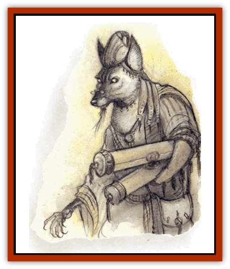

# Yugoloth - Greater - Arcanaloth

| Statistic | **Yugoloth, Greater, Arcanaloth** |
| --- | --- |
| **Activity Cycle:** | Any |
| **Alignment:** | Neutral evil |
| **Armor Class:** | -8 |
| **Climate/Terrain:** | Lower Planes |
| **Damage/Attack:** | 1d4/1d4/2d6 |
| **Diet:** | Carnivore |
| **Frequency:** | Very rare |
| **Hit Dice:** | 12+24 |
| **Intelligence:** | Genius (17-18) |
| **Magic Resistance:** | 60% |
| **Morale:** | Champion (15-16) |
| **Movement:** | 12, Fl 18 (B) |
| **No. Appearing:** | 1-3 |
| **No. of Attacks:** | 3 |
| **Organization:** | Solitary |
| **Size:** | M (6' tall) |
| **Special Attacks:** | Claw, sting |
| **Special Defenses:** | +3 or better weapons to hit, spell immunity |
| **THAC0:** | 9 |
| **Treasure:** | H |
| **XP Value:** | 20,000 |

Arcanaloths keep records and execute contracts for the [[Yugoloth_General_Information|yugoloths]]. All transactions for services rendered in the Blood War go through them. As yugoloths go, they are a civilized breed.

An arcanaloth looks like a robed human with the head of a fanged [[Jackal|jackal]] or [[Dog|war dog]]. Arcanaloths usually snarl and wear expressions of hatred. However, they keep themselves well groomed and dressed.

As speakers for their race, arcanaloths can speak and write all languages.

**Combat:** Arcanaloth cannot be surprised on the Lower Planes. All arcanaloths have the abilities of a 12th-level mage. They commonly memorize destructive spells, but they keep a wise eye on their escape and defensive spells for good measure.

In addition to those available to all yugoloths, arcanaloths have the following spell-like powers: *advanced illusion* (once per day), *continual darkness*, *control temperature (10' radius)*, *fear* (once per day), *fly* (unlimited duration), *heat metal*, *invisibility*, *magic missile*, *shape change* to any humanoid form, *telekinesis*, and *warp wood*. Arcanaloth are extremely intelligent and use these spell-like abilities to best advantage.

In general, arcanaloths avoid hand-to-hand combat, but they can attack with two stinging, poisonous claws (1d4 damage each and a - 1 penalty, cumulative per hit, on attack rolls). *Bless*, *neutralize poison* or *slow poison* eliminates the attack penalty; otherwise, effects are permanent. Arcanaloths can also bite (2d6 damage).

Once a day an arcanaloth can attempt to *gate* in 1-6 [[Yugoloth_Lesser_Mezzoloth|mezzoloths]], 1-2 [[Yugoloth_Lesser_Dergoloth|dergholoths]], or 1 arcanaloth, with a 40% chance of success.

Arcanaloths are harmed only by weapons of +3 or greater enchantment. Due to their enchanted nature, arcanaloths are immune to mind-affecting spells. They are destroyed only if they die on the plane of Gehenna, their source of power.

**Habitat/Society:** Arcanaloths negotiate all bargains with [[Baatezu_General_Information|baatezu]] and [[Tanar'ri_General_Information|tanar'ri]] and play the two sides against each other with practiced ease. They openly discuss one side's offers with its enemy in hopes of raising the stakes. For example, a baatezu force attempting to siege the Lakes of Molten Iron on the first layer of the Abyss tries to hire the yugoloths for 1,000 mortal life forces and the power of death for one year. The arcanaloth agent goes to the tanar'ri and tells them the offer. Usually the tanar'ri make a counter-offer for the yugoloths to help them defend against the baatezu.

**Ecology:** Arcanaloths, like all yugoloths, play a casual role in the Blood War. They trade and scheme for mercenary success, not out of "racial pride," but for personal wealth and power. Arcanaloths have randomly determined spellbooks.

An incantation in *The Book of Keeping* describes the creation of a potion that grants success in any venture. The potion requires a shred of flesh from the heart of an arcanaloth. Its efficacy is unknown.

Arcanaloths dwell in the plane of Gehenna, where they draw power from the furnaces there. They seldom leave the plane, and then only briefly.

---
## Discovery & Documentation

**Source Publication:** MC8 Outer Planes Appendix (1990)
**Campaign Setting:** Planescape
**Author(s):** Timothy B. Brown, Jamie LaFountain

### Other Creatures Found in This Source Book
   * [[Aasimon_Agathinon|Aasimon, Agathinon]]
   * [[Aasimon_Deva|Aasimon, Deva]]
   * [[Aasimon_Light|Aasimon, Light]]
   * [[Aasimon_General_Information|Aasimon, General Information]]
   * [[Aasimon_Planetar|Aasimon, Planetar]]
   * [[Aasimon_Solar|Aasimon, Solar]]
   * [[Air_Sentinel|Air Sentinel]]
   * [[Animal_Lord|Animal Lord]]
   * [[Archon|Archon]]
   * [[Baatezu_Lesser_Abishai|Baatezu, Lesser, Abishai]]
   * [[Baatezu_Greater_Amnizu|Baatezu, Greater, Amnizu]]
   * [[Baatezu_Lesser_Barbazu|Baatezu, Lesser, Barbazu]]
   * [[Baatezu_Greater_Cornugon|Baatezu, Greater, Cornugon]]
   * [[Baatezu_Lesser_Erinyes|Baatezu, Lesser, Erinyes]]
   * [[Baatezu_General_Information|Baatezu, General Information]]
   * [[Baatezu_Greater_Gelugon|Baatezu, Greater, Gelugon]]
   * [[Baatezu_Lesser_Hamatula|Baatezu, Lesser, Hamatula]]
   * [[Baatezu_Lemure|Baatezu, Lemure]]
   * [[Baatezu_Least_Nupperibo|Baatezu, Least, Nupperibo]]
   * [[Baatezu_Lesser_Osyluth|Baatezu, Lesser, Osyluth]]
   * [[Baatezu_Greater_Pit_Fiend|Baatezu, Greater, Pit Fiend]]
   * [[Baatezu_Least_Spinagon|Baatezu, Least, Spinagon]]
   * [[Balaena|Balaena]]
   * [[Bariaur|Bariaur]]
   * [[Bebilith|Bebilith]]
   * [[Bodak|Bodak]]
   * [[Dog_Moon|Dog, Moon]]
   * [[Dragon_Adamantite|Dragon, Adamantite]]
   * [[Einheriar|Einheriar]]
   * [[Gehreleth|Gehreleth]]
   * [[Githyanki|Githyanki]]
   * [[Githzerai|Githzerai]]
   * [[Hordling|Hordling]]
   * [[Lammasu_Celestial|Lammasu, Celestial]]
   * [[Larva|Larva]]
   * [[Maelephant|Maelephant]]
   * [[Marut|Marut]]
   * [[Mediator|Mediator]]
   * [[Mortai|Mortai]]
   * [[Night_Hag|Night Hag]]
   * [[Nightmare|Nightmare]]
   * [[Noctral|Noctral]]
   * [[Per|Per]]
   * [[Phoenix|Phoenix]]
   * [[Slaad|Slaad]]
   * [[Tanar'ri_Greater_Babau|Tanar'ri, Greater, Babau]]
   * [[Tanar'ri_Greater_Chasme|Tanar'ri, Greater, Chasme]]
   * [[Tanar'ri_Greater_Nabassu|Tanar'ri, Greater, Nabassu]]
   * [[Tanar'ri_Least_Dretch|Tanar'ri, Least, Dretch]]
   * [[Tanar'ri_Least_Manes|Tanar'ri, Least, Manes]]
   * [[Tanar'ri_Least_Rutterkin|Tanar'ri, Least, Rutterkin]]
   * [[Tanar'ri_Lesser_Alu-Fiend|Tanar'ri, Lesser, Alu-Fiend]]
   * [[Tanar'ri_Lesser_Bar-Lgura|Tanar'ri, Lesser, Bar-Lgura]]
   * [[Tanar'ri_Lesser_Cambion|Tanar'ri, Lesser, Cambion]]
   * [[Tanar'ri_Lesser_Succubus|Tanar'ri, Lesser, Succubus]]
   * [[Tanar'ri_Guardian_Molydeus|Tanar'ri, Guardian, Molydeus]]
   * [[Tanar'ri_General_Information|Tanar'ri, General Information]]
   * [[Tanar'ri_True_Balor|Tanar'ri, True, Balor]]
   * [[Tanar'ri_True_Glabrezu|Tanar'ri, True, Glabrezu]]
   * [[Tanar'ri_True_Hezrou|Tanar'ri, True, Hezrou]]
   * [[Tanar'ri_True_Marilith|Tanar'ri, True, Marilith]]
   * [[Tanar'ri_True_Nalfeshnee|Tanar'ri, True, Nalfeshnee]]
   * [[Tanar'ri_True_Vrock|Tanar'ri, True, Vrock]]
   * [[Titan|Titan]]
   * [[Translator|Translator]]
   * [[T'uen-rin|T'uen-rin]]
   * [[Vaporighu|Vaporighu]]
   * [[Warden_Beast|Warden Beast]]
   * [[Yugoloth_Lesser_Dergoloth|Yugoloth, Lesser, Dergoloth]]
   * [[Yugoloth_Lesser_Hydroloth|Yugoloth, Lesser, Hydroloth]]
   * [[Yugoloth_General_Information|Yugoloth, General Information]]
   * [[Yugoloth_Lesser_Mezzoloth|Yugoloth, Lesser, Mezzoloth]]
   * [[Yugoloth_Greater_Nycaloth|Yugoloth, Greater, Nycaloth]]
   * [[Yugoloth_Lesser_Piscoloth|Yugoloth, Lesser, Piscoloth]]
   * [[Yugoloth_Greater_Ultroloth|Yugoloth, Greater, Ultroloth]]
   * [[Yugoloth_Lesser_Yagnoloth|Yugoloth, Lesser, Yagnoloth]]
   * [[Zoveri|Zoveri]]
