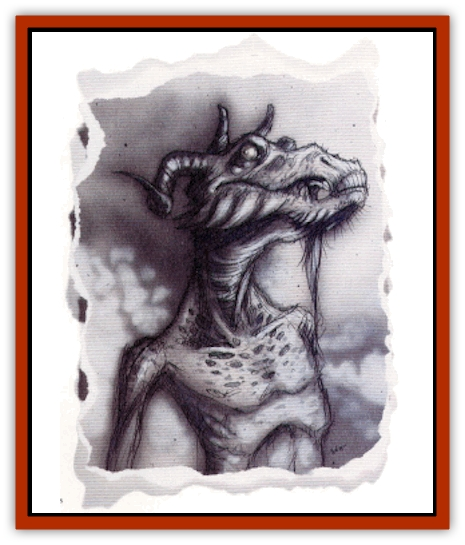

# Yugoloth - Greater - Baernaloth

| Statistic | **Yugoloth, Greater, Baernaloth** |
| --- | --- |
| **Activity Cycle:** | Any |
| **Alignment:** | Neutral evil |
| **Armor Class:** | -4 |
| **Climate/Terrain:** | The Grey Waste |
| **Damage/Attack:** | 1d8/1d8/2d6 |
| **Diet:** | Omnivore |
| **Frequency:** | Rare |
| **Hit Dice:** | 11+22 |
| **Intelligence:** | High to exceptional (13-16) |
| **Magic Resistance:** | 50% |
| **Morale:** | Elite (14) |
| **Movement:** | 12 |
| **No. Appearing:** | 1 |
| **No. of Attacks:** | 3 |
| **Organization:** | Solitary |
| **Size:** | L (8' tall) |
| **Special Attacks:** | Spells, reopen wounds |
| **Special Defenses:** | Spells, immunities |
| **THAC0:** | 9 |
| **Treasure:** | R,H |
| **XP Value:** | 19,000 |

Long, gangly limbs covered by purulent gray flesh; an over-sized, horned head with an obscene mouth comprising nothing but teeth and tongue; distant, glazed yellow eyes dripping fluid far more vile than tears - all these things are a baernaloth, yet it is more. The essence of the creature is callous detatchment, never seeing the suffering and pain that it ceaselessly creates; an unending, unsatiable need for misery and affliction; a monster that mechanically, methodically hurts, harms, foils, impairs, and hinders all other creatures.

In many ways, the baernaloths are the outcasts among the ranks of the [[Yugoloth_General_Information|yugoloths]]. They rarely associate with other yugoloths, and are always found on the Gray Waste, never on Gehenna, where so many of the others have migrated. Some people wonder it perhaps the baernaloths are not true yugoloths at all, but rather some older, even more primal creatures. If this is true, baernaloth and yugoloth alike are propagating some sort of intentional deception (not that such a thing is at all inconceivable.

As "greater" yugoloths, baernaloths may be the weakest of their type when it comes to sheer might. Nevertheless, they are afforded a great deal of respect from their kind (when the rare occasion occurs and they actually come upon other yugoloths) - far more than their physical or magical power would warrant, for reasons unknown.

**Combat:** In hand-to-hand combat, the baernaloth rakes with its savage claws (1d8 points of damage per strike) and rears at its foes with its huge mouth (2d6 points of damage). Baernaloths never use weapons or equipment of any kind, even magical items. Accompanying these physical attacks, however, are two strange powers relating to the baernaloth's goal of causing pain and spreading misery. Three times per day, the creature can cause wounds created by his claws and mouth to worsen, tearing open painfully. With this attack, the baernaloth can wreak the same amount of damage that he has previously inflicted upon a foe in one round sometime during the last 24 hours. For example, if a baernalolh uses his claws and bite to inflict 13 points of damage upon a foe and then casts him into a dungeon, the baernaloth can return anytime within the next day and instantly indict 13 additional points of damage upon that particular foe. There is no saving throw against this ability (although magic resistance still applies), but the target must be within 10 yards, and within sight. This ability can be used in addition to the baernaloth's normal attacks during a single round.

Conversely, a baernaloth can instantly heal any or all damage that it inflicts. This can be done as often as it likes. with a range of 10 yards. It uses this ability to keep captives - and even foes in battle - alive so that the fiend can continue to inflict pain. Obviously, the baernaloth is intelligent enough to keep from using this ability in a way whlch puts itself in jeopard (by healing its opponents too much, for example).

In addition to the powers inherent to all yugoloths (*alter self*, *cause disease*, *charm person*, *improved phantasmal force*, *produce flame*, and *teleport without error*), baernaloths can use the following spell-like powers once per round, at will: *darkness 15-foot radius*, *detect lie*, *detect magic*, *emotion*, *fear*, *suggestion*, *cloudkill* (3 times/day), *true seeing* (3 times/day), *symbol* (1 time/day), and *demand* (1 time/day). As all yugoloths, baernaloths are immune to the effects of acid, magical and normal fire, iron weapons, and poison. They suffer only half normal damage from cold-based attacks. Magical weapons are required to harm a baernaloth.

**Habitat/Society:** Usually found alone, baernaloths sometimes have [[Nightmare|nightmares]] or even [[Night_Hag|night hags]] as companions. Baernaloths like to lair in twisted, forbidding towers in areas desolate even by the standards of the Gray Waste. Although the arcanaloths are the scholars and record-keepers of the yugoloth ranks, baernaloths are said to be in the possession of mysterious and varied secrets. They certainly seem to know more about fiends of all types, and lower-planar creatures in general, than any other singular source. More than anything else, though, baernaloths see their place in the scheme of things as bringers of misery and pain. They specialize in torture, not as a means of interrogation, but as agony for agony's sake.

Emotionlessly, coldly, they bring anguish upon others. Oftentimes they find means other than simple physical pain to accomplish this end. Baernaloths seem to relish folling well-laid plans, spreading vicious lies, and revealing sinister secrets in order to cause dismay. All the while, these creatures of evil stare at their victims with a chillingly disturbing detachment. Baernaloths take no apparent pleasure in their work, yet certainly show no regret.

**Ecology:** Rellian Whi'ys was a sage and scholar whose theories on the planes are still studied by today's learned scholars. In her treatises on the Lower Planes, she contemplated the fiends that inhabited them as a whole. The [[Tanar'ri_General_Information|tanar'ri]] she saw as the destroyers, tearing apart things both literally and morally. The [[Baatezu_General_Information|baatezu]], she said, were the subjugators, again both in a literal sense and morally as well. These she saw as the ends of the dark spectrum of evil. (The organization among the tanar'ri ranks and the destructive nature of many baatezu are, of course, convincing arguments that her theories are far too simplistic).

The yugoloths, Rellian thought, were the true force of pure evil on the Lower Planes. She saw them as a representation of suffering (at worst) and cold, unfeeling detachment (at best). The baernaloths, perhaps more than the rest of their brethren, epitomize Rellian's views of the multiverse. They see the actions taken by the other yugoloths, making moves to control things around them, and scoff at their plans and schemes.

Strangely, the *Book of Keeping* makes no mention whatsoever of the baernaloth.

**The Demented**

  Apparently, madness is not an affliction to which baernaloths are immune. It is unusual, but not unknown, to see a baernaloth commanding a brigade of mixed fiends in a Blood War skirmish. Likewise, at least one baernaloth serves as advisor and confidant to the most prominent [[Yugoloth_Greater_Ultroloth|ultroloth]] masters. These baernaloths are referred to as the Demented. Their madness is not a raving, hysterical insanity, but an insidiousm, mind-altering malady.

The Demented, individually or in a group, decide that they are going to attempt to control the events around them, subtly subjugating the creatures of the Lower Planes while plotting the destruction of all things. Somehow, they have decided to embrace both of the ends of the ethical spectrum, seeking rigid order and utter devastation at the same time. Although they are the exceptions (to what are already the exceptions among yugoloths), these baernaloths are actually the ones most likely to be encountered by player characters, since most baernaloths are reclusive and generally inactive.

---
## Discovery & Documentation

**Source Publication:** Planes of Conflict (1995)
**Campaign Setting:** Planescape
**Author(s):** Colin Mccomb, Dale Donovan

### Other Creatures Found in This Source Book
   * [[Aeserpent|Aeserpent]]
   * [[Asuras|Asuras]]
   * [[Buraq|Buraq]]
   * [[Delphon|Delphon]]
   * [[Diakk|Diakk]]
   * [[Ethyk|Ethyk]]
   * [[Gautiere|Gautiere]]
   * [[Linqua|Linqua]]
   * [[Ni'iath|Ni'iath]]
   * [[Phiuhl|Phiuhl]]
   * [[Quesar|Quesar]]
   * [[Slasrath|Slasrath]]
   * [[Warden_Beast|Warden Beast]]
