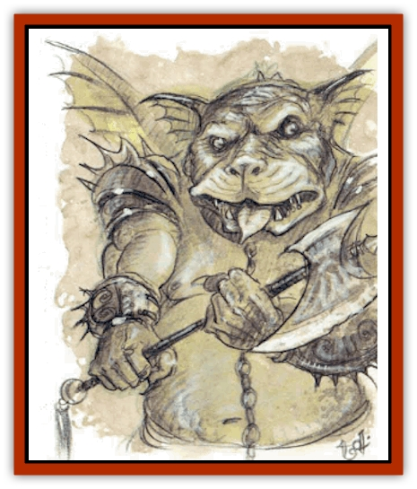
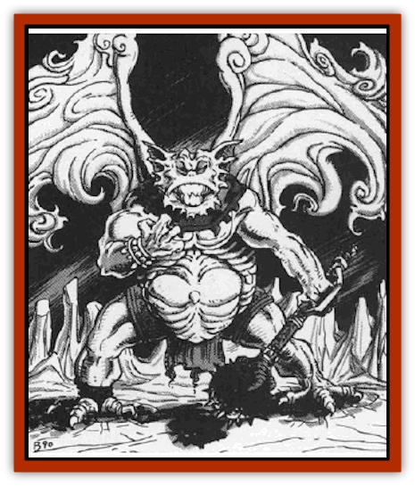

# Yugoloth - Greater - Nycaloth

| Statistic | **Yugoloth, Greater, Nycaloth** |
| --- | --- |
| **Activity Cycle:** | Any |
| **Alignment:** | Neutral evil |
| **Armor Class:** | -6 |
| **Climate/Terrain:** | Lower Planes |
| **Damage/Attack:** | 1d8+8/1d8+8 or by weapon +8 (Strength bonus) |
| **Diet:** | Carnivore |
| **Frequency:** | Very rare |
| **Hit Dice:** | 11+22 |
| **Intelligence:** | Exceptional to genius (15-18) |
| **Magic Resistance:** | 70% |
| **Morale:** | Champion (15-16) |
| **Movement:** | 12, Fl 36 (C) |
| **No. Appearing:** | 1 (rarely 2) |
| **No. of Attacks:** | 2 or 1 weapon at +3 |
| **Organization:** | Solitary |
| **Size:** | L (9' tall and broad) |
| **Special Attacks:** | Magical axe, bleeding |
| **Special Defenses:** | Spell immunity, +2 or better weapons to hit |
| **THAC0:** | 9 |
| **Treasure:** | Q&times;10,X |
| **XP Value:** | 25,000 |

Observers and reporters, nycaloths reconnoiter the Lower Planes and observe the Blood War.

Nycaloths look like fiends in their characteristic [[Gargoyle_I|gargoyle]]-like appearance. They are hulking, broad humanoids with powerful limbs and wings; thick, light green skin with a leathery texture; and sharp, thick claws that make excellent weapons.

Nycaloths communicate using telepathy.

**Combat:** Nycaloths commonly use giant two-headed axes (2d8+8 damage). Nine out of ten of these axes are magical, though of common variety (+1, +2, etc.) Of the enchanted axes, 20% have a special enchantment (e.g. vorpal, etc.) Determine the qualities of special blades randomly. Often (75%) nycaloths use shields as well. Their great strength gives nycaloths a +3 bonus to their attack rolls.

Nycaloths can attack with two claws (1d8+8 damage each). These wicked claws cause seeping wounds that continue to bleed for 1d6 damage per wound per round until healed magically (*cure light wounds*, etc.)

In addition to those available to all [[Yugoloth_General_Information|yugoloths]], nycaloths also have the following spell-like powers: *command* (3 times per day), *comprehend languages* (always active), *detect invisibility* (always active), *detect magic* (always active), *dimension door* (3 times per day), *dispel magic*, *enlarge* (or its reverse, *reduce*), *fear* (by touch), *invisibility*, *mirror image* (3 times per day), *polymorph self*, *project image*, *read magic* (always active), *reverse gravity* (once per day), *wind walk*, *word of recall* (once per day), and *wraithform* (once per day). Once per day nycaloths can attempt to *gate* in 1-10 [[Yugoloth_Lesser_Mezzoloth|mezzoloths]], 1-3 [[Yugoloth_Lesser_Dergoloth|dergholoths]], or 1 additional nycaloth. The gate has a 35% chance of success.

Enchantment/charm spells never affect nycaloths. They are immune to weapons of less than +2 enchantment.

**Habitat/Society:** Nycaloths act in a careful and calculating manner to maximize their personal power and safety. These creatures serve as scouts because they can travel the Lower Planes at will, viewing battles between the [[Baatezu_General_Information|baatezu]] and [[Tanar'ri_General_Information|tanar'ri]]. They report their findings to the [[Yugoloth_Greater_Arcanaloth|arcanaloths]], who use the information in negotiating contracts.

Though powerful, nycaloths endure low status because their information goes to profit others, not themselves. Nycaloths are bitter and jealous of the status of the other greater yugoloths. They scheme constantly to increase their status, often bullying lesser yugoloths to get attention. Sometimes they destroy whole companies of mezzoloths and dergholoths in a fit of rage.

**Ecology:** Female and male nycaloths are nearly identical, impossible for others to tell apart. Mated pairs give birth to three young at a time. These young are allowed to grow for 100 days, at which time they are pitted against each other in a battle to the death. Only the victor is allowed to grow to maturity.

Nycaloths are carnivores, but may have once been scavengers, inasmuch as they prefer rotting flesh to fresh meat.

---
## Discovery & Documentation

**Source Publication:** MC8 Outer Planes Appendix (1990)
**Campaign Setting:** Planescape
**Author(s):** Timothy B. Brown, Jamie LaFountain

### Other Creatures Found in This Source Book
   * [[Aasimon_Agathinon|Aasimon, Agathinon]]
   * [[Aasimon_Deva|Aasimon, Deva]]
   * [[Aasimon_Light|Aasimon, Light]]
   * [[Aasimon_General_Information|Aasimon, General Information]]
   * [[Aasimon_Planetar|Aasimon, Planetar]]
   * [[Aasimon_Solar|Aasimon, Solar]]
   * [[Air_Sentinel|Air Sentinel]]
   * [[Animal_Lord|Animal Lord]]
   * [[Archon|Archon]]
   * [[Baatezu_Lesser_Abishai|Baatezu, Lesser, Abishai]]
   * [[Baatezu_Greater_Amnizu|Baatezu, Greater, Amnizu]]
   * [[Baatezu_Lesser_Barbazu|Baatezu, Lesser, Barbazu]]
   * [[Baatezu_Greater_Cornugon|Baatezu, Greater, Cornugon]]
   * [[Baatezu_Lesser_Erinyes|Baatezu, Lesser, Erinyes]]
   * [[Baatezu_General_Information|Baatezu, General Information]]
   * [[Baatezu_Greater_Gelugon|Baatezu, Greater, Gelugon]]
   * [[Baatezu_Lesser_Hamatula|Baatezu, Lesser, Hamatula]]
   * [[Baatezu_Lemure|Baatezu, Lemure]]
   * [[Baatezu_Least_Nupperibo|Baatezu, Least, Nupperibo]]
   * [[Baatezu_Lesser_Osyluth|Baatezu, Lesser, Osyluth]]
   * [[Baatezu_Greater_Pit_Fiend|Baatezu, Greater, Pit Fiend]]
   * [[Baatezu_Least_Spinagon|Baatezu, Least, Spinagon]]
   * [[Balaena|Balaena]]
   * [[Bariaur|Bariaur]]
   * [[Bebilith|Bebilith]]
   * [[Bodak|Bodak]]
   * [[Dog_Moon|Dog, Moon]]
   * [[Dragon_Adamantite|Dragon, Adamantite]]
   * [[Einheriar|Einheriar]]
   * [[Gehreleth|Gehreleth]]
   * [[Githyanki|Githyanki]]
   * [[Githzerai|Githzerai]]
   * [[Hordling|Hordling]]
   * [[Lammasu_Celestial|Lammasu, Celestial]]
   * [[Larva|Larva]]
   * [[Maelephant|Maelephant]]
   * [[Marut|Marut]]
   * [[Mediator|Mediator]]
   * [[Mortai|Mortai]]
   * [[Night_Hag|Night Hag]]
   * [[Nightmare|Nightmare]]
   * [[Noctral|Noctral]]
   * [[Per|Per]]
   * [[Phoenix|Phoenix]]
   * [[Slaad|Slaad]]
   * [[Tanar'ri_Greater_Babau|Tanar'ri, Greater, Babau]]
   * [[Tanar'ri_Greater_Chasme|Tanar'ri, Greater, Chasme]]
   * [[Tanar'ri_Greater_Nabassu|Tanar'ri, Greater, Nabassu]]
   * [[Tanar'ri_Least_Dretch|Tanar'ri, Least, Dretch]]
   * [[Tanar'ri_Least_Manes|Tanar'ri, Least, Manes]]
   * [[Tanar'ri_Least_Rutterkin|Tanar'ri, Least, Rutterkin]]
   * [[Tanar'ri_Lesser_Alu-Fiend|Tanar'ri, Lesser, Alu-Fiend]]
   * [[Tanar'ri_Lesser_Bar-Lgura|Tanar'ri, Lesser, Bar-Lgura]]
   * [[Tanar'ri_Lesser_Cambion|Tanar'ri, Lesser, Cambion]]
   * [[Tanar'ri_Lesser_Succubus|Tanar'ri, Lesser, Succubus]]
   * [[Tanar'ri_Guardian_Molydeus|Tanar'ri, Guardian, Molydeus]]
   * [[Tanar'ri_General_Information|Tanar'ri, General Information]]
   * [[Tanar'ri_True_Balor|Tanar'ri, True, Balor]]
   * [[Tanar'ri_True_Glabrezu|Tanar'ri, True, Glabrezu]]
   * [[Tanar'ri_True_Hezrou|Tanar'ri, True, Hezrou]]
   * [[Tanar'ri_True_Marilith|Tanar'ri, True, Marilith]]
   * [[Tanar'ri_True_Nalfeshnee|Tanar'ri, True, Nalfeshnee]]
   * [[Tanar'ri_True_Vrock|Tanar'ri, True, Vrock]]
   * [[Titan|Titan]]
   * [[Translator|Translator]]
   * [[T'uen-rin|T'uen-rin]]
   * [[Vaporighu|Vaporighu]]
   * [[Warden_Beast|Warden Beast]]
   * [[Yugoloth_Greater_Arcanaloth|Yugoloth, Greater, Arcanaloth]]
   * [[Yugoloth_Lesser_Dergoloth|Yugoloth, Lesser, Dergoloth]]
   * [[Yugoloth_Lesser_Hydroloth|Yugoloth, Lesser, Hydroloth]]
   * [[Yugoloth_General_Information|Yugoloth, General Information]]
   * [[Yugoloth_Lesser_Mezzoloth|Yugoloth, Lesser, Mezzoloth]]
   * [[Yugoloth_Lesser_Piscoloth|Yugoloth, Lesser, Piscoloth]]
   * [[Yugoloth_Greater_Ultroloth|Yugoloth, Greater, Ultroloth]]
   * [[Yugoloth_Lesser_Yagnoloth|Yugoloth, Lesser, Yagnoloth]]
   * [[Zoveri|Zoveri]]
