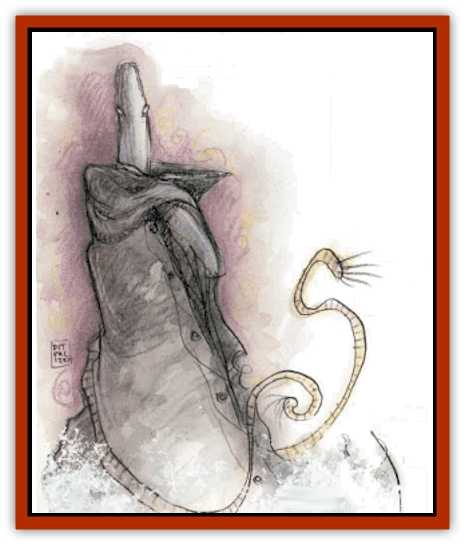
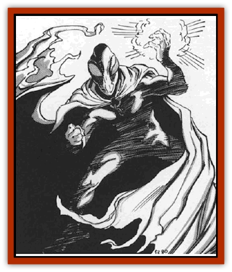

# Yugoloth - Greater - Ultroloth

| Statistic | **Yugoloth, Greater, Ultroloth** |
| --- | --- |
| **Activity Cycle:** | Any |
| **Alignment:** | Neutral evil |
| **Armor Class:** | -8 |
| **Climate/Terrain:** | Lower Planes |
| **Damage/Attack:** | 1d12/1d12 or by weapon +9 (Strength bonus) |
| **Diet:** | Carnivore |
| **Frequency:** | Very rare |
| **Hit Dice:** | 13+26 |
| **Intelligence:** | Supra-genius (19-20) |
| **Magic Resistance:** | 60% |
| **Morale:** | Champion (15-16) |
| **Movement:** | 15, Fl 15 (C), Sw 15 |
| **No. Appearing:** | 1 |
| **No. of Attacks:** | 2 |
| **Organization:** | Solitary |
| **Size:** | M (6½' tall) |
| **Special Attacks:** | Magical weapon, gaze of fascination |
| **Special Defenses:** | +3 or better weapons to hit, never surprised |
| **THAC0:** | 7 |
| **Treasure:** | G,R |
| **XP Value:** | 26,000 |

Ultroloths are the strange, enigmatic rulers of the [[Yugoloth_General_Information|yugoloths]]. These creatures hold sway over their underlings by force of will and a reputation for cruelty.

These ruling yugoloths appear as faceless humanoids with large eyes that resemble fire-opals. They have dark gray skin and typically wear flowing capes or cloaks.

Ultroloths communicate using telepathy.

**Combat:** Ultroloths, though evil, are cerebral and reserved. They rarely enter combat and rarely have to. They are never surprised. They can attack with two hand strikes (1d12 energy damage each). Ultroloths have Strength 21 (+9 damage adjustment with weapons).

Ultroloths wield swords and polearms (always of +2 or greater enchantment) with expert precision. Four out of ten such weapons have a special enchantment (*vorpal*, etc.), determined randomly. A very few of these special weapons are extremely powerful; choose their specific abilities, including restrictions or curses. An ultroloth always knows its weapon's full abilities.

Any creature who meets the gaze of the ultroloth must save vs. spell or stop, fascinated (as if affected by a *hold person* spell) by the coursing colors and patterns. If the victim saves, the ultroloth can use a special form of alter self to appear as a person whom the victim loves or respects.

In addition to those available to all yugoloths, ultroloths have the following spell-like abilities at 15th level of spell use: *airwalk*, *animate object*, *bind*, *call lightning*, *color spray* (7 times per day), *control winds*, *detect invisibility*, d*etect lie*, *detect magic*, *detect poison*, *detect scrying* (all *detect* spells always active), *ESP*, *fear*, *fire storm* (once per day), *geas*, *know alignment* (always active), *mass suggestion* (once per day), *passwall*, *pass without trace* (always active), *read magic* (always active), *shout*, *solid fog*, *symbol* (any type, once per day), and *wall of fire*. Ultroloths can also automatically *gate* in one yugoloth of each of the nine weaker types ([[Yugoloth_Greater_Arcanaloth|arcanoloth]], [[Yugoloth_Lesser_Canoloth|canoloth]], [[Yugoloth_Lesser_Dergoloth|dergoloth]], [[Yugoloth_Lesser_Gacholoth|gacholoth]], [[Yugoloth_Lesser_Hydroloth|hydroloth]], [[Yugoloth_Lesser_Mezzoloth|mezzoloth]], [[Yugoloth_Greater_Nycaloth|nycaloth]], [[Yugoloth_Lesser_Piscoloth|piscoloth]], [[Yugoloth_Lesser_Yagnoloth|yagnoloth]]), once per day per type.

No nonmagical attack affects an ultroloth. They are harmed only by weapons of +3 or greater magical enchantment. Yugoloths have infravision to 240'.

**Habitat/Society:** No lower-planar mercenary dares disobey an ultroloth for fear of cruel punishment. Even non-yugoloths in the Lower Planes steer clear of the ultroloths, fearing their powers.

Note that the ultroloth's actual power, though certainly respectable, does not greatly exceed some others of its kind. However, ultroloths maintain an air of mystery, so that few yugoloths of lesser power know their true abilities. Ultroloths also typically have enormous presence, shrewdness, and force of will, nonmagical qualities that often overshadow the most powerful enchantments.

**Ecology:** Ultroloths are the ultimate level of the corruption of the yugoloths. Little occurs in the mercenary ranks that these beings do not know about.

---
## Discovery & Documentation

**Source Publication:** MC8 Outer Planes Appendix (1990)
**Campaign Setting:** Planescape
**Author(s):** Timothy B. Brown, Jamie LaFountain

### Other Creatures Found in This Source Book
   * [[Aasimon_Agathinon|Aasimon, Agathinon]]
   * [[Aasimon_Deva|Aasimon, Deva]]
   * [[Aasimon_Light|Aasimon, Light]]
   * [[Aasimon_General_Information|Aasimon, General Information]]
   * [[Aasimon_Planetar|Aasimon, Planetar]]
   * [[Aasimon_Solar|Aasimon, Solar]]
   * [[Air_Sentinel|Air Sentinel]]
   * [[Animal_Lord|Animal Lord]]
   * [[Archon|Archon]]
   * [[Baatezu_Lesser_Abishai|Baatezu, Lesser, Abishai]]
   * [[Baatezu_Greater_Amnizu|Baatezu, Greater, Amnizu]]
   * [[Baatezu_Lesser_Barbazu|Baatezu, Lesser, Barbazu]]
   * [[Baatezu_Greater_Cornugon|Baatezu, Greater, Cornugon]]
   * [[Baatezu_Lesser_Erinyes|Baatezu, Lesser, Erinyes]]
   * [[Baatezu_General_Information|Baatezu, General Information]]
   * [[Baatezu_Greater_Gelugon|Baatezu, Greater, Gelugon]]
   * [[Baatezu_Lesser_Hamatula|Baatezu, Lesser, Hamatula]]
   * [[Baatezu_Lemure|Baatezu, Lemure]]
   * [[Baatezu_Least_Nupperibo|Baatezu, Least, Nupperibo]]
   * [[Baatezu_Lesser_Osyluth|Baatezu, Lesser, Osyluth]]
   * [[Baatezu_Greater_Pit_Fiend|Baatezu, Greater, Pit Fiend]]
   * [[Baatezu_Least_Spinagon|Baatezu, Least, Spinagon]]
   * [[Balaena|Balaena]]
   * [[Bariaur|Bariaur]]
   * [[Bebilith|Bebilith]]
   * [[Bodak|Bodak]]
   * [[Dog_Moon|Dog, Moon]]
   * [[Dragon_Adamantite|Dragon, Adamantite]]
   * [[Einheriar|Einheriar]]
   * [[Gehreleth|Gehreleth]]
   * [[Githyanki|Githyanki]]
   * [[Githzerai|Githzerai]]
   * [[Hordling|Hordling]]
   * [[Lammasu_Celestial|Lammasu, Celestial]]
   * [[Larva|Larva]]
   * [[Maelephant|Maelephant]]
   * [[Marut|Marut]]
   * [[Mediator|Mediator]]
   * [[Mortai|Mortai]]
   * [[Night_Hag|Night Hag]]
   * [[Nightmare|Nightmare]]
   * [[Noctral|Noctral]]
   * [[Per|Per]]
   * [[Phoenix|Phoenix]]
   * [[Slaad|Slaad]]
   * [[Tanar'ri_Greater_Babau|Tanar'ri, Greater, Babau]]
   * [[Tanar'ri_Greater_Chasme|Tanar'ri, Greater, Chasme]]
   * [[Tanar'ri_Greater_Nabassu|Tanar'ri, Greater, Nabassu]]
   * [[Tanar'ri_Least_Dretch|Tanar'ri, Least, Dretch]]
   * [[Tanar'ri_Least_Manes|Tanar'ri, Least, Manes]]
   * [[Tanar'ri_Least_Rutterkin|Tanar'ri, Least, Rutterkin]]
   * [[Tanar'ri_Lesser_Alu-Fiend|Tanar'ri, Lesser, Alu-Fiend]]
   * [[Tanar'ri_Lesser_Bar-Lgura|Tanar'ri, Lesser, Bar-Lgura]]
   * [[Tanar'ri_Lesser_Cambion|Tanar'ri, Lesser, Cambion]]
   * [[Tanar'ri_Lesser_Succubus|Tanar'ri, Lesser, Succubus]]
   * [[Tanar'ri_Guardian_Molydeus|Tanar'ri, Guardian, Molydeus]]
   * [[Tanar'ri_General_Information|Tanar'ri, General Information]]
   * [[Tanar'ri_True_Balor|Tanar'ri, True, Balor]]
   * [[Tanar'ri_True_Glabrezu|Tanar'ri, True, Glabrezu]]
   * [[Tanar'ri_True_Hezrou|Tanar'ri, True, Hezrou]]
   * [[Tanar'ri_True_Marilith|Tanar'ri, True, Marilith]]
   * [[Tanar'ri_True_Nalfeshnee|Tanar'ri, True, Nalfeshnee]]
   * [[Tanar'ri_True_Vrock|Tanar'ri, True, Vrock]]
   * [[Titan|Titan]]
   * [[Translator|Translator]]
   * [[T'uen-rin|T'uen-rin]]
   * [[Vaporighu|Vaporighu]]
   * [[Warden_Beast|Warden Beast]]
   * [[Yugoloth_Greater_Arcanaloth|Yugoloth, Greater, Arcanaloth]]
   * [[Yugoloth_Lesser_Dergoloth|Yugoloth, Lesser, Dergoloth]]
   * [[Yugoloth_Lesser_Hydroloth|Yugoloth, Lesser, Hydroloth]]
   * [[Yugoloth_General_Information|Yugoloth, General Information]]
   * [[Yugoloth_Lesser_Mezzoloth|Yugoloth, Lesser, Mezzoloth]]
   * [[Yugoloth_Greater_Nycaloth|Yugoloth, Greater, Nycaloth]]
   * [[Yugoloth_Lesser_Piscoloth|Yugoloth, Lesser, Piscoloth]]
   * [[Yugoloth_Lesser_Yagnoloth|Yugoloth, Lesser, Yagnoloth]]
   * [[Zoveri|Zoveri]]
