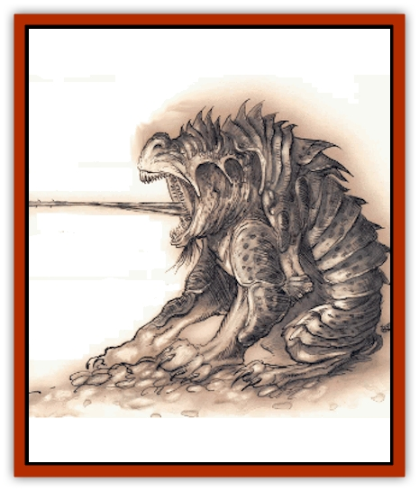

# Yugoloth - Lesser - Canoloth

| Statistic | **Yugoloth, Lesser, Canoloth** |
| --- | --- |
| **Activity Cycle:** | Any |
| **Alignment:** | Neutral evil |
| **Armor Class:** | 0 |
| **Climate/Terrain:** | Lower Planes |
| **Damage/Attack:** | 1d6/1d6/3d4+3 |
| **Diet:** | Carnivore |
| **Frequency:** | Uncommon |
| **Hit Dice:** | 6+12 |
| **Intelligence:** | Low (5-7) |
| **Magic Resistance:** | 25% |
| **Morale:** | Fearless (19-20) |
| **Movement:** | 18 |
| **No. Appearing:** | 1-3 |
| **No. of Attacks:** | 3 |
| **Organization:** | Group |
| **Size:** | M (6' long) |
| **Special Attacks:** | Tongue lash |
| **Special Defenses:** | Struck only by +1 or better weapons |
| **THAC0:** | 15 |
| **Treasure:** | Nil |
| **XP Value:** | 9,000 |

Canoloths're specialzed [[Yugoloth_General_Information|yugoloths]] who serve as scouts, skirmishers, and trackers for the yugoloth mercanary companies. They're not as common as the [[Yugoloth_Lesser_Mezzoloth|mezzoloths]] or [[Yugoloth_Lesser_Dergoloth|dergholoths]] that make up the bulk of these units, but a couple of canoloths can greatly increase the effectiveness of a yugoloth company by providing the [[Yugoloth_Lesser_Piscoloth|piscoloth]] or [[Yugoloth_Greater_Nycaloth|nycaloth]] commanders with excelent intelligence and reconnaissance reports.

Canoloths resemble great semi-instectile mastiffs, their hulking forms plated in chitinous armor. Their bodies've got a distinctly bull[[Dog|dog]]like shape to them, with massive jaws and short, squat, forelegs. Their mouths are made up of both a horizontal set ot teeth and a vertical set of teeth just behind, and a vile barbed tongue often lolls out of the creature's mouth. The canoloth's nostrils're gaping wounds in the front of its skull, and it has no eyes - it relies on its uncanny senses of smell and hearing to find its quarry.

Canoloths can communicate with semi-intelligent or higher creatures by means of an innate power of telepathy.

**Combat:** Canoloths're never surprised. Their smell and hearing give them the equivalent of normal vision to a range of 240 feet, and darkness or normal invisibility don't hinder their perception in the slightest. However, tenches such as a *stinking cloud*, *cloudkill*, or a pot of burning naphtha can "blind" a canoloth when accompanied by very loud noises. (Routine yelling or screaming won't cut it.) Canoloths won't be affected by any spell that uses a visual effect, such as *glitterdust*, *phantasmal force*, *hypnotic pattern*, and the like.

Canoloths attack with two slashes of their stubby foreclaws for 1d6 points of damage each, and a bite of their horryfying jaws that inflict 6-15 (3d4+3) points of damage. The canoloth's powerful mandibles destroy its victim's armor on a natural attack roll of 19 or 20, but magical armor gains a saving throw versus crushing blow to avoid this effect.

In place of its melee attacks, a canoloth can instead use its barbed tongue to entangle its prey. The creature's tongue can strike targets up to 20 feet away and works much like the tongue of a frog or chameleon. The strike inflicts 1d6 points of damage if the cnnoloth hits, and the victim must survive a saving throw versus paralyzation or be helplessly entangled on the wicked barbs and sticky slime of the canoloth's tongue.

The canoloth can draw its victim back to its mouth and automatically hit with its bite attack in the next round; the victim has to make a bend bars/lift gates roll to resist being drawn to the yugoloth. If the victim's friends try to pull him free, they'll need a combined total of 34 Strength points to disentangle him from the tongue. Optionally, the tongue can be attackes with Type S weapons; it's AC 4 and has 15 hit points.

Canoloths suffer no damage from add, magical or normal fire, iron weapons, or poison and only half damage from poisonous gas. They suffer double damage from cold-based attacks. Like all yugoloths, they can use the spell-like powers of *alter self*, *cause disease*, *charm person*, *improved phantasmal force*, *produce flame*, and *teleport without error*. In addition, canoloths can also use the following abilities one at a time at will: *cloudkill* (1/day), *darkness 15' radius*, *fear*, *passwall*, and *shout* (1/day). Once per day the canoloths can *gate* 1 to 4 additional canoloths or 1 to 3 mezzoloths with a 50% chance of success.

Canoloths can be struck only by weapons of +1 or better enchantment.

**Habitat/Society:** Although canoloths're a,ong the weakest yugoloths, they're considered valuable by the leaders of the yugoloth armies. It's not uncommon for greater yugoloths to have several canoloths at their beck and call; canoloths make excellent guards, assassins or retrievers. Their lack of intelligence makes canoloths the most loyal of the race, and they'll follow the orders of their masters to the death - a rare trait among the lesser yugoloths.

Canoloths are well aware of their favored status and use it to bully and pester mezzoloths or hydroloths. When they're not employed with a mercenary company, canoloths spend their time bounding through the foul wastes of the Lower Planes in search of lesser creatures to torment and slay.

It's not unusual to see canoloths saddled and used as great, fearsome mounts by arcanaloths or ultroloths.

**Ecology:** It's thought that canoloths're created from particularly courageous mezzoloths, but there's little to substantiate this. The creatures're common on the Gray Waste and Gehenna. Some spells of binding and entrapment make use of a piece of the tongue of a canolnth; the organ'll bring about 1,000 gp in the right market.

---
## Discovery & Documentation

**Source Publication:** Planescape II (1996)
**Campaign Setting:** Planescape
**Author(s):** Rich Baker, Karen S. Boomgarden

### Other Creatures Found in This Source Book
   * [[Aasimar|Aasimar]]
   * [[Abrian|Abrian]]
   * [[Arcane|Arcane]]
   * [[Balaena|Balaena]]
   * [[Beholder-kin_Observer|Beholder-kin, Observer]]
   * [[Bloodthorn|Bloodthorn]]
   * [[Bonespear|Bonespear]]
   * [[Darkweaver|Darkweaver]]
   * [[Demarax|Demarax]]
   * [[Dhour|Dhour]]
   * [[Eater_of_Knowledge|Eater of Knowledge]]
   * [[Eladrin_Greater_Firre|Eladrin, Greater, Firre]]
   * [[Eladrin_Greater_Ghaele|Eladrin, Greater, Ghaele]]
   * [[Eladrin_Greater_Tulani|Eladrin, Greater, Tulani]]
   * [[Eladrin_Lesser_Bralani|Eladrin, Lesser, Bralani]]
   * [[Eladrin_Lesser_Coure|Eladrin, Lesser, Coure]]
   * [[Eladrin_Lesser_Noviere|Eladrin, Lesser, Noviere]]
   * [[Eladrin_Lesser_Shiere|Eladrin, Lesser, Shiere]]
   * [[Fhorge|Fhorge]]
   * [[Ghostlight|Ghostlight]]
   * [[Guardinal_Avoral|Guardinal, Avoral]]
   * [[Guardinal_Cervidal|Guardinal, Cervidal]]
   * [[Guardinal_General_Information|Guardinal, General Information]]
   * [[Guardinal_Equinal|Guardinal, Equinal]]
   * [[Guardinal_Leonal|Guardinal, Leonal]]
   * [[Guardinal_Lupinal|Guardinal, Lupinal]]
   * [[Guardinal_Ursinal|Guardinal, Ursinal]]
   * [[Hollyphant|Hollyphant]]
   * [[Incantifer|Incantifer]]
   * [[Ironmaw|Ironmaw]]
   * [[Keeper|Keeper]]
   * [[Khaasta|Khaasta]]
   * [[Leomarh|Leomarh]]
   * [[Monster_of_Legend|Monster of Legend]]
   * [[Mortai|Mortai]]
   * [[Noctral|Noctral]]
   * [[Quill|Quill]]
   * [[Razorvine|Razorvine]]
   * [[Reave|Reave]]
   * [[Retriever|Retriever]]
   * [[Rilmani_Abiorach|Rilmani, Abiorach]]
   * [[Rilmani_General_Information|Rilmani, General Information]]
   * [[Rilmani_Argenach|Rilmani, Argenach]]
   * [[Rilmani_Aurumach|Rilmani, Aurumach]]
   * [[Rilmani_Cuprilach|Rilmani, Cuprilach]]
   * [[Rilmani_Ferrumach|Rilmani, Ferrumach]]
   * [[Rilmani_Plumach|Rilmani, Plumach]]
   * [[Shadowdrake|Shadowdrake]]
   * [[Spellhaunt|Spellhaunt]]
   * [[Spider_Hook|Spider, Hook]]
   * [[Sunfly|Sunfly]]
   * [[Sword_Spirit|Sword Spirit]]
   * [[Tanar'ri_Lesser_Bulezau|Tanar'ri, Lesser, Bulezau]]
   * [[Tanar'ri_Lesser_Maurezhi|Tanar'ri, Lesser, Maurezhi]]
   * [[Tanar'ri_Lesser_Yochlol|Tanar'ri, Lesser, Yochlol]]
   * [[Tanar'ri_General_Information|Tanar'ri, General Information]]
   * [[Tanar'ri_True_Alkilith|Tanar'ri, True, Alkilith]]
   * [[Terlen|Terlen]]
   * [[Tso|Tso]]
   * [[T'uen-rin|T'uen-rin]]
   * [[Vaporighu|Vaporighu]]
   * [[Vorr|Vorr]]
   * [[Wastrel|Wastrel]]
   * [[Wraithworm|Wraithworm]]
   * [[Zoveri|Zoveri]]
