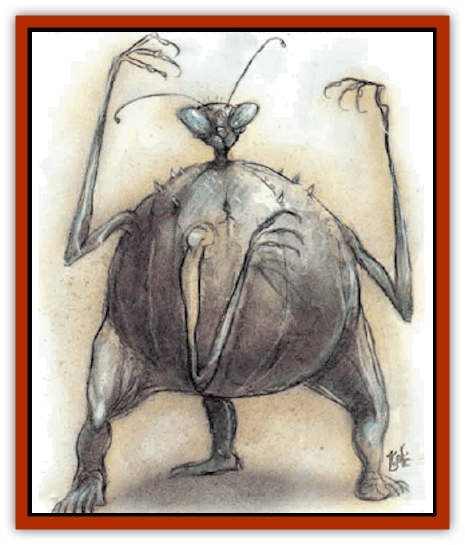
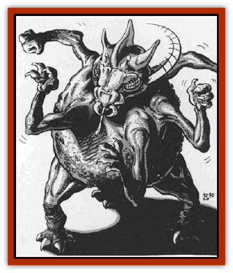

# Yugoloth - Lesser - Dergoloth

| Statistic | **Yugoloth, Lesser, Dergoloth** |
| --- | --- |
| **Activity Cycle:** | Any |
| **Alignment:** | Neutral evil |
| **Armor Class:** | -3 (see below) |
| **Climate/Terrain:** | Lower Planes |
| **Damage/Attack:** | See below |
| **Diet:** | Carnivore |
| **Frequency:** | Uncommon |
| **Hit Dice:** | 8+16 |
| **Intelligence:** | Low (5-7) |
| **Magic Resistance:** | 40% |
| **Morale:** | Elite (13-14) |
| **Movement:** | 12 |
| **No. Appearing:** | 1-4 |
| **No. of Attacks:** | 5 |
| **Organization:** | Solitary |
| **Size:** | L (8' tall) |
| **Special Attacks:** | Grab, <i>feeblemind</i> |
| **Special Defenses:** | Weapon parry, +1 or better weapons to hit |
| **THAC0:** | 13 |
| **Treasure:** | Nil |
| **XP Value:** | 12,000 |

Dergholoths are native to the Gray Waste but inhabit Carceri and Gehenna as well. These lesser [[Yugoloth_General_Information|yugoloths]] serve as rank-and-file mercenaries in the Blood War.

Dergholoths have round bodies with five arms and three legs. Their insect-like heads rotate 360 degrees, so they can move and change direction with astonishing speed. They are extremely strong but also stupid.

Dergholoths communicate using telepathy.

**Combat:** In the Waste the dergboloth are never surprised. Their five arms end in stubby, four-clawed hands. They have Strength 20 (+8 damage adjustment). Each may have weapons, as determined below, but dergholoths never carry magical weapons.

| Roll | Attacks (Damage per Attack) |
| --- | --- |
| 01-60 | 5 claws (1d4+8) |
| 61-85 | 4 claws (1d4+8), 1 sword (1d8+8) |
| 86-95 | 3 claws (1d4+8), 1 sword (1d8+8), 1 spear (1d6+8) |
| 96-00 | 2 claws (1d4+8), 1 sword (1d8+8), 1 spear (1d6+8), 1 battle axe (1d8+8) |

If the first two claw attacks hit, the dergholoth has grabbed its opponent and gets a +2 bonus on its attack rolls on that opponent; however, the two grabbing arms cannot attack. Grabbed opponents can fight, but cannot move or retreat until they break free (by making a Strength check against half their current Strength score).

Armed dergholoths can parry with their weapons instead of attacking. For each weapon used to parry, the dergholoth's Armor Class improves by 2. For example, if a dergholoth with three weapons decides to attack with one weapon and parry with two of them, its armor Class becomes -7 for the melee round.

Once per day, a dergholoth can chatter senselessly by clicking its mouth pincers rapidly. This has the effect of *feeblemind* spell on any creature of less than 7 HD that hears the attack. Those beings must save vs. spells or be *feebleminded* for 1-6 melee rounds, after which they will return to normal.

In addition to those available to all yugoloths, dergholoths can use the following spell-like abilities: *darkness 15' radius*, *fear*, and *sleep* (twice per day).

Dergholoths are immune to attacks from nonmagical weapons. The material form of a dergholoth may be destroyed but it reforms within a few days.

**Habitat/Society:** Dergholoths are treated poorly in yugoloth society. Not nearly as powerful as many of the other types, they receive constant abuse from their betters. This makes the dergholoths mean, which in turn serves the yugoloths well.

Dergholoths make up many of the yugoloth mercenary companies, but despite their stupidity, they are stubborn and difficult to control. They fight only because more powerful yugoloths compel them. They do not understand the Blood War or know of the profits that higher yugoloths make from their fighting.

When not fighting, dergholoths wander the Waste, sometimes in huge, milling groups up to 500 strong. They spend their time either stealing [[Larva|larvae]] from the [[Night_Hag|night hags]] or waiting for a fight.

**Ecology:** How dergholoths are created is still a mystery. None have ever been properly examined. Some speculate that [[Yugoloth_Greater_Ultroloth|ultroloths]] transform erring underlings into dergholoths for a specified time (a millenium, perhaps) as punishment.

---
## Discovery & Documentation

**Source Publication:** MC8 Outer Planes Appendix (1990)
**Campaign Setting:** Planescape
**Author(s):** Timothy B. Brown, Jamie LaFountain

### Other Creatures Found in This Source Book
   * [[Aasimon_Agathinon|Aasimon, Agathinon]]
   * [[Aasimon_Deva|Aasimon, Deva]]
   * [[Aasimon_Light|Aasimon, Light]]
   * [[Aasimon_General_Information|Aasimon, General Information]]
   * [[Aasimon_Planetar|Aasimon, Planetar]]
   * [[Aasimon_Solar|Aasimon, Solar]]
   * [[Air_Sentinel|Air Sentinel]]
   * [[Animal_Lord|Animal Lord]]
   * [[Archon|Archon]]
   * [[Baatezu_Lesser_Abishai|Baatezu, Lesser, Abishai]]
   * [[Baatezu_Greater_Amnizu|Baatezu, Greater, Amnizu]]
   * [[Baatezu_Lesser_Barbazu|Baatezu, Lesser, Barbazu]]
   * [[Baatezu_Greater_Cornugon|Baatezu, Greater, Cornugon]]
   * [[Baatezu_Lesser_Erinyes|Baatezu, Lesser, Erinyes]]
   * [[Baatezu_General_Information|Baatezu, General Information]]
   * [[Baatezu_Greater_Gelugon|Baatezu, Greater, Gelugon]]
   * [[Baatezu_Lesser_Hamatula|Baatezu, Lesser, Hamatula]]
   * [[Baatezu_Lemure|Baatezu, Lemure]]
   * [[Baatezu_Least_Nupperibo|Baatezu, Least, Nupperibo]]
   * [[Baatezu_Lesser_Osyluth|Baatezu, Lesser, Osyluth]]
   * [[Baatezu_Greater_Pit_Fiend|Baatezu, Greater, Pit Fiend]]
   * [[Baatezu_Least_Spinagon|Baatezu, Least, Spinagon]]
   * [[Balaena|Balaena]]
   * [[Bariaur|Bariaur]]
   * [[Bebilith|Bebilith]]
   * [[Bodak|Bodak]]
   * [[Dog_Moon|Dog, Moon]]
   * [[Dragon_Adamantite|Dragon, Adamantite]]
   * [[Einheriar|Einheriar]]
   * [[Gehreleth|Gehreleth]]
   * [[Githyanki|Githyanki]]
   * [[Githzerai|Githzerai]]
   * [[Hordling|Hordling]]
   * [[Lammasu_Celestial|Lammasu, Celestial]]
   * [[Larva|Larva]]
   * [[Maelephant|Maelephant]]
   * [[Marut|Marut]]
   * [[Mediator|Mediator]]
   * [[Mortai|Mortai]]
   * [[Night_Hag|Night Hag]]
   * [[Nightmare|Nightmare]]
   * [[Noctral|Noctral]]
   * [[Per|Per]]
   * [[Phoenix|Phoenix]]
   * [[Slaad|Slaad]]
   * [[Tanar'ri_Greater_Babau|Tanar'ri, Greater, Babau]]
   * [[Tanar'ri_Greater_Chasme|Tanar'ri, Greater, Chasme]]
   * [[Tanar'ri_Greater_Nabassu|Tanar'ri, Greater, Nabassu]]
   * [[Tanar'ri_Least_Dretch|Tanar'ri, Least, Dretch]]
   * [[Tanar'ri_Least_Manes|Tanar'ri, Least, Manes]]
   * [[Tanar'ri_Least_Rutterkin|Tanar'ri, Least, Rutterkin]]
   * [[Tanar'ri_Lesser_Alu-Fiend|Tanar'ri, Lesser, Alu-Fiend]]
   * [[Tanar'ri_Lesser_Bar-Lgura|Tanar'ri, Lesser, Bar-Lgura]]
   * [[Tanar'ri_Lesser_Cambion|Tanar'ri, Lesser, Cambion]]
   * [[Tanar'ri_Lesser_Succubus|Tanar'ri, Lesser, Succubus]]
   * [[Tanar'ri_Guardian_Molydeus|Tanar'ri, Guardian, Molydeus]]
   * [[Tanar'ri_General_Information|Tanar'ri, General Information]]
   * [[Tanar'ri_True_Balor|Tanar'ri, True, Balor]]
   * [[Tanar'ri_True_Glabrezu|Tanar'ri, True, Glabrezu]]
   * [[Tanar'ri_True_Hezrou|Tanar'ri, True, Hezrou]]
   * [[Tanar'ri_True_Marilith|Tanar'ri, True, Marilith]]
   * [[Tanar'ri_True_Nalfeshnee|Tanar'ri, True, Nalfeshnee]]
   * [[Tanar'ri_True_Vrock|Tanar'ri, True, Vrock]]
   * [[Titan|Titan]]
   * [[Translator|Translator]]
   * [[T'uen-rin|T'uen-rin]]
   * [[Vaporighu|Vaporighu]]
   * [[Warden_Beast|Warden Beast]]
   * [[Yugoloth_Greater_Arcanaloth|Yugoloth, Greater, Arcanaloth]]
   * [[Yugoloth_Lesser_Hydroloth|Yugoloth, Lesser, Hydroloth]]
   * [[Yugoloth_General_Information|Yugoloth, General Information]]
   * [[Yugoloth_Lesser_Mezzoloth|Yugoloth, Lesser, Mezzoloth]]
   * [[Yugoloth_Greater_Nycaloth|Yugoloth, Greater, Nycaloth]]
   * [[Yugoloth_Lesser_Piscoloth|Yugoloth, Lesser, Piscoloth]]
   * [[Yugoloth_Greater_Ultroloth|Yugoloth, Greater, Ultroloth]]
   * [[Yugoloth_Lesser_Yagnoloth|Yugoloth, Lesser, Yagnoloth]]
   * [[Zoveri|Zoveri]]
