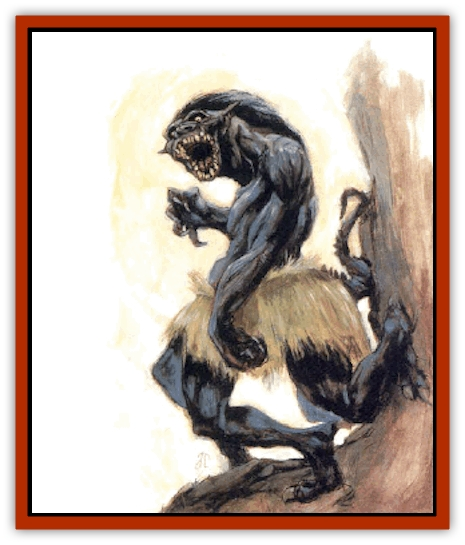

# Yugoloth - Lesser - Gacholoth

| Statistic | **Yugoloth, Lesser, Gacholoth** |
| --- | --- |
| **Activity Cycle:** | Any |
| **Alignment:** | Neutral evil |
| **Armor Class:** | -1 |
| **Climate/Terrain:** | Lower Planes |
| **Damage/Attack:** | 2d6/2d6 or 1d10 |
| **Diet:** | Carnivore |
| **Frequency:** | Rare |
| **Hit Dice:** | 9+9 |
| **Intelligence:** | Very (11-12) |
| **Magic Resistance:** | 40% |
| **Morale:** | Elite (13-14) |
| **Movement:** | 24 |
| **No. Appearing:** | 1-3 |
| **No. of Attacks:** | 2 claws or 1 bite |
| **Organization:** | Solitary |
| **Size:** | L (8' tall) |
| **Special Attacks:** | Acid touch, shock |
| **Special Defenses:** | +1 or better weapon to hit |
| **THAC0:** | 11 |
| **Treasure:** | Nil |
| **XP Value:** | 18,000 |

Gacholoths are the infiltrators and terrorists of the Blood War. They use their abilities to cause havoc and spread panic behind enemy lines. They also might spend months, years, even centuries, serving in the army of a temporary master with unquestioned loyalty, while secretly waiting for the best moment to reveal their true allegiance and begin a reign of slaughter and terror.

Gacholoths have a roughly humanoid appearance. Their bodies are an ebony black, and they have four long and powerful legs, each tipped with three sharp claws to aid in climbing. Their well-muscled torsos have two arms, each ending in a hand with four fingers that are tipped with savage, retractable claws. Gacholoth skulls are bony, their ears are triangular and flare back; a thick shock of dark hair flows back from a receding hairline. Sharp fangs thrust forward prominently, while the sunken eyes are cold and inhuman. Something about their skull structure suggests [[Sahuagin|sahuagin]].

Gacholoths communicate using telepathy.

**Combat:** Gacholoths can see 90 feet in normal darkness. Their four powerful legs enable them to move with blinding speed on any surface, climbing walls and ceilings without hindrance. They can fight from any angle without disorientation, even hanging upside down.

As a consequence of their speed and maneuverability, gacholoths have a +5 bonus to their initiative in the first round of combat (initiative in subsequent rounds is determined normally). Gacholoths often strike swiftly and savagely before their opponents can react, then immediately withdraw from combat until another opening presents itself.

Their sudden attack has another effect. Anyone attacked by a gacholoth for the first time (whether hit or not) must make a successful saving throw vs. paralyzation or go into shock. This shock is a fear attack that induces irrational terror; the victim drops all hand-held items and is rooted to the spot for 1d6 rounds. Regardless of whether or not the victim makes his saving throw, no subsequent attack by the same gacholoth will cause this shock effect.

Gacholoths do not carry weapons, magical or otherwise, preferring to rely on the speed and ferocity of their natural weapons. The gacholoth either strikes with both claws (70% of the time) or bites (30% of the time). A bite inflicts 1d10 points of damage, while the claws inflict 2d6 points of damage. The claws also secrete a stinging, acidic venom. Any creature hit by a claw attack must make a successful saving throw vs. poison or take an additional 1d6 points of acid damage.

As with other [[Yugoloth_General_Information|yugoloths]], the gacholoth has the following spell-like abilities: *alter self*, *improved phantasmal force*, *animate dead*, *cause disease*, *charm person*, *produce flame*, and *gate* (50% chance for one gacholoth, 1/day). In addition, gacholoths have the following powers, at 5th-level spell use, usable once per round, at will: *darkness 15' radius*, *feather fall*, *magic missile*, and *mirror image*.

Gacholoths are unaffected by acid, poison, and *charm* spells. They take half damage from gas attacks, including poisons gases, but double damage from cold-based attacks.

**Habitat/Society:** The gacholoths' fondness for deceit and terror make them favored troops in yugoloth conflicts, and many have risen to minor positions of power as a result.

Gacholoths have a particular interest in the workings of the Prime Material plane and will take any opportunity to enter that plane and indulge in a reign of bloodletting. They often use their shock ability to play with their victims, paralyzing them and making a leisurely job of it.

Gacholoths consider themselves to be the great betrayers and terrorists of the Outer Planes and will not allow others of similar skill to outdo them. For example, they have an intense hatred of [[Tanar'ri_Lesser_Succubus|succubi]] and [[Baatezu_Lesser_Erinyes|erinyes]], taking pleasure in torturing to death any of these they capture. Gacholoths often clash with [[Tanar'ri_Lesser_Cambion|cambions]], and nearly always become their bitter rivals.

**Ecology:** The origin of the gacholoths is unknown. All of them appear to be male; no distinctly female versions have ever been sighted. The faint resemblance to sahuagin suggests some long-lost connection between these creatures and the "devil men of the deep", but hard evidence has yet to be discovered.

---
## Discovery & Documentation

**Source Publication:** Monstrous Compendium, 1997 Annual, Volume 4 (1995)
**Campaign Setting:** Advanced Dungeons & Dragons 2nd Edition
**Author(s):** Jon Pickens

### Other Creatures Found in This Source Book
   * [[Anemone_Giant_Sea|Anemone, Giant Sea]]
   * [[Asperii|Asperii]]
   * [[Bainligor|Bainligor]]
   * [[Beast_of_Chaos|Beast of Chaos]]
   * [[Blindheim|Blindheim]]
   * [[Bloodsipper_Far_Realm|Bloodsipper (Far Realm)]]
   * [[Bulette_Gohlbrorn|Bulette, Gohlbrorn]]
   * [[Child_of_the_Sea|Child of the Sea]]
   * [[Clockwork_Horror|Clockwork Horror]]
   * [[Clockwork_Swordsman|Clockwork Swordsman]]
   * [[Coral|Coral]]
   * [[Darklore|Darklore]]
   * [[Dharculus|Dharculus]]
   * [[Dolphin_Athas|Dolphin (Athas)]]
   * [[Dragon_Neutral_Moonstone|Dragon, Neutral, Moonstone]]
   * [[Dragon_Prismatic|Dragon, Prismatic]]
   * [[Dream_Stalker|Dream Stalker]]
   * [[Dragon-kin_Albino_Wyrm|Dragon-kin, Albino Wyrm]]
   * [[Echyan|Echyan]]
   * [[Firestar|Firestar]]
   * [[Firetail|Firetail]]
   * [[Fish_Ascallion|Fish, Ascallion]]
   * [[Fish_Deep_Ocean|Fish, Deep Ocean]]
   * [[Fish_Tropical|Fish, Tropical]]
   * [[Fish_Vurgens|Fish, Vurgens]]
   * [[Fogwarden|Fogwarden]]
   * [[Fraal|Fraal]]
   * [[Giant_Crag|Giant, Crag]]
   * [[Gibberling_Brood|Gibberling, Brood]]
   * [[Glutton_Sea|Glutton, Sea]]
   * [[Golden_Ammonite|Golden Ammonite]]
   * [[Golem_Brass_Minotaur|Golem, Brass Minotaur]]
   * [[Golem_Gemstone|Golem, Gemstone]]
   * [[Golem_Maggot|Golem, Maggot]]
   * [[Groundling|Groundling]]
   * [[Hermit_Sea|Hermit, Sea]]
   * [[Hound_of_Law|Hound of Law]]
   * [[Human_Amazon|Human, Amazon]]
   * [[Human_Pygmy|Human, Pygmy]]
   * [[Inquisitor|Inquisitor]]
   * [[Kercpa|Kercpa]]
   * [[Kreel|Kreel]]
   * [[Lycanthrope_Lythari|Lycanthrope, Lythari]]
   * [[Mercurial|Mercurial]]
   * [[Mold_Chromatic|Mold, Chromatic]]
   * [[Mummy_Bog|Mummy, Bog]]
   * [[Neh-thalggu|Neh-thalggu]]
   * [[Nymph_Grain|Nymph, Grain]]
   * [[Nymph_Unseelie|Nymph, Unseelie]]
   * [[Octopus_Octo-Jelly|Octopus, Octo-Jelly]]
   * [[Puddingfish|Puddingfish]]
   * [[Sea_Demon|Sea Demon]]
   * [[Shade|Shade]]
   * [[Shadowrath|Shadowrath]]
   * [[Shark_Athas|Shark (Athas)]]
   * [[Siren_Ravenloft|Siren (Ravenloft)]]
   * [[Skeleton_Variant|Skeleton, Variant]]
   * [[Skyfish|Skyfish]]
   * [[Spectral_Scion|Spectral Scion]]
   * [[Spyder_Fiend|Spyder Fiend]]
   * [[Squid_Squark|Squid, Squark]]
   * [[Tanar'ri_Lesser_Uridezu|Tanar'ri, Lesser, Uridezu]]
   * [[Troll_Mutate|Troll Mutate]]
   * [[Vaati|Vaati]]
   * [[Vampire_Cerebral|Vampire, Cerebral]]
   * [[Varkha|Varkha]]
   * [[Wizshade|Wizshade]]
   * [[Worm_Lukhorn|Worm, Lukhorn]]
   * [[Wyste|Wyste]]
   * [[Zombie_Mud|Zombie, Mud]]
