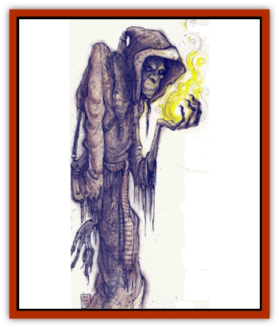
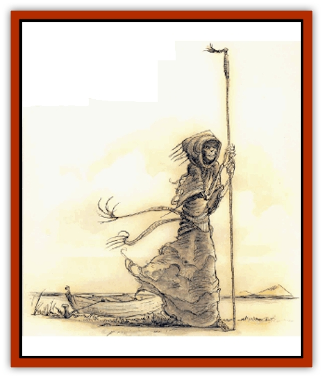

# Yugoloth - Lesser - Marraenoloth

| Statistic | **Yugoloth, Lesser, Marraenoloth** |
| --- | --- |
| **Activity Cycle:** | Any |
| **Alignment:** | Neutral evil |
| **Armor Class:** | -1 |
| **Climate/Terrain:** | Lower Planes |
| **Damage/Attack:** | 2d4 |
| **Diet:** | Special |
| **Frequency:** | Rare |
| **Hit Dice:** | 10+20 hp |
| **Intelligence:** | Exceptional (15-16) |
| **Magic Resistance:** | 80% to 1st-level spells |
| **Morale:** | Champion (15) |
| **Movement:** | 18 |
| **No. Appearing:** | 1 |
| **No. of Attacks:** | 1 |
| **Organization:** | Solitary |
| **Size:** | M (5' tall) |
| **Special Attacks:** | Gaze inspires fear |
| **Special Defenses:** | Nil |
| **THAC0:** | 11 |
| **Treasure:** | I |
| **XP Value:** | 7,000 |

The marraenoloths are a special type of [[Yugoloth_General_Information|yugoloth]]. The thin, gray, pale-eyed humanoids are easily identified by their skeletal faces, somber hooded robes, and eyes that glow red when they are angry. They are a cold species, mercenary at heart, like all yugoloths. They are telepathic and, in addition to speaking all languages, maintain mental contact with others of their race at all times.

**Combat:** Marraenoloths have all the standard powers of tho yugoloths, but also use the following powers at will: *alter self*, *animate dead*, *cause disease*, *charm person*, *improved phantasmal force*, *produce flame*, and *teleport without error*. In addition, marraenoloths can *gate* in 1d6 [[Yugoloth_Lesser_Hydroloth|hydroloths]] (75% chance), should the need arise.

These yugololhs are not great warriors, attacking only with tiheir bony fangs. When angered, a marraenoloth's eyes glow fiery red, and anyone confronted by this horrifying gaze must successfully save vs. spell or be affected as by a *fear* spell. The marraenoloth will then summon hydroloths to fight for it.

Marraenoloths have 80% magic resistance to 1st-level spells. This resistance decreases by 5% for each higher level of spell. (Thus, a marraenoloth's resistance to 7th-level spells is only 50%.) They are immune to acid, fire, and poison, and they suffer only half damage from gases. Their greatest weakness is cold-based attacks, which inflict double damage upon them.

**Habitat/Society:** Marraenoloths are unique among the yugoloths in that they havy an established task: They are boatmen who pilot small skiffs on the black waters of the River Styx. Unlike many other fiends, the marraenoloths can pass from plane to plane without arousing suspicion in the minds of others. They are ferrymen and ferrymen only. Other fiends would love to subvert the marraenoloths to spy on their Blood War enemies, but these creatures are only concerned with their passengers.

Marraenoloths have an innate understanding of the twists and bends of the River Styx's channels, so they never get lost (unless it's convenient to do so). These creatures also can pilot their crafts through the Astral Plane and to the boundary of the Prime Material Plane. They can actually enter the Prime Material, too, but they must leave their skiffs behind. A marraenoloth without a vessel is lost and useless, so they are naturally reluctant to venture far from their crafts. Occasionally they are summoned or sent to the Prime, anyway, to transport some being to or from the Lower Planes (using a special *plane shift* ability that work for this task only).

Marraenoloths carry passengers but never cargo, always demanding immediate payment for their servixes. (Greater fiends may ignore this, forcing the marraenoloth to serve them.) The may demand a magical item, a bag of 10 platinum coins, or two gems of 50 gp value (or more). If not paid, the marraenoloth will seek to prevent the would-be passenger from entering its boat, and it will *teleport* itself and its craft away at the first opportunity.

Even if a marraenoloth is paid (as opposed to being sent by a higher evil force), there is still a 15% chance that the creature will betray the passenger, either by delivering him to the incorrect destination or plane (85% chance) or by leading the summoner into an ambush (15% chance). This chance of betrayal can be reduced by making additional contributions to the marraenoloth's hoard (-5% per additional payment listed above).

Since all marraenoloths are aware of each other, all know of any person who cheats or harms anyone of their kind. They won't come to each other's aid (that would indicate concern for their fellows), but the identity of the transgressor is noted, and future services from any of these yugoloths will require greater payments and incur a significantly higher risk of treachery. The cheater can return to the good graces of the boatmen only by making a suitable sacrifice to all their kind. The nature of this tribute is left to the DM, but a typical one would be the surrender of rare gems or several unique magical items, presented with due ceeremony and contrition.

**Ecology:** There are among the most neutral of the evil yugoloths, existing to collect their fares and nothing else. They stay clear of the politics of the Blood War. Because their skills are valuable to [[Tanar'ri_General_Information|tanar'ri]] and [[Baatezu_General_Information|baatezu]] alike, the other fiends tolerate this neutrality. As much as some infernal lord might like to subjugate them, it's understood they would no longer function properly if that happened.

As a marraenoloth without its sailing duties is fairly worthless, even as a lowly foot soldier in the Blood War, no one has attempted to take control of them. However, they may unwittingly play pawns in the subtle plottings of some baatezu or tanar'ri.

---
## Discovery & Documentation

**Source Publication:** Planescape Campaign Setting (1994)
**Campaign Setting:** Planescape
**Author(s):** David Cook

### Other Creatures Found in This Source Book
   * [[Aleax|Aleax]]
   * [[Astral_Searcher|Astral Searcher]]
   * [[Barghest|Barghest]]
   * [[Bariaur|Bariaur]]
   * [[Cranium_Rat|Cranium Rat]]
   * [[Dabus|Dabus]]
   * [[Magman|Magman]]
   * [[Minion_of_Set|Minion of Set]]
   * [[Modron|Modron]]
   * [[Nic'Epona|Nic'Epona]]
   * [[Spirit_of_the_Air|Spirit of the Air]]
   * [[Vortex|Vortex]]
