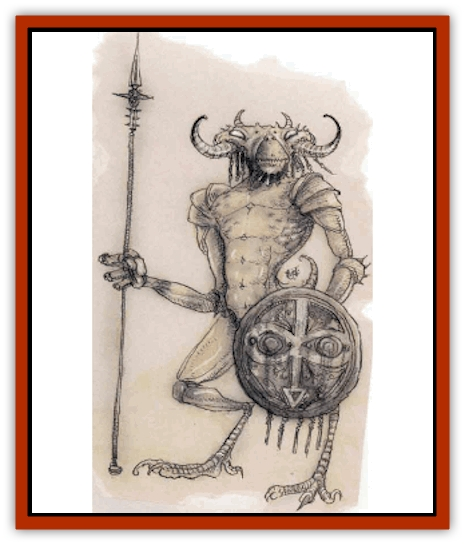

# Yugoloth - Lesser - Mezzoloth

| Statistic | **Yugoloth, Lesser, Mezzoloth** |
| --- | --- |
| **Activity Cycle:** | Any |
| **Alignment:** | Neutral evil |
| **Armor Class:** | -1 |
| **Climate/Terrain:** | Lower Planes |
| **Damage/Attack:** | 1d6+6/1d6+6 or weapon +6 (Strength bonus) |
| **Diet:** | Carnivore |
| **Frequency:** | Common |
| **Hit Dice:** | 10+20 |
| **Intelligence:** | Low (5-7) |
| **Magic Resistance:** | 50% |
| **Morale:** | Elite (13-14) |
| **Movement:** | 15 |
| **No. Appearing:** | 2-5 |
| **No. of Attacks:** | 2 or 1 |
| **Organization:** | Group |
| **Size:** | M (7' tall) |
| **Special Attacks:** | Magical items |
| **Special Defenses:** | +2 or better weapons to hit |
| **THAC0:** | 11 |
| **Treasure:** | Nil |
| **XP Value:** | 21,000 |

Mezzoloths, the most common [[Yugoloth_General_Information|yugoloths]] of the Lower Planes, are as plentiful as they are lowly and wretched. They look like humanoid insects covered in chitinous plates of a dirty ivory color. They have long, lanky arms and legs; wide, armored skulls; sharp claws that can cut through most nonmagical substances; and glaring red eyes.

Mezzoloths have a limited telepathy that lets them communicate with any creature of Low or better intelligence.

**Combat:** Mezzoloths can attack with two claws for 1d6+6 damage each and, because of their Strength 18/00, a +6 damage bonus with weapons.

Mezzoloths, highly magical, can use any magical item without penalty, except those with alignment or class restrictions. They often use magical weapons, and, if so, generally a shield as well. Other powerful yugoloths, recognizing mezzoloths' natural affinity for enchanted items as an asset, equip them accordingly. Solitary mezzoloths are only 5% likely to have a magical item. For every three mezzoloths present, they are 10% (cumulative) likely to have one magical item among them. For example, a group of 10 mezzoloths has a 30% chance for magic, but a group of 30 or more always has randomly determined enchanted items.

In addition to those available to all yugoloths, mezzoloths have the following spell-like powers at 10th level of spell use: *burning hands*, *cause serious wounds* (reverse of *cure serious wounds*), *cloudkill* (once per day), *darkness, 15' radius*, *detect invisibility* (always active), *detect magic*, *dispel magic* (twice per day), *flame strike* (once per day), *hold person*, *mirror image*, *sleep*, and *trip*. Once per day mezzoloths can also attempt to gate in 1-4 additional mezzoloths or 1-2 [[Yugoloth_Lesser_Hydroloth|hydroloths]], with a 40% chance of success.

Mezzoloths have infravision to 12014. They are immune to attacks by nonmagical weapons and magical weapons of less than +2 enchantment, to paralysis, to all poisons, and to *charm* and *suggestion* spells. Cold-based attacks cause only normal damage (as opposed to double damage taken by most yugoloths).

**Habitat/Society:** Mezzoloths are the lowest yugoloths, the rank-and-file warriors of the mercenary armies. Higher yugoloths rule over them by might alone. Due to their lack of intelligence, the mezzoloths have accepted their lot. In fact, the abuse they receive makes them more vicious, toughening them for brutal combat.

Mezzoloths have little motivation when not fighting in a mercenary army. The wander the Lower Planes (particularly the Abyss) in search of creatures to torment, especially [[Baatezu_Lemure|lemures]].

**Ecology:** Sages have never ascertained exactly where mezzoloths are formed. They appear to be yugoloth adaptations of some other evil creature. Mezzoloths appear slightly more plentiful in Gehenna than elsewhere; perhaps [[Yugoloth_Greater_Ultroloth|ultroloths]] or [[Yugoloth_Greater_Arcanaloth|arcanaloths]] originally brought them there from some other plane.

---
## Discovery & Documentation

**Source Publication:** MC8 Outer Planes Appendix (1990)
**Campaign Setting:** Planescape
**Author(s):** Timothy B. Brown, Jamie LaFountain

### Other Creatures Found in This Source Book
   * [[Aasimon_Agathinon|Aasimon, Agathinon]]
   * [[Aasimon_Deva|Aasimon, Deva]]
   * [[Aasimon_Light|Aasimon, Light]]
   * [[Aasimon_General_Information|Aasimon, General Information]]
   * [[Aasimon_Planetar|Aasimon, Planetar]]
   * [[Aasimon_Solar|Aasimon, Solar]]
   * [[Air_Sentinel|Air Sentinel]]
   * [[Animal_Lord|Animal Lord]]
   * [[Archon|Archon]]
   * [[Baatezu_Lesser_Abishai|Baatezu, Lesser, Abishai]]
   * [[Baatezu_Greater_Amnizu|Baatezu, Greater, Amnizu]]
   * [[Baatezu_Lesser_Barbazu|Baatezu, Lesser, Barbazu]]
   * [[Baatezu_Greater_Cornugon|Baatezu, Greater, Cornugon]]
   * [[Baatezu_Lesser_Erinyes|Baatezu, Lesser, Erinyes]]
   * [[Baatezu_General_Information|Baatezu, General Information]]
   * [[Baatezu_Greater_Gelugon|Baatezu, Greater, Gelugon]]
   * [[Baatezu_Lesser_Hamatula|Baatezu, Lesser, Hamatula]]
   * [[Baatezu_Lemure|Baatezu, Lemure]]
   * [[Baatezu_Least_Nupperibo|Baatezu, Least, Nupperibo]]
   * [[Baatezu_Lesser_Osyluth|Baatezu, Lesser, Osyluth]]
   * [[Baatezu_Greater_Pit_Fiend|Baatezu, Greater, Pit Fiend]]
   * [[Baatezu_Least_Spinagon|Baatezu, Least, Spinagon]]
   * [[Balaena|Balaena]]
   * [[Bariaur|Bariaur]]
   * [[Bebilith|Bebilith]]
   * [[Bodak|Bodak]]
   * [[Dog_Moon|Dog, Moon]]
   * [[Dragon_Adamantite|Dragon, Adamantite]]
   * [[Einheriar|Einheriar]]
   * [[Gehreleth|Gehreleth]]
   * [[Githyanki|Githyanki]]
   * [[Githzerai|Githzerai]]
   * [[Hordling|Hordling]]
   * [[Lammasu_Celestial|Lammasu, Celestial]]
   * [[Larva|Larva]]
   * [[Maelephant|Maelephant]]
   * [[Marut|Marut]]
   * [[Mediator|Mediator]]
   * [[Mortai|Mortai]]
   * [[Night_Hag|Night Hag]]
   * [[Nightmare|Nightmare]]
   * [[Noctral|Noctral]]
   * [[Per|Per]]
   * [[Phoenix|Phoenix]]
   * [[Slaad|Slaad]]
   * [[Tanar'ri_Greater_Babau|Tanar'ri, Greater, Babau]]
   * [[Tanar'ri_Greater_Chasme|Tanar'ri, Greater, Chasme]]
   * [[Tanar'ri_Greater_Nabassu|Tanar'ri, Greater, Nabassu]]
   * [[Tanar'ri_Least_Dretch|Tanar'ri, Least, Dretch]]
   * [[Tanar'ri_Least_Manes|Tanar'ri, Least, Manes]]
   * [[Tanar'ri_Least_Rutterkin|Tanar'ri, Least, Rutterkin]]
   * [[Tanar'ri_Lesser_Alu-Fiend|Tanar'ri, Lesser, Alu-Fiend]]
   * [[Tanar'ri_Lesser_Bar-Lgura|Tanar'ri, Lesser, Bar-Lgura]]
   * [[Tanar'ri_Lesser_Cambion|Tanar'ri, Lesser, Cambion]]
   * [[Tanar'ri_Lesser_Succubus|Tanar'ri, Lesser, Succubus]]
   * [[Tanar'ri_Guardian_Molydeus|Tanar'ri, Guardian, Molydeus]]
   * [[Tanar'ri_General_Information|Tanar'ri, General Information]]
   * [[Tanar'ri_True_Balor|Tanar'ri, True, Balor]]
   * [[Tanar'ri_True_Glabrezu|Tanar'ri, True, Glabrezu]]
   * [[Tanar'ri_True_Hezrou|Tanar'ri, True, Hezrou]]
   * [[Tanar'ri_True_Marilith|Tanar'ri, True, Marilith]]
   * [[Tanar'ri_True_Nalfeshnee|Tanar'ri, True, Nalfeshnee]]
   * [[Tanar'ri_True_Vrock|Tanar'ri, True, Vrock]]
   * [[Titan|Titan]]
   * [[Translator|Translator]]
   * [[T'uen-rin|T'uen-rin]]
   * [[Vaporighu|Vaporighu]]
   * [[Warden_Beast|Warden Beast]]
   * [[Yugoloth_Greater_Arcanaloth|Yugoloth, Greater, Arcanaloth]]
   * [[Yugoloth_Lesser_Dergoloth|Yugoloth, Lesser, Dergoloth]]
   * [[Yugoloth_Lesser_Hydroloth|Yugoloth, Lesser, Hydroloth]]
   * [[Yugoloth_General_Information|Yugoloth, General Information]]
   * [[Yugoloth_Greater_Nycaloth|Yugoloth, Greater, Nycaloth]]
   * [[Yugoloth_Lesser_Piscoloth|Yugoloth, Lesser, Piscoloth]]
   * [[Yugoloth_Greater_Ultroloth|Yugoloth, Greater, Ultroloth]]
   * [[Yugoloth_Lesser_Yagnoloth|Yugoloth, Lesser, Yagnoloth]]
   * [[Zoveri|Zoveri]]
