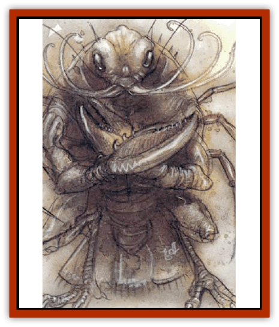

# Yugoloth - Lesser - Piscoloth

| Statistic | **Yugoloth, Lesser, Piscoloth** |
| --- | --- |
| **Activity Cycle:** | Any |
| **Alignment:** | Neutral evil |
| **Armor Class:** | -5 |
| **Climate/Terrain:** | Lower Planes |
| **Damage/Attack:** | 2d8/2d8 |
| **Diet:** | Carnivore |
| **Frequency:** | Uncommon |
| **Hit Dice:** | 9+18 |
| **Intelligence:** | Very (11-12) |
| **Magic Resistance:** | 40% |
| **Morale:** | Elite (13-14) |
| **Movement:** | 6, Sw 18 |
| **No. Appearing:** | 2-8 |
| **No. of Attacks:** | 2 |
| **Organization:** | Group |
| **Size:** | M (5' tall) |
| **Special Attacks:** | Severing, sting |
| **Special Defenses:** | Never surprised, +1 or better weapons to hit |
| **THAC0:** | 11 |
| **Treasure:** | E |
| **XP Value:** | 19,000 |

Piscoloths are the sergeants and overseers of [[Yugoloth_General_Information|yugoloth]] mercenary armies. These creatures hold dictatorial sway over companies of [[Yugoloth_Lesser_Dergoloth|dergholoths]] and [[Yugoloth_Lesser_Mezzoloth|mezzoloths]] throughout the Lower Planes.

The [[Fish|fish]]-tailed, walleyed piscoloth has the red, chitinous body of a lobster, the talons of a [[Bird|bird]], and the head of a [[Carrion_Crawler|carrion crawler]]. The piscoloth's arms, though humanoid, end in a set of crab-like pincers.

Piscoloths communicate using telepathy.

**Combat:** Its faceted eyes, bulging from the sides of the monster's head, let the piscoloth see around and behind so that it cannot usually be surprised.

The piscoloth's pincers inflict 2d8 damage and may sever a limb on an unmodified attack roll of 20; the victim must save vs. paralyzation or lose an arm (60% chance) or leg (40%). Metal armor gives a +2 bonus on the save, +1 for each "plus" if magical armor. For example, if a piscoloth scores an unmodified 20 against a man in *chain mail +2*, the opponent receives a +4 bonus to the saving throw.

Piscoloths can attack with its mouth tentacles against a single creature (1d10 damage and poison; save vs. paralyzation with a -2 penalty or die in six turns unless healed by *neutralize poison* or similar magical means; non-magical healing has no effect). If the save succeeds, the victim is instead *slowed* for 1-6 rounds.

In addition to those available to all yugoloths, piscoloths have the following spell-like abilities at 10th-level of spell use: *bind*, *blink*, *emotion*, *jump*, *know alignment*, *meld into stone*, *phantasmal killer* (twice per day), *protection from good*, *resist fire*, *scare*, and *stinking cloud*.

These creatures are prodigious summoners. They can *gate* in 1-8 mezzoloths three times per day with no chance of failure. They can also attempt to *gate* in 1-2 additional piscoloths once per day with a 35% chance of success.

Piscoloths are immune to nonmagical weapons. Also, due to the piscoloth's aquatic nature, all water-based attacks inflict -1 damage per die.

**Habitat/Society:** Piscoloths maintain order (or a semblance thereof) in the armies of the yugoloths - a task akin to passing a planet through the eye of a needle. They have short life spans, having to answer to their easily angered superiors. Nonetheless, piscoloths enjoy their work, for they are cruel, hateful, and bullying.

Piscoloths are among the few yugoloths that cooperate in groups. They are commonly found in groups of five or six, ruling over one or more companies of mezzoloths. They maintain order through destruction of those who do not obey them. Of course, few at the head of hordes of their own abused underlings, piscoloths become subject to frequent "friendly fire."

Piscoloths are the yugoloths most often presented with chances to turn against their employers.

**Ecology:** Nothing is known of a piscoloth's reproduction or biology. They are widely believed to he the wretched creations of evil generals, but this may be simply myth.

---
## Discovery & Documentation

**Source Publication:** MC8 Outer Planes Appendix (1990)
**Campaign Setting:** Planescape
**Author(s):** Timothy B. Brown, Jamie LaFountain

### Other Creatures Found in This Source Book
   * [[Aasimon_Agathinon|Aasimon, Agathinon]]
   * [[Aasimon_Deva|Aasimon, Deva]]
   * [[Aasimon_Light|Aasimon, Light]]
   * [[Aasimon_General_Information|Aasimon, General Information]]
   * [[Aasimon_Planetar|Aasimon, Planetar]]
   * [[Aasimon_Solar|Aasimon, Solar]]
   * [[Air_Sentinel|Air Sentinel]]
   * [[Animal_Lord|Animal Lord]]
   * [[Archon|Archon]]
   * [[Baatezu_Lesser_Abishai|Baatezu, Lesser, Abishai]]
   * [[Baatezu_Greater_Amnizu|Baatezu, Greater, Amnizu]]
   * [[Baatezu_Lesser_Barbazu|Baatezu, Lesser, Barbazu]]
   * [[Baatezu_Greater_Cornugon|Baatezu, Greater, Cornugon]]
   * [[Baatezu_Lesser_Erinyes|Baatezu, Lesser, Erinyes]]
   * [[Baatezu_General_Information|Baatezu, General Information]]
   * [[Baatezu_Greater_Gelugon|Baatezu, Greater, Gelugon]]
   * [[Baatezu_Lesser_Hamatula|Baatezu, Lesser, Hamatula]]
   * [[Baatezu_Lemure|Baatezu, Lemure]]
   * [[Baatezu_Least_Nupperibo|Baatezu, Least, Nupperibo]]
   * [[Baatezu_Lesser_Osyluth|Baatezu, Lesser, Osyluth]]
   * [[Baatezu_Greater_Pit_Fiend|Baatezu, Greater, Pit Fiend]]
   * [[Baatezu_Least_Spinagon|Baatezu, Least, Spinagon]]
   * [[Balaena|Balaena]]
   * [[Bariaur|Bariaur]]
   * [[Bebilith|Bebilith]]
   * [[Bodak|Bodak]]
   * [[Dog_Moon|Dog, Moon]]
   * [[Dragon_Adamantite|Dragon, Adamantite]]
   * [[Einheriar|Einheriar]]
   * [[Gehreleth|Gehreleth]]
   * [[Githyanki|Githyanki]]
   * [[Githzerai|Githzerai]]
   * [[Hordling|Hordling]]
   * [[Lammasu_Celestial|Lammasu, Celestial]]
   * [[Larva|Larva]]
   * [[Maelephant|Maelephant]]
   * [[Marut|Marut]]
   * [[Mediator|Mediator]]
   * [[Mortai|Mortai]]
   * [[Night_Hag|Night Hag]]
   * [[Nightmare|Nightmare]]
   * [[Noctral|Noctral]]
   * [[Per|Per]]
   * [[Phoenix|Phoenix]]
   * [[Slaad|Slaad]]
   * [[Tanar'ri_Greater_Babau|Tanar'ri, Greater, Babau]]
   * [[Tanar'ri_Greater_Chasme|Tanar'ri, Greater, Chasme]]
   * [[Tanar'ri_Greater_Nabassu|Tanar'ri, Greater, Nabassu]]
   * [[Tanar'ri_Least_Dretch|Tanar'ri, Least, Dretch]]
   * [[Tanar'ri_Least_Manes|Tanar'ri, Least, Manes]]
   * [[Tanar'ri_Least_Rutterkin|Tanar'ri, Least, Rutterkin]]
   * [[Tanar'ri_Lesser_Alu-Fiend|Tanar'ri, Lesser, Alu-Fiend]]
   * [[Tanar'ri_Lesser_Bar-Lgura|Tanar'ri, Lesser, Bar-Lgura]]
   * [[Tanar'ri_Lesser_Cambion|Tanar'ri, Lesser, Cambion]]
   * [[Tanar'ri_Lesser_Succubus|Tanar'ri, Lesser, Succubus]]
   * [[Tanar'ri_Guardian_Molydeus|Tanar'ri, Guardian, Molydeus]]
   * [[Tanar'ri_General_Information|Tanar'ri, General Information]]
   * [[Tanar'ri_True_Balor|Tanar'ri, True, Balor]]
   * [[Tanar'ri_True_Glabrezu|Tanar'ri, True, Glabrezu]]
   * [[Tanar'ri_True_Hezrou|Tanar'ri, True, Hezrou]]
   * [[Tanar'ri_True_Marilith|Tanar'ri, True, Marilith]]
   * [[Tanar'ri_True_Nalfeshnee|Tanar'ri, True, Nalfeshnee]]
   * [[Tanar'ri_True_Vrock|Tanar'ri, True, Vrock]]
   * [[Titan|Titan]]
   * [[Translator|Translator]]
   * [[T'uen-rin|T'uen-rin]]
   * [[Vaporighu|Vaporighu]]
   * [[Warden_Beast|Warden Beast]]
   * [[Yugoloth_Greater_Arcanaloth|Yugoloth, Greater, Arcanaloth]]
   * [[Yugoloth_Lesser_Dergoloth|Yugoloth, Lesser, Dergoloth]]
   * [[Yugoloth_Lesser_Hydroloth|Yugoloth, Lesser, Hydroloth]]
   * [[Yugoloth_General_Information|Yugoloth, General Information]]
   * [[Yugoloth_Lesser_Mezzoloth|Yugoloth, Lesser, Mezzoloth]]
   * [[Yugoloth_Greater_Nycaloth|Yugoloth, Greater, Nycaloth]]
   * [[Yugoloth_Greater_Ultroloth|Yugoloth, Greater, Ultroloth]]
   * [[Yugoloth_Lesser_Yagnoloth|Yugoloth, Lesser, Yagnoloth]]
   * [[Zoveri|Zoveri]]
