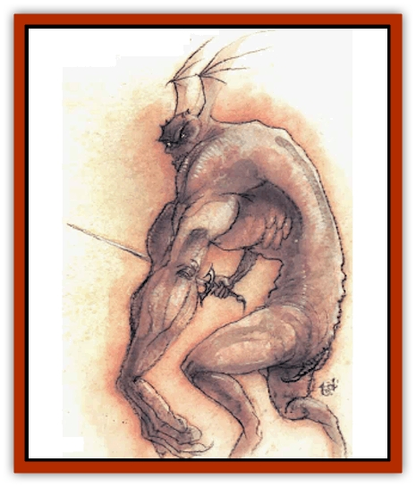

# Yugoloth - Lesser - Yagnoloth

| Statistic | **Yugoloth, Lesser, Yagnoloth** |
| --- | --- |
| **Activity Cycle:** | Any |
| **Alignment:** | Neutral evil |
| **Armor Class:** | -4 |
| **Climate/Terrain:** | Lower Planes |
| **Damage/Attack:** | 1d12 or by weapon +10 |
| **Diet:** | Carnivore |
| **Frequency:** | Uncommon |
| **Hit Dice:** | 10+20 |
| **Intelligence:** | High to exceptional (13-16) |
| **Magic Resistance:** | 40% |
| **Morale:** | Elite (13-14) |
| **Movement:** | 18 |
| **No. Appearing:** | 1 |
| **No. of Attacks:** | 2 |
| **Organization:** | Solitary |
| **Size:** | L (12' tall) |
| **Special Attacks:** | Magical weapon, acid breath, devour |
| **Special Defenses:** | +1 or better weapons to hit |
| **THAC0:** | 11 |
| **Treasure:** | R,H |
| **XP Value:** | 20,000 |

Yagnoloths are nobles of the [[Yugoloth_General_Information|yugoloth]] society, despised lords of fiefs and all who enter these fiefs. They are large, horrible humanoid creatures with two unequal arms, one man-sized and the other giant-sized. They have scaly red skin, bulky muscles, and horrid heads with wing-like ears. Their facial features, like their personalities, are ugly and alien.

Yagnoloths communicate using telepathy.

**Combat:** A yagnoloth can attack with its huge arm (1d12 damage and save vs. paralysis or be stunned for 2- 12 rounds). Yagnoloths have 22 Strength (+10 damage adjustment). Attacks by the human hand do not gain Strength bonuses.

Yagnoloths can also attack with a weapon, typically a sword or mace carried in their human hand. These weapon may (30% chance) have enchantments of the common variety (e.g. +1 +2, etc.). They are never special.

Three times a day yagnoloths can breathe a cloud of acidic gas that painfully eats at all exposed skin (6d6 damage; save vs. breath weapon for half damage). Victims are also stunned for 1-6 rounds (1-3 rounds if a save vs. paralysis is successful).

A yagnoloth feeds on an unconscious opponent's life-force by placing its head against the victim's flesh. It devours 10-100% of the victim's experience points, hit points, and ability scores (Strength, Dexterity, etc.); round fractions up. This process takes five melee rounds, and the feeding is interrupted (without loss to the victim) if the victim awakens. If the yugoloth is slain within one day, victims recover all lost abilities. Otherwise, a *restoration* spell is required.

Yagnoloths can use *shocking grasp* (1d8+10 damage) three times per day. They can also use all the spell-like abilities available to other yugoloths. These monsters are damaged only by +1 or better magical weapons and take half damage from earth-based attacks.

**Habitat/Society:** Yagnoloths are princes of sorts. Yugoloth territories are divided into regions, each with a governing yagnoloth. Although yagnoloths command less power than other yugoloths, [[Yugoloth_Greater_Ultroloth|ultroloths]] (who determined the regions in the first place) enforce their authority.

Yagnoloths frequently order the execution of higher-status yugoloths, to increase their own already lofty status. Needless to say, all yugoloths other than ultroloths despise the yagnoloths and savagely betray them when feasible. Hated so, yagnoloths cannot *gate* additional yugoloths into a battle.

These creatures pay little attention to the rest of yugoloth society. They are greedy and gluttonous, and they abuse their power greatly.

**Ecology:** Yagnoloths care little for mercenary issues or the Blood War. Consumers in the purest sense, these creatures live by the labors of their fellows and produce nothing of value. No one knows what inspired the ultroloths to place these creatures in command of the provinces of the Lower Planes. Their merits are well hidden.

One can only speculate on the bizarre cross-mutation involved in the creation of the yagnoloths. Perhaps these creatures have giantish blood in them. Or perhaps giants a bit of yagnolothish blood in *them*&hellip;

---
## Discovery & Documentation

**Source Publication:** MC8 Outer Planes Appendix (1990)
**Campaign Setting:** Planescape
**Author(s):** Timothy B. Brown, Jamie LaFountain

### Other Creatures Found in This Source Book
   * [[Aasimon_Agathinon|Aasimon, Agathinon]]
   * [[Aasimon_Deva|Aasimon, Deva]]
   * [[Aasimon_Light|Aasimon, Light]]
   * [[Aasimon_General_Information|Aasimon, General Information]]
   * [[Aasimon_Planetar|Aasimon, Planetar]]
   * [[Aasimon_Solar|Aasimon, Solar]]
   * [[Air_Sentinel|Air Sentinel]]
   * [[Animal_Lord|Animal Lord]]
   * [[Archon|Archon]]
   * [[Baatezu_Lesser_Abishai|Baatezu, Lesser, Abishai]]
   * [[Baatezu_Greater_Amnizu|Baatezu, Greater, Amnizu]]
   * [[Baatezu_Lesser_Barbazu|Baatezu, Lesser, Barbazu]]
   * [[Baatezu_Greater_Cornugon|Baatezu, Greater, Cornugon]]
   * [[Baatezu_Lesser_Erinyes|Baatezu, Lesser, Erinyes]]
   * [[Baatezu_General_Information|Baatezu, General Information]]
   * [[Baatezu_Greater_Gelugon|Baatezu, Greater, Gelugon]]
   * [[Baatezu_Lesser_Hamatula|Baatezu, Lesser, Hamatula]]
   * [[Baatezu_Lemure|Baatezu, Lemure]]
   * [[Baatezu_Least_Nupperibo|Baatezu, Least, Nupperibo]]
   * [[Baatezu_Lesser_Osyluth|Baatezu, Lesser, Osyluth]]
   * [[Baatezu_Greater_Pit_Fiend|Baatezu, Greater, Pit Fiend]]
   * [[Baatezu_Least_Spinagon|Baatezu, Least, Spinagon]]
   * [[Balaena|Balaena]]
   * [[Bariaur|Bariaur]]
   * [[Bebilith|Bebilith]]
   * [[Bodak|Bodak]]
   * [[Dog_Moon|Dog, Moon]]
   * [[Dragon_Adamantite|Dragon, Adamantite]]
   * [[Einheriar|Einheriar]]
   * [[Gehreleth|Gehreleth]]
   * [[Githyanki|Githyanki]]
   * [[Githzerai|Githzerai]]
   * [[Hordling|Hordling]]
   * [[Lammasu_Celestial|Lammasu, Celestial]]
   * [[Larva|Larva]]
   * [[Maelephant|Maelephant]]
   * [[Marut|Marut]]
   * [[Mediator|Mediator]]
   * [[Mortai|Mortai]]
   * [[Night_Hag|Night Hag]]
   * [[Nightmare|Nightmare]]
   * [[Noctral|Noctral]]
   * [[Per|Per]]
   * [[Phoenix|Phoenix]]
   * [[Slaad|Slaad]]
   * [[Tanar'ri_Greater_Babau|Tanar'ri, Greater, Babau]]
   * [[Tanar'ri_Greater_Chasme|Tanar'ri, Greater, Chasme]]
   * [[Tanar'ri_Greater_Nabassu|Tanar'ri, Greater, Nabassu]]
   * [[Tanar'ri_Least_Dretch|Tanar'ri, Least, Dretch]]
   * [[Tanar'ri_Least_Manes|Tanar'ri, Least, Manes]]
   * [[Tanar'ri_Least_Rutterkin|Tanar'ri, Least, Rutterkin]]
   * [[Tanar'ri_Lesser_Alu-Fiend|Tanar'ri, Lesser, Alu-Fiend]]
   * [[Tanar'ri_Lesser_Bar-Lgura|Tanar'ri, Lesser, Bar-Lgura]]
   * [[Tanar'ri_Lesser_Cambion|Tanar'ri, Lesser, Cambion]]
   * [[Tanar'ri_Lesser_Succubus|Tanar'ri, Lesser, Succubus]]
   * [[Tanar'ri_Guardian_Molydeus|Tanar'ri, Guardian, Molydeus]]
   * [[Tanar'ri_General_Information|Tanar'ri, General Information]]
   * [[Tanar'ri_True_Balor|Tanar'ri, True, Balor]]
   * [[Tanar'ri_True_Glabrezu|Tanar'ri, True, Glabrezu]]
   * [[Tanar'ri_True_Hezrou|Tanar'ri, True, Hezrou]]
   * [[Tanar'ri_True_Marilith|Tanar'ri, True, Marilith]]
   * [[Tanar'ri_True_Nalfeshnee|Tanar'ri, True, Nalfeshnee]]
   * [[Tanar'ri_True_Vrock|Tanar'ri, True, Vrock]]
   * [[Titan|Titan]]
   * [[Translator|Translator]]
   * [[T'uen-rin|T'uen-rin]]
   * [[Vaporighu|Vaporighu]]
   * [[Warden_Beast|Warden Beast]]
   * [[Yugoloth_Greater_Arcanaloth|Yugoloth, Greater, Arcanaloth]]
   * [[Yugoloth_Lesser_Dergoloth|Yugoloth, Lesser, Dergoloth]]
   * [[Yugoloth_Lesser_Hydroloth|Yugoloth, Lesser, Hydroloth]]
   * [[Yugoloth_General_Information|Yugoloth, General Information]]
   * [[Yugoloth_Lesser_Mezzoloth|Yugoloth, Lesser, Mezzoloth]]
   * [[Yugoloth_Greater_Nycaloth|Yugoloth, Greater, Nycaloth]]
   * [[Yugoloth_Lesser_Piscoloth|Yugoloth, Lesser, Piscoloth]]
   * [[Yugoloth_Greater_Ultroloth|Yugoloth, Greater, Ultroloth]]
   * [[Zoveri|Zoveri]]
