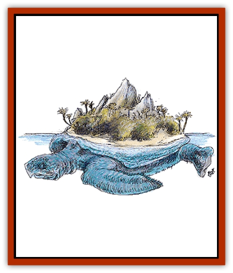

# Zaratan

| Statistic | **Zaratan** |
| --- | --- |
| **Activity Cycle:** | Any |
| **Alignment:** | Neutral |
| **Armor Class:** | -6/0 |
| **Climate/Terrain:** | Tropical/Fresh and salt water |
| **Damage/Attack:** | 10-100 |
| **Diet:** | Omnivore |
| **Frequency:** | Very rare |
| **Hit Dice:** | 51-70 |
| **Intelligence:** | Average (8-10) |
| **Magic Resistance:** | Nil |
| **Morale:** | Fearless (19) |
| **Movement:** | 1, Sw 2 |
| **No. Appearing:** | 1 |
| **No. of Attacks:** | 1 |
| **Organization:** | Solitary |
| **Size:** | G (200-350' diameter) |
| **Special Attacks:** | Swallow |
| **Special Defenses:** | Immune to poison, magic weapon needed to pierce shell |
| **THAC0:** | 5 |
| **Treasure:** | See below |
| **XP Value:** | 46,000 + 1,000 per HD over 51 |

The zaratan is an enormous, passive [[Turtle_Giant|turtle]] found in the warm currents of Zakhara's seas, in the Al-Qadim campaign setting. Thankfully, the zaratan spends most of its existence in a profoundly deep slumber.

The shell of a zaratan (plural, zaratani) looks like a sloped, rocky mound several hundred feet in diameter. The zaratan's head, over 50 feet across, is often mistaken for a partially-submerged, barnacle-encrusted boulder. The zaratan usually keeps its eyes shut, covered with stony lids that blend with the rest of its head in texture and color. The zaratan's four flippers, each over a hundred feet long, appear to be small reefs, supporting a variety of corals, barnacles, and small fish. The zaratan's rocky shell is considered AC -6, while its head and flippers are only AC 0. In its dormant state, a zaratan appears to be a small, floating island.

**Combat:** More often than not, once wakened from its slumber, a zaratan will react to an enemy by withdrawing into its rocklike shell, against which nonmagical weapons have absolutely no effect. In addition, no known poison will effect a zaratan with its incredibly slow metabolism. A zaratan will remain in its shell for 1-10 years (if not further provoked) before re-emerging.

However, if pestered and wounded for more than 5% of its total hit points, a zaratan becomes a terrible opponent. Although it attacks last in every round, a single bite from its 40' maw delivers 10-100 points of damage and will swallow any beings within a 10' radius of its target (no save), should its attack roll succeed by 4 more than needed.

The stomach of a zaratan is a tough, tube-shaped cave. Usually there is enough stale, trapped air for a creature to survive indefinitely (if they survived the bite attack), but creatures trapped within also suffer 2 points of damage per day unless they can figure out a way to protect themselves from the stomach's corrosive digestive juices. The stomach lining is AC 5. Damage equal to 5% of the zaratan's total hit points (a case of painful indigestion) will result in the victims' regurgitation. A zaratan's stomach might contain just about anything, depending upon the whim of the DM, from pieces of driftwood and chunks of ships, to weapons, armor, and even a small amount of treasure (suggested type Z).

After a battle, a zaratan will immediately fall into a deep slumber, which typically lasts 1-100 years.

**Habitat/Society:** The slow metabolism of the zaratani assure them incredibly long (if uneventful) lives, measured in millennia. The zaratani are said to have been floating in the sea long before the genies first visited the Land of Fate.

At any given time, a zaratan is 99% likely to be sleeping. As it slumbers, it keeps its mouth wide open. Any small to man-sized creatures stupid enough to swim inside (large fish mostly) are reflexively swallowed. The zaratan spends the rest of its time either mating or conversing with others of its own kind.

Every few centuries, by sheer coincidence, a pair of zaratani will drift into each other. Should they awake (and be of the opposite sex), they will mate. The courtship ritual may take decades, and the mating itself lasts as long as a year.

The zaratani communicate with one another in a language similar to that of the [[Whale|whales]]. Conversations between the zaratani often last decades. On rare occasions, they have been known to communicate with other beings by telepathy.

**Ecology:** The older a zaratan gets, the longer it sleeps. As a result, many actually become indistinguishable from a floating island or reef, supporting their own mini-ecosystems on their broad, rocky carapaces and underbellies. Many sport stunted palm trees and vegetation on their shells.

The older and wiser zaratani are perfectly content to be attended by lesser symbiotic beings, provided the symbiotes are not too bothersome and don't interfere with a zaratan's sleep. A few are known to support small, uncivilized villages, while others have even been used as a mobile base for pirates and corsairs!

Visitors will find most inhabitants of a zaratan highly superstitious. Many revere their island home as a god. They believe (rightly) that were their deity to awaken due to hunger, their island might sink beneath the sea, destroying their village. As a result, these villagers strive at every opportunity to keep the zaratan well-fed and content, sacrificing large quantities of caught fish and even visitors to placate their floating deity.

---
## Discovery & Documentation

**Source Publication:** MC13 Al-Qadim Appendix (1992)
**Campaign Setting:** Al-Qadim (Forgotten Realms)
**Author(s):** C. Terry Phillips

### Other Creatures Found in This Source Book
   * [[Ammut|Ammut]]
   * [[Ashira|Ashira]]
   * [[Asuras|Asuras]]
   * [[Black_Cloud_of_Vengeance|Black Cloud of Vengeance]]
   * [[Buraq|Buraq]]
   * [[Camel|Camel]]
   * [[Camel_of_the_Pearl|Camel of the Pearl]]
   * [[Centaur_Desert|Centaur, Desert]]
   * [[Copper_Automaton|Copper Automaton]]
   * [[Debbi|Debbi]]
   * [[Elephant_Bird|Elephant Bird]]
   * [[Gen|Gen]]
   * [[Genie_Noble_Dao|Genie, Noble Dao]]
   * [[Genie_Noble_Djinni|Genie, Noble Djinni]]
   * [[Genie_Noble_Efreeti|Genie, Noble Efreeti]]
   * [[Genie_Noble_Marid|Genie, Noble Marid]]
   * [[Genie_Tasked_Architect_Builder|Genie, Tasked, Architect/Builder]]
   * [[Genie_Tasked_Artist|Genie, Tasked, Artist]]
   * [[Genie_Tasked_Guardian|Genie, Tasked, Guardian]]
   * [[Genie_Tasked_Herdsman|Genie, Tasked, Herdsman]]
   * [[Genie_Tasked_Slayer|Genie, Tasked, Slayer]]
   * [[Genie_Tasked_Warmonger|Genie, Tasked, Warmonger]]
   * [[Genie_Tasked_Winemaker|Genie, Tasked, Winemaker]]
   * [[Ghost_Mount|Ghost Mount]]
   * [[Ghul|Ghul]]
   * [[Giant_Desert|Giant, Desert]]
   * [[Giant_Jungle|Giant, Jungle]]
   * [[Giant_Reef|Giant, Reef]]
   * [[Giant_Zakhara_General_Information|Giant (Zakhara), General Information]]
   * [[Hama|Hama]]
   * [[Heway|Heway]]
   * [[Living_Idol|Living Idol]]
   * [[Lycanthrope_Werehyena|Lycanthrope, Werehyena]]
   * [[Lycanthrope_Werelion|Lycanthrope, Werelion]]
   * [[Markeen|Markeen]]
   * [[Maskhi|Maskhi]]
   * [[Mason_Wasp_Giant|Mason Wasp, Giant]]
   * [[Nasnas|Nasnas]]
   * [[Pahari|Pahari]]
   * [[Rom|Rom]]
   * [[Sabu_Lord|Sabu Lord]]
   * [[Sakina|Sakina]]
   * [[Serpent_Lord|Serpent Lord]]
   * [[Serpent_Winged|Serpent, Winged]]
   * [[Silat|Silat]]
   * [[Simurgh|Simurgh]]
   * [[Stone_Maiden|Stone Maiden]]
   * [[Vishap|Vishap]]
   * [[Zin|Zin]]
