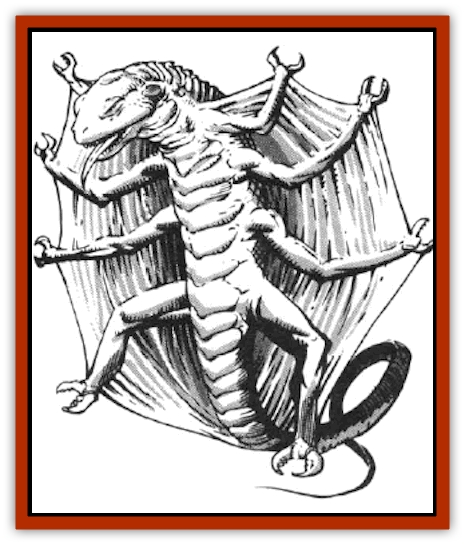

# Zard

| Statistic | **Zard** |
| --- | --- |
| **Activity Cycle:** | Any |
| **Alignment:** | Neutral |
| **Armor Class:** | 8 |
| **Climate/Terrain:** | Any |
| **Damage/Attack:** | 1-2 |
| **Diet:** | Omnivore |
| **Frequency:** | Uncommon in wildspace, rare in phlogiston |
| **Hit Dice:** | 1+1 |
| **Intelligence:** | Animal (1) |
| **Magic Resistance:** | Nil |
| **Morale:** | Unsteady (5-7) |
| **Movement:** | 2, Fl 18 (C) |
| **No. Appearing:** | 10-100 |
| **No. of Attacks:** | 1 |
| **Organization:** | Swarm |
| **Size:** | S (1½' long) |
| **Special Attacks:** | Nil |
| **Special Defenses:** | Nil |
| **THAC0:** | 19 |
| **Treasure:** | Nil |
| **XP Value:** | 65 |

Zard are reptiles, averaging one to two feet in length. They have eight legs, with a set of tiny, grasping claws at the end of each. These claws, like a zard's teeth, are very sharp. A thin but tough webbing runs between the creature's legs, forming a wing-like glider on each side of its body. Zards use these wings to coast through space, moving from meal to meal with little effort, though their maneuverability is quite good.

Zards rarely travel alone. Instead, they float through space, latched onto other zards with one or more of their clawed legs. Together, this swarm of up to 100 creatures seeks out food. Individual zards range in color from deep forest green to light blue, though some have been captured that are mottled and even striped, though always in the blue-green color range.

For all practical purposes, zards are blind. Over the centuries, their eyes have atrophied from lack of use in the vastness of wildspace and the phlogiston. In wildspace, zards rely on a sort of sonar to locate their meals. They emit a high-pitched, far-reaching squeal. When this noise echoes back to them after bouncing off an object, the zard swarm heads for the object, whatever it may be. Obviously, this dangerous, random feeding method helps to keep the zard population down in many areas.

**Combat:** Zards are not consciously malicious creatures, as their low Intelligence would indicate. However, attacks by zard swarms have often been cited as the malicious arts of various gods in a number of different systems. This is more a testament to the zards' potential destructive power than the creativity of any deity.

After a zard swarm has located an object, it follows the object until it impact. At that time, the swarm breaks up and the zards cling to whatever they hit. They then begin to devour everything and anything they can sink their sharp, little teeth into. They cause 1-2 points of damage with each bite. Though their claws are sharp, they are not large enough to do any real damage. Zards are slow-moving once they've landed, making them easy targets. Howerer, as they are air-breathers, they do put an additional burden on a ship's air pocket. Every five zards use up the same amount of air as one human.

**Habitat/Society:** Wildspace holds the greatest number of zards. Since zards breathe air, they tend to be found closer to planets, where they can get fresher air more often. They also pilfer air from ships or objects they attack. In wildspace, the swarm moves by creating a rippling, wave-like motion that propels it along, similar to a [[Dolphin|dolphin]] undulating through water.

Zards have also been found in the phlogiston, though they are much rarer in those environs. In the phlogiston, their wings carry them through the radiant rivers. Like other air-breathing creatures, however, their flesh turns stone-like once their air pocket is expended. They float, petrified in their swarm structure, until they run into a ship or other object maintaining an air supply. The zards instantly revive and begin their feeding frenzy.

Zard society is relatively peaceful at most times. When food is plentiful, the swarm simply drifts through its days, coupling and birthing new zards on the wing. Newborn zards are hungry from the, moment they are born, and they are fully equipped to eat solid food. Zards eat anything they can chew, including wood, rope, paper, flesh, and bone. Even thin sheets of metal aren't excluded from a zard's menu.

After a few weeks of short food supply, zards have been known to prey upon each other. Whole swarms have torn themselves apart this way. This is a rare occurrence, but it does help to keep the zard population down.

**Ecology:** Many creatures, including all types of [[Scavver|scavvers]], prize zard meat and actively hunt swarms. This is a dangerous meal to seek, however, and many creatures have found themselves devoured by a zard swarm they were hunting.

Intelligent races, such as the [[Giff|giff]] and various types of [[Beholder_and_Beholder-kin_I|beholders]], also find zard meat quite tasty. It shouldn't be surprising, then, that a thriving trade exists in zard meat in many systems with spelljamming capability. Zards are also prized for their teeth and claws, which make excellent points for writing utensils. It is rumored the [[Neogi|neogi]] use the voracious, razor-toothed little reptiles in their interrogation of prisoners.

---
## Discovery & Documentation

**Source Publication:** MC7 Spelljammer Appendix I (1990)
**Campaign Setting:** Advanced Dungeons & Dragons 2nd Edition
**Author(s):** various

### Other Creatures Found in This Source Book
   * [[Aartuk|Aartuk]]
   * [[Albari|Albari]]
   * [[Ancient_Mariner|Ancient Mariner]]
   * [[Argos|Argos]]
   * [[Beholder_Abomination_Astereater|Beholder (Abomination), Astereater]]
   * [[Blazozoid|Blazozoid]]
   * [[Chattur|Chattur]]
   * [[Chevall|Chevall]]
   * [[Clockwork_Horror|Clockwork Horror]]
   * [[Colossus|Colossus]]
   * [[Delphinid|Delphinid]]
   * [[Dizantar|Dizantar]]
   * [[Dog|Dog]]
   * [[Dog_Bog_Hound|Dog, Bog Hound]]
   * [[Esthetic|Esthetic]]
   * [[Focoid|Focoid]]
   * [[Fractine|Fractine]]
   * [[Giant_Spacesea|Giant, Spacesea]]
   * [[Golem_Furnace|Golem, Furnace]]
   * [[Golem_Radiant|Golem, Radiant]]
   * [[Gravislayer|Gravislayer]]
   * [[Grommam|Grommam]]
   * [[Hadozee|Hadozee]]
   * [[Hamster_Giant_Space|Hamster, Giant Space]]
   * [[Jammer_Leech|Jammer Leech]]
   * [[Lakshu|Lakshu]]
   * [[Lumineaux|Lumineaux]]
   * [[Lutum|Lutum]]
   * [[Mimic_Space|Mimic, Space]]
   * [[Misi|Misi]]
   * [[Moon_Rogue|Moon, Rogue]]
   * [[Mortiss|Mortiss]]
   * [[Murderoid|Murderoid]]
   * [[Nay-Churr|Nay-Churr]]
   * [[Phlog-Crawler|Phlog-Crawler]]
   * [[Plasman|Plasman]]
   * [[Plasmoid_DeGleash|Plasmoid, DeGleash]]
   * [[Plasmoid_DelNoric|Plasmoid, DelNoric]]
   * [[Plasmoid_General_Information|Plasmoid, General Information]]
   * [[Plasmoid_Ontalak|Plasmoid, Ontalak]]
   * [[Puffer|Puffer]]
   * [[Q'nidar|Q'nidar]]
   * [[Rastipede|Rastipede]]
   * [[Reigar|Reigar]]
   * [[Rock_Hopper|Rock Hopper]]
   * [[Slinker|Slinker]]
   * [[Spider_Asteroid|Spider, Asteroid]]
   * [[Spiritjam|Spiritjam]]
   * [[Survivor|Survivor]]
   * [[Syllix|Syllix]]
   * [[Symbiont_Power|Symbiont, Power]]
   * [[Vine_Infinity|Vine, Infinity]]
   * [[Wiggle|Wiggle]]
   * [[Wizshade|Wizshade]]
   * [[Wryback|Wryback]]
   * [[Zodar|Zodar]]
