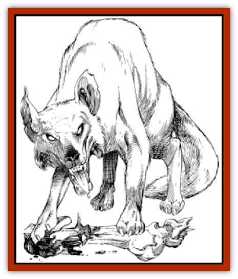

# Zhackal

| Statistic | **Zhackal** |
| --- | --- |
| **Activity Cycle:** | Any |
| **Alignment:** | Neutral evil |
| **Armor Class:** | 7 |
| **Climate/Terrain:** | Tablelands, forest, mountains |
| **Damage/Attack:** | 1-3 |
| **Diet:** | Special |
| **Frequency:** | Rare |
| **Hit Dice:** | 1 |
| **Intelligence:** | Low (5-7) |
| **Magic Resistance:** | Nil |
| **Morale:** | Steady (12) |
| **Movement:** | 18 |
| **No. Appearing:** | 2-12 |
| **No. of Attacks:** | 1 |
| **Organization:** | Pack |
| **Size:** | T (1') |
| **Special Attacks:** | Psionics |
| **Special Defenses:** | Psionics |
| **THAC0:** | 19 |
| **Treasure:** | Nil |
| **XP Value:** | 120 / Leader: 175 |

**Psionics Summary**

| Level | Dis/Sci/Dev | Attack/Defense | Score | PSPs |
| --- | --- | --- | --- | --- |
| 1 | 2/0/6 | EW/- | 12 | 24 |

**Telepathy -** *Sciences:* nil; *Devotions:* contact, mind bar, mind link, ego whip, invisibility.

Zhackals are small pack animals that travel about feeding off of the emotions of those about to die. The pack gathers and feeds on the dying victim's emotions, using psionics to get the victim to give up his hold on life.

Zhackals are small brown or gray creatures with thick fur. They are four-legged, have small, very sharp teeth, and eyes of deep blue.

A zhackal makes no sound, although it can communicate with others of its kind by means of its mindlink power.

**Combat:** A zhackal pack roams about, looking for a dying victim. A weakened or dying victim is followed until he is very near death. The pack then closes in and turns its full psionic powers on the victim. The dying prey is attacked psionically until he ceases clinging to life. The victim's expiring emotions constitute a feast for the zhackal pack.

A zhackal pack has a unique ability. When closing in for the kill, the strongest zhackal establishes a mindlink with the others. This allows them not only to communicate, but to share psionic points. For game purposes, the zhackal pack acts as if it has one mind, with the total psionic strength of the whole pack. The pack attempts to hide themselves, using invisibility or mind bar if necessary, and then makes contact with the victim. The victim is then subjected to an ego whip until he is sure that he has no reason or chance to survive.

A zhackal pack has a low intelligence but a high degree of cunning. Their victims are always those helpless or near death. Victims of mountain malaise are some of their favorite prey. A pack can exist very well on vegetation, seeds, berries, and small rodents, but it needs dying emotions to really feast.

If cornered and attacked physically, the pack responds with their sharp bites. Victims killed in battle this way yield very few of the proper emotions for a pack; the pack would rather run away than stay to fight.

**Habitat/Society:** Zhackal packs roam any areas except the silt basins and the Sea of Silt. A zhackal pack does not value treasure, leaving a victim's, valuables alone, though they may feast on the corpse if they are physically hungry. This is rare, for the emotions they feast on seem to satisfy them physically as well as emotionally.

A zhackal pack is always led by the largest member, having maximum hit points and an extra 10 PSPs. The pack leader is usually the most intelligent. A zhackal pack can be contacted mentally. However, since they do not speak a language, only basic emotions can be sensed. The emotion most often sensed is a lust for the death of the being who contacts them.

**Ecology:** Any dying creature is potential food, including other zhackals. Note that zhackals do not feast on members of their own pack, leaving a dying member behind to fend for itself. A zhackal pack may even be found in a city, but they only come out at night. They never stay long in a village or city because, if they do, they are almost sure to be found out and hunted down. This usually involves psionic searching, since they are very good at concealing themselves. Certain jaded nobles even keep single zhackals as pets, feeding them from the emotions of dying slaves and gladiators. A zhackal fed this way will be quite loyal to the noble, said noble becoming its "pack leader", so to speak. A zhackal is very expensive to keep, for slaves and gladiators that might otherwise live die off much sooner with a zhackal around.

Zhackal fur is fairly valuable, but it takes quite a few zhackal skins to make anything that could be sold. In most markets, zhackal fur is worth 100 cp a square yard, but ten unmarked zhackal are needed to produce that much fur. The fur is used in the manufacture of clothing. Such clothing resembles cotton in its ability to "breath" and also wears very well.

---
## Discovery & Documentation

**Source Publication:** MC12 Dark Sun Appendix I - Terrors of the Desert (1991)
**Campaign Setting:** Dark Sun
**Author(s):** Tom Prusa, Louis J. Prosperi, Walter M. Baas

### Other Creatures Found in This Source Book
   * [[Animal_Herd_Athas|Animal, Herd (Athas)]]
   * [[Animal_Household_Athas|Animal, Household (Athas)]]
   * [[Antloid_Desert|Antloid, Desert]]
   * [[Banshee_Dwarf|Banshee, Dwarf]]
   * [[Beetle_Agony|Beetle, Agony]]
   * [[Bog_Wader|Bog Wader]]
   * [[Brambleweed|Brambleweed]]
   * [[B'rohg|B'rohg]]
   * [[Burnflower|Burnflower]]
   * [[Cat_Psionic|Cat, Psionic]]
   * [[Cha'thrang|Cha'thrang]]
   * [[Cistern_Fiend|Cistern Fiend]]
   * [[Clam_Giant|Clam, Giant]]
   * [[Cloud_Ray|Cloud Ray]]
   * [[Drake_Athas_Air|Drake (Athas), Air]]
   * [[Drake_Athas_Earth|Drake (Athas), Earth]]
   * [[Drake_Athas_Fire|Drake (Athas), Fire]]
   * [[Drake_Athas_Water|Drake (Athas), Water]]
   * [[Dune_Runner|Dune Runner]]
   * [[Dune_Trapper|Dune Trapper]]
   * [[Elemental_Athas_Greater_Air|Elemental (Athas), Greater, Air]]
   * [[Elemental_Athas_Greater_Earth|Elemental (Athas), Greater, Earth]]
   * [[Elemental_Athas_Greater_Fire|Elemental (Athas), Greater, Fire]]
   * [[Elemental_Athas_Greater_Water|Elemental (Athas), Greater, Water]]
   * [[Elemental_Athas_Lesser_Air_Earth|Elemental (Athas), Lesser, Air/Earth]]
   * [[Elemental_Athas_Lesser_Fire_Water|Elemental (Athas), Lesser, Fire/Water]]
   * [[Elemental_Athas_General_Information|Elemental (Athas), General Information]]
   * [[Erdland|Erdland]]
   * [[Esperweed|Esperweed]]
   * [[Flailer|Flailer]]
   * [[Floater|Floater]]
   * [[Giant_Athas|Giant (Athas)]]
   * [[Golem_Athas_I|Golem (Athas) I]]
   * [[Golem_Athas_II|Golem (Athas) II]]
   * [[Golem_Athas_III|Golem (Athas) III]]
   * [[Golem_Athas_General_Information|Golem (Athas), General Information]]
   * [[Halfling_Renegade|Halfling, Renegade]]
   * [[Hej-kin|Hej-kin]]
   * [[Id_Fiend|Id Fiend]]
   * [[Insect_Swarm_Athas|Insect Swarm (Athas)]]
   * [[Kank_Wild|Kank, Wild]]
   * [[Kirre|Kirre]]
   * [[Megapede|Megapede]]
   * [[Mul_Wild|Mul, Wild]]
   * [[Nightmare_Beast|Nightmare Beast]]
   * [[Plant_Carnivorous_Athas|Plant, Carnivorous (Athas)]]
   * [[Pterran|Pterran]]
   * [[Pterrax|Pterrax]]
   * [[Pulp_Bee|Pulp Bee]]
   * [[Pyreen|Pyreen]]
   * [[Rasclinn|Rasclinn]]
   * [[Razorwing|Razorwing]]
   * [[Roc_Athas|Roc (Athas)]]
   * [[Sand_Bride|Sand Bride]]
   * [[Sand_Cactus|Sand Cactus]]
   * [[Sand_Vortex|Sand Vortex]]
   * [[Scrab|Scrab]]
   * [[Silt_Horror|Silt Horror]]
   * [[Silt_Runner|Silt Runner]]
   * [[Sink_Worm|Sink Worm]]
   * [[Sloth_Athas|Sloth (Athas)]]
   * [[So-ut|So-ut]]
   * [[Spider_Cactus|Spider Cactus]]
   * [[Spider_Crystal|Spider, Crystal]]
   * [[Spirit_of_the_Land|Spirit of the Land]]
   * [[T'Chowb|T'Chowb]]
   * [[Thrax|Thrax]]
   * [[Tohr-kreen_I|Tohr-kreen I]]
   * [[Villichi|Villichi]]
   * [[Zombie_Plant|Zombie Plant]]
