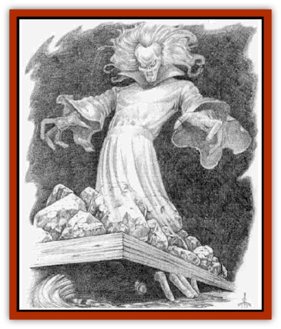

# Zhentarim Spirit

| Statistic | **Zhentarim Spirit** |
| --- | --- |
| **Activity Cycle:** | Night |
| **Alignment:** | Any evil |
| **Armor Class:** | -2 |
| **Climate/Terrain:** | Any/Zhentarim-controlled areas |
| **Damage/Attack:** | 1d8 |
| **Diet:** | None |
| **Frequency:** | Very rare |
| **Hit Dice:** | 7 |
| **Intelligence:** | High (13-14) |
| **Magic Resistance:** | Nil |
| **Morale:** | Fanatic (17-18) |
| **Movement:** | Fl 12 (C) |
| **No. Appearing:** | 1 |
| **No. of Attacks:** | 1 |
| **Organization:** | Solitary |
| **Size:** | M (5-6' tall) |
| **Special Attacks:** | Hit point drain, possession |
| **Special Defenses:** | +1 magical or better weapon needed to hit, spell immunities, invisible and intangible at will |
| **THAC0:** | 13 |
| **Treasure:** | Nil |
| **XP Value:** | 6,000 |

A Zhentarim spirit is the essence of a Zhentarim wizard who met with a horrible death at the hands of his or her enemies or treacherous comrades. The spirit of the wizard is extremely vengeful, and by sheer force of will is remaining on the Prime Material Plane until a task is complete or until it takes revenge on those who slew it. Zhentarim spirits are extremely rare, and only the death of a wizard who is greater than 14th level can bring about the creation of one of these spiteful spirits.

Zhentarim spirits are semitransparent spirits that look somewhat like [[Spectre|spectres]], and those who confuse the two often end up dead. These spirits appear as they did at the time of their deaths, bearing their fatal wounds.

**Combat:** Zhentarim spirits can no longer cast spells of any kind, but can converse with Prime Material beings in the languages they knew in life. Zhentarim spirits are not undead in the normal sense of the word - that is, they are not affected by holy water, cannot be turned, and are not connected to the Negative Energy Plane. They are simply being held to the Prime Material Plane by their indomitable willpower, refusing to go to their final rest (or judgment) until their killers have been dealt with. A Zhentarim spirit can become invisible and intangible at will, but must materialize to attack.

Zhentarim spirits primarily target their killers. The attack of a Zhentarim spirit drains the hit points of its victim at a rate of 1d8 per strike. The loss of these hit points is permanent to the target of the spirit's vengeance (its killer or killers), while all others regain lost points as normal.

Zhentarim spirits can also possess people through the use of a *magic jar* ability that they can attempt once per round; a spirit can only possess one person at any one time. A Zhentarim spirit must be within at least one-half mile of the possessed victim to exercise control over him or her. The spirits often use possessed victims to get close to their targets and either kill or injure them. A spirit must relinquish possession of a person before attacking a victim with its draining touch.

Depending on the power possessed by a spirit's intended victim or victims, it will use extreme caution or a straightforward attack. Once those responsible for the death of the spirit's mortal form are dead, the creature will depart for its judgment on the planes. It is impossible to fool the spirit about the death of its victim - it will know if that person (or group of people) is truly dead or not.

Killing Zhentarim spirits is a difficult thing, as they reform by force of will after 100 days if reduced to fewer than 0 hit points. The only way to completely destroy Zhentarim spirits is to kill them using a *finger of death*, *power word, kill*, or *wish*. They receive normal saving throws against these spells.

Zhentarim spirits are immune to all spells except *magic missile*, *protection from evil*, *finger of death*, *power word, kill*, and *wish*; all others simply pass through the creatures as if they were immaterial. They are also immune to weapons not of a magical nature (of at least +1 enchantment) and take only normal damage from a *mace of disruption*.

**Habitat/Society:** The determination of Zhentarim spirits to annihilate their killers is exceptional, and these creatures defy final judgment for indefinite and extended periods to exact their revenge. This is done through these spirits' force of will (minimum Wisdom of 16), aided by their connection with the magical arts (minimum of 14th-level wizard).

These spirits have so far only been linked with wizards of the Zhentarim, and many think the tendency of Zhentarim wizards to form these spirits is attributable to magical means that they use to extend their lives. A vengeful Zhentarim spirit is formed one to two days after the death of an appropriate Zhentarim wizard, and it immediately sets about planning its revenge.

**Ecology:** Zhentarim spirits have no need for sustenance or rest, and they continuously seek the destruction of their killer or killers. These spirits exist on the Prime Material Plane until their victim dies or they are destroyed.

---
## Discovery & Documentation

**Source Publication:** Ruins of Zhentil Keep (1995)
**Campaign Setting:** Forgotten Realms
**Author(s):** John Terra and Kevin Melka

### Other Creatures Found in This Source Book
   * [[Banedead|Banedead]]
   * [[Banelich|Banelich]]
   * [[Burnbones|Burnbones]]
   * [[Elemental_Nature|Elemental, Nature]]
   * [[Gargoyle_Guardgoyle|Gargoyle, Guardgoyle]]
   * [[Golem_Magic|Golem, Magic]]
   * [[Golem_Vault_Guardian|Golem, Vault Guardian]]
   * [[Hybsil|Hybsil]]
   * [[Magedoom|Magedoom]]
   * [[Mist_Scarlet_Dancer|Mist, Scarlet Dancer]]
   * [[Orc_Ondonti|Orc, Ondonti]]
   * [[Rat_Zhentish_Sewer|Rat, Zhentish Sewer]]
   * [[Render|Render]]
   * [[Sacaanti|Sacaanti]]
   * [[Snake_Messenger|Snake, Messenger]]
