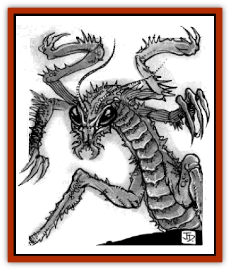

# Zik-trin'ak

| Statistic | **Zik-trin'ak** |
| --- | --- |
| **Activity Cycle:** | Any |
| **Alignment:** | Chaotic neutral |
| **Armor Class:** | 2 |
| **Climate/Terrain:** | Any land except Forest Ridge |
| **Damage/Attack:** | 1d6+6(&times;4)/1d6+1 or by weapon (kyorkcha)+6 |
| **Diet:** | Carnivore |
| **Frequency:** | Very rare |
| **Hit Dice:** | 9-12 |
| **Intelligence:** | Average (8-10) |
| **Magic Resistance:** | Nil |
| **Morale:** | Fearless (19-20) |
| **Movement:** | 24 |
| **No. Appearing:** | 1d4 |
| **No. of Attacks:** | 5 or 2 |
| **Organization:** | Solitary |
| **Size:** | L (11' long) |
| **Special Attacks:** | Paralyzation, leap, missile weapons, high Strength |
| **Special Defenses:** | Missile dodge |
| **THAC0:** | 9-10 HD: 11 / 11-12 HD : 9 |
| **Treasure:** | Nil |
| **XP Value:** | 9 HD: 8,000 / 10+HD: add 1,000 each / Psionic: add 2000 |

**Psionics Summary**

| Level | Dis/Sci/Dev | Attack/Defense | Score | PSPs |
| --- | --- | --- | --- | --- |
| 17 | 3/5/14 | All/All | =Int | 52 |

Like the [[Tohr-kreen_II|zik-trin'ta]] scout (called [[Tohr-kreen_I|tohr-kreen]] in the Tablelands), the zik-trin'ak warrior is a creature created from normal kreen. The zik-trin'ak looks much like a normal [[Thri-kreen|thri-kreen]] or [[Tohr-kreen_III|tohr-kreen]], but is larger and more dangerous. The zik-trin'ak stands as tall as 10 feet and is as long as 13 feet.

The zik-trin'ak is built for combat; the claws are longer end sharper than those of a normal kreen, and the exoskeleton is ornamented with spikes, knobs, and other protrusions. Though most zik-trin'ak have yellow exoskeletons (having been made from To'ksa thri-kreen), some have black shells, end a few are red or even green. Zik-trin'ak of other colors also have other features associated with their base species.

While intelligent and capable of speaking, they seldom talk, and cannot be distracted from en assigned task.

**Combat:** The zik-trin'ak are mentally adjusted for combat. They are programmed for specific purposes end implacably follow the instructions of the zik-chil who create them. If ordered to guard, they guard; if ordered to attack mammals, they attack mammals; if ordered to attack everything they see, they attack everything they see. They give no quarter end retreat only if ordered to do so.

Roughly half of zik-trin'ak are psionic. Most are equivalent to 9th-level psychokineticists, with psychometabolism as a secondary discipline.

If not ordered otherwise, zik-trin'ak first attack from a distance, throwing kyorkcha (inflict 1d8+2, and a +6 damage bonus due to the creature's greet Strength). A zik-trin'ak carries 2d8 kyorkcha, and throws them to soften opposition before closing. Psionic distance attacks are also used.

After using distance attacks, zik-trin'ak charge, using their leaps to great effect. A zik-trin'ak can leap 40 feet upward or 90 feet forward; it cannot leap backward. When leaping into combat, zik-trin'ak receive standard charge adjustments. Also, the leap itself counts as an attack; the creature's spikes inflict 2d4 points of damage against opponents of man-size or smaller end 1d6+1 against larger opponents.

Zik-trin'ak use no melee weapons. Once they close to melee, they attack each round with four sets of blades that have replaced their natural claws, plus a bite with augmented mandibles.

The bite attack is poisonous. The creature bitten must make a successful saving throw vs. poison. Those failing the saving throw immediately take 20 points of damage (shock to the nervous system) and are paralyzed for 2d6 rounds (kreen are immune).

Finally, the zik-trin'ak can dodge missiles on a roll of 11 or better on 1d20. Only physical missiles can be dodged, not magical effects, and physical missiles with magical bonuses adjust the dodge roll by their magical bonus.

Zik-trin'ak are resistant to magical and psionic interrogation.

**Habitat/Society:** Zik-trin'ak have no society of their own and live on the edges of tohr-kreen society They can be found wherever they are sent by the zik-chil; they respond to the orders of zik-chil (whom they identitfy) by pheromones) and no one else. They enforce the will of the zik-chil end the policies of the the tohr-kreen empire. They do not refer to themselves as zik-trin, but call themselves tohr-kreen.

As implied by its name (which translates as "near-person, altered for combat"), the zik-trin'ak has lost its identity. These creatures are devastating combatants, but at the cost of their personality and beliefs, almost like [[Zombie|zombies]] in many ways. Much like in in their ferocity, zik-trin'ak are also cold, controlled, and cunning. They cannot breed.

**Ecology:** Zik-trin'ak are dangerous hunters. Zik-trin were ordinary kreen before their conversion; the process is believed irreversible.

---
## Discovery & Documentation

**Source Publication:** Thri-Kreen of Athas (1995)
**Campaign Setting:** Dark Sun
**Author(s):** Tim Beach and Dori Hein

### Other Creatures Found in This Source Book
   * [[Jalath'gak|Jalath'gak]]
   * [[Trin|Trin]]
